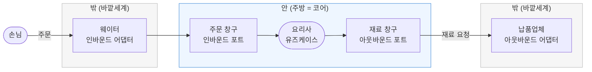

<!-- truncate -->

헥사고날 아키텍처(포트 앤 어댑터, Ports and Adapters)를 처음 접하면 **유즈케이스, 포트, 인바운드/아웃바운드 어댑터**의 관계가 가장 헷갈립니다. 이 글에서는 식당 비유와 자바 예제로 이 관계를 하나씩 풀어봅니다.

---

## 1. 유즈케이스 vs 어댑터, 한 줄 요약

핵심은 **"안(도메인/코어)"과 "밖(외부 세계)"의 경계**입니다. <mark>유즈케이스는 안쪽, 어댑터는 바깥쪽입니다.</mark>

### 유즈케이스 (Use Case)
- 애플리케이션 코어(안쪽)에 위치하는 **비즈니스 로직**
- "이 시스템이 무엇을 할 수 있는가"를 표현 (예: `회원가입`, `주문생성`, `게시글작성`)
- **포트(Port) 인터페이스에만 의존**하고, 외부 기술(DB, HTTP, 카프카)은 전혀 모름
- 순수 도메인 규칙과 흐름을 조율(orchestration)

### 어댑터 (Adapter)
- 바깥쪽(인프라)에 위치하며 **특정 기술과 도메인을 연결**
- "어떻게 외부와 통신하는가"를 담당
- 두 종류:
  - **인바운드(Driving) 어댑터** — 외부 요청을 유즈케이스로 전달 (REST 컨트롤러, CLI, 메시지 컨슈머)
  - **아웃바운드(Driven) 어댑터** — 유즈케이스가 필요로 하는 외부 작업 구현 (JPA 리포지토리, 외부 API 클라이언트, 이메일 발송)

| | 유즈케이스 | 어댑터 |
|---|---|---|
| 위치 | 코어(안) | 인프라(밖) |
| 책임 | 비즈니스 규칙 "무엇" | 기술 연동 "어떻게" |
| 의존 방향 | 포트에만 의존 | 도메인/포트에 의존 |
| 교체 가능성 | 안정적, 잘 안 바뀜 | 기술 바뀌면 교체 |

**핵심 원칙**: <mark>의존성은 항상 바깥(어댑터) → 안(유즈케이스) 방향으로만 흐릅니다.</mark> 그래서 DB를 MySQL에서 MongoDB로 바꿔도, HTTP를 gRPC로 바꿔도 유즈케이스 코드는 그대로 유지됩니다.

---

## 2. 식당 비유로 한 방에 이해하기 🍽️

**유즈케이스 = 주방(요리사)**
- 실제 요리를 만드는 곳. "무엇을 하는지"의 핵심.
- 손님이 누군지, 재료가 어느 마트에서 오는지 관심 없음. 그냥 요리만 잘함.

**포트 = 주방의 창구(구멍)**
- 주방에는 구멍이 딱 2개 뚫려 있음.
- **주문 받는 창구(인바운드 포트)**: "이런 주문을 넣을 수 있어요"라는 메뉴판
- **재료 요청 창구(아웃바운드 포트)**: "나는 이런 재료가 필요해요"라는 주문서

**어댑터 = 창구에 꽂히는 사람**
- **웨이터(인바운드 어댑터)**: 손님 주문을 받아서 → 주방 창구에 넣어줌
- **식자재 납품업체(아웃바운드 어댑터)**: 주방이 요청한 재료 창구에 → 실제 재료를 갖다줌



### 핵심 규칙 3가지

1. **포트는 "구멍/약속", 어댑터는 "구멍에 꽂히는 실제 물건"**
   - 포트 = `interface` (약속만 정의)
   - 어댑터 = 그 interface를 실제로 구현한 코드

2. **방향으로 인/아웃을 구분**
   - **인바운드** = 밖에서 → 안으로 들어옴 (주문이 들어온다). 웹 요청, 버튼 클릭
   - **아웃바운드** = 안에서 → 밖으로 나감 (재료를 요청한다). DB 저장, 이메일 발송

3. **주방(유즈케이스)은 밖을 절대 모른다**
   - 웨이터가 앱이든 전화든 상관없음
   - 재료가 이마트에서 오든 쿠팡에서 오든 상관없음
   - → <mark>그래서 웹을 앱으로 바꿔도, DB를 바꿔도 주방 코드는 그대로</mark>

| 비유 | 역할 | 자바 |
|---|---|---|
| 메뉴판 | 인바운드 포트 | `interface RegisterUserUseCase` |
| 요리사 | 유즈케이스 | `class RegisterUserService` |
| 재료 주문서 | 아웃바운드 포트 | `interface SaveUserPort` |
| 웨이터 | 인바운드 어댑터 | `class UserController` |
| 납품업체 | 아웃바운드 어댑터 | `class UserPersistenceAdapter` |

---

## 3. 자바 예제 (회원가입 기능)

### 3-1. 도메인 (코어 안쪽)

```java
// domain/User.java
public class User {
    private final String id;
    private final String email;
    private final String password;

    public User(String id, String email, String password) {
        this.id = id;
        this.email = email;
        this.password = password;
    }
    // getters...
}
```

### 3-2. 인바운드 포트 (유즈케이스 인터페이스)

```java
// application/port/in/RegisterUserUseCase.java
public interface RegisterUserUseCase {
    User register(RegisterUserCommand command);
}

// application/port/in/RegisterUserCommand.java
public record RegisterUserCommand(String email, String password) {}
```

### 3-3. 아웃바운드 포트 (유즈케이스가 필요로 하는 외부 작업)

```java
// application/port/out/SaveUserPort.java
public interface SaveUserPort {
    User save(User user);
}

// application/port/out/LoadUserPort.java
public interface LoadUserPort {
    Optional<User> findByEmail(String email);
}
```

### 3-4. 유즈케이스 구현 (코어 — 기술을 전혀 모름)

```java
// application/service/RegisterUserService.java
@Service
public class RegisterUserService implements RegisterUserUseCase {

    private final SaveUserPort saveUserPort;      // 인터페이스에만 의존
    private final LoadUserPort loadUserPort;
    private final PasswordEncoder passwordEncoder;

    public RegisterUserService(SaveUserPort saveUserPort,
                               LoadUserPort loadUserPort,
                               PasswordEncoder passwordEncoder) {
        this.saveUserPort = saveUserPort;
        this.loadUserPort = loadUserPort;
        this.passwordEncoder = passwordEncoder;
    }

    @Override
    public User register(RegisterUserCommand command) {
        // 비즈니스 규칙: 중복 이메일 금지
        if (loadUserPort.findByEmail(command.email()).isPresent()) {
            throw new IllegalStateException("이미 가입된 이메일입니다.");
        }
        User user = new User(
            UUID.randomUUID().toString(),
            command.email(),
            passwordEncoder.encode(command.password())
        );
        return saveUserPort.save(user);   // DB가 뭔지 모름
    }
}
```

### 3-5. 인바운드 어댑터 (REST 컨트롤러 — 유즈케이스를 호출)

```java
// adapter/in/web/UserController.java
@RestController
@RequestMapping("/api/users")
public class UserController {

    private final RegisterUserUseCase registerUserUseCase;  // 포트에만 의존

    public UserController(RegisterUserUseCase registerUserUseCase) {
        this.registerUserUseCase = registerUserUseCase;
    }

    @PostMapping
    public ResponseEntity<UserResponse> register(@RequestBody RegisterUserRequest req) {
        User user = registerUserUseCase.register(
            new RegisterUserCommand(req.email(), req.password())
        );
        return ResponseEntity.ok(new UserResponse(user.getId(), user.getEmail()));
    }
}

record RegisterUserRequest(String email, String password) {}
record UserResponse(String id, String email) {}
```

### 3-6. 아웃바운드 어댑터 (JPA — 아웃바운드 포트를 구현)

```java
// adapter/out/persistence/UserPersistenceAdapter.java
@Component
public class UserPersistenceAdapter implements SaveUserPort, LoadUserPort {

    private final UserJpaRepository repository;

    public UserPersistenceAdapter(UserJpaRepository repository) {
        this.repository = repository;
    }

    @Override
    public User save(User user) {
        UserJpaEntity saved = repository.save(UserJpaEntity.from(user));
        return saved.toDomain();
    }

    @Override
    public Optional<User> findByEmail(String email) {
        return repository.findByEmail(email).map(UserJpaEntity::toDomain);
    }
}

// adapter/out/persistence/UserJpaRepository.java
interface UserJpaRepository extends JpaRepository<UserJpaEntity, String> {
    Optional<UserJpaEntity> findByEmail(String email);
}
```

### 패키지 구조 요약

```
com.example.user
├── domain/                     # User (순수 도메인)
├── application/
│   ├── port/in/                # RegisterUserUseCase, Command  (인바운드 포트)
│   ├── port/out/               # SaveUserPort, LoadUserPort    (아웃바운드 포트)
│   └── service/                # RegisterUserService           (유즈케이스)
└── adapter/
    ├── in/web/                 # UserController                (인바운드 어댑터)
    └── out/persistence/        # UserPersistenceAdapter, JPA   (아웃바운드 어댑터)
```

---

## 4. 가장 헷갈리는 포인트: "호출 ↔ 구현"이 뒤집힌다

interface(포트)가 있을 때 코드는 두 가지 일을 합니다.

- **호출한다(call / 사용한다)** = 그 메서드를 갖다 씀. `port.save(user)` ← 부르는 쪽
- **구현한다(implement / 만든다)** = 그 메서드의 실제 내용을 채움. `implements` ← 만드는 쪽

포트는 항상 이 둘 사이에 껴 있습니다:

```
[호출하는 쪽] ──▶ interface(포트) ◀── [구현하는 쪽]
```

### 인바운드일 때

```
UserController  ──호출──▶  RegisterUserUseCase  ◀──구현──  RegisterUserService
 (어댑터)                    (인바운드 포트)                (유즈케이스=코어)
```

- 어댑터(Controller)가 **호출하는 쪽** (부른다)
- 코어(Service)가 **구현하는 쪽** (만든다)

### 아웃바운드일 때

```
RegisterUserService  ──호출──▶  SaveUserPort  ◀──구현──  UserPersistenceAdapter
 (유즈케이스=코어)                (아웃바운드 포트)          (어댑터)
```

- 코어(Service)가 **호출하는 쪽** (부른다)
- 어댑터(Persistence)가 **구현하는 쪽** (만든다)

### "뒤집혀 있다"는 게 이 말

| | 어댑터가 하는 일 | 코어가 하는 일 |
|---|---|---|
| **인바운드** | 포트를 **호출**(부른다) | 포트를 **구현**(만든다) |
| **아웃바운드** | 포트를 **구현**(만든다) | 포트를 **호출**(부른다) |

→ <mark>어댑터가 인바운드에서는 "부르는 쪽", 아웃바운드에서는 "만드는 쪽" — 정확히 역할이 반대(뒤집힘)</mark>. 코어도 마찬가지로 반대.

### 왜 이렇게 뒤집힐까? (핵심 이유)

기준은 딱 하나: **"화살표(의존성)는 항상 코어 안쪽을 향해야 한다."**

```
        밖 ────────▶ 안 ◀──────── 밖
   (인바운드 어댑터) (코어) (아웃바운드 어댑터)
```

- 인바운드: 밖(어댑터)이 안(코어)을 부르니까 → 자연스럽게 화살표가 안쪽으로 감. 그냥 호출하면 됨.
- 아웃바운드: 안(코어)이 밖(DB)을 써야 하는데… 이러면 화살표가 **밖으로** 나가버림. ❌ 규칙 위반!

그래서 아웃바운드에서는 **트릭**을 씁니다:
- 코어가 자기 안에 `SaveUserPort` 인터페이스를 **직접 소유**하고, 그걸 호출만 함.
- 실제 구현(어댑터)은 밖에 두고, 그 어댑터가 코어의 인터페이스를 **구현하러 들어옴**.
- 결과적으로 화살표가 다시 **안쪽을 향함**. ✅

<mark>이게 **의존성 역전(DIP, Dependency Inversion Principle)** 이고, 어댑터의 역할이 뒤집히는 진짜 이유입니다.</mark>

> **한 문장 요약**: 포트는 언제나 "호출 ↔ 구현" 사이에 끼는데, **인바운드는 어댑터가 호출·코어가 구현**, **아웃바운드는 코어가 호출·어댑터가 구현** — 화살표를 항상 코어 쪽으로 유지하려다 보니 어댑터의 역할이 서로 반대가 된다.

---

## 5. 왜 인바운드 포트는 이름이 "Port"가 아니고 "UseCase"일까?

### 결론 먼저

<mark>인바운드 포트는 그 자체가 **"이 애플리케이션이 할 수 있는 일(=유즈케이스)"의 목록**이라서, `~Port`보다 `~UseCase`라고 부르는 게 의미가 더 잘 드러나기 때문입니다.</mark> **둘 다 맞는 이름**인데, 관례적으로 인바운드는 `UseCase`를 씁니다.

### 왜 그런지

포트는 "코어가 바깥세계와 대화하는 창구"인데, 인바운드와 아웃바운드는 창구의 **성격이 다릅니다.**

**인바운드 포트 = "우리가 제공하는 기능 메뉴"**
- 바깥에서 "너 뭐 할 수 있어?"라고 물었을 때 내미는 메뉴판
- 그 메뉴 한 줄 한 줄이 곧 **유즈케이스**(회원가입, 주문생성…)
- 즉 인바운드 포트 ≈ 유즈케이스 그 자체 → 이름을 `RegisterUserUseCase`로 지으면 의도가 명확

```java
public interface RegisterUserUseCase {   // "회원가입 할 수 있음" = 기능 목록
    User register(RegisterUserCommand command);
}
```

**아웃바운드 포트 = "우리가 남에게 부탁하는 요청서"**
- 이건 기능(유즈케이스)이 아니라, 코어가 일을 하다가 필요한 도움
- "저장 좀 해줘", "메일 좀 보내줘" 같은 요청 → `SaveUserPort`, `SendEmailPort`
- 유즈케이스가 아니니까 그냥 `~Port`

```java
public interface SaveUserPort {   // 기능이 아니라 코어의 '요청'
    User save(User user);
}
```

| | 정식 명칭 | 흔히 쓰는 이름 | 왜? |
|---|---|---|---|
| 인바운드 포트 | Inbound/Driving Port | **`~UseCase`** | 포트 = 제공 기능 목록 = 유즈케이스 그 자체 |
| 아웃바운드 포트 | Outbound/Driven Port | **`~Port`** | 기능이 아니라 코어가 밖에 보내는 요청 |

> **주의**: 이건 강제 규칙이 아니라 **관례**입니다. 팀에 따라 인바운드도 `~Port`로 통일하기도 합니다. 다만 대부분의 헥사고날 책/예제(특히 *Get Your Hands Dirty on Clean Architecture*)가 인바운드=`UseCase`, 아웃바운드=`Port`로 쓰다 보니 표준처럼 굳어졌습니다.

---

## 마치며

헥사고날 아키텍처의 핵심은 결국 하나입니다.

> **의존성은 항상 코어 안쪽을 향한다.**

이 규칙 하나를 지키기 위해 포트(interface)를 경계에 두고, 어댑터가 인바운드에서는 호출하고 아웃바운드에서는 구현하는 형태로 역할이 뒤집힙니다. 그 덕분에 웹 프레임워크나 DB 같은 "기술"이 바뀌어도 비즈니스 로직(유즈케이스)은 흔들리지 않고, 테스트도 포트만 갈아끼우면 쉽게 할 수 있게 됩니다.
