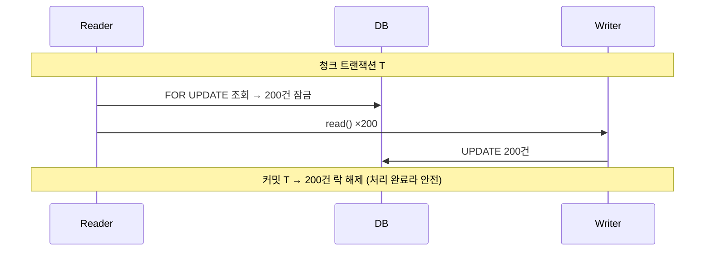
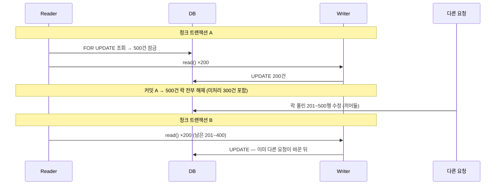

<!-- truncate -->

"일정 시간이 지난 `READY` 작업을 `IN_PROGRESS`로 전이하는 배치." 요구사항만 보면 `JdbcPagingItemReader` 하나로 해결될 것 같았습니다. 그런데 여기에는 놓치기 쉬운 문제가 하나 있었습니다. <mark>대상을 고르는 기준(`status = 'READY'`)을, 그 배치가 처리 과정에서 스스로 변경한다는 점</mark>(`READY → IN_PROGRESS`)입니다.

여기에 "대량 처리", "동시성", "기존 쿼리 재사용"이라는 조건이 더해지자 내장 Reader들이 하나씩 탈락했고, 결국 30줄짜리 Reader를 직접 만들게 됐습니다. 그 판단 과정을 정리합니다.

> **결론부터**: 내장 DB Reader는 크게 **커서형**과 **페이징형** 두 계열인데, 커서형은 `FOR UPDATE` 락이 청크 트랜잭션에 묶이지 않고, 페이징형은 읽는 조건이 바뀌는 탓에 스킵이 납니다. 키셋 커서와 청크에 묶인 락을 동시에 만족하는 내장 Reader가 없어서, 결국 직접 만들었습니다.

## 요구사항

`task(id, status, created_at)`에서 **등록된 지 N분이 지난 `READY` 작업을 `IN_PROGRESS`로 전이**하는 배치입니다. 조건은 세 가지였습니다.

1. 대상이 수만 건이라 청크 단위로 나눠 처리해야 한다.
2. 배치가 도는 중에도 다른 요청이 같은 행을 건드릴 수 있어(예: 사용자가 직접 취소) 동시성을 지켜야 한다.
3. 이미 QueryDSL로 만들어 둔 조회·갱신 쿼리를 재사용하고 싶다.

Spring Batch의 chunk step은 `read → process → write`를 청크 크기만큼 모아 한 트랜잭션으로 커밋합니다. "대상 id를 읽는" 역할이 ItemReader이고, 후보는 네 가지였습니다.

- `JdbcPagingItemReader` — 페이징형
- `JdbcCursorItemReader` — 커서형
- `JpaPagingItemReader` — 페이징형
- `RepositoryItemReader` — 리포지토리 메서드 호출형

이제 4개의 Reader가 어떤 부분에서 기준을 충족하지 못하는지 순서대로 보겠습니다.

## 제약 1. 읽는 조건을 쓰기에서 바꾼다

인트로에서 언급한 문제가 구체적으로 드러나는 곳이 바로 여기입니다. `READY`를 읽어 `IN_PROGRESS`로 전이하니, <mark>조회할 때 거는 필터를 Writer가 바꿔 버립니다.</mark> 이 상태에서 OFFSET 페이징으로 읽으면 문제가 생깁니다.

```
1페이지: OFFSET 0   LIMIT 100  → 100건 처리 → IN_PROGRESS
   이제 READY 개수가 100건 줄었다.
2페이지: OFFSET 100 LIMIT 100  → 원래 101~200번째였던 행이
   앞으로 100칸 당겨져서 201~300을 읽는다. 101~200은 통째로 스킵.
```

한 페이지를 처리하면 `READY` 개수가 그만큼 줄어듭니다. 그 상태에서 `OFFSET 100`을 다시 조회하면 원래 101번째였던 행이 앞으로 당겨져 있어 건너뛰게 됩니다. **처리하면서 목록에서 빠지는 데이터에 OFFSET 페이징을 쓰면 나타나는 전형적인 스킵 버그**입니다.

그래서 OFFSET을 버리고 <mark>마지막으로 읽은 id 다음부터 조회하는 키셋 커서(`id > afterId`)</mark>로 바꿨습니다.

```sql
WHERE status = 'READY' AND created_at < :threshold
  AND id > :afterId
ORDER BY id ASC
LIMIT :chunkSize
```

id 값은 항상 증가하는 방향이고, 이미 전이된 행은 다음 조회에서 `status = 'READY'` 조건에 의해 제외됩니다. 스킵도 중복도 없습니다.

## 제약 2. 락을 청크 트랜잭션에 묶어야 한다

동시성은 조회 시 `FOR UPDATE`(비관적 락)로 잡았습니다. 그런데 이 락이 효과를 보려면 <mark>"잠그고 → 바꾸고 → 커밋"이 하나의 트랜잭션 안에서 일어나 잡은 락이 커밋 시점까지 유지</mark>되어야 합니다.

그런데 내장 커서형·페이징형 Reader는 이 조건을 만족시키지 못합니다. 근거를 문서와 소스로 나눠 확인하면 이렇습니다.

**`JdbcCursorItemReader` (커서형)**

"커서를 열어 `read`마다 한 행씩 읽는다"는 [Spring Batch 레퍼런스](https://docs.spring.io/spring-batch/reference/readers-and-writers/database.html)에 그대로 있습니다.

> opens a cursor on initialization and moves the cursor forward one row for every call to `read`
>
> → 커서를 초기화 시점에 한 번 열고, `read()`가 불릴 때마다 다음 행으로 전진한다는 뜻입니다.

다만 **"별도 커넥션"** 은 공식 문서에는 없지만, [`AbstractCursorItemReader`](https://github.com/spring-projects/spring-batch/blob/main/spring-batch-infrastructure/src/main/java/org/springframework/batch/infrastructure/item/database/AbstractCursorItemReader.java)에서 근거를 찾을 수 있습니다.

```java
/**
 * ...
 * By default, the cursor will be opened using a separate connection.
 * ...
 */
public abstract class AbstractCursorItemReader<T>
        extends AbstractItemCountingItemStreamItemReader<T> implements InitializingBean {
    // ...
    private boolean useSharedExtendedConnection = false;   // 기본값
    // ...
}
```

→ 커서는 기본적으로 청크 트랜잭션과 **다른 커넥션**에서 열립니다(공유하려면 `useSharedExtendedConnection`을 켜고 `ExtendedConnectionDataSourceProxy`를 써야 함). 그래서 그 커넥션에서 건 `FOR UPDATE` 락은 각 청크의 쓰기·커밋 트랜잭션에 묶이지 않습니다.

그럼 **"`useSharedExtendedConnection`을 켜서 커넥션을 공유하면 커서형으로 되지 않나?"** 라는 의문이 들 수 있습니다. 두 가지가 남습니다. 첫째, 커서는 스텝 전체를 관통하는 **한 번의 조회**인데 청크는 그 사이 여러 번 커밋되므로, 아직 처리하지 않은 행의 락이 먼저 풀리는 구도는 그대로입니다. 둘째, 더 결정적으로 커서형은 여전히 **SQL을 문자열로** 받아 **제약 3(기존 쿼리 재사용)** 을 풀지 못합니다. 커넥션 옵션 하나로는 이미 만든 리포지토리 메서드를 그대로 부를 수 없습니다.

**`JdbcPagingItemReader` (페이징형)**

"페이지마다 별도 쿼리를 실행한다"는 문서에 있습니다.

> running multiple queries where each query fetches a portion of the results … Each query must specify the starting row number and the number of rows that we want returned in the page.
>
> → 하나의 커서를 유지하는 게 아니라, 페이지 단위로 조회 쿼리를 여러 번 실행한다는 뜻입니다.

실제 구현도 그렇습니다. [`JdbcPagingItemReader.doReadPage()`](https://github.com/spring-projects/spring-batch/blob/main/spring-batch-infrastructure/src/main/java/org/springframework/batch/infrastructure/item/database/JdbcPagingItemReader.java)는 페이지마다 조회 쿼리를 새로 실행합니다.

```java
protected void doReadPage() {
    // ...
    if (getPage() == 0) {
        getJdbcTemplate().query(firstPageSql, rowCallback, ...);       // 첫 페이지
    } else {
        getJdbcTemplate().query(remainingPagesSql, rowCallback, ...);  // 이후 페이지
    }
    // ...
}
```

→ 페이지마다 별도 statement가 실행되므로, 한 페이지 조회에서 건 `FOR UPDATE` 락은 다음 페이지 조회 시점까지 유지되지 않습니다.

즉 커서형은 커넥션이 갈리고, 페이징형은 쿼리가 갈려서, 어느 쪽도 `FOR UPDATE` 락을 "청크 쓰기·커밋과 같은 트랜잭션"에 유지해 주지 못합니다.

그래서 다음 규칙을 지켜야 합니다. <mark>Reader가 한 번에 읽는 개수 = 청크 커밋 간격(commit-interval)</mark>. 이렇게 맞추면 "한 번의 `FOR UPDATE` 조회"가 정확히 "한 청크 트랜잭션" 안에 들어가고, 그 조회로 잠근 행들이 같은 트랜잭션의 커밋 시점까지 잠긴 채 유지됩니다(chunk step은 `read()`를 청크 트랜잭션 안에서 호출합니다).

예시를 들어 보겠습니다. 커밋 간격을 200이라고 하면:

**맞춘 경우 (fetch = chunk = 200)** — 한 조회로 잠근 200건이 그 청크 트랜잭션 안에서 처리·커밋됩니다.



**다르게 둔 경우 (fetch = 500, chunk = 200)** — 한 조회로 500건을 잠갔는데, 첫 청크가 커밋되며 아직 처리하지 않은 300건의 락까지 풀립니다.



`fetch`가 `chunk`보다 크면, 한 조회로 잠근 행이 여러 청크 트랜잭션에 걸칩니다. 첫 청크가 커밋되는 순간 **아직 처리하지 않은 행의 락까지 함께 풀려**, 그 사이 다른 요청이 끼어들 수 있어 안전장치가 깨집니다. 그래서 "한 번의 `FOR UPDATE` 조회 = 한 청크"가 되도록 두 값을 같게 맞춥니다.

## 제약 3. 내장 Reader는 기존 쿼리를 호출하지 못한다

제약 1·2를 풀어 만든 조회(키셋 커서 + `FOR UPDATE` + 조인)는 이미 리포지토리에 메서드로 있었습니다.

```java
// 이미 있는 조회 메서드 (키셋 커서 + FOR UPDATE + 조인, QueryDSL로 구현)
List<Long> findNextChunk(long afterId, int size);
```

그대로 재사용하고 싶었지만, `Jdbc*`·`Jpa*` Reader는 이 **메서드**가 아니라 SQL·JPQL을 **문자열로** 설정받습니다. 메서드에 위임할 지점이 없어, 결국 같은 쿼리를 배치 쪽에 문자열로 다시 적어야 합니다.

```java
// JdbcPagingItemReader — 메서드가 아니라 쿼리 '문자열'을 요구
new JdbcPagingItemReaderBuilder<Long>()
    .selectClause("SELECT id")
    .fromClause("FROM task")
    .whereClause("WHERE status = 'READY' AND created_at < :threshold")  // ← 여기 다시 적어야 함
    .sortKeys(Map.of("id", Order.ASCENDING))
    .build();
// findNextChunk()에 위임 불가 → 같은 쿼리가 리포지토리와 배치, 두 곳에 존재
```

메서드를 호출할 수 있는 Reader는 `RepositoryItemReader` 하나뿐인데, 이건 Spring Data의 `Pageable → Page` 시그니처만 받습니다.

```java
// RepositoryItemReader — 메서드는 부르지만 Pageable(=OFFSET) 시그니처만
new RepositoryItemReaderBuilder<Long>()
    .repository(taskRepository)
    .methodName("findReadyPage")   // Page<Long> findReadyPage(Pageable) 형태만 가능
    .build();
// → OFFSET 페이징이라 제약 1(스킵)로 되돌아가고, id > afterId 키셋 커서와도 안 맞음
```

즉 문자열 방식은 쿼리 재사용이 안 되고, 메서드 방식은 재사용은 되지만 다시 OFFSET이라 제약 1로 되돌아갑니다.

## 후보를 하나씩 대입해 보기

앞의 세 제약(스킵·락 유지·쿼리 재사용)을 후보 Reader에 하나씩 대입하면, 각각 어디서 왜 떨어지는지가 분명해집니다.

### `JdbcPagingItemReader` — 페이징형

- **동작**: 페이지마다 `... ORDER BY id LIMIT :size OFFSET :page*size` 쿼리를 **새로** 실행해 한 페이지씩 읽습니다.
- **제약 1(스킵)**: ✕ — OFFSET 기반이라, 처리된 행이 `READY`에서 빠지면 목록이 앞으로 당겨져 다음 페이지가 건너뜁니다(제약 1의 그 버그).
- **제약 2(락 유지)**: ✕ — 페이지마다 쿼리를 새로 실행하고 페이지 사이에 락을 유지하지 않습니다. `FOR UPDATE`를 걸어도 다음 페이지 조회 전에 트랜잭션이 커밋되며 풀립니다.
- **제약 3(쿼리 재사용)**: ✕ — SQL을 **문자열로만** 받아, 이미 만든 리포지토리 메서드에 위임할 지점이 없습니다.
- **판정**: 셋 다 탈락.

### `JpaPagingItemReader` — 페이징형

- `JdbcPagingItemReader`와 구조가 같고, SQL 대신 **JPQL 문자열**을 받는 것만 다릅니다. 스킵·락·재사용 모두 같은 이유로 탈락합니다.

### `JdbcCursorItemReader` — 커서형

- **동작**: 스텝 시작 시 커서를 한 번 열어, 스텝이 끝날 때까지 **하나의 커넥션**으로 결과를 한 행씩 스트리밍합니다.
- **제약 1(스킵)**: △ — OFFSET이 아니라 단일 커서라 "페이지 당겨짐" 자체가 없어 스킵은 나지 않습니다.
- **제약 2(락 유지)**: ✕ — **바로 이 지점에서 탈락합니다.** 커서가 청크 트랜잭션과 **별도 커넥션**으로 열립니다. `FOR UPDATE`로 잠근 행은 그 읽기 커넥션에 걸려 있고, 실제 쓰기·커밋은 다른 청크 트랜잭션이 합니다. 두 트랜잭션이 분리돼 있어, 청크가 커밋되는 시점까지 그 락이 유지된다는 보장이 없습니다.
- **제약 3(쿼리 재사용)**: ✕ — 역시 SQL 문자열만 받습니다.
- **판정**: 스킵은 피하지만 락과 재사용에서 탈락.

### `RepositoryItemReader` — 메서드 호출형

- **동작**: 리포지토리의 `Page<T> method(Pageable)` 형태 메서드를 페이지 단위로 호출합니다.
- **제약 3(쿼리 재사용)**: ○ — 후보 중 **유일하게 기존 메서드를 그대로 호출**할 수 있습니다. QueryDSL로 만든 조회 메서드를 붙일 수 있는 유일한 길입니다.
- **제약 1(스킵)**: ✕ — 하지만 `Pageable`은 결국 OFFSET 페이징이라, 제약 1에서 본 스킵이 똑같이 나타납니다.
- **제약 2(락 유지)**: ✕ — 페이지 호출마다 트랜잭션이 갈려, 락이 청크 커밋 시점까지 유지되지 않습니다.
- **판정**: 재사용은 되지만 스킵·락에서 탈락.

정리하면 이렇습니다. **커서형은 스킵은 없지만 락이 청크에 유지되지 않고, 페이징형은 스킵이 발생하고, 메서드 호출형은 재사용은 되지만 다시 OFFSET이라 스킵**입니다. "키셋 커서 + 청크 트랜잭션에 유지되는 락 + 기존 쿼리 재사용" 세 가지를 한 번에 만족하는 후보가 없습니다.

## 그래서 어떤 Reader가 남나

위 판정을 한 표로 요약하면 이렇습니다.

| Reader | 쿼리 재사용 | 스킵 없음 | 락 유지 | 막히는 지점 |
|---|:---:|:---:|:---:|---|
| `JdbcCursorItemReader` | ✕ | △ | ✕ | SQL 문자열만 받음 / 별도 커넥션 커서라 락 미유지 |
| `JdbcPagingItemReader` | ✕ | ✕ | ✕ | SQL 문자열만 / OFFSET 스킵 / 페이지마다 새 쿼리 |
| `JpaPagingItemReader` | ✕ | ✕ | ✕ | 위와 동일(JPQL 문자열) |
| `RepositoryItemReader` | ○ | ✕ | ✕ | 메서드는 호출하나 `Pageable`=OFFSET → 스킵 재발 |
| **커스텀(직접)** | ○ | ○ | ○ | 쿼리 그대로 호출 + `id > afterId` 키셋 + `fetch = commit-interval` |

> △: `JdbcCursorItemReader`는 OFFSET이 아니라 단일 커서 스트리밍이라 스킵 자체는 없지만, 락(세 번째 열)에서 탈락합니다.

표에 없는 나머지 구현체도 마찬가지입니다. `JpaCursorItemReader`·`HibernateCursorItemReader`·`StoredProcedureItemReader`(그리고 생태계의 `MyBatisCursorItemReader`)는 **커서형**이라 제약 2에, `HibernatePagingItemReader`·`MyBatisPagingItemReader`는 **페이징형**이라 제약 1에 걸립니다. 게다가 전부 쿼리를 문자열이나 매퍼 statement로 받아서 제약 3까지 그대로입니다. 즉 내장 Reader는 결국 **커서형과 페이징형 두 계열**로 나뉘는데, 커서형은 락이 안 묶이고 페이징형은 스킵이 발생하고, 어느 쪽도 이미 만든 쿼리 메서드를 그대로 부르지 못합니다.

그러니 정확히는 "내장 Reader가 부족하다"가 아니라, <mark>키셋 커서 + 청크 트랜잭션에 묶인 락 + 기존 쿼리 재사용, 이 셋을 동시에 만족하는 내장 Reader가 없다</mark>는 것입니다.

## 해결: 버퍼 역할만 하는 커스텀 Reader

무거운 로직은 이미 쿼리 계층에 있으니, Reader는 <mark>청크 조회 결과를 한 건씩 흘려주는 버퍼</mark>면 충분했습니다.

```java
public class StatusTransitionItemReader implements ItemReader<Long> {

    private final TargetIdQuery query;   // 이미 있는 조회 계층(키셋 커서 + FOR UPDATE)
    private final int chunkSize;          // 스텝의 commit-interval과 같은 값

    private final Deque<Long> buffer = new ArrayDeque<>();
    private long afterId = 0L;
    private boolean exhausted = false;

    public StatusTransitionItemReader(TargetIdQuery query, int chunkSize) {
        this.query = query;
        this.chunkSize = chunkSize;
    }

    @Override
    public Long read() {
        if (buffer.isEmpty() && !exhausted) {
            fill();
        }
        return buffer.poll();   // 비면 null → 스텝 종료
    }

    private void fill() {
        List<Long> ids = query.findNextChunk(afterId, chunkSize);
        if (ids.isEmpty()) {
            exhausted = true;
            return;
        }
        buffer.addAll(ids);
        afterId = ids.get(ids.size() - 1);   // 다음 커서 = 이번 청크의 마지막 id
        if (ids.size() < chunkSize) {
            exhausted = true;                 // 마지막 페이지면 빈 조회 한 번을 생략
        }
    }
}
```

`read()`는 버퍼에서 하나씩 꺼내고, 버퍼가 비면 커서로 다음 청크를 채웁니다. 스텝에 등록할 때 fetch 크기와 청크 크기를 같은 상수로 넘기면, 제약 2에서 본 규칙(**한 번에 읽는 개수 = 커밋 간격**)이 코드로 강제됩니다.

```java
int CHUNK = 200;
new StepBuilder("transitionStep", jobRepository).<Long, Long>chunk(CHUNK, txManager)
                                                .reader(new StatusTransitionItemReader(query, CHUNK)) // ← 같은 값
                                                .writer(writer)
                                                .build();
```

Writer는 모인 id에 조건부 UPDATE를 겁니다. `WHERE`에 `status='READY'`를 한 번 더 넣은 것은, 락과 별개로 "조회 이후 상태가 바뀐 행"을 걸러 내는 2차 방어선입니다.

```java
public void write(Chunk<? extends Long> chunk) {
    List<Long> ids = new ArrayList<>(chunk.getItems());
    // UPDATE ... SET status='IN_PROGRESS' WHERE id IN (:ids) AND status='READY'
    query.bulkUpdateStatus(ids, "READY", "IN_PROGRESS");
}
```

## 남은 문제: 재시작

이렇게 만들면서 딱 하나 포기한 게 있습니다. **재시작 복원**입니다. 내장 Reader는 읽은 위치를 `ExecutionContext`에 저장해, 중간에 실패해도 이어서 재개할 수 있습니다.

커스텀에서도 이걸 얻는 길은 있습니다. `ItemStream`(open/update/close)을 함께 구현해 읽은 위치를 `ExecutionContext`에 저장하면 되고, 방법은 몇 가지입니다.

- `AbstractItemCountingItemStreamItemReader` — `doRead()`만 구현하면 위치 저장이 딸려오지만, 저장하는 값이 `currentItemCount`(읽은 **개수**)라 우리 커서 `afterId`와 맞지 않습니다. 개수로는 커서를 되살릴 수 없어서, 결국 `open()`/`update()`를 직접 손봐야 합니다.
- `AbstractPagingItemReader` — 페이징 리더의 추상 베이스지만 page(=OFFSET) 기반이라 제약 1(스킵)이 그대로 돌아옵니다.
- **`ItemStreamReader`를 직접 구현** — `open()`/`update()`에서 `afterId`를 직접 저장·복원합니다. <mark>키셋 커서에는 이 방식이 가장 자연스럽습니다.</mark>

그런데 이번에는 애초에 재시작 저장이 필요 없었습니다. 안 쓸 기능 때문에 라이프사이클 메서드를 얹을 이유가 없어, 순수 `ItemReader`로 갔습니다. 대신 기댄 건 멱등성입니다. <mark>상태 전이 자체가 멱등이라, 다시 실행하면 아직 `READY`인 행만 다시 잡힙니다.</mark> 이미 전이된 행은 조건에서 빠집니다.

배치를 "기동해 한 번 실행하고 종료"하는 방식(K8s CronJob 등)으로 운영하면, 중간 상태를 복원하기보다 그냥 재실행하는 편이 더 자연스러운 복구입니다. 그래서 재시작 저장을 포기해도 문제가 없었고, 그 덕분에 Reader를 이 정도로 단순하게 유지할 수 있었습니다.

반대로 재시작 복원이 꼭 필요한 배치라면, keyset 커서에는 `ItemStreamReader`를 직접 구현해 `afterId`를 저장하는 쪽이 가장 잘 맞습니다. 앞의 `read()`/`fill()`은 그대로 두고, 라이프사이클 메서드만 얹으면 됩니다.

```java
public class StatusTransitionItemReader implements ItemStreamReader<Long> {

    private static final String CURSOR_KEY = "status.transition.afterId";
    // ... 기존 필드(query, chunkSize, buffer, afterId) 그대로 ...

    @Override
    public void open(ExecutionContext ctx) {      // 재시작 시: 저장된 커서부터 재개
        if (ctx.containsKey(CURSOR_KEY)) {
            this.afterId = ctx.getLong(CURSOR_KEY);
        }
    }

    @Override
    public void update(ExecutionContext ctx) {    // 청크 커밋마다: 현재 커서를 저장
        ctx.putLong(CURSOR_KEY, afterId);
    }

    @Override
    public void close() { }

    // read() / fill() 은 앞과 동일 — 버퍼가 비면 findNextChunk(afterId, chunkSize)로 채움
}
```

Spring Batch가 청크 커밋마다 `update()`를 호출해 `afterId`를 `ExecutionContext`에 저장하고, 재시작 시 `open()`에서 그 값을 되살립니다. 개수(`currentItemCount`)가 아니라 **커서 값 자체**를 저장하므로, 중간에 실패해도 정확히 그 지점부터 이어서 조회합니다.

### `afterId`는 메모리에만 있는 게 아니라 DB에 저장된다

여기서 한 가지 짚어둘 점이 있습니다. `ExecutionContext`는 **메모리의 키-값 맵**이지만, 그 값은 메모리에만 머무르지 않고 **DB의 배치 메타데이터 테이블에 영속화**됩니다. 프로세스를 껐다 켜도 재시작이 되는 이유가 바로 이것입니다.

1. 실행 중에는 `ExecutionContext`가 메모리 맵으로 존재합니다. `update()`로 `afterId`를 여기에 넣습니다.
2. **청크가 커밋되는 시점마다**, Spring Batch의 `JobRepository`가 그 스텝의 `ExecutionContext`를 직렬화해 **`BATCH_STEP_EXECUTION_CONTEXT` 테이블**(`SHORT_CONTEXT`·`SERIALIZED_CONTEXT` 컬럼)에 씁니다. 즉 청크 커밋(데이터 UPDATE)과 진행 위치(`afterId`) 저장이 **같은 트랜잭션**에서 함께 일어나, 둘의 정합성이 유지됩니다.
3. 재시작하면(같은 JVM이든 종료됐다 재기동한 새 JVM이든), `JobRepository`가 그 테이블에서 **마지막으로 저장된 컨텍스트**를 읽어 `open(ctx)`로 넘겨줍니다. 그래서 `afterId`가 복원되어 그 지점부터 이어집니다.

```text
[청크 N 커밋]  DB 트랜잭션
  UPDATE task SET status='IN_PROGRESS' WHERE id IN (...)   ← 데이터 반영
  UPDATE BATCH_STEP_EXECUTION_CONTEXT SET ... = {afterId}  ← 진행 위치 저장
  COMMIT   ← 데이터와 커서가 함께 커밋 (한 트랜잭션)

[프로세스 재시작]
  SELECT ... FROM BATCH_STEP_EXECUTION_CONTEXT             ← 저장된 afterId 로드
  open(ctx) → this.afterId = ctx.getLong(CURSOR_KEY)       ← 그 지점부터 재개
```

<mark>재시작 복원의 실제 저장소는 메모리가 아니라 DB의 배치 메타 테이블입니다. 그래서 데이터 변경과 진행 위치가 같은 트랜잭션에서 커밋돼, 프로세스가 중단돼도 정합성이 깨지지 않습니다.</mark>

단, 이건 **JDBC 기반 `JobRepository`**(배치 메타 테이블을 쓰는 표준 구성)일 때입니다. 메모리형(Map) `JobRepository`를 쓰면 DB에 남지 않아, 프로세스가 종료되면 진행 위치도 사라집니다.

## 마무리

내장 컴포넌트는 일반적인 사용 사례를 편하게 처리하도록 만들어져 있습니다. 그래서 요구사항이 하나씩일 때는 대개 잘 맞지만, **평범하지 않은 요구가 두세 개 한꺼번에 겹치면** 어느 하나에서 걸리곤 합니다. 이번엔 (1) 읽으면서 목록에서 빠지는 데이터, (2) 청크 트랜잭션에 유지돼야 하는 락, (3) 기존 쿼리 재사용 — 이 세 가지가 동시에 필요했고, 그 교집합을 만족하는 내장 Reader가 없어서 30줄짜리 Reader가 가장 나은 답이었습니다.

내장을 안 쓴 게 아니라 쓸 수 없었던 것이고, 그 이유를 이해해 두면 다음 배치를 설계할 때도 판단이 빨라집니다.
