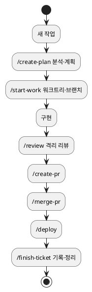

<!-- truncate -->

AI 코딩 어시스턴트를 실무에 쓰다 보면 매번 같은 벽에 부딪힙니다. **세션이 바뀌면 맥락이 날아가고, 어제와 오늘의 작업 방식이 달라집니다.** 머릿속으로 지키던 절차를 어시스턴트도 매번 똑같이 따르게 하려면 어떻게 해야 할까요? 이 글에서는 제가 실무에서 구축해 쓰고 있는 **AI 엔지니어링 하네스(harness)** — Claude Code용 메타 워크스페이스 — 의 구조와 방식을 예시와 폴더 구조로 풀어봅니다.

---

## 왜 "하네스"가 필요한가

LLM은 세션마다 백지에서 시작합니다. 프로세스를 모델의 기억에 맡기면, 오늘은 리뷰를 건너뛰고 내일은 브랜치 규칙을 잊는 식으로 매번 흔들립니다.

해법은 발상을 뒤집는 것입니다. <mark>프로세스·상태·규칙·안전장치를 모델의 기억이 아니라 파일 시스템에 박아두면, 세션이 바뀌어도 같은 절차가 재현된다.</mark>

그래서 만든 것이 **하네스**입니다. 코드 저장소 위에 올린 최소한의 메타 레이어로, 코드 자체는 전혀 건드리지 않고 *"어떻게 일할지"* 만 담습니다. 말(馬)이 아니라 마구(馬具, harness) — 방향을 잡아주는 장치죠.

---

## 전체 그림: 코드 위에 얹은 메타 워크스페이스

워크스페이스는 세 축으로 나뉩니다 — **상태 · 기록 · 하네스 부품**.

```
claude-workspace/
├── CLAUDE.md          # 인덱스: 언제 무엇을 호출하나
├── CONTEXT.md         # ⭐ 활성 티켓 인덱스 + Focus(지금 주로 작업 중인 티켓)
├── tickets/           # 작업(티켓)별 영구 기록
├── projects/          # 저장소별 컨벤션 (<repo>/CLAUDE.md, ARCHITECTURE.md)
├── wiki/              # decisions(ADR) · patterns · incidents · troubleshooting
└── .claude/           # 하네스 부품 (Claude Code가 자동 인식)
    ├── commands/      # 슬래시 커맨드 — 사용자가 부르는 절차
    ├── agents/        # 서브에이전트 — 격리 컨텍스트 위임
    ├── skills/        # 자동 로드되는 지식
    └── hooks/         # 도구 호출 시점의 정책 강제
```

핵심은 경계입니다. 코드 원본은 읽기 전용으로, 실제 작업은 워크트리 사본에서 이뤄지고, <mark>"일하는 방식"은 전부 이 메타 워크스페이스가 소유한다.</mark> 코드와 프로세스를 물리적으로 분리하는 것이 출발점입니다.

---

## 상태 추적: 활성 티켓 인덱스

하네스는 여러 티켓을 **병렬로** 추적합니다. 작업 공간부터가 티켓별로 갈라져 있어서요 — 티켓마다 워크트리가 따로 있어(뒤에서 볼 워크트리 격리) 여러 티켓을 동시에 체크아웃·빌드·커밋합니다. 이 물리적 병렬을 추적이 그대로 따라가도록, 상태를 세 가지로 나눕니다.

- **`CONTEXT.md` = 활성 티켓 인덱스.** 활성 티켓을 한 줄씩 담은 표. 라이브 상세는 각 티켓 파일에 위임합니다.

```markdown
# Current Context — 활성 티켓 인덱스

## Focus
- TICKET-4352   ← 지금 주로 작업 중인 티켓 (인자 없이 스킬을 부르면 이 티켓이 대상)

## Active Tickets
| 티켓 | repo | 브랜치 | 상태 | 다음 액션 |
|------|------|--------|------|-----------|
| TICKET-4185 | order-service | feature/TICKET-4185 | 스테이징·미커밋 | 커밋 → PR |
| TICKET-4352 | order-service | feature/TICKET-4352 | 계획 중 | /start-work |
```

- **라이브 상태 = `tickets/<티켓>.md`.** 각 티켓의 Goal·진행 상태·다음 액션·이력을 담는 **상시 상태 파일**. 인덱스에는 한 줄 요약만, 상세는 여기에 둡니다.
- **스킬은 대상 티켓을 인자로 받는다.** `/start-work TICKET-4352`처럼 티켓 키를 붙여 부릅니다. 인자가 없으면 → 활성이 1건이면 그것, 여럿이면 **`Focus`(지금 주로 작업 중인 티켓)** 를 따르고, 그것도 없으면 사용자에게 묻습니다.

<mark>상태는 세 곳이 나눠 답한다 — 활성 티켓 목록은 `CONTEXT.md`(인덱스), 각 티켓의 라이브 상태는 `tickets/<티켓>.md`, 대상 지정은 스킬의 티켓 인자. 워크트리가 티켓별로 병렬이므로 추적도 병렬이다.</mark>

`pause`/`resume`은 인덱스에서 티켓을 **등록 해제 / 다시 등록**하고 Focus를 전환합니다(상태 자체는 티켓 파일에 상시 남아 삭제되지 않습니다). 리뷰 대기 티켓과 신규 착수 티켓을 동시에 든 채, 각 스킬 호출에서 대상만 명시하면 워크트리 혼동 없이 병렬로 진행됩니다.

```bash
# TICKET-4185는 리뷰/커밋 대기, TICKET-4352 신규 착수를 동시에
/create-plan   TICKET-4352     # 인덱스에 4352 추가(계획 중), Focus=4352
/start-work    TICKET-4352     # 4352 워크트리·브랜치 생성 → 구현
/create-pr     TICKET-4185     # 대기 중이던 4185를 커밋·PR (대상 명시)
/finish-ticket TICKET-4185     # 인덱스에서 4185 제거, 4352는 계속 활성
```

트레이드오프는 있습니다. **스킬 호출 때 대상 티켓 명시가 원칙**이고(모호하면 질문), 활성 티켓이 쌓이면 인덱스가 방치될 수 있어 `/finish-ticket`·`/pause-ticket`로 제때 정리해 인덱스를 가볍게 유지합니다.

---

## 하네스의 4가지 부품

`.claude/` 아래 네 종류의 부품이 서로 다른 역할을 맡습니다. 구분 기준은 **누가 발동하는가**와 **컨텍스트를 격리하는가**입니다.

| 부품 | 무엇 | 누가 발동 | 격리 |
|---|---|---|---|
| `commands/` | 슬래시 커맨드 — 절차 프롬프트 | **사용자**가 `/이름`으로 명시 호출 | 메인 |
| `agents/` | 서브에이전트 — 작은 Claude | **메인 Claude**가 도구로 호출 | 분리 |
| `skills/` | 자동 로드되는 지식 묶음 | **모델**이 상황 보고 자동 | 메인 |
| `hooks/` | 정책 강제 셸 스크립트 | **시스템**이 도구 호출 직전 | OS 프로세스 |

이 네 가지가 이렇게 맞물립니다.

```
사용자 입력 → 메인 Claude
              │
              ├─ /command 호출 ──→ commands/<name>.md 가 프롬프트로 주입
              ├─ 상황 인지 → 자동 ─→ skills/<name>/SKILL.md 가 컨텍스트에 추가
              ├─ Agent 도구 호출 ─→ agents/<name>.md 를 격리 실행 (결과만 반환)
              └─ Edit/Write/Bash ─→ hooks/<name>.sh (exit 0 통과 / exit 2 차단)
```

<mark>같은 일을 두 부품에 넣지 않는 것이 핵심 — 호출 주체(사용자·모델·시스템)와 격리 여부로 부품이 갈린다.</mark> 예를 들어 "사용자가 명시적으로 부르는 절차"는 command, "AI가 알아서 로드해야 할 지식"은 skill입니다.

예시로, 슬래시 커맨드 하나(`create-plan`)는 이런 모습입니다.

```markdown
---
description: 티켓을 분석하고 작업 계획을 작성한다. 승인 전까지 코드 수정 금지.
---

## 절차
1. ticket-analyzer 에이전트로 티켓 분석을 격리 위임
2. 시나리오(일반/장기/핫픽스)를 사용자에게 확인
3. 계획 작성 후 승인 대기 — 승인 전 코드 수정 금지
```

프론트매터의 `description` 한 줄이 명령의 정체성이고, 본문이 Claude가 따를 절차입니다.

---

## 루프: 작업 하나가 흐르는 길

작업(티켓) 하나는 정해진 슬래시 커맨드를 따라 한 방향으로 흐릅니다.

<details>
<summary>PlantUML 코드</summary>



</details>


<mark>작업 하나가 계획 → 구현 → 리뷰 → PR → 배포 → 마무리까지 정해진 커맨드를 따라 흐른다.</mark> 각 단계가 끝날 때마다 `CONTEXT.md`의 상태 필드가 즉시 갱신되므로, 중간에 세션이 끊겨도 다음 세션이 "어디까지 왔는지"를 파일에서 그대로 읽습니다.

무거운 일은 이 루프 중간에서 **격리 컨텍스트로 위임**합니다. 예를 들어 `/review`는 `code-reviewer` 서브에이전트를 불러 diff 점검을 별도 컨텍스트에서 돌리고, 결과 요약 한 통만 메인으로 돌려받습니다. 메인 대화가 리뷰 로그로 오염되지 않습니다.

---

## 기록은 목적별로 나눈다

가장 많이 실수하는 지점이 "기록을 한 군데 몰아넣는" 것입니다. 이 하네스는 기록을 목적별로 쪼갭니다.

| 위치 | 무엇을 담나 | 수명 |
|---|---|---|
| `CONTEXT.md` | 지금 활성 작업의 상태 | 짧음 (분~일) |
| `tickets/<키>.md` | 그 작업에서 *무엇을 했나* (요약·영향·발견) | 영구 |
| `projects/<repo>/` | 그 저장소는 *어떻게 동작하나* (스택·컨벤션) | 지속 |
| `wiki/decisions/` | *왜 그렇게 정했나* (ADR) | 영구 |

<mark>"지금 어디까지 왔나"와 "무엇을 했나"와 "이 저장소는 어떻게 동작하나"와 "왜 그렇게 정했나"를 각각 다른 파일이 책임진다.</mark>

특히 `wiki/decisions/`의 ADR(Architecture Decision Record)이 중요합니다. 코드만 봐서는 알 수 없는 *선택의 맥락*을 박제해, 미래의 나와 새 합류자(그리고 Claude)가 "왜 이렇게 됐는가"를 판단할 수 있게 합니다. 반복되는 작업 절차는 `patterns/`, 운영 장애 회고는 `incidents/`, 자주 만나는 에러는 `troubleshooting/`으로 갈래를 나눕니다.

---

## 안전장치는 훅으로 강제한다

"규칙을 잘 지키자"는 다짐만으로는 언젠가 사고가 납니다. 그래서 되돌리기 어려운 행동은 **훅으로 물리적으로 막습니다.**

- `main`·`develop` 같은 보호 브랜치로의 직접 push 차단
- 읽기 전용 원본 저장소 파일 수정 차단 (워크트리 강제)
- 코드 저장소에 문서 파일 커밋 차단

훅은 도구 호출 직전에 실행되는 셸 스크립트로, `exit 0`이면 통과, `exit 2`면 차단 후 안내 메시지를 띄웁니다.

```bash
# 예: 보호 브랜치 push 차단 (PreToolUse hook)
branch=$(git rev-parse --abbrev-ref HEAD)
case "$branch" in
  main|develop)
    echo "[차단] $branch 직접 push 금지 — PR로 진행하세요." >&2
    exit 2 ;;   # 도구 호출 자체를 막음
esac
exit 0
```

<mark>규칙은 "잘 지키자"는 다짐이 아니라, 도구 호출 시점에 훅이 실제로 차단해야 지켜진다.</mark> 프롬프트에 적어둔 규칙은 모델이 잊을 수 있지만, 훅은 시스템이 실행하므로 잊히지 않습니다.

---

## 정리 — 설계 원칙 5가지

- **프로세스는 모델 밖 파일에** — 세션이 바뀌어도 같은 절차가 재현되도록.
- **상태는 인덱스로 모으고, 상세는 티켓별로** — 활성 티켓 목록은 `CONTEXT.md`(인덱스), 각 티켓의 진행은 `tickets/<티켓>.md`가 답한다. 워크트리가 병렬이면 추적도 병렬로.
- **무겁고 시끄러운 일은 격리 컨텍스트(agent)로** — 메인 대화를 깨끗하게.
- **지식은 자동 로드(skill), 절차는 명시 호출(command)** — 호출 주체로 부품을 가른다.
- **규칙은 훅으로 강제** — 다짐이 아니라 시스템이 막는다.

결국 하네스의 목표는 하나입니다. **AI를 더 똑똑하게 만드는 게 아니라, 어떤 세션에서 시작하든 팀의 프로세스를 그대로 따르게 만드는 것.** 모델의 능력이 아니라 *주변 구조*에 투자하는 셈입니다.
