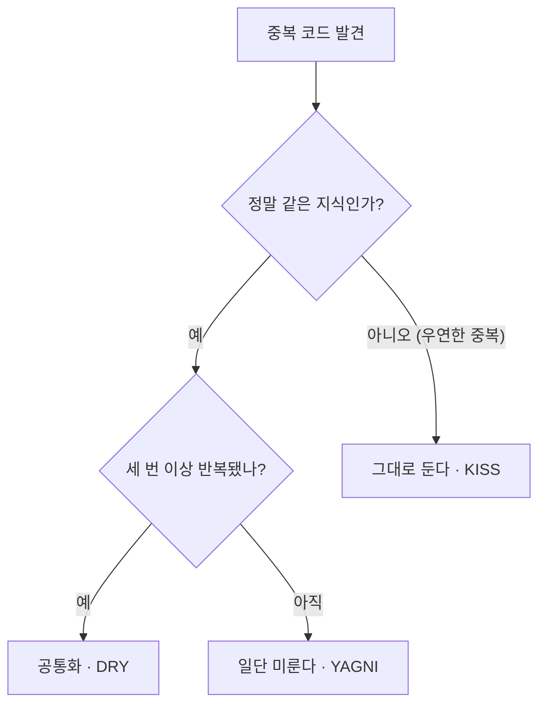

<!-- truncate -->
<br /><br />

좋은 코드를 만드는 규칙은 셀 수 없이 많지만, 실무에서 가장 자주 인용되는 설계 원칙 세 가지가 **KISS · DRY · YAGNI**입니다. 셋 다 짧고 외우기 쉬워서 구호처럼 쓰이지만, 정작 *언제 적용하고 언제 멈춰야 하는지*는 자주 오해됩니다. 이 글에서는 세 원칙의 의미와 자바 예제, 그리고 서로 충돌하는 지점까지 정리합니다.

---

## 세 원칙을 한 줄로

| 원칙 | 풀이 | 한 줄 요약 |
|---|---|---|
| KISS | Keep It Simple, Stupid | 단순한 해법을 우선하라 |
| DRY | Don't Repeat Yourself | 지식의 중복을 없애라 |
| YAGNI | You Aren't Gonna Need It | 지금 필요 없는 건 만들지 마라 |

세 원칙은 결국 하나의 목표를 다른 각도에서 말합니다. <mark>KISS·DRY·YAGNI는 모두 "불필요한 복잡성을 줄여라"는 한 문장의 세 가지 얼굴이다.</mark>

---

## KISS — 단순하게 유지하라

가장 단순하고 이해하기 쉬운 해법을 선택하라는 원칙입니다. 여기서 "단순함"은 *대충 짜라*는 뜻이 아니라, **문제를 푸는 데 꼭 필요한 만큼만 복잡하게 만들라**는 뜻입니다.

코드는 한 번 쓰이고 여러 번 읽힙니다. 그래서 판단 기준은 줄 수가 아닙니다. <mark>KISS의 기준은 "코드가 얼마나 짧은가"가 아니라 "다음 사람이 이해하는 데 걸리는 시간"이다.</mark>

예를 들어 등급별 할인율 계산을, 아직 규칙이 3개뿐인데 전략 패턴 + 팩토리 + 레지스트리로 감싸는 건 과합니다.

```java
// 과한 추상화 — 규칙이 3개뿐인데 전략/팩토리/레지스트리까지
public interface DiscountStrategy {
    BigDecimal apply(BigDecimal price);
}
// VipDiscountStrategy, RegularDiscountStrategy, DiscountStrategyFactory ...
```

```java
// KISS — 지금 필요한 만큼만
public BigDecimal discountedPrice(Grade grade, BigDecimal price) {
    return switch (grade) {
        case VIP     -> price.multiply(new BigDecimal("0.80"));
        case REGULAR -> price.multiply(new BigDecimal("0.95"));
        default      -> price;
    };
}
```

규칙이 수십 개로 늘어나고 런타임에 교체까지 필요해지면 그때 전략 패턴을 도입해도 늦지 않습니다.

---

## DRY — 반복하지 마라

DRY의 원래 정의(『실용주의 프로그래머』)는 "모든 **지식**은 시스템 안에서 단 하나의, 명확한 표현을 가져야 한다"입니다. 흔히 "같은 코드를 복붙하지 마라"로 축약되지만, 핵심은 코드 모양이 아닙니다. <mark>DRY가 없애야 할 것은 '똑같이 생긴 코드'가 아니라 '똑같은 지식'이다.</mark>

같은 비즈니스 규칙(예: 주문 금액 계산)이 여러 곳에 흩어져 있으면, 규칙이 바뀔 때 한 곳만 고치고 나머지를 잊어 버그가 납니다.

```java
// 중복 — 같은 "총액 계산" 지식이 두 서비스에 흩어짐
class OrderService {
    BigDecimal total(Order o) {
        return o.getItems().stream()
                .map(i -> i.getPrice().multiply(BigDecimal.valueOf(i.getQty())))
                .reduce(BigDecimal.ZERO, BigDecimal::add);
    }
}
class InvoiceService {
    BigDecimal total(Order o) { /* 위와 똑같은 로직 복붙 */ }
}
```

```java
// DRY — 지식을 도메인 한 곳으로
class Order {
    public BigDecimal total() {
        return items.stream()
                .map(OrderItem::subtotal)   // 소계 규칙도 OrderItem 안에 하나로
                .reduce(BigDecimal.ZERO, BigDecimal::add);
    }
}
```

단, 여기엔 함정이 있습니다. **지금 우연히 코드가 닮았다고 해서 무조건 합치면 안 됩니다** — 이 이야기는 뒤에서 다시 다룹니다.

---

## YAGNI — 필요해질 때까지 만들지 마라

"언젠가 필요할 것 같아서" 미리 만들어 두는 기능·설정·추상화를 경계하라는 원칙입니다. 미래 요구사항 예측은 대체로 빗나가고, 쓰지 않는 코드는 그 자체로 유지보수 부담이자 잘못된 방향으로 구조를 굳혀 버립니다.

<mark>YAGNI는 "미래를 위한 투자"처럼 보이는 코드가 대개 '미래에 대한 잘못된 베팅'임을 상기시킨다.</mark>

```java
// YAGNI 위반 — 아무도 요청하지 않은 "확장성"
public Report generate(
        ReportType type,
        boolean exportToPdf,     // PDF 요구 없음
        boolean exportToExcel,   // Excel 요구 없음
        Locale locale,           // 다국어 계획 없음
        Consumer<Report> hook) { // 훅 쓰는 곳 없음
    ...
}
```

```java
// YAGNI — 지금 필요한 시그니처만
public Report generate(ReportType type) {
    ...
}
```

파라미터가 실제로 필요해지는 순간에 추가하는 편이, 지금 다섯 개를 늘어놓고 넷을 방치하는 것보다 훨씬 안전합니다.

---

## 세 원칙은 서로를 견제한다

세 원칙은 늘 같은 방향을 가리키지 않습니다. **DRY를 과하게 밀면** 억지 공통화로 이어져 오히려 KISS와 YAGNI를 어깁니다. 반대로 **YAGNI를 과하게 밀면** 정말 필요한 통합까지 미루게 됩니다.

그래서 충돌할 때의 기본값이 중요합니다. <mark>원칙이 충돌하면 기본값은 "일단 단순하게(KISS·YAGNI) 두고, 중복이 실제로 아플 때 통합한다(DRY)"이다.</mark>



---

## 원칙을 오해하면 생기는 일

세 원칙은 오해될 때 오히려 코드를 망칩니다. 대표적인 함정들입니다.

- **성급한 추상화(premature abstraction)**: DRY를 앞세워 두 번째 중복에서 곧바로 공통 모듈을 만든다. 그러다 요구가 갈라지면, 억지로 합쳐 둔 추상화가 온갖 `if`와 플래그로 오염됩니다.
- **우연한 중복(coincidental duplication) 통합**: 지금 코드가 같아 보여도 *변하는 이유*가 다르면 다른 지식입니다. 예를 들어 "회원 나이 검증"과 "상품 재고 검증"이 우연히 `x >= 0` 로 같아도, 합치면 두 규칙이 서로를 잡아끕니다.
- **KISS = 생각 안 하기**로 오해: 단순함은 고민의 결과지 고민의 회피가 아닙니다.

이 함정들을 피하는 실용적 타협점이 바로 **삼세번 규칙**입니다. <mark>"세 번 반복될 때 추상화하라(Rule of Three)"는 DRY와 YAGNI를 화해시키는 현장의 절충안이다.</mark> 첫 번째는 그냥 쓰고, 두 번째 중복에서 "닮았네"라고 인지만 하고, 세 번째에 이르러 패턴이 확실해지면 그때 공통화합니다.

---

## 정리

- **KISS** — 필요한 만큼만 복잡하게. 기준은 줄 수가 아니라 이해에 걸리는 시간.
- **DRY** — 없앨 대상은 닮은 코드가 아니라 같은 *지식*. 우연한 중복은 건드리지 않는다.
- **YAGNI** — 지금 요구가 없으면 만들지 않는다. 미래 예측 대신 실제 요구를 기다린다.
- 충돌할 땐 **KISS·YAGNI가 기본값**, DRY는 중복이 실제로 아플 때(삼세번 규칙) 적용한다.

세 원칙은 "무조건 지켜야 할 계명"이 아니라, **복잡성이 늘어날 때마다 스스로에게 던지는 질문**에 가깝습니다. "이거, 지금 이만큼 복잡할 필요가 있나?"
