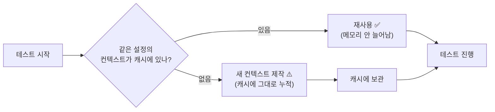
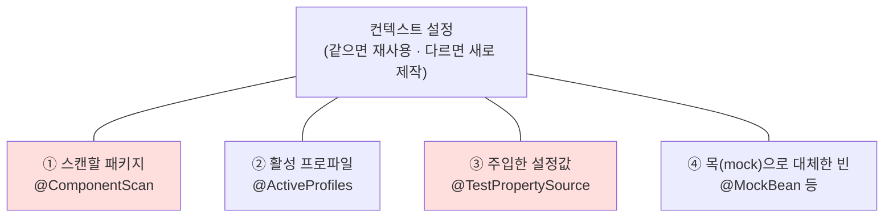
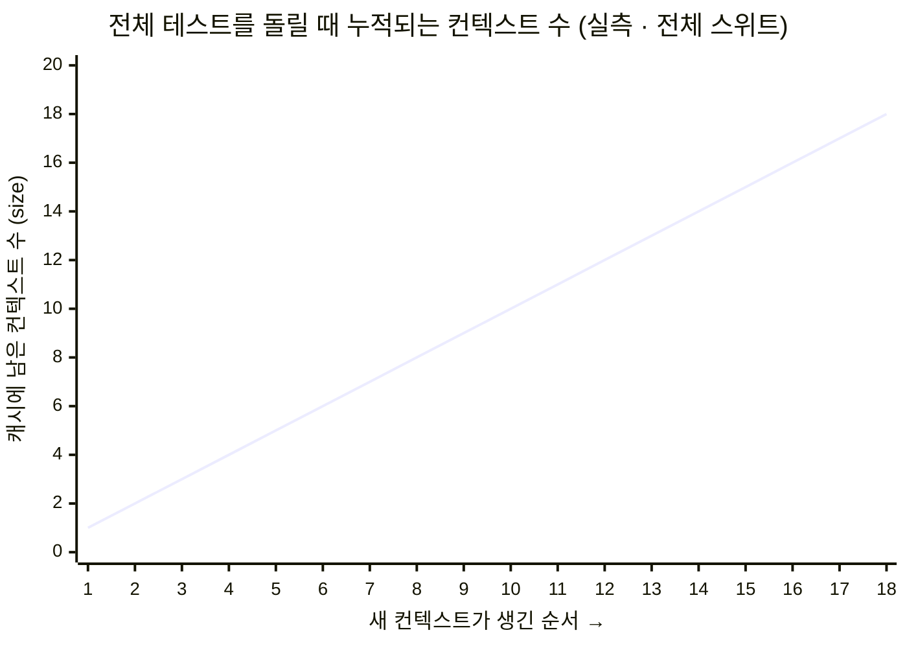
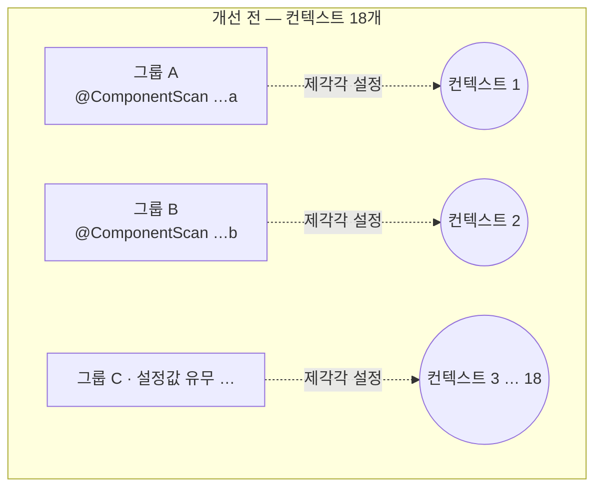
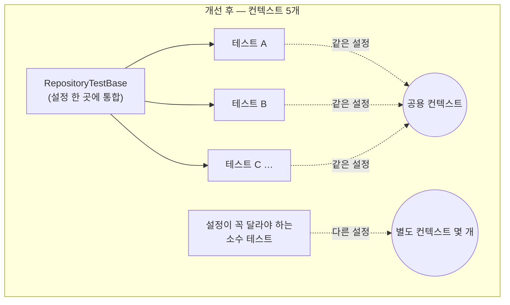
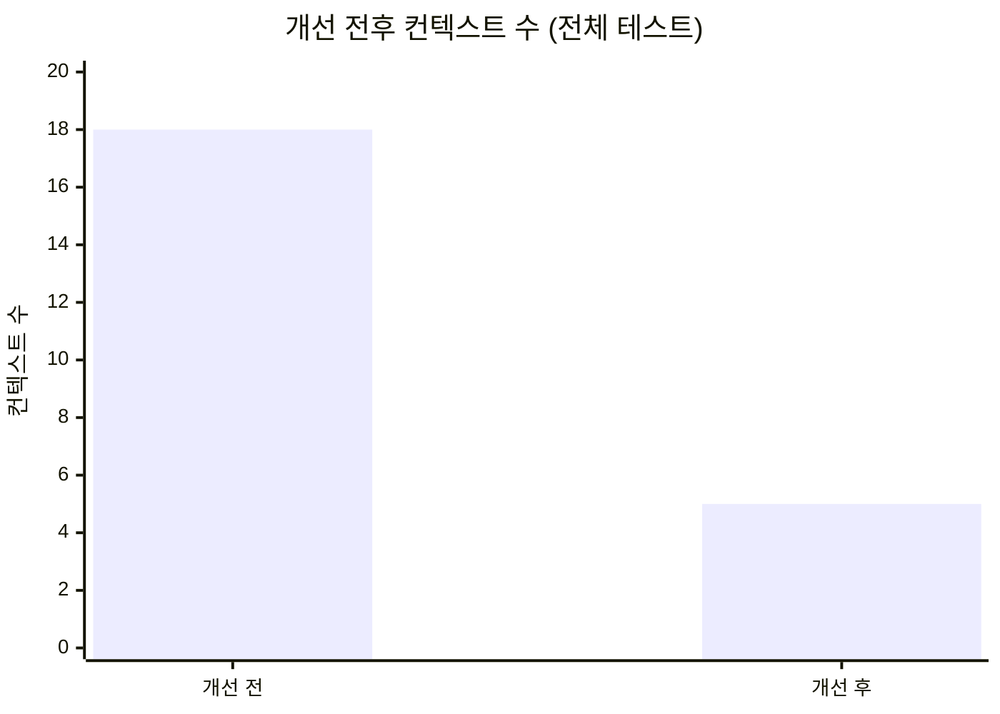

<!-- truncate -->

테스트를 **하나씩** 돌리면 다 통과하는데, **전부 한꺼번에** 돌리면 메모리 부족(OOM)으로 실패했습니다. 원인은 코드 버그가 아니라 <mark>Spring이 테스트용 "컨텍스트"를 재사용하지 못하고 18개나 새로 만들어 계속 남겨둔 것</mark>이었습니다. 여러 곳에 나뉜 설정을 **공통 부모 클래스로 통합해** 18개로 나뉜 컨텍스트를 5개로 줄이니, 메모리 문제가 사라졌습니다.

---

## 1. 무슨 일이 있었나

테스트를 하나만 돌리면:

```
✅ 통과
```

전부 한 번에 돌리면:

```
java.lang.OutOfMemoryError: Java heap space   ❌
```

얼핏 보면 이상합니다. 각각은 멀쩡한데 함께 돌리면 메모리가 부족해집니다. 이럴 때는 보통 **"테스트 하나가 자원을 많이 써서"가 아니라, 뭔가가 계속 누적돼서** 입니다. <mark>그 "누적되는 것"이 무엇인지 찾는 게 전부였습니다.</mark>

---

## 2. 먼저: 애플리케이션 컨텍스트와 캐시

Spring 테스트는 테스트가 사용할 빈(bean)들을 포함한 **애플리케이션 컨텍스트**를 하나 구성합니다. 이걸 매 테스트마다 새로 만들면 느리므로, Spring은 다음 규칙으로 컨텍스트를 재사용합니다:

> **"설정이 같은 컨텍스트면 새로 만들지 말고, 만들어둔 걸 재사용하자."**



이 캐시는 **힙(메모리)** 을 점유합니다. 컨텍스트 하나가 크기가 커서(DB 관련 빈을 전부 포함합니다) 여러 개 누적되면 **힙이 곧 한계를 넘어 OOM**이 발생합니다.

또한 Spring은 컨텍스트를 웬만하면 **안 버립니다**(최대 32개까지 계속 보관). <mark>한 번 만든 컨텍스트는 테스트가 끝날 때까지 캐시에 계속 남아 있습니다.</mark>

> **공식 문서 근거.** [컨텍스트 캐시](https://docs.spring.io/spring-framework/reference/testing/testcontext-framework/ctx-management/caching.html)의 기본 최대 크기는 **32**이고, 이 한계에 도달하면 **LRU(가장 오래 안 쓴 것부터)** 방식으로 오래된 컨텍스트를 닫아 제거합니다. 이 값은 JVM 시스템 프로퍼티 `spring.test.context.cache.maxSize`로 조정할 수 있습니다.

---

## 3. 핵심 — Spring은 "무엇이 다르면" 새 컨텍스트를 만드나?

<mark>Spring은 **설정이 조금이라도 다르면** 완전히 다른 컨텍스트로 취급해서 새로 만듭니다.</mark> 설정을 이루는 건 대략 이런 것들입니다:



> **공식 문서 근거.** Spring은 컨텍스트마다 "설정 식별값"을 붙여 두고([`MergedContextConfiguration`](https://docs.spring.io/spring-framework/docs/current/javadoc-api/org/springframework/test/context/MergedContextConfiguration.html)), 이 식별값을 [컨텍스트 캐시](https://docs.spring.io/spring-framework/reference/testing/testcontext-framework/ctx-management/caching.html)의 키로 씁니다. 두 테스트의 식별값이 아래 항목까지 **전부 같아야** 같은 컨텍스트로 보고 재사용하고, 하나라도 다르면 새로 만듭니다(왼쪽이 애노테이션/설정, 오른쪽이 그 값을 이루는 항목):
>
> - `@ContextConfiguration` / `@ComponentScan` → `classes`·`locations` (로딩할 구성 클래스·XML)
> - `@ActiveProfiles` → `activeProfiles`
> - `@TestPropertySource` → `propertySourceProperties`·`propertySourceDescriptors`
> - `@MockBean`(현 `@MockitoBean`)·`@TestBean` 등 빈 오버라이드, `@DynamicPropertySource`, Spring Boot 테스트 설정 → `contextCustomizers`
> - `@ContextHierarchy` → `parent`
> - `@WebAppConfiguration` → `resourceBasePath`
> - `@ContextConfiguration(initializers = …, loader = …)` → `contextInitializerClasses`·`contextLoader`
>
> 이 항목 중 `@ContextConfiguration`·`@ActiveProfiles`·`@TestPropertySource`는 공식 Javadoc이 **직접 이름을 든** 것입니다. `@ComponentScan`은 문서에 직접 나오진 않지만, **컨텍스트가 불러올 클래스(구성)를 바꾸는** 설정입니다. 그러면 이 식별값의 `classes` 항목이 달라지고, "식별값이 다르면 다른 컨텍스트"라는 위 규칙에 걸려 스캔 대상이 다른 테스트끼리는 컨텍스트가 갈립니다. 즉 문서에 문장으로 적혀 있는 게 아니라 **이 식별값 비교 규칙에서 따라오는 결론**입니다. 이 글에서 컨텍스트를 18개로 나눈 ①~④가 모두 이 목록에 들어갑니다.

전체 테스트에서 컨텍스트를 나눈 차이는 두 가지였습니다.

| 설정 요소 | 전체 테스트에서 어떻게 나뉘었나 |
|---|---|
| **① 스캔할 패키지** (`@ComponentScan`) | 테스트 그룹마다 스캔하는 패키지가 달라 **그룹 수만큼** 컨텍스트가 분리됨 |
| **③ 주입한 설정값** (`@TestPropertySource`) | 같은 패키지를 쓰는 그룹 안에서도 **일부 테스트에만** 설정값이 붙어 더 분리됨 |

이 두 차이가 겹치면서 컨텍스트가 **18개**까지 늘었습니다. 스캔 패키지가 똑같은 테스트끼리도 설정값 유무 하나로 컨텍스트가 갈릴 만큼, 사소한 차이 하나면 컨텍스트가 복제됩니다.

> **한 줄 참고 — 컨텍스트를 안 나누는 것도 있다:** `@DisplayName`(테스트 이름), 테스트 실행 순서 같은 **JUnit용 표시**는 설정에 안 들어갑니다. 그래서 이런 건 붙어 있어도 컨텍스트가 나뉘지 않습니다.

### 그럼 이 `@ComponentScan`은 왜 붙어 있었나?

이 슬라이스 테스트(`@DataJpaTest`)는 앱 전체가 아니라 **DB 관련 빈만** 포함하는 작은 컨텍스트입니다. 이때 컨텍스트에 **자동으로 포함되는 것**과 **안 되는 것**이 정해져 있습니다.

**포함되는 것 — Spring이 만들어주는 "기본 리포지토리"**

인터페이스에 메서드 이름만 적으면 Spring이 구현을 알아서 채워주는 리포지토리입니다. 구현 몸통은 직접 작성하지 않습니다.

```java
interface UserRepository extends JpaRepository<User, Long> {
    List<User> findByName(String name);   // ← 이름만 적으면 Spring이 SQL을 채워줌
}
```

엔티티(`User`)와 이런 인터페이스 리포지토리는 컨텍스트에 **자동으로** 들어갑니다.

**포함되지 않는 것 — 내가 직접 구현한 "커스텀 클래스"**

복잡한 조회는 메서드 이름만으로 표현되지 않아, 직접 클래스로 구현합니다.

```java
@Repository
class UserRepositoryImpl implements UserRepositoryCustom {
    // 복잡한 조회 로직을 손으로 작성 (예: QueryDSL)
}
```

이렇게 **직접 만든 클래스**는 슬라이스 컨텍스트에는 자동으로 포함되지 않습니다. 그대로 두면 테스트가 "해당 빈을 찾을 수 없음(No qualifying bean)"으로 실패합니다.

**그래서 각 테스트가 이 줄을 직접 추가했습니다** — "내 커스텀 구현이 있는 패키지도 스캔해줘":

```java
@DataJpaTest
@ComponentScan(basePackages = "com.example.repository.sample")  // ← 빠진 빈 등록
class SampleQueryRepositoryTest { ... }
```

이렇게 `@ComponentScan`으로 커스텀 구현을 등록합니다. 그런데 **그룹마다 스캔하는 패키지가 다르다 보니**, Spring 입장에선 그룹 수만큼 "다른 설정"이 되어 컨텍스트가 나뉘었습니다. (같은 패키지를 쓰는 테스트끼리도 설정값 하나가 다르면 또 나뉩니다.) 결국 이렇게 나뉜 게 누적돼 18개가 된 것 — 해결은 컨텍스트를 나누는 이 설정 요소들을 공통 부모 클래스로 통합하는 것입니다.

---

## 4. 어떻게 알아냈나 (도구와 지표)

추측하지 않고 **숫자로** 확인했습니다.

### 4-1. 컨텍스트가 몇 개 누적되는지 보이게 만들기

Spring에는 이 "컨텍스트 캐시" 상태를 출력하는 로그가 숨어 있습니다. 공식 문서도 로거 `org.springframework.test.context.cache`의 레벨을 `DEBUG`로 두면 캐시 통계를 볼 수 있다고 안내합니다([Context Caching](https://docs.spring.io/spring-framework/reference/testing/testcontext-framework/ctx-management/caching.html)). 로그 설정 하나(`logback-test.xml`)로 켜기만 하면 됩니다:

```xml
<configuration>
  <logger name="org.springframework.test.context.cache" level="DEBUG"/>
  <root level="WARN">
    <appender-ref ref="STDOUT"/>
  </root>
</configuration>
```

그러면 컨텍스트가 생길 때마다 다음과 같은 로그가 출력됩니다:

```
cache statistics: [ size = 17, maxSize = 32, hitCount = ..., missCount = 25 ]
```

읽는 법은 딱 두 개만 알면 됩니다:

- **`size`** = 지금 캐시에 남아 있는 컨텍스트 수 ← **이게 실제로 메모리를 점유하는 핵심 숫자**
- **`missCount`** = 지금까지 새로 만든 컨텍스트 총횟수

### 4-2. 관측 결과 — 컨텍스트가 18개까지 누적된다

전체 테스트를 돌리는 동안 `size`가 **1에서 18까지 한 번도 안 줄고 계속 늘어났고**, 그 지점에서 메모리가 한계를 넘었습니다.



| 지표 | 값 |
|---|---|
| 최대 `size` (동시에 남아 있는 컨텍스트 수) | **18** |
| `missCount` (새로 만든 총횟수) | **25** |
| 결과 | 메모리 한계 초과 → **OOM** |

용량이 큰 컨텍스트 18개가 동시에 캐시에 있으니 한계를 넘은 것입니다. <mark>컨텍스트 하나하나가 문제가 아니라, **개수**가 문제였습니다.</mark>

`size`는 18인데 `missCount`는 25입니다. **왜 다를까요?** 정의가 다릅니다. `missCount`(25)는 지금까지 컨텍스트를 새로 지은 누적 횟수이고, `size`(18)는 지금 캐시에 남아 있는 수입니다. 원래 아무것도 안 버리면 둘은 같아야 합니다. 그런데 일부 테스트엔 `@DirtiesContext`("이 컨텍스트는 상태가 오염됐으니 테스트가 끝나면 폐기하라")가 붙어 있어, 쓰던 컨텍스트를 중간에 캐시에서 버립니다. 버리면 `size`는 줄지만 `missCount`는 그대로고, 나중에 같은 컨텍스트가 또 필요하면 다시 지어서 `missCount`만 또 올라갑니다. 그래서 총 25번 지었어도 동시에 최대로 있던 건 18개였습니다. 메모리(OOM)에 중요한 건 "동시에 몇 개(`size`=18)"이지 "총 몇 번 지었나(25)"가 아닙니다 — 메모리는 지금 캐시에 있는 컨텍스트만 점유하니까요.

> [`@DirtiesContext`](https://docs.spring.io/spring-framework/reference/testing/testcontext-framework/ctx-management/dirtying.html)가 붙은 테스트는 끝난 뒤 해당 컨텍스트를 캐시에서 제거·종료하고, 이후 같은 설정이 다시 필요하면 새로 만듭니다(그래서 `missCount`만 늘어납니다).

> 컨텍스트 하나가 정확히 몇 MB인지까지 보고 싶다면, 테스트에 힙덤프 옵션(`-XX:+HeapDumpOnOutOfMemoryError`)을 켜서 덤프 파일을 만든 뒤 분석 도구(Eclipse MAT)로 열면 됩니다. 이번엔 "개수(18)"만으로 원인이 명확해서 거기까지는 안 갔습니다.

---

## 5. 어떻게 고쳤나

원인이 "설정이 조금씩 달라 컨텍스트가 반복해서 새로 생성된다"였으니, 해결은 하나입니다:

> **여러 곳에 나뉜 설정을 공통 부모 클래스로 통합해, 모든 테스트가 같은 컨텍스트 하나를 쓰게 한다.**

앞에서 본 두 가지 차이를 모두 없앱니다.

- **스캔 패키지** — 테스트마다 자기 패키지를 스캔하던 것을, 공통 부모에서 **커스텀 구현을 한 번에 등록**합니다 → 개별 `@ComponentScan`이 필요 없어집니다.
- **주입 설정값** — 내용이 같은 `@TestPropertySource`는 공통 부모로 올려 **모두 공유**합니다.

```java
// 공통 부모 — 여러 곳에 나뉘어 있던 설정을 여기 한 곳에 정리한다
@DataJpaTest
@ActiveProfiles("test")
@ComponentScan(basePackages = "com.example.repository")  // 커스텀 구현을 한 곳에서 전부 등록
@TestPropertySource(properties = {
        "app.image.base-url=https://cdn.example.com/{size}/"
})
abstract class RepositoryTestBase {
}
```

각 테스트는 컨텍스트 분리의 원인이던 설정 애노테이션들을 **제거하고 부모를 상속**만 합니다. (컨텍스트에 영향 없는 `@DisplayName` 같은 건 그대로 둡니다.)

```diff
-@DataJpaTest
-@ActiveProfiles("test")
 @DisplayName("샘플 조회 테스트")
-@ComponentScan(basePackages = "com.example.repository.sample")
-@TestPropertySource(properties = { "app.image.base-url=https://cdn.example.com/{size}/" })
-class SampleQueryRepositoryTest {
+class SampleQueryRepositoryTest extends RepositoryTestBase {
```

개선 전에는 그룹마다 설정이 제각각이라 컨텍스트가 18개까지 분리돼 있었습니다.



<mark>이제 대부분의 테스트가 **똑같은 설정**을 공유하므로, 18개로 나뉘어 있던 컨텍스트가 **몇 개로 크게 줄어듭니다**.</mark> (스캔 대상이나 프로퍼티가 꼭 달라야 하는 소수만 자기 컨텍스트를 유지합니다.)



---

## 6. 결과

여러 곳에 나뉘어 있던 설정을 공통 부모 클래스로 통합하자, <mark>컨텍스트가 **18개 → 5개**로 크게 줄었습니다.</mark> 대부분의 테스트가 공통 부모를 공유하고, 스캔 대상이나 프로퍼티가 **정말로 달라야 하는** 소수만 별도 컨텍스트로 남습니다.

같은 로그로 확인하면 캐시의 컨텍스트 수가 두 자리(18)에서 한 자리로 떨어집니다.



- 용량이 큰 컨텍스트가 몇 개만 남으니 메모리 여유가 크게 늘고, **OOM이 사라집니다**.
- 컨텍스트를 18번이 아니라 몇 번만 지으니 전체 테스트도 **더 빨라집니다**.
- 테스트 코드도 설정 애노테이션이 빠지고 `extends` 한 줄만 남아 **단순해집니다**.

---

## 7. 오늘의 교훈

1. **"하나씩은 되는데 전부는 안 된다"** 는 대개 **뭔가가 누적된다**는 뜻입니다. 테스트 하나의 크기가 아니라, 계속 남아 있는 자원(여기선 애플리케이션 컨텍스트)을 의심하세요.
2. **안 보이는 걸 보이게 만드세요.** 로그 한 줄(`org.springframework.test.context.cache` DEBUG)로 컨텍스트가 몇 개 누적되는지(`size`) 숫자로 볼 수 있습니다.
3. **컨텍스트를 가르는 건 아주 사소한 설정 차이**입니다 — 스캔 패키지, 주입한 설정값 하나. 특히 **내용이 같은 설정은 반드시 공유**하세요.
4. **메모리를 키우는 건 회피지 해결이 아닙니다.** "용량이 큰 컨텍스트가 여러 개"가 원인이면, 컨텍스트 **개수**를 줄이는 게 정답입니다.

---

## 부록 — 직접 확인해보는 명령

```bash
# 1) 위 logback-test.xml 을 테스트 리소스에 넣는다

# 2) 전체 실행하면서 컨텍스트 통계 관측 ( -i 로 테스트 로그를 함께 출력 )
./gradlew :persistence:test --rerun-tasks -i \
  | grep -E 'cache statistics|size = |missCount'

# 3) 테스트들의 스캔 패키지 설정을 한눈에 세어보기
grep -rhoE '@ComponentScan\([^)]*\)' src/test --include='*.java' | sort | uniq -c | sort -rn
```

### 용어 한 줄 정리

| 용어 | 쉬운 뜻 |
|---|---|
| 애플리케이션 컨텍스트 | 테스트가 쓸 빈을 포함한 "컨텍스트" |
| 컨텍스트 캐시 | 같은 설정의 컨텍스트를 재사용하려고 보관해 두는 "캐시" |
| `size` / `missCount` | 지금 남은 컨텍스트 수 / 지금까지 새로 만든 컨텍스트 수 |
| 힙(heap) | 그 컨텍스트들이 누적되는 메모리 공간 |
