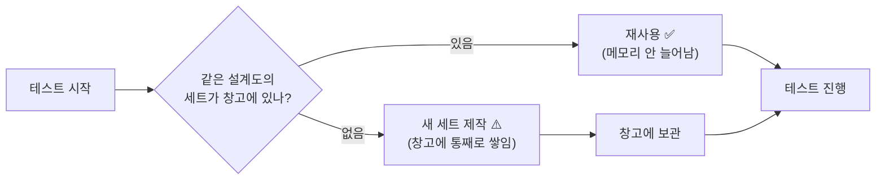
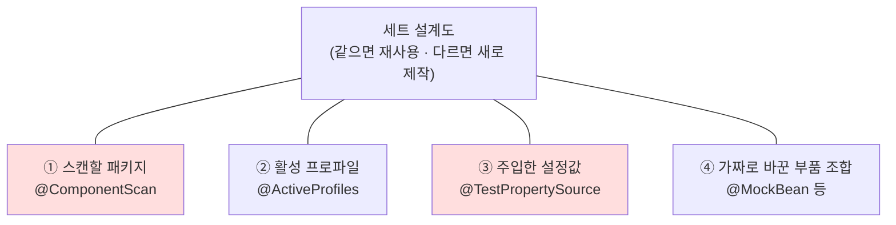
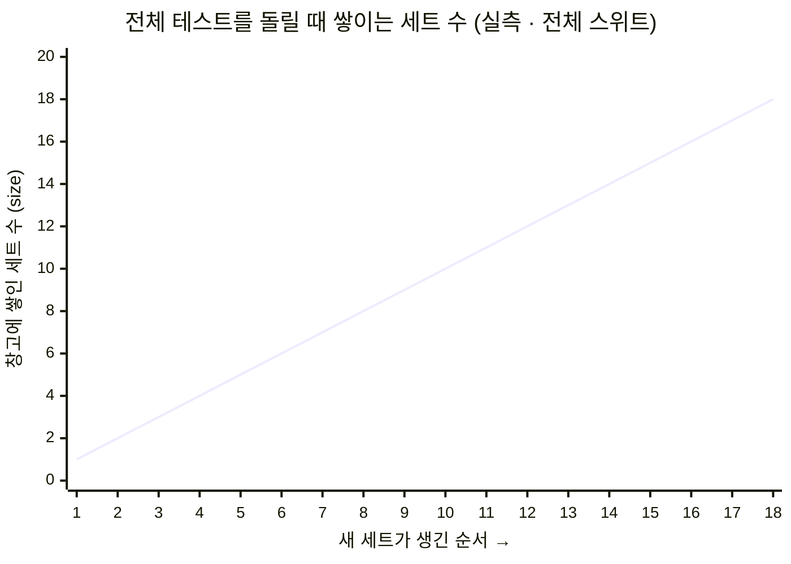
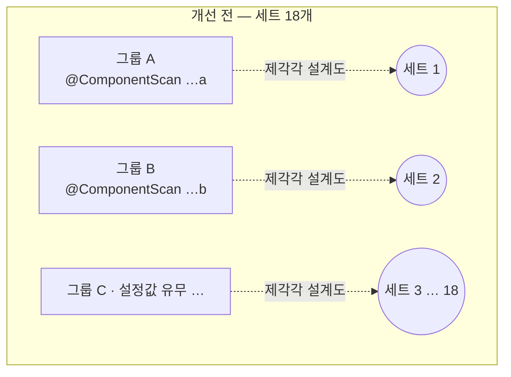
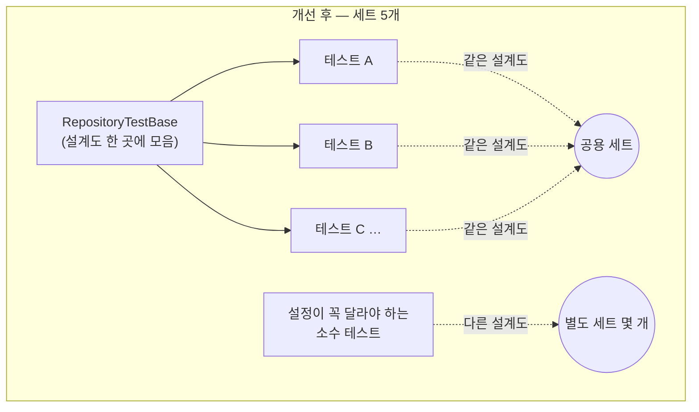
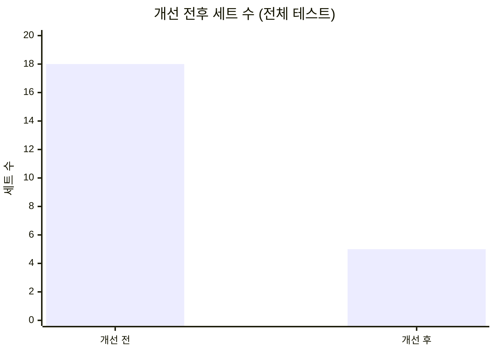

<!-- truncate -->

테스트를 **하나씩** 돌리면 다 통과하는데, **전부 한꺼번에** 돌리면 메모리 부족(OOM)으로 실패했습니다. 범인은 코드 버그가 아니라 <mark>Spring이 테스트용 "세트(컨텍스트)"를 재사용하지 못하고 18개나 새로 만들어 쌓아둔 것</mark>이었습니다. 흩어진 설정을 **공통 부모로 모아** 18개로 갈려 있던 세트를 5개로 줄이니, 메모리 문제가 사라졌습니다.

---

## 1. 무슨 일이 있었나

테스트를 하나만 돌리면:

```
✅ 통과
```

전부 한 번에 돌리면:

```
java.lang.OutOfMemoryError: Java heap space   ❌
```

이상하죠. 각각은 멀쩡한데 모으면 터집니다. 이럴 때는 보통 **"테스트 하나가 무거워서"가 아니라, 뭔가가 계속 쌓여서** 입니다. <mark>그 "쌓이는 것"이 무엇인지 찾는 게 전부였습니다.</mark>

---

## 2. 먼저 비유로 — "테스트 세트"란?

Spring으로 테스트를 하려면, 테스트가 쓸 부품(빈)들을 담은 **작은 무대 세트**가 하나 필요합니다. 이걸 **애플리케이션 컨텍스트**라고 부릅니다.

이 세트를 매 테스트마다 새로 짓는 건 느립니다. 그래서 Spring은 이렇게 아낍니다:

> **"설계도(설정)가 같은 세트면, 새로 짓지 말고 있던 걸 재사용하자."**



여기서 **창고 = 메모리(힙)** 입니다. 세트 하나가 꽤 무거워서(DB 관련 부품을 통째로 담습니다) 여러 개 쌓이면 창고가 금방 꽉 차고, 그러면 OOM이 납니다.

게다가 Spring은 세트를 웬만하면 **안 버립니다**(최대 32개까지 계속 보관). <mark>한 번 만든 세트는 테스트가 끝날 때까지 창고에 계속 남아 있습니다.</mark>

---

## 3. 핵심 — Spring은 "무엇이 다르면" 새 세트를 만드나?

<mark>Spring은 **설계도(설정)가 조금이라도 다르면** 완전히 다른 세트로 취급해서 새로 만듭니다.</mark> 설계도를 이루는 건 대략 이런 것들입니다:



전체 테스트에서 세트를 가른 차이는 두 갈래였습니다.

| 설계도 요소 | 전체 테스트에서 어떻게 갈렸나 |
|---|---|
| **① 스캔할 패키지** (`@ComponentScan`) | 테스트 그룹마다 스캔하는 패키지가 달라 **그룹 수만큼** 세트가 갈림 |
| **③ 주입한 설정값** (`@TestPropertySource`) | 같은 패키지를 쓰는 그룹 안에서도 **일부 테스트에만** 설정값이 붙어 더 갈림 |

이 두 차이가 겹치면서 세트가 **18개**까지 늘었습니다. 스캔 패키지가 똑같은 테스트끼리도 설정값 유무 하나로 세트가 갈릴 만큼, 사소한 차이 하나면 세트가 복제됩니다.

> **한 줄 참고 — 세트를 안 나누는 것도 있다:** `@DisplayName`(테스트 이름), 테스트 실행 순서 같은 **JUnit용 표시**는 설계도에 안 들어갑니다. 그래서 이런 건 붙어 있어도 세트가 나뉘지 않습니다.

### 그럼 이 `@ComponentScan`은 왜 붙어 있었나?

이 슬라이스 테스트(`@DataJpaTest`)는 앱 전체가 아니라 **DB 관련 부품만** 담는 작은 세트라고 했죠. 이때 세트에 **자동으로 담기는 것**과 **안 담기는 것**이 정해져 있습니다.

**담기는 것 — Spring이 만들어주는 "기본 리포지토리"**

인터페이스에 메서드 이름만 적으면 Spring이 구현을 알아서 채워주는 리포지토리입니다. 내가 몸통을 안 짭니다.

```java
interface UserRepository extends JpaRepository<User, Long> {
    List<User> findByName(String name);   // ← 이름만 적으면 Spring이 SQL을 채워줌
}
```

엔티티(`User`)와 이런 인터페이스 리포지토리는 세트에 **자동으로** 들어갑니다.

**안 담기는 것 — 내가 직접 클래스로 짠 "커스텀 구현"**

복잡한 조회는 메서드 이름만으론 표현이 안 돼서, 직접 클래스를 만들어 구현합니다.

```java
@Repository
class UserRepositoryImpl implements UserRepositoryCustom {
    // 복잡한 조회 로직을 손으로 작성 (예: QueryDSL)
}
```

이렇게 **내가 손으로 만든 클래스**는 슬라이스 세트가 자동으로 안 담습니다. 그냥 두면 테스트가 "그런 부품 없음(No qualifying bean)"으로 실패합니다.

**그래서 각 테스트가 이 줄을 직접 추가했습니다** — "내 커스텀 구현이 있는 패키지도 스캔해줘":

```java
@DataJpaTest
@ComponentScan(basePackages = "com.example.repository.sample")  // ← 빠진 부품 끌어오기
class SampleQueryRepositoryTest { ... }
```

이렇게 `@ComponentScan`으로 커스텀 구현을 끌어옵니다. 그런데 **그룹마다 스캔하는 패키지가 다르다 보니**, Spring 눈엔 그룹 수만큼 "다른 설계도"가 되어 세트가 갈렸습니다. (같은 패키지를 쓰는 테스트끼리도 설정값 하나가 다르면 또 갈리고요.) 결국 이런 갈림이 쌓여 18개가 된 것 — 해결은 이 갈림 요소들을 공통 부모로 모으는 것입니다.

---

## 4. 어떻게 알아냈나 (도구와 지표)

추측하지 않고 **숫자로** 확인했습니다.

### 4-1. 세트가 몇 개 쌓이는지 보이게 만들기

Spring에는 이 "세트 창고" 상태를 찍어주는 로그가 숨어 있습니다. 로그 설정 한 조각(`logback-test.xml`)으로 켜기만 하면 됩니다:

```xml
<configuration>
  <logger name="org.springframework.test.context.cache" level="DEBUG"/>
  <root level="WARN">
    <appender-ref ref="STDOUT"/>
  </root>
</configuration>
```

그러면 세트가 생길 때마다 이런 줄이 찍힙니다:

```
cache statistics: [ size = 17, maxSize = 32, hitCount = ..., missCount = 25 ]
```

읽는 법은 딱 두 개만 알면 됩니다:

- **`size`** = 지금 창고에 쌓여 있는 세트 수 ← **이게 메모리를 잡아먹는 실제 범인 숫자**
- **`missCount`** = 지금까지 새로 만든 세트 총횟수

### 4-2. 관측 결과 — 세트가 18개까지 쌓인다

전체 테스트를 돌리는 동안 `size`가 **1에서 18까지 한 번도 안 줄고 계속 늘어났고**, 그 지점에서 메모리가 터졌습니다.



| 지표 | 값 |
|---|---|
| 최대 `size` (동시에 쌓인 세트 수) | **18** |
| `missCount` (새로 만든 총횟수) | **25** |
| 결과 | 메모리 한계 초과 → **OOM** |

무거운 세트 18개가 동시에 창고에 있으니 한계를 넘은 것입니다. <mark>세트 하나하나가 문제가 아니라, **개수**가 문제였습니다.</mark>

**"어, `size`는 18인데 `missCount`는 25네? 왜 다르지?"** 정의가 다릅니다. `missCount`(25)는 지금까지 세트를 새로 지은 누적 횟수이고, `size`(18)는 지금 창고에 남아 있는 수입니다. 원래 아무것도 안 버리면 둘은 같아야 하죠. 그런데 일부 테스트엔 `@DirtiesContext`("이 세트는 상태를 더럽혔으니 끝나면 버려")가 붙어 있어, 쓰던 세트를 중간에 창고에서 버립니다. 버리면 `size`는 줄지만 `missCount`는 그대로고, 나중에 같은 세트가 또 필요하면 다시 지어서 `missCount`만 또 올라갑니다. 그래서 총 25번 지었어도 동시에 최대로 있던 건 18개였습니다. 메모리(OOM)에 중요한 건 "동시에 몇 개(`size`=18)"이지 "총 몇 번 지었나(25)"가 아닙니다 — 메모리는 지금 창고에 있는 세트만 차지하니까요.

> 세트 하나가 정확히 몇 MB인지까지 보고 싶다면, 테스트에 힙덤프 옵션(`-XX:+HeapDumpOnOutOfMemoryError`)을 켜서 덤프 파일을 만든 뒤 분석 도구(Eclipse MAT)로 열면 됩니다. 이번엔 "개수(18)"만으로 원인이 명확해서 거기까지는 안 갔습니다.

---

## 5. 어떻게 고쳤나

원인이 "설정이 조금씩 달라서 세트가 자꾸 새로 생긴다"였으니, 해결은 하나입니다:

> **흩어진 설정을 공통 부모 클래스로 모아, 모든 테스트가 같은 세트 하나를 쓰게 한다.**

앞에서 본 두 갈래의 차이를 모두 없앱니다.

- **스캔 패키지** — 테스트마다 자기 패키지를 스캔하던 것을, 공통 부모에서 **커스텀 구현을 한 번에 등록**하게 모읍니다 → 개별 `@ComponentScan`이 필요 없어집니다.
- **주입 설정값** — 내용이 같은 `@TestPropertySource`는 공통 부모로 올려 **모두 공유**합니다.

```java
// 공통 부모 — 흩어져 있던 설계도를 여기 한 곳에 모은다
@DataJpaTest
@ActiveProfiles("test")
@ComponentScan(basePackages = "com.example.repository")  // 커스텀 구현을 한 곳에서 전부 등록
@TestPropertySource(properties = {
        "app.image.base-url=https://cdn.example.com/{size}/"
})
abstract class RepositoryTestBase {
}
```

각 테스트는 갈라짐의 원인이던 설정 애노테이션들을 **떼고 부모를 상속**만 합니다. (세트에 영향 없는 `@DisplayName` 같은 건 그대로 둡니다.)

```diff
-@DataJpaTest
-@ActiveProfiles("test")
 @DisplayName("샘플 조회 테스트")
-@ComponentScan(basePackages = "com.example.repository.sample")
-@TestPropertySource(properties = { "app.image.base-url=https://cdn.example.com/{size}/" })
-class SampleQueryRepositoryTest {
+class SampleQueryRepositoryTest extends RepositoryTestBase {
```

개선 전에는 그룹마다 설계도가 제각각이라 세트가 18개까지 갈려 있었습니다.



<mark>이제 대부분의 테스트가 **똑같은 설계도**를 공유하므로, 18개로 흩어져 있던 세트가 **몇 개로 크게 줄어듭니다**.</mark> (스캔 대상이나 프로퍼티가 꼭 달라야 하는 소수만 자기 세트를 유지합니다.)



---

## 6. 결과

흩어져 있던 설정을 공통 부모로 모으자, <mark>세트가 **18개 → 5개**로 크게 줄었습니다.</mark> 대부분의 테스트가 공통 부모를 공유하고, 스캔 대상이나 프로퍼티가 **정말로 달라야 하는** 소수만 별도 세트로 남습니다.

같은 로그로 확인하면 창고의 세트 수가 두 자리(18)에서 한 자리로 떨어집니다.



- 무거운 세트가 몇 개만 남으니 메모리 여유가 크게 늘고, **OOM이 사라집니다**.
- 세트를 18번이 아니라 몇 번만 지으니 전체 테스트도 **더 빨라집니다**.
- 테스트 코드도 설정 애노테이션이 빠지고 `extends` 한 줄만 남아 **단순해집니다**.

---

## 7. 오늘의 교훈

1. **"하나씩은 되는데 전부는 안 된다"** 는 대개 **뭔가가 쌓인다**는 뜻입니다. 테스트 하나의 무게가 아니라, 계속 남아 있는 자원(여기선 세트=컨텍스트)을 의심하세요.
2. **안 보이는 걸 보이게 만드세요.** 로그 한 줄(`org.springframework.test.context.cache` DEBUG)로 세트가 몇 개 쌓이는지(`size`) 숫자로 볼 수 있습니다.
3. **세트를 가르는 건 아주 사소한 설정 차이**입니다 — 스캔 패키지, 주입한 설정값 하나. 특히 **내용이 같은 설정은 반드시 공유**하세요.
4. **메모리를 키우는 건 회피지 해결이 아닙니다.** "무거운 세트가 여러 개"가 원인이면, 세트 **개수**를 줄이는 게 정답입니다.

---

## 부록 — 직접 확인해보는 명령

```bash
# 1) 위 logback-test.xml 을 테스트 리소스에 넣는다

# 2) 전체 실행하면서 세트 통계 관측 ( -i 로 테스트 로그를 함께 출력 )
./gradlew :persistence:test --rerun-tasks -i \
  | grep -E 'cache statistics|size = |missCount'

# 3) 테스트들의 스캔 패키지 설정을 한눈에 세어보기
grep -rhoE '@ComponentScan\([^)]*\)' src/test --include='*.java' | sort | uniq -c | sort -rn
```

### 용어 한 줄 정리

| 용어 | 쉬운 뜻 |
|---|---|
| 애플리케이션 컨텍스트 | 테스트가 쓸 부품을 담은 "세트" |
| 컨텍스트 캐시 | 같은 설계도의 세트를 재사용하려고 보관해 두는 "창고" |
| `size` / `missCount` | 지금 쌓인 세트 수 / 지금까지 새로 만든 세트 수 |
| 힙(heap) | 그 세트들이 쌓이는 메모리 공간 |
