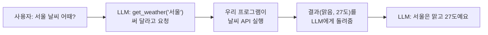
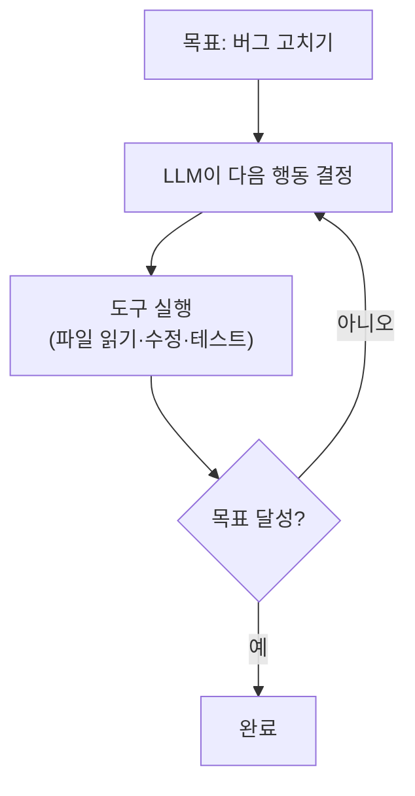
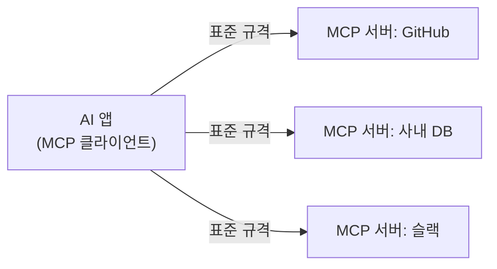

<!-- truncate -->

요즘 기술 뉴스에 **LLM, 에이전트(agent), MCP, 도구 호출** 같은 말이 쉴 새 없이 나옵니다. 각각 따로 보면 어렵지만, 사실 이 개념들은 **하나가 다른 하나를 딛고 올라서는 순서**로 이어져 있습니다. 아래로 내려갈수록 "AI가 스스로 할 수 있는 일"이 넓어진다고 보면 됩니다. 하나씩, 배경 지식 없이도 이해되도록 풀어보겠습니다.

## 1. LLM — "다음 단어"를 굉장히 잘 맞히는 모델

**LLM(Large Language Model, 대규모 언어 모델)** 은 이름은 거창하지만 핵심은 의외로 단순합니다. <mark>지금까지의 문장을 보고 "다음에 올 단어"를 확률적으로 예측하는 것</mark>이 전부입니다. Claude, GPT, Gemini 같은 것들이 전부 LLM입니다.

"단어 맞히기"를 어마어마한 양의 글로 훈련하면, 그 예측이 놀랄 만큼 똑똑해집니다. 질문에 답하고, 요약하고, 번역하고, 코드를 쓰는 게 전부 "이 상황 다음에 올 가장 그럴듯한 말"을 이어 붙인 결과입니다.

여기서 두 가지 기본 용어만 알면 됩니다.

- **토큰(token)** — LLM이 글을 다루는 단위입니다. 대략 단어 조각(예: "안녕하세요"는 몇 개의 토큰) 정도라고 생각하면 됩니다. LLM은 글자가 아니라 토큰 단위로 읽고 씁니다.
- **컨텍스트 윈도우(context window)** — 모델이 **한 번에 볼 수 있는 토큰의 최대량**입니다. 사람으로 치면 "한 번에 머릿속에 올려둘 수 있는 분량"이죠. 이 창이 크면 긴 문서도 통째로 넣고 물어볼 수 있습니다(요즘 큰 모델은 100만 토큰까지 갑니다).

<mark>중요한 성질 하나: LLM은 대화가 끝나면 방금 나눈 내용을 기억하지 못합니다.</mark> 다음 요청 때 이전 대화를 **다시 통째로 넣어줘야** 이어서 말할 수 있습니다. 이 "기억 없음"이 뒤에 나올 개념들의 출발점입니다.

## 2. LLM 혼자서는 못 하는 일

LLM은 글을 잘 짓지만, 결정적인 한계가 있습니다. <mark>훈련 시점 이후의 일을 모르고, 바깥 세상에 아무 행동도 하지 못합니다.</mark>

- "오늘 환율 알려줘" → 훈련 데이터에 없으니 모릅니다.
- "이 파일 내용 고쳐줘" → 파일을 직접 열 수 없습니다.
- "이메일 보내줘" → 메일을 보낼 손이 없습니다.

LLM은 어디까지나 **말을 만들어내는 두뇌**일 뿐, 계산기·검색·파일·API 같은 **손발**이 없습니다. 이 손발을 붙여주는 것이 다음 개념입니다.

## 3. 도구 호출 — LLM에게 손발을 달아주기

**도구 호출(Tool Use, 함수 호출/Function Calling이라고도 함)** 은 LLM이 "내가 직접은 못 하니, 이 도구 좀 써 줘"라고 **요청**하게 만드는 방법입니다.

동작을 오해하기 쉬운데, 순서를 보면 명확합니다. <mark>LLM이 도구를 직접 실행하는 게 아니라, "이 도구를 이런 입력으로 써 달라"는 요청만 내놓고, 실제 실행은 우리 프로그램이 합니다.</mark>



우리가 할 일은 "이런 도구가 있고, 이런 입력을 받는다"를 LLM에게 알려주는 것뿐입니다. 예를 들어 날씨 도구는 이렇게 정의합니다.

```json
{
  "name": "get_weather",
  "description": "도시의 현재 날씨를 알려준다",
  "input_schema": {
    "type": "object",
    "properties": {
      "city": { "type": "string", "description": "도시 이름" }
    },
    "required": ["city"]
  }
}
```

그러면 LLM은 날씨를 물어봤을 때 `get_weather` 를 쓰겠다고 스스로 판단합니다. 이 한 걸음 덕분에 LLM은 검색·계산·파일 읽기·외부 API 호출 같은 "바깥 행동"을 할 수 있게 됩니다. 두뇌에 손발이 생긴 셈입니다.

### LLM은 어떻게 도구를 "부를 줄" 아는가

"두뇌일 뿐인데 어떻게 도구를 부르지?"가 핵심 질문입니다. 원리는 생각보다 단순합니다 — <mark>LLM은 도구를 실행하는 게 아니라, "이 도구를 이렇게 써 달라"는 **구조화된 출력(신호)** 을 텍스트 대신 내놓고, 그걸 받은 우리 프로그램이 대신 실행합니다.</mark> 과정을 다섯 걸음으로 나누면 이렇습니다.

1. **도구 목록을 함께 보낸다.** 요청할 때 질문뿐 아니라 "쓸 수 있는 도구 목록(이름·설명·입력 형식)"을 같이 넣습니다. LLM은 이걸 보고 어떤 도구가 있는지 압니다.
2. **LLM이 "도구를 쓰겠다"는 신호를 낸다.** 답을 바로 내는 대신, `get_weather`를 `{"city": "서울"}`로 부르겠다는 **특별한 형식의 출력**을 냅니다. 일반 문장이 아니라 기계가 알아볼 수 있는 구조입니다(모델이 그렇게 하도록 훈련돼 있어서 가능합니다).

```json
{
  "stop_reason": "tool_use",
  "content": [
    { "type": "tool_use", "name": "get_weather", "input": { "city": "서울" } }
  ]
}
```

3. **프로그램이 신호를 감지해 실제로 실행한다.** 응답에 `tool_use`가 있으면(멈춘 이유가 `tool_use`), 우리 코드가 진짜 날씨 API를 호출합니다. 여기서 실제 실행이 일어납니다.
4. **결과를 다시 대화에 넣어 돌려준다.** 실행 결과("맑음, 27도")를 `tool_result` 형태로 대화에 붙여 LLM에게 다시 보냅니다. (1절의 "매번 통째로 넣어줘야 안다"가 여기서도 작동합니다 — 결과도 넣어줘야 LLM이 압니다.)
5. **LLM이 결과를 읽고 최종 답을 만든다.** 이제 날씨를 아는 상태로 "서울은 맑고 27도예요"라고 마무리합니다.

여기서 꼭 기억할 두 가지. <mark>첫째, LLM은 "요청"만 하고 "실행"은 늘 우리 프로그램이 한다.</mark> 그래서 위험한 도구(삭제·결제·메일 발송)는 실행 직전에 우리가 사람 확인을 끼워 넣어 막을 수 있습니다. 둘째, 이 왕복(요청→실행→결과 반환)을 **한 번 더, 여러 번 반복**하도록 코드로 감싸면, 그게 바로 다음에 나올 **에이전트**입니다.

## 4. 에이전트 — 스스로 여러 걸음을 밟는 LLM

도구를 한 번 쓰는 것으로 끝나지 않는 일도 많습니다. "이 버그 고치고 테스트까지 통과시켜 줘" 같은 요청은 **여러 단계**가 필요하죠 — 파일 읽고, 원인 찾고, 고치고, 테스트 돌리고, 실패하면 다시 고치고….

**에이전트(agent)** 는 <mark>LLM이 도구를 반복해서 쓰며 스스로 다음 할 일을 정해 목표까지 가는 것</mark>입니다. "도구 호출 → 결과 확인 → 다음 도구 호출"을 목표를 이룰 때까지 루프로 돕니다.



다만 "무조건 에이전트로 만들면 좋다"는 아닙니다. 단계가 단순하면 한 번의 호출로 충분하고, 정해진 순서가 있으면 우리가 흐름을 짜는 편이 안전합니다. <mark>에이전트는 "미리 다 정해두기 어렵고, 여러 단계를 거쳐야 하는" 열린 문제에 어울립니다.</mark> AI 코딩 어시스턴트가 대표적인 에이전트인데, 이걸 실무 절차에 맞게 길들이는 이야기는 [AI 엔지니어링 하네스](./ai-engineering-harness) 글에서 다뤘습니다.

## 5. MCP — 도구를 "표준 규격"으로 꽂기

에이전트가 쓸모 있으려면 도구가 많아야 합니다. GitHub, 사내 DB, 슬랙, 캘린더…. 그런데 도구마다 연결 방식이 제각각이면, 새 도구를 붙일 때마다 매번 코드를 새로 짜야 합니다.

**MCP(Model Context Protocol, 모델 컨텍스트 프로토콜)** 는 이 문제를 푸는 **표준 규격**입니다. <mark>AI와 외부 도구·데이터를 연결하는 방식을 하나로 통일한 "AI용 USB-C" 같은 것</mark>입니다. USB-C 케이블 하나로 여러 기기를 꽂듯, MCP를 따르면 어떤 AI든 어떤 도구든 같은 방식으로 연결됩니다.



용어를 정리하면 이렇습니다.

- **MCP 서버** — 도구나 데이터를 MCP 규격으로 "내주는" 쪽입니다. 예: GitHub MCP 서버는 이슈 조회·PR 생성 같은 기능을 표준 형태로 제공합니다.
- **MCP 클라이언트** — 그 도구를 "가져다 쓰는" AI 앱 쪽입니다.

<mark>도구 호출이 "도구 하나를 붙이는 법"이라면, MCP는 "도구를 붙이는 방식 자체를 표준화한 것"</mark>입니다. 그래서 한 번 MCP 서버로 만들어 두면 여러 AI 도구에서 재사용할 수 있습니다. (MCP는 공개된 개방형 프로토콜이라 여러 회사·도구가 함께 씁니다.)

## 6. 한 걸음 더 — RAG는 뭐가 다른가

자주 함께 나오는 말이 **RAG(Retrieval-Augmented Generation, 검색 증강 생성)** 입니다. 앞의 것들과 헷갈리기 쉬운데, 목적이 다릅니다.

LLM이 모르는 사내 문서·최신 자료에 답하게 하려면, **질문과 관련된 문서를 먼저 검색해서 프롬프트에 붙여준 뒤** 답하게 합니다. 이게 RAG입니다. <mark>모델을 다시 훈련시키지 않고도, "필요한 자료를 찾아 그때그때 넣어주는" 방식으로 최신·전용 지식을 답에 반영합니다.</mark> 1절에서 말한 "LLM은 매번 통째로 넣어줘야 안다"는 성질을 역이용하는 셈입니다.

## 정리 — 개념이 쌓이는 순서

- **LLM**: 다음 토큰을 예측하는 두뇌. 기억이 없고, 컨텍스트 윈도우 안에 넣어준 것만 안다.
- **도구 호출**: 두뇌에 손발을 달아, 검색·계산·외부 행동을 하게 함(LLM은 요청만, 실행은 프로그램이).
- **에이전트**: 도구 호출을 스스로 반복하며 여러 단계 목표까지 감.
- **MCP**: 그 도구들을 붙이는 방식을 표준화한 규격("AI용 USB-C").
- **RAG**: 관련 자료를 검색해 프롬프트에 넣어주는, 지식 보강 방식.

<mark>핵심은 "LLM(두뇌) → 도구(손발) → 에이전트(스스로 반복) → MCP(표준 연결)"로 능력이 한 겹씩 쌓인다는 것</mark>입니다. 새 용어가 나와도 이 사다리의 어느 칸인지 짚어보면 대개 자리를 찾습니다.

### 용어 한 줄 정리

| 용어 | 쉬운 뜻 |
|---|---|
| LLM | 다음 단어(토큰)를 예측해 글을 만드는 AI 모델 |
| 토큰 | LLM이 글을 다루는 단위(대략 단어 조각) |
| 컨텍스트 윈도우 | 모델이 한 번에 볼 수 있는 토큰의 최대량 |
| 도구 호출 | LLM이 외부 기능을 "써 달라"고 요청하는 방법 |
| 에이전트 | 도구를 스스로 반복해 목표까지 가는 LLM |
| MCP | AI와 도구를 잇는 표준 규격("AI용 USB-C") |
| RAG | 관련 자료를 검색해 프롬프트에 넣어 답을 보강 |
