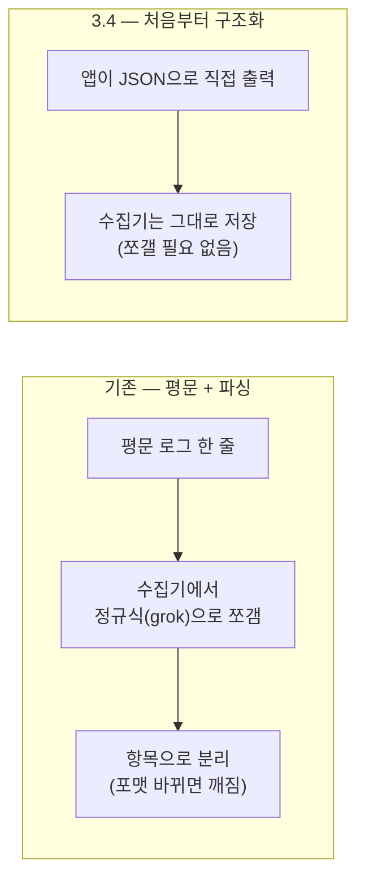

<!-- truncate -->

서버는 무슨 일이 일어났는지 **로그(log)** 로 남깁니다. 문제가 터지면 이 로그를 뒤져 원인을 찾죠. 그런데 로그가 "사람이 읽는 문장"으로만 쌓이면, 수천만 줄 속에서 원하는 조건만 골라내기가 의외로 어렵습니다. <mark>Spring Boot **3.4.0**(2024-11-21)부터는 로그를 처음부터 검색·집계하기 좋은 **JSON** 형태로 내보내는 기능이 프레임워크에 들어왔습니다.</mark> 이걸 **구조적 로깅**이라 부릅니다. 별도 라이브러리 없이 설정 한 줄로 켤 수 있는데, 왜 필요하고 어떻게 쓰는지 처음부터 풀어보겠습니다.

## 왜 "구조적" 로깅인가

우리가 흔히 찍는 로그는 이렇게 생겼습니다. 사람이 눈으로 읽으라고 만든 **한 줄 문자열**입니다.

```
2026-08-05 10:12:33.412  INFO 12345 --- [http-nio-8080-exec-1] c.e.OrderService : order placed userId=123 orderId=A-99
```

로그를 한두 대의 서버에서 보던 시절엔 이걸로 충분했습니다. 하지만 요즘은 로그를 한곳(Elasticsearch·Loki·Datadog 같은 **로그 수집기**)에 모아 놓고 "userId가 123인 로그만", "에러 레벨만" 하는 식으로 검색합니다. 그러려면 위 한 줄에서 시각·레벨·userId 같은 **항목(필드)을 분리**해 줘야 합니다.

문제는 그 분리를 수집기 쪽에서 **정규식(grok)** 으로 한다는 점입니다. grok은 "이 위치엔 시각, 저 위치엔 레벨"처럼 로그 모양을 정규식으로 파싱하는 규칙인데, <mark>로그 포맷이 조금만 바뀌어도 이 파싱이 통째로 깨집니다.</mark> 그래서 많은 팀이 아예 로그를 처음부터 JSON으로 찍는 방법을 택해 왔습니다. JSON은 `{"userId":"123"}`처럼 **항목 이름과 값이 짝지어진** 형태라, 수집기가 파싱 없이 그대로 항목으로 인식합니다.



전에는 이 "JSON으로 찍기"를 하려고 `logstash-logback-encoder` 같은 **라이브러리를 따로 붙이고 XML 설정**을 해야 했습니다. <mark>3.4부터는 그 기능이 Spring Boot 안에 기본으로 들어와, 설정 몇 줄이면 끝납니다.</mark>

## 무엇이 달라졌나 — 설정 한 줄로 JSON 로그 (3.4)

라이브러리도, XML도 필요 없습니다. `application.yml`에 프로퍼티만 적으면 됩니다. 로그가 나가는 곳은 보통 두 군데(터미널에 뜨는 **콘솔**, 파일로 쌓는 **파일**)인데 각각 따로 켤 수 있습니다.

```yaml
logging:
  structured:
    format:
      console: ecs   # 콘솔 출력을 JSON(ECS 형식)으로
      file: ecs      # 파일 출력을 JSON(ECS 형식)으로
```

여기서 `ecs`는 **JSON을 어떤 규격으로 만들지** 고르는 값입니다. 수집기마다 선호하는 항목 이름 규칙이 있어서, 대표적인 세 가지를 기본 제공합니다.

| 값 | 어떤 규격인가 | 주로 쓰는 곳 |
|---|---|---|
| `ecs` | Elastic Common Schema | Elasticsearch / Kibana |
| `gelf` | Graylog Extended Log Format | Graylog |
| `logstash` | Logstash JSON | Logstash |

<mark>내가 쓰는 수집기에 맞는 값 하나만 넣으면, 그때부터 로그가 JSON 한 줄씩 나갑니다.</mark> 뭘 골라야 할지 모르겠다면, 로그를 Elasticsearch/Kibana로 보고 있으면 `ecs`가 무난합니다.

## 서비스 이름·환경 같은 공통 항목 붙이기

여러 서비스의 로그가 한곳에 섞여 쌓이면 "이건 어느 서비스, 어느 환경(운영/개발) 로그지?"가 헷갈립니다. 그래서 모든 로그에 공통으로 붙는 항목을 정해 둘 수 있습니다. ECS 형식은 이렇게 적습니다.

```yaml
logging:
  structured:
    ecs:
      service:
        name: order-service   # 서비스 이름
        version: 1.4.2         # 버전
        environment: production # 환경(운영/스테이징 등)
        node-name: pod-a1      # 어느 인스턴스에서 나온 로그인지
```

<mark>`name`을 안 적으면 `spring.application.name`을, `version`을 안 적으면 `spring.application.version`을 자동으로 가져다 씁니다.</mark> 즉 애플리케이션 이름을 이미 설정해 뒀다면 대부분 저절로 채워집니다. (Graylog를 쓴다면 `logging.structured.gelf.host`로 이름을 지정합니다.)

## 로그마다 값 하나씩 더 붙이기 — MDC와 Fluent API

구조적 로깅이 진짜 힘을 내는 건 **요청마다 다른 값**(누가·무엇을)을 항목으로 남길 때입니다. 방법이 두 가지입니다.

**① MDC** — MDC는 "지금 처리 중인 요청에 붙여 두는 쪽지"라고 생각하면 됩니다(Mapped Diagnostic Context). 여기에 값을 넣어 두면, 그 요청에서 찍는 **모든 로그**에 자동으로 그 항목이 따라붙습니다.

```java
import org.slf4j.MDC;

MDC.put("userId", "123");
MDC.put("orderId", "A-99");
try {
    log.info("order placed");   // 이 로그 JSON에 userId, orderId가 함께 실림
    log.info("payment done");   // 이 로그에도 똑같이 따라붙음
} finally {
    MDC.clear();                // 요청 끝나면 쪽지는 반드시 치운다
}
```

> `MDC.clear()`를 빼먹으면 다음 요청에 이전 값이 남아 섞일 수 있으니, 요청이 끝날 때 꼭 비웁니다. (웹 요청 단위로 자동 정리해 주는 설정도 있습니다.)

**② SLF4J Fluent API** — "이 로그 딱 한 줄에만" 값을 붙이고 싶을 때 씁니다.

```java
log.atInfo()
   .addKeyValue("userId", 123)
   .addKeyValue("action", "login")
   .log("user logged in");
```

<mark>요청 전체에 걸쳐 붙일 값이면 MDC, 지금 이 한 줄에만 붙일 값이면 Fluent API</mark> — 이렇게 나눠 쓰면 됩니다. 참고로 분산 추적을 함께 쓰면 요청을 추적하는 traceId도 자연스럽게 항목으로 실리는데, 이 부분은 [Kafka 분산 추적](./kafka-distributed-tracing) 글과 이어집니다.

## 항목 이름을 바꾸거나, 형식을 통째로 직접 만들기

기본 JSON에서 항목을 빼거나·이름을 바꾸거나·고정 항목을 더할 수도 있습니다.

```yaml
logging:
  structured:
    json:
      include: log.level,process.id   # 이 항목들만 남기기
      exclude: log.level              # 이 항목 빼기
      rename:
        process.id: procid            # 항목 이름 바꾸기(process.id → procid)
      add:
        corpname: mycorp              # 항상 붙는 고정 항목 추가
```

세 가지 기본 형식(ecs·gelf·logstash) 어느 것도 맞지 않으면, **형식을 직접 코드로** 만들 수 있습니다. 로그 한 건을 받아 원하는 문자열로 바꿔 주는 클래스를 만들면 됩니다. (아래 `StructuredLogFormatter<ILoggingEvent>`에서 꺾쇠 안은 "Logback이 넘겨주는 로그 한 건의 타입"이라는 뜻입니다.)

```java
class MyFormat implements StructuredLogFormatter<ILoggingEvent> {
    @Override
    public String format(ILoggingEvent event) {
        return "time=" + event.getInstant()
             + " level=" + event.getLevel()
             + " msg=" + event.getFormattedMessage() + "\n";
    }
}
```

그리고 형식 값 자리에 `ecs` 대신 **만든 클래스의 전체 경로(패키지까지 포함한 이름)** 를 적어 줍니다.

```yaml
logging:
  structured:
    format:
      console: com.example.MyFormat
```

<mark>기본 형식 이름(`ecs` 등)과 내가 만든 클래스 이름이 같은 자리에 들어간다</mark>는 점이 포인트입니다 — 필요할 때 언제든 갈아 끼울 수 있습니다.

## 3.5에서 더 편해진 점

같은 기능이 다음 버전에서 조금 더 다듬어졌습니다. **Spring Boot 3.5.0**(2025-05-22)에서 추가된 것들입니다.

- **에러 스택트레이스 정리** — 예외가 나면 로그에 딸려오는 긴 스택트레이스를, 길이를 줄이거나 형식을 바꿔 실을 수 있습니다(`logging.structured.json.stacktrace.*`).
- **컨텍스트 항목 제어** — MDC 같은 값들을 빼거나 다른 위치에 넣도록 조정(`logging.structured.json.context.*`).
- **커스터마이저 여러 개 등록** — JSON을 손보는 규칙을 여러 개 걸 수 있게 확장.

## 실무에서는 이렇게 씁니다

- **로컬은 사람이 읽는 평문, 운영은 JSON.** 개발할 땐 콘솔 로그를 눈으로 봐야 편하고, 운영에선 수집기로 보내야 하니 형식이 다릅니다. 프로파일로 나누면 둘 다 만족합니다.

```yaml
# application-prod.yml — 운영에서만 파일을 JSON으로
logging:
  structured:
    format:
      file: ecs
  file:
    name: /var/log/app/app.json
```

- **콘솔은 평문, 파일만 JSON** 조합을 권합니다. 구조적 로깅을 켠 출력은 사람이 읽기엔 불편한 JSON 한 줄이 되므로, 눈으로 볼 콘솔은 평문으로 두는 편이 낫습니다.
- **기존에 `logstash-logback-encoder`를 쓰고 있었다면**, 대부분 `logback-spring.xml`의 인코더 설정을 제거하고 위 프로퍼티로 대체할 수 있습니다.

## 정리

- 구조적 로깅은 **3.4.0(2024-11-21)** 부터 Spring Boot 내장 — `logging.structured.format.console`/`file`에 `ecs`·`gelf`·`logstash` 중 하나만 넣으면 JSON 로그가 나갑니다.
- 서비스 공통 항목은 `logging.structured.ecs.service.*`(이름·버전은 애플리케이션 설정을 자동 상속), 요청별 값은 **MDC**(요청 전체)와 **Fluent API**(한 줄)로 붙입니다.
- 항목 구성은 `logging.structured.json.*`로 손보고, 안 맞으면 형식을 직접 만들어 클래스 이름으로 지정합니다.
- **3.5.0(2025-05-22)** 에서 스택트레이스·컨텍스트 제어가 더해졌습니다.

<mark>핵심은 "로그를 JSON으로 만들려고 라이브러리를 붙이던 시대"가 끝났다는 것</mark> — 이제 수집기에 맞는 형식 값 하나가 출발점입니다.

### 용어 한 줄 정리

| 용어 | 쉬운 뜻 |
|---|---|
| 로그(log) | 서버가 "무슨 일이 있었는지" 남기는 기록 |
| 구조적 로깅 | 로그를 사람이 읽는 문장이 아니라 기계가 읽는 JSON으로 남기기 |
| 로그 수집기 | 여러 서버의 로그를 한곳에 모아 검색하게 해 주는 도구(Elasticsearch 등) |
| grok | 평문 로그를 정규식으로 쪼개 항목으로 만드는 파싱 규칙 |
| MDC | 지금 처리 중인 요청에 붙여 두는 "쪽지" — 그 요청의 모든 로그에 따라붙음 |
| ECS / GELF / Logstash | 수집기별로 선호하는 JSON 항목 규격(형식) |
