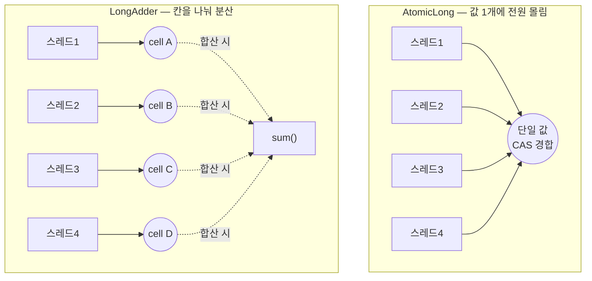

<!-- truncate -->

"요청 수를 센다", "처리 건수를 집계한다" 같은 **카운터**는 서버 어디에나 있습니다. 스레드 하나면 `long count++` 로 끝이지만, 수십 개 스레드가 동시에 같은 카운터를 올리면 이야기가 달라집니다. 보통 `AtomicLong` 을 떠올리는데, <mark>경합(여러 스레드가 같은 값을 동시에 건드림)이 심해지면 `AtomicLong` 은 오히려 급격히 느려집니다.</mark> 이때를 위해 나온 것이 **`LongAdder`** 입니다. 무엇이고, 왜 빠르고, 언제 써야 하는지 처음부터 풀어봅니다.

## 먼저: AtomicLong은 왜 느려지나

`AtomicLong` 은 값 하나를 **CAS(Compare-And-Swap)** 로 갱신합니다. CAS는 "지금 값이 내가 읽은 그 값이면 새 값으로 바꿔라"라는 원자적 연산인데, 만약 그 사이 다른 스레드가 값을 바꿨으면 실패하고 **다시 시도**합니다.

스레드가 몇 개 없으면 문제없지만, 수십 개가 **같은 메모리 한 곳**을 동시에 CAS 하려 들면 대부분 실패→재시도를 반복합니다. <mark>모두가 값 하나에 몰리니, 갱신이 사실상 줄서기가 되어 스레드가 늘수록 오히려 느려집니다.</mark>

```java
AtomicLong counter = new AtomicLong();
counter.incrementAndGet();   // 내부적으로 CAS 재시도 루프 — 경합 시 재시도 폭증
```

## LongAdder의 아이디어: 값을 여러 칸으로 쪼갠다

`LongAdder` 의 발상은 단순합니다. <mark>모두가 값 하나를 다투게 하지 말고, 여러 칸(cell)으로 나눠 각 스레드가 서로 다른 칸에 더하게 하자.</mark> 그리고 최종 합계가 필요할 때 모든 칸을 더한다.

내부적으로는 기본 값 `base` 하나와, 경합이 감지되면 동적으로 늘어나는 칸 배열(`Cell[]`)을 둡니다. 각 스레드는 자기 해시에 따라 특정 칸으로 흩어져 더하므로, 같은 메모리를 두고 다툴 일이 줄어듭니다. (이 구조는 내부 베이스 클래스 `Striped64` 가 담당합니다.)



```java
LongAdder counter = new LongAdder();
counter.increment();   // add(1) — 스레드마다 다른 칸에 더해 경합 분산
counter.add(5);
long total = counter.sum();   // 모든 칸 + base 를 더한 현재 합계
```

## 주의: `sum()` 은 "정확한 순간 스냅샷"이 아니다

여러 칸을 훑어 더하는 특성상, 함수 실행 도중 다른 스레드가 어떤 칸을 바꾸면 그 값이 반영될 수도, 안 될 수도 있습니다. 공식 문서도 <mark>"반환값은 원자적 스냅샷이 아니다(NOT an atomic snapshot)"</mark> 라고 명시합니다.

- **동시 갱신이 없을 때** 부르면 정확합니다.
- **갱신이 도는 중**에 부르면 "그 시점 근처의 값"입니다(약간 뒤처질 수 있음).

그래서 통계·모니터링 카운터처럼 "대략 맞으면 되고, 조용할 때 읽는" 용도에 잘 맞습니다. `reset()`(0으로 초기화)이나 `sumThenReset()`(합계를 읽고 바로 초기화)도 **갱신이 없는 시점**에 쓰는 걸 전제로 합니다.

## 성능 — 고경합일수록 격차가 벌어진다

핵심 경향만 기억하면 됩니다.

| 상황 | AtomicLong | LongAdder |
|---|---|---|
| 단일 스레드 / 저경합 | 살짝 더 빠름 | 살짝 느림(칸 분산 오버헤드) |
| 다수 스레드 / 고경합 | 재시도 폭증으로 급격히 저하 | **처리량이 훨씬 높음** |
| 메모리 | 값 하나 | 칸 배열만큼 더 씀 |

공식 문서 표현으로도 <mark>고경합에서 `LongAdder` 의 기대 처리량은 "훨씬 높으며(significantly higher), 대신 공간을 더 쓴다"</mark> 입니다. 스레드 수가 늘수록 `AtomicLong` 은 CAS 재시도에 시간을 쏟는 반면, `LongAdder` 는 칸을 늘려 경합을 흩뜨리기 때문입니다(벤치마크상 고경합에서 수 배~수십 배까지 벌어지는 사례가 흔합니다 — 수치는 환경마다 다릅니다).

바꿔 말하면, **쓰기(갱신)는 아주 잦고 읽기(합계)는 가끔** 일어나는 상황이 `LongAdder` 가 가장 유리한 경우입니다.

## 언제 쓰고, 언제 쓰면 안 되나

**쓰기 좋은 경우 — 카운터·통계 집계**

```java
// 예: 엔드포인트 호출 수 집계 (여러 워커 스레드가 동시에 증가)
LongAdder requestCount = new LongAdder();
// ... 각 요청마다
requestCount.increment();
// ... 주기적으로(조용할 때) 스냅샷
metrics.report("requests", requestCount.sum());
```

**쓰면 안 되는 경우 — "현재 값을 보고 판단"이 필요할 때**

`LongAdder` 에는 `AtomicLong` 의 `compareAndSet`·`getAndIncrement` 같은 **읽고-판단-갱신을 원자적으로 묶는** 연산이 없습니다. <mark>"값이 N을 넘으면 막는다"처럼 현재 값에 기반해 원자적으로 분기·제어해야 하면 `LongAdder` 가 아니라 `AtomicLong` 을 써야 합니다.</mark> `LongAdder` 는 "정확히 얼마인지"보다 "많이·빠르게 누적"에 최적화된 도구입니다.

## 언제부터 지원됐나 — Java 8부터

`java.util.concurrent.atomic.LongAdder` 는 **Java 8(since 1.8, 2014년)** 에 추가됐습니다. 같은 시기에 들어온 형제 클래스들도 함께 알아두면 좋습니다.

| 클래스 | 용도 |
|---|---|
| `LongAdder` | `long` 합계 누적(고경합 카운터) |
| `DoubleAdder` | `double` 합계 누적 |
| `LongAccumulator` | 합뿐 아니라 임의의 결합 함수(예: max)로 누적 — 항등원 + 이항연산 지정 |
| `DoubleAccumulator` | 위의 `double` 버전 |

예를 들어 "최댓값을 여러 스레드가 갱신"하려면 `LongAccumulator` 로 이렇게 씁니다.

```java
// 초기값 Long.MIN_VALUE, 결합 함수 = max
LongAccumulator maxLatency = new LongAccumulator(Long::max, Long.MIN_VALUE);
maxLatency.accumulate(120);
maxLatency.accumulate(87);
long peak = maxLatency.get();   // 120
```

## 정리

- `AtomicLong` 은 값 하나를 CAS로 다투므로 **고경합에서 재시도가 폭증**해 느려진다.
- `LongAdder` 는 **값을 여러 칸으로 쪼개** 경합을 분산하고, 필요할 때 `sum()` 으로 합친다.
- `sum()` 은 **원자적 스냅샷이 아니다** — 통계·카운터처럼 "대략 맞으면 되는" 용도에 적합.
- **쓰기 잦고 읽기 드문** 카운터엔 `LongAdder`, **현재 값 기반 원자 제어**엔 `AtomicLong`.
- **Java 8(1.8)** 부터 지원. 형제로 `DoubleAdder`·`LongAccumulator`·`DoubleAccumulator`.

<mark>한 줄 요약: "많은 스레드가 그저 숫자를 누적만 하는" 상황이면 `AtomicLong` 대신 `LongAdder` 를 기본값으로 고려하라.</mark>

### 용어 한 줄 정리

| 용어 | 쉬운 뜻 |
|---|---|
| 경합(contention) | 여러 스레드가 같은 자원(값)을 동시에 건드리려는 상태 |
| CAS | "지금 값이 그대로면 바꿔라" — 실패하면 재시도하는 원자적 갱신 |
| Striped64 | 값을 여러 칸으로 쪼개 분산 누적하는 내부 베이스 클래스 |
| 원자적 스냅샷 | 그 순간을 딱 얼려 읽은 정확한 값(`sum()`은 이게 아님) |
