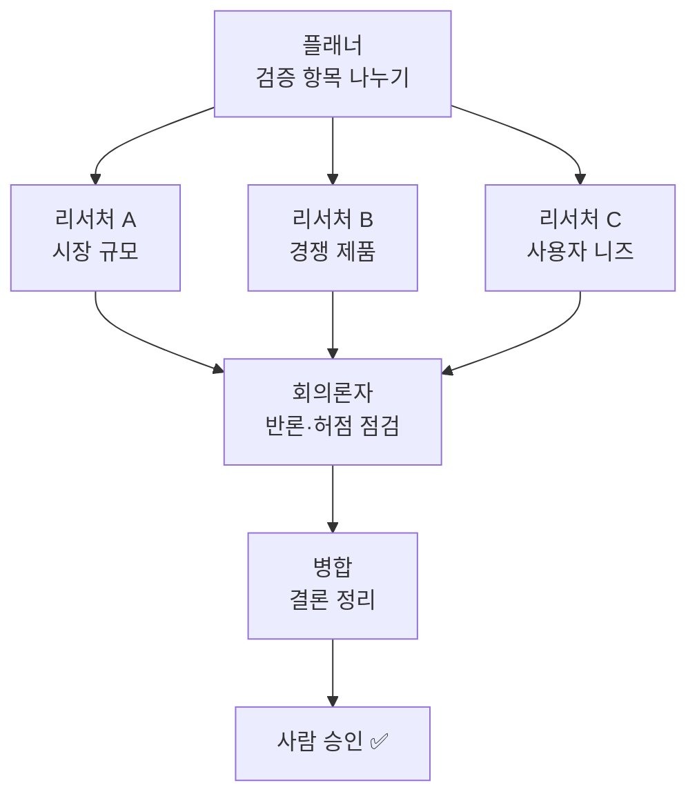

<!-- truncate -->

한동안은 "프롬프트를 잘 쓰는 법"이 화두였습니다. 그다음엔 "무엇을 맥락으로 넣어줄까(컨텍스트 엔지니어링)"였죠. 요즘 그 뒤를 잇는 말로 **그래프 엔지니어링(graph engineering)** 이 자주 보입니다. <mark>한 번의 채팅으로 끝내지 말고, AI가 할 일을 여러 단계의 "그래프"로 그려서 설계하자는 것</mark>입니다. **프롬프트 엔지니어링 · 컨텍스트 엔지니어링**부터 그래프 엔지니어링까지, 각각이 무엇이고 어떻게 이어지는지 처음부터 풀어봅니다.

## 세 가지 엔지니어링 — 말, 자료, 흐름

AI를 잘 쓰는 기술은 대략 이 순서로 발전해 왔습니다. 뒤의 것이 앞의 것을 대체하는 게 아니라 **위에 쌓입니다.**

**① 프롬프트 엔지니어링 — "무엇을, 어떻게 말할까"** 
모델에게 주는 지시문(프롬프트)을 잘 다듬는 단계입니다. 역할을 정해주고("너는 시니어 리뷰어야"), 원하는 출력 형식을 지정하고, 예시를 몇 개 보여주고(few-shot), "단계별로 생각해"처럼 풀이 방식을 유도합니다. <mark>같은 모델이라도 어떻게 묻느냐에 따라 답 품질이 달라진다</mark>는 점을 이용합니다. 다만 아무리 잘 물어도, 모델이 *모르는 정보*(사내 문서·최신 자료)까지 채워주진 못합니다.

**② 컨텍스트 엔지니어링 — "무엇을 자료로 넣어줄까"** 
그래서 다음은 모델의 작업 공간(컨텍스트 윈도우)에 **필요한 자료를 넣어주는** 일입니다. 관련 문서를 검색해 붙이고(RAG), 이전 대화·메모리를 관리하고, 도구 실행 결과를 다시 넣어줍니다. 관건은 "무엇을, 얼마나, 어떤 순서로" 넣느냐입니다 — 너무 많으면 산만해지고, 빠지면 엉뚱한 답을 합니다. <mark>말을 잘하는 것(프롬프트)을 넘어, 판단에 필요한 재료를 갖춰주는 단계</mark>죠. 하지만 이것도 여전히 "한 번의 호출"을 잘하는 데 초점입니다.

**③ 그래프 엔지니어링 — "일의 흐름을 어떻게 짤까"** 
일이 여러 단계로 얽히면 한 번의 호출로는 부족합니다. 조사하고 · 검증하고 · 승인받는 **흐름 자체**를 설계해야 하죠. <mark>AI에게 뭐라고 말할지(프롬프트)와 무엇을 줄지(컨텍스트)를 넘어, AI 주변의 일을 어떻게 배치할지를 설계</mark>하는 게 그래프 엔지니어링입니다.

| 단계 | 다루는 것 | 한 줄 비유 |
|---|---|---|
| 프롬프트 엔지니어링 | 지시문(말) | 질문을 잘 던지기 |
| 컨텍스트 엔지니어링 | 넣어줄 자료 | 필요한 서류를 챙겨주기 |
| 그래프 엔지니어링 | 작업의 흐름 | 일하는 순서·팀을 짜기 |

간단한 질문은 ①만으로 충분합니다. 하지만 **여러 단계 + 일부 병렬 + 최종 검증**이 얽히면, 프롬프트 하나에 다 욱여넣기보다 흐름을 그래프로 그려 AI 바깥에 고정해 두는 편이 낫습니다.

## 기본 재료는 딱 세 가지 — 잡·화살표·상태

그래프라고 하면 복잡해 보이지만, 구성 요소는 셋뿐입니다.

- **잡(job)** — 하나의 작업 단위. "자료 조사", "초안 작성", "검토" 각각이 잡입니다. (내부적으로 AI 호출일 수도, 사람의 승인일 수도 있습니다.)
- **화살표(흐름)** — 잡에서 잡으로 이어지는 순서. "조사 → 초안"처럼요. 여러 화살표가 갈라지면 **병렬**, 다시 모이면 **병합**입니다.
- **상태(state)** — 잡들이 주고받는 공유 데이터. 앞 단계의 결과가 상태에 쌓이고, 다음 잡이 그걸 읽어 이어갑니다.

<mark>즉 "무슨 일들을(잡), 어떤 순서로(화살표), 무엇을 주고받으며(상태) 처리할지"를 그리는 게 전부입니다.</mark>

## 두 종류의 그래프 — 지식 그래프 vs 에이전트 그래프

"그래프"라는 말이 두 가지로 쓰여 헷갈리기 쉬운데, 목적이 다릅니다.

| 종류 | 무엇을 그리나 | 쓰임 |
|---|---|---|
| **지식 그래프** | 데이터(엔티티) 사이의 **관계** | AI가 "A는 B에 속하고 B는 C와 연결" 같은 관계를 추론하도록 도움 |
| **에이전트 그래프** | 작업이 흐르는 **순서·구조** | 여러 단계 작업을 어떤 순서로, 어디서 병렬·검증할지 설계 |

이 글에서 말하는 그래프 엔지니어링은 주로 **에이전트 그래프** — 작업의 흐름을 설계하는 쪽입니다. (에이전트가 무엇인지 자체가 낯설다면 [LLM·에이전트·MCP 개념 글](./ai-concepts-llm-agent-mcp)을 먼저 보면 좋습니다.)

## 언제 필요한가

모든 일에 그래프가 필요한 건 아닙니다. 다음 세 조건이 겹칠 때가 신호입니다.

> **여러 단계가 있고, 그중 몇몇은 동시에 할 수 있고, 최종 결과물이 검사를 거쳐야 할 때.**

<mark>단계가 하나거나, 순서가 고정된 단순 작업이면 굳이 그래프로 만들 필요 없습니다.</mark> 반대로 "조사·비교·검증"이 얽히면 그래프가 힘을 냅니다.

## 예시 — 제품 아이디어를 검증하는 그래프

"쇼피파이 장부 정리 제품이 될까?"를 검증한다고 해봅시다. 채팅 한 번 대신, 이렇게 그래프로 짭니다.

- **플래너**가 검증할 항목을 쪼개고,
- **리서처 3명**이 서로 다른 축을 **병렬로** 조사하고,
- **회의론자**가 일부러 반론을 던져 허점을 걸러내고,
- **병합** 잡이 결론을 모은 뒤,
- 마지막에 **사람이 승인**합니다.

<mark>핵심은 "조사"와 "반론(검증)"을 서로 다른 잡으로 분리한 것</mark> — 한 AI에게 "조사하고 스스로 검증까지 해"라고 시키는 것보다, 검증을 독립된 단계로 떼어 놓으면 품질이 훨씬 일관됩니다.

## 어떻게 시작하나 — 레벨별로

거창한 도구부터 배울 필요 없습니다. 단계적으로 올라가면 됩니다.

- **초급 — 손으로 구조만.** 도구 없이, 위 흐름을 그냥 순서대로 직접 돌립니다. "이 프롬프트로 조사 → 결과를 다음 프롬프트에 붙여 검증." 그래프를 *머리와 문서*로만 관리하는 단계.
- **중급 — Claude Code·파일 저장소 활용.** 각 잡을 파일·명령으로 고정하고, 상태를 파일에 남깁니다. 세션이 바뀌어도 같은 절차가 재현되죠. (이 방식을 구조화한 사례는 [AI 엔지니어링 하네스 글](./ai-engineering-harness)에서 다뤘습니다.)
- **고급 — 오케스트레이션 도구.** 그래프를 코드/노드로 선언하고 병렬·재시도·분기를 자동화합니다. 대표적으로 **LangGraph, AutoGen, n8n** 등이 있습니다.

<mark>도구는 나중이고, 먼저 "잡·화살표·상태"로 흐름을 그리는 습관이 본질입니다.</mark>

## 실무에 붙이면

같은 패턴이 분야만 바꿔 반복됩니다.

- **고객 지원**: 분류 → 조사 → 초안 → 검사 → 승인
- **콘텐츠 제작**: 리서치 → 논지 → 사례 → 대본 → 검사
- **코딩**: 계획 → 수정 → 리뷰 → 테스트 → 승인

공통점은 **"만드는 잡"과 "검사하는 잡"이 분리**돼 있고, 만드는 단계는 병렬로, 검사 단계는 게이트로 둔다는 것입니다.

## 정리

- 그래프 엔지니어링은 프롬프트/컨텍스트 다음 단계로, **AI 작업의 흐름 자체를 설계**하는 것.
- 재료는 **잡(작업) · 화살표(순서) · 상태(공유 데이터)** 셋.
- **여러 단계 + 일부 병렬 + 최종 검증**이 겹칠 때 쓴다. 단순 작업엔 과하다.
- **만들기와 검증을 다른 잡으로 분리**하는 게 품질 일관성의 핵심.
- 시작은 손으로, 다음은 파일·명령으로 고정, 마지막에 LangGraph·n8n 같은 도구로 자동화.

<mark>결국 이점은 하나 — 결과 품질이 "완벽한 프롬프트를 매번 기억하는지"에 덜 의존하게 되고, 검증이 일관되며, 자동화의 토대가 생긴다는 것</mark>입니다. 모델을 더 똑똑하게 만드는 게 아니라, 모델 *주변의 흐름*을 설계하는 셈입니다.

> 이 글은 ["요즘 유행하는 '그래프 엔지니어링' 대체 뭔지 리뷰해 봤습니다"](https://maily.so/josh/posts/1do1d125ox6) 뉴스레터에서 출발해, 개념을 제 방식대로 정리한 것입니다.
