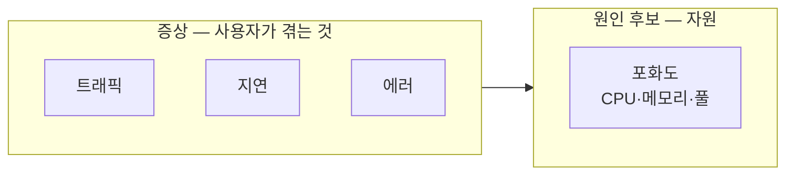
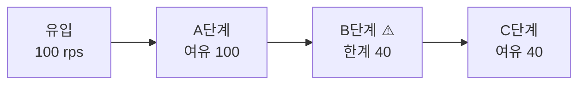
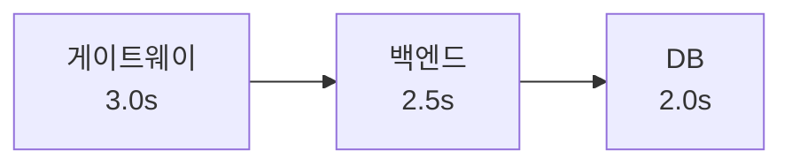

import {AnimatedLineChart, AnimatedBars} from '@site/src/components/blog/MonitorCharts';

<!-- truncate -->

모니터링 툴을 붙이고 대시보드를 띄우는 것까지는 다들 합니다. 진짜 어려운 건 그다음 — **그 지표를 읽고 "지금 무슨 일이 벌어지는지"를 진단하는 것**입니다. 화면 가득한 그래프 앞에서 어디부터 봐야 할지 막막했던 적이 있다면, 이 글이 그 순서를 잡아줍니다. 핵심 원칙은 하나입니다. <mark>원인부터 찾으려 하지 말고, 증상을 먼저 파악한 뒤 원인 범위를 줄여 나간다.</mark>

## 1. 무엇부터 보나 — 4대 골든 시그널

구글 SRE가 정리한 **골든 시그널(Golden Signals)** 네 가지가 출발점입니다. "사용자가 겪는 일"을 먼저 보는 지표들입니다.

- **트래픽(Traffic)** — 얼마나 들어오나. 초당 요청 수(RPS)·트랜잭션 수.
- **지연 시간(Latency)** — 얼마나 느린가. (뒤에서 다루지만, 평균이 아니라 백분위수로 봐야 합니다.)
- **에러(Errors)** — 얼마나 실패하나. `4xx`(클라이언트 잘못)와 `5xx`(서버 잘못)를 반드시 구분.
- **포화도(Saturation)** — 자원이 얼마나 찼나. CPU·메모리·스레드/커넥션 풀.

<mark>앞의 셋(트래픽·지연·에러)은 "사용자의 증상", 포화도는 "원인 후보"입니다.</mark> 그래서 증상 셋을 먼저 읽고, 포화도·리소스로 내려가며 원인 범위를 줄입니다.



비슷한 틀로 **RED**(Rate·Errors·Duration — 요청 흐름 관점)와 **USE**(Utilization·Saturation·Errors — 자원 관점)도 자주 쓰입니다. 이름만 다를 뿐 "사용자 쪽 증상"과 "자원 쪽 원인"을 나눠 본다는 발상은 같습니다. 어떤 틀을 쓰든 <mark>중요한 건 "무엇을 먼저 보고, 어디로 범위를 줄여 갈지" 순서를 정해 두는 것</mark>입니다.

## 2. 지연은 "평균"이 아니라 "P99"로 본다

가장 흔히 하는 실수가 **평균 응답시간**입니다. 평균은 분포를 지워버립니다 — 99명이 빠르고 1명이 10초 걸려도 평균은 멀쩡해 보이죠. 그래서 **백분위수(percentile)** 로 봅니다.

- **P50** — 중앙값. 절반은 이보다 빠름(대표적 경험).
- **P95 / P99** — 상위 5% / 1%가 겪는 지연. 이 **P99 지연(tail latency)** 이 사용자 불만으로 이어지는 실제 구간입니다.

응답시간 분포는 보통 이렇게 **왼쪽에 몰리고 오른쪽으로 길게 늘어집니다**. 이 오른쪽 끝의 느린 소수 때문에 평균이 위로 끌려가서, 평균은 대부분이 실제로 겪는 속도도, 가장 느린 속도도 아닌 어중간한 값이 됩니다.

<AnimatedBars
  title="응답시간 분포 — 대부분 빠르지만 오른쪽 끝이 길다"
  labels={[50, 100, 150, 200, 300, 500, 800, 1200, 2000]}
  data={[92, 78, 40, 18, 9, 5, 3, 2, 1]}
  yMax={100}
  xLabel="응답시간(ms)"
  unit="요청 수(건)"
/>

<mark>P99는 "가장 운 나쁜 사용자"가 아니라, 요청을 많이 하는 "핵심 사용자"가 실제로 겪는 경험입니다.</mark> 한 화면이 내부적으로 여러 번 호출하면, 그중 하나만 느린 쪽에 걸려도 화면 전체가 느려지기 때문입니다.

구체적으로, 한 요청이 느릴 확률이 **1%(P99)** 라도 한 페이지가 내부적으로 **100번** 호출하면, 그중 최소 한 번이 느린 쪽(P99)에 걸릴 확률은:

```
1 − (0.99)^100 ≈ 0.63  → 약 63%
```

즉 개별 호출은 "99% 빠름"인데, 페이지 단위로는 **셋 중 둘이 느림**을 겪습니다. 팬아웃(fan-out, 내부 호출 수)이 많은 서비스일수록 P99 지연 관리가 훨씬 더 중요해지는 이유입니다.

> 정리: **지연 알람은 평균이 아니라 P95/P99에 건다.**

## 3. 리소스로 원인 범위 줄이기

증상을 확인했으면, 이제 자원 지표로 원인 범위를 줄입니다. 각 지표에는 그래프 모양만 봐도 원인을 추정할 수 있는 전형적인 패턴이 있습니다.

**CPU** — 높으면 당연히 의심이지만, 정작 놓치기 쉬운 건 반대 경우입니다. <mark>"CPU는 낮은데 응답이 느리다"면 십중팔구 무언가를 기다리는 중(I/O 대기)</mark> — DB 응답, 락, 커넥션 풀 고갈입니다. 이럴 땐 CPU 사용률보다 **런 큐(대기 중인 실행 대기열)·로드 애버리지**가 단서가 됩니다. 컨테이너 환경이면 **스로틀링**(할당량 초과로 강제로 CPU를 뺏김)도 꼭 확인해야 합니다 — 사용률은 낮아 보여도 스로틀 카운터가 올라가고 있으면 그게 원인입니다. 반대로 사용률이 100%라도 배치·인코딩처럼 원래 CPU를 다 쓰는 작업이면 정상일 수 있으니, 숫자 자체보다 **"사용자 지연과 같이 움직이는가"** 를 봅니다.

**메모리** — 그래프의 **모양**을 읽습니다. GC로 오르내리는 **톱니(sawtooth)의 "최저점"이 계속 우상향**이면 누수 신호입니다(회수돼도 바닥이 안 내려감). **계단 모양**으로 한 번 크게 올라가 유지되면 대량 데이터를 한꺼번에 로드했다는 뜻입니다.

<AnimatedLineChart
  title="메모리 — 톱니의 '최저점(GC 직후)'이 우상향하면 누수"
  data={[40, 70, 45, 76, 53, 82, 61, 88, 69, 95]}
  trend={[40, 69]}
  yMax={100}
  unit="사용량(MB)"
/>

위 그래프에서 봉우리(peak)가 아니라 **골(trough)** — 40 → 45 → 53 → 61 → 69로 꾸준히 올라가는 게 핵심입니다. 봉우리는 트래픽 따라 요동쳐도, 건강한 서버라면 GC 직후 최저점은 평평해야 합니다. 여기가 우상향이면 힙 덤프를 떠서 무엇이 안 풀리는지 봐야 합니다.

반면 **계단 모양**은 원인이 다릅니다. 톱니처럼 오르내리지 않고 한 번씩 크게 올라가 유지되면, 대량 데이터를 한꺼번에 로드해 그만큼 메모리를 계속 차지하고 있는 것입니다(예: 큰 결과셋을 통째로 메모리에).

<AnimatedLineChart
  title="메모리 — 계단형: 대량 로드가 한 번에 크게 오른다"
  data={[30, 30, 30, 58, 58, 58, 86, 86, 86, 86]}
  yMax={100}
  unit="사용량(MB)"
  step
/>

**스레드/커넥션 풀** — 여기서 **리틀의 법칙(Little's Law)** 이 유용합니다.

```
동시 처리 중인 요청 수(L) = 초당 유입량(λ) × 평균 처리시간(W)
```

처리시간(W)이 늘면 동시 요청(L)이 함께 불어나고, 풀·큐가 고갈되면 대기가 폭증해 응답시간이 수직 상승합니다.

숫자로 보면 명확합니다. 유입이 초당 200건이고 평균 처리시간이 50ms면 동시에 물려 있는 요청은 `200 × 0.05 = 10`건 — 커넥션 풀이 20이면 여유입니다. 그런데 슬로 쿼리로 처리시간이 **300ms로 6배** 뛰면 `200 × 0.3 = 60`건이 필요해져 풀(20)을 훌쩍 넘깁니다. 초과분은 큐에서 대기하고, 대기가 다시 처리시간을 늘리는 악순환이 됩니다. <mark>슬로 쿼리 하나가 커넥션을 오래 붙들면, 그 영향이 연쇄적으로 클러스터 전체로 번집니다.</mark>

**이벤트 루프 서버(Node.js 등)** — 핵심 지표는 **이벤트 루프 지연**입니다. 평균이 아니라 최댓값·P99로 보세요. CPU를 오래 쓰는 작업 하나가 루프를 막으면 그 순간 모든 요청이 멈춥니다.

## 4. 지표 하나로는 안 보이는 복합 패턴

진짜 장애는 지표 하나가 아니라 **여러 지표의 조합**으로 드러납니다.

**병목(bottleneck)** — 병목 지점 앞에는 대기가 쌓이고 뒤는 여유가 있습니다. <mark>전체 처리량은 언제나 가장 느린 한 단계에 묶입니다 — 그 단계보다 빨라질 수 없습니다.</mark> 각 단계 처리량을 나란히 보면, 앞단은 유입만큼 나가는데 특정 단계에서 뚝 떨어지는 지점이 원인입니다.



B단계가 40까지만 처리하니, C단계가 아무리 여유로워도 전체 처리량은 40에 묶이고 B 앞에는 대기가 쌓입니다.

**백프레셔(backpressure)** — 큐 길이가 줄지 않고 계속 쌓이면 유입이 처리 속도를 앞선 것입니다. 아래처럼 **대기 큐가 발산**하면 곧 응답시간도 수직으로 오릅니다.

<AnimatedLineChart
  title="백프레셔 — 대기 큐가 줄지 않고 발산한다"
  data={[2, 3, 5, 9, 16, 28, 45, 68, 95, 116]}
  yMax={120}
  tone="accent2"
  unit="대기 큐(개)"
/>

방치하면 전부 중단되므로, **로드 셰딩(load shedding)** — `429 Too Many Requests`로 초과분을 빨리 거절 — 으로 일부를 포기해 전체를 지킵니다. "다 받다 전부 멈추기"보다 "일부만 받고 지키기"가 낫다는 판단입니다.

**캐시 스탬피드(cache stampede)** — 캐시 히트율이 급락하면서 DB 부하가 동시에 튀는 패턴. DB가 갑자기 느려진 게 아니라, 인기 키의 캐시가 만료돼 다들 동시에 원본을 다시 만들며 몰린 것입니다. <mark>두 지표가 **거울처럼 엇갈리는 순간**이 신호입니다 — 히트율이 뚝 떨어지는 그때 DB 부하가 급등합니다.</mark>

<AnimatedLineChart
  title="캐시 스탬피드 — 히트율 급락과 DB 부하 급등이 동시에"
  data={[95, 94, 95, 60, 25, 22, 28, 45, 70, 90]}
  data2={[12, 12, 14, 48, 82, 90, 82, 60, 38, 20]}
  yMax={100}
  tone="good"
  tone2="bad"
  unit="상대 부하(%)"
  legend={["캐시 히트율", "DB 부하"]}
/>

완화책은 만료 시점 분산(지터), 재생성 잠금(한 요청만 원본 조회), 백그라운드 갱신 등입니다.

**타임아웃 예산(timeout budget)** — 하나의 요청이 게이트웨이 → 백엔드 → DB처럼 여러 계층을 거칠 때, 각 계층의 타임아웃을 **바깥일수록 길게, 안쪽일수록 짧게** 차등 설정하는 것입니다. 요청 하나에 허용된 전체 시간(예산)을 계층들이 나눠 갖되, **안쪽이 항상 바깥보다 먼저 끊기도록** 조금씩 여유를 남깁니다. 모든 계층에 같은 값을 주면, 바깥이 기다리다 포기한 뒤에도 안쪽은 그 사실을 모른 채 계속 일해 자원을 낭비합니다.



안쪽(DB)이 먼저 끊겨야, 바깥(게이트웨이)이 **"안쪽이 시간 초과됐다"는 명확한 실패 응답**을 제때 받아 정상적으로 처리(에러 반환·대체 동작)할 수 있습니다. 반대로 바깥이 먼저 끊기면, 이미 손을 놓은 요청을 안쪽은 모른 채 계속 처리해 자원만 낭비합니다.

## 5. 세 가지 시간 — 평시·장애 중·장애 후

같은 지표라도 **언제 보느냐**에 따라 읽는 법이 다릅니다. 예를 들어 하루 트래픽은 대개 이런 "정상 곡선"을 그립니다 — 이 모양을 외워둬야 오늘의 이상이 눈에 들어옵니다.

<AnimatedLineChart
  title="평시 트래픽 — 이 '정상 곡선'을 외워둬야 이상이 보인다"
  data={[12, 8, 6, 5, 7, 15, 32, 55, 72, 68, 50, 28]}
  yMax={80}
  unit="트래픽(RPS)"
/>

- **평시** — <mark>평소 패턴을 알고 있어야 이상을 감지한다.</mark> "화요일 오후의 정상 곡선"을 알아야 "오늘의 이상"이 보입니다. 주간·월간 비교 패널이 유용합니다.
- **배포 직후(30분)** — 배포 마커·버전 라벨로 변화를 추적하고, **"회복 추세인가"** 방향부터 봅니다. 나빠지는 방향이면 원인 규명보다 **즉시 롤백**(기준은 미리 합의).
- **장애 중** — 원인부터 찾지 말고 **영향 범위**부터 파악 → **복구 먼저**, 원인 규명은 그다음. (응급실에서 급한 환자부터 처치하듯, 급한 것부터 처리하는 것을 '트리아지'라고 합니다.)
- **장애 후** — 장애를 되짚을 때(포스트모템) 원인만 보지 말고 **"왜 늦게 감지했나, 왜 대응이 느렸나"** 도 함께 점검해 다음 개선 과제로 남깁니다. 원인 자체보다 **더 빨리 감지하고 더 빨리 대응하도록** 만드는 게 개선의 핵심입니다.

## 6. 그래서 — 알람은 "증상"에 건다

가장 중요한 실무 원칙 하나로 정리됩니다. <mark>알람은 리소스(CPU 80%)가 아니라 증상(지연 P99, 에러율)에 걸어야 합니다.</mark> CPU가 높아도 사용자가 멀쩡하면 급한 일이 아니고, CPU가 낮아도 P99가 튀면 급한 일입니다. 알람은 "사용자가 아픈가"를 물어야지 "자원이 찼나"를 물으면 노이즈만 늘어납니다.

관측 자체를 갖추는 쪽은 이 블로그의 [구조적 로깅](./spring-boot-structured-logging)·[분산 추적](./kafka-distributed-tracing) 글과 이어집니다 — 로그·트레이스로 재료를 모으고, 이 글의 방식으로 그 재료를 **읽어** 진단하는 셈입니다.

## 정리

- **증상(트래픽·지연·에러)부터 → 원인(포화도·리소스)으로** 범위를 줄여 나간다.
- 지연은 **평균이 아니라 P95/P99**로 본다.
- "CPU 낮은데 느림"=I/O 대기, 메모리 톱니 최저점 우상향=누수, 풀 고갈은 **리틀의 법칙**으로 이해한다.
- 장애는 조합으로 드러난다 — **병목·백프레셔·캐시 스탬피드·타임아웃 예산**.
- 지표는 **평시·장애 중·장애 후**로 나눠 읽고, **알람은 증상에** 건다.

<mark>대시보드를 "설치"하는 것과 "읽는" 것은 다른 기술입니다 — 이 글은 그중 '읽는' 쪽에 초점을 맞췄습니다.</mark>

> 이 글은 [kciter — 서버 모니터링 분석 가이드](https://kciter.so/posts/server-monitoring-analysis-guide/)를 바탕으로, 핵심을 제 방식대로 정리한 것입니다.

### 용어 한 줄 정리

| 용어 | 쉬운 뜻 |
|---|---|
| 골든 시그널 | 먼저 봐야 할 4지표 — 트래픽·지연·에러·포화도 |
| 백분위수(P99) | "상위 1%가 겪는 지연" — 평균이 감추는 느린 소수 |
| 포화도 | 자원(CPU·메모리·풀)이 얼마나 찼는지 |
| 리틀의 법칙 | 동시 요청 = 유입량 × 처리시간 |
| 백프레셔 | 처리보다 유입이 빨라 큐가 쌓이는 상태 |
| 로드 셰딩(load shedding) | 초과 요청을 빨리 거절해 전체를 살리기 |
| 캐시 스탬피드 | 캐시 만료로 원본 재생성이 한꺼번에 몰림 |
| 타임아웃 예산 | 계층별로 안쪽을 더 짧게 준 타임아웃 |
