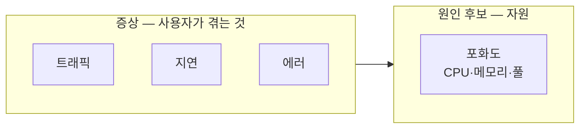
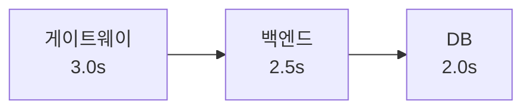

<!-- truncate -->

모니터링 툴을 붙이고 대시보드를 띄우는 것까지는 다들 합니다. 진짜 어려운 건 그다음 — **그 지표를 읽고 "지금 무슨 일이 벌어지는지"를 진단하는 것**입니다. 화면 가득한 그래프 앞에서 어디부터 봐야 할지 막막했던 적이 있다면, 이 글이 그 순서를 잡아줍니다. 핵심 원칙은 하나입니다. <mark>원인부터 뒤지지 말고, 증상을 먼저 파악한 뒤 범인을 좁혀 들어간다.</mark>

## 1. 무엇부터 보나 — 4대 황금 신호

구글 SRE가 정리한 **황금 신호(Golden Signals)** 네 가지가 출발점입니다. "사용자가 겪는 일"을 먼저 보는 지표들입니다.

- **트래픽(Traffic)** — 얼마나 들어오나. 초당 요청 수(RPS)·트랜잭션 수.
- **지연 시간(Latency)** — 얼마나 느린가. (뒤에서 다루지만, 평균이 아니라 백분위수로 봐야 합니다.)
- **에러(Errors)** — 얼마나 실패하나. `4xx`(클라이언트 잘못)와 `5xx`(서버 잘못)를 반드시 구분.
- **포화도(Saturation)** — 자원이 얼마나 찼나. CPU·메모리·스레드/커넥션 풀.

<mark>앞의 셋(트래픽·지연·에러)은 "사용자의 증상", 포화도는 "원인 후보"입니다.</mark> 그래서 증상 셋을 먼저 읽고, 포화도·리소스로 내려가며 범인을 좁힙니다.



## 2. 지연은 "평균"이 아니라 "꼬리"로 본다

가장 흔한 함정이 **평균 응답시간**입니다. 평균은 분포를 지워버립니다 — 99명이 빠르고 1명이 10초 걸려도 평균은 멀쩡해 보이죠. 그래서 **백분위수(percentile)** 로 봅니다.

- **P50** — 중앙값. 절반은 이보다 빠름(대표적 경험).
- **P95 / P99** — 상위 5% / 1%가 겪는 지연. 이 **꼬리 지연(tail latency)** 이 실제 불만이 터지는 지점입니다.

<mark>P99는 "가장 운 나쁜 사용자"가 아니라, 요청을 많이 하는 "핵심 사용자"가 실제로 겪는 경험입니다.</mark> 한 화면이 내부적으로 여러 번 호출하면, 그중 하나만 꼬리에 걸려도 화면 전체가 느려지기 때문입니다. 호출이 많을수록 "하나쯤 느릴 확률"이 곱으로 커집니다.

> 정리: **지연 알람은 평균이 아니라 P95/P99에 건다.**

## 3. 리소스로 범인 좁히기

증상을 확인했으면, 이제 자원 지표로 원인을 좁힙니다. 각 지표에는 "이렇게 생기면 이 병" 같은 전형적 패턴이 있습니다.

**CPU** — 높으면 당연히 의심이지만, 함정은 반대입니다. <mark>"CPU는 낮은데 응답이 느리다"면 십중팔구 무언가를 기다리는 중(I/O 대기)</mark> — DB 응답, 락, 커넥션 풀 고갈입니다. 컨테이너 환경이면 **스로틀링**(할당량 초과로 강제로 CPU를 뺏김)도 꼭 확인해야 합니다. 사용률은 낮아 보여도 스로틀에 걸려 느린 경우가 많습니다.

**메모리** — 그래프 모양을 읽습니다. GC로 오르내리는 **톱니 모양의 "최저점"이 계속 우상향**이면 누수 신호입니다(회수돼도 바닥이 안 내려감). **계단 모양**으로 훅 뛰면 한 번에 대량 데이터를 로드했다는 뜻입니다.

**스레드/커넥션 풀** — 여기서 **리틀의 법칙(Little's Law)** 이 강력합니다.

```
동시 처리 중인 요청 수(L) = 초당 유입량(λ) × 평균 처리시간(W)
```

처리시간(W)이 늘면 동시 요청(L)이 함께 불어나고, 풀·큐가 고갈되면 대기가 폭증해 응답시간이 수직 상승합니다. <mark>슬로 쿼리 하나가 커넥션을 오래 붙들면, 그 한 방이 도미노처럼 클러스터 전체를 무너뜨립니다.</mark>

**이벤트 루프 서버(Node.js 등)** — 핵심 지표는 **이벤트 루프 지연**입니다. 평균이 아니라 최댓값·P99로 보세요. CPU를 오래 쓰는 작업 하나가 루프를 막으면 그 순간 모든 요청이 멈춥니다.

## 4. 지표 하나로는 안 보이는 복합 패턴

진짜 장애는 지표 하나가 아니라 **여러 지표의 조합**으로 드러납니다.

- **병목(bottleneck)** — 병목 지점 앞에는 대기가 쌓이고 뒤는 한가합니다. <mark>전체 처리량은 언제나 가장 좁은 단(段)의 용량으로 정해집니다.</mark>
- **배압(backpressure)** — 큐 길이가 줄지 않고 계속 쌓이면 유입이 처리 속도를 앞선 것. 방치하면 다 같이 죽으므로, **로드 셰딩**(`429 Too Many Requests`로 초과분을 빨리 거절)으로 일부를 포기해 전체를 살립니다.
- **캐시 스탬피드(cache stampede)** — 캐시 히트율이 급락하면서 DB 부하가 동시에 튀는 패턴. DB가 갑자기 느려진 게 아니라, 캐시가 만료돼 다들 동시에 원본을 다시 만들며 몰린 것입니다.
- **타임아웃 예산(timeout budget)** — 계층마다 타임아웃을 **안쪽이 더 짧게** 차등 설정합니다.



안쪽(DB)이 먼저 끊겨야, 바깥(게이트웨이)이 "정돈된 에러"를 제때 받습니다. 바깥이 먼저 끊기면 안쪽 작업은 헛돌고 자원만 태웁니다.

## 5. 세 가지 시간 — 평시·장애 중·장애 후

같은 지표라도 **언제 보느냐**에 따라 읽는 법이 다릅니다.

- **평시** — <mark>평소 패턴을 외워둬야 이상을 알아챈다.</mark> "화요일 오후의 정상 곡선"을 알아야 "오늘의 이상"이 보입니다. 주간·월간 비교 패널이 유용합니다.
- **배포 직후(30분)** — 배포 마커·버전 라벨로 변화를 추적하고, **"회복 추세인가"** 방향부터 봅니다. 나빠지는 방향이면 원인 규명보다 **즉시 롤백**(기준은 미리 합의).
- **장애 중** — 원인부터 찾지 말고 **영향 범위**부터 파악 → **복구 먼저**, 원인 규명은 그다음. (트리아지)
- **장애 후** — 포스트모템에서 "감지가 늦었나·대응이 느렸나"를 액션 아이템으로. 원인 그 자체보다 **감지 공백과 대응 속도**를 줄이는 게 개선의 핵심입니다.

## 6. 그래서 — 알람은 "증상"에 건다

가장 중요한 실무 원칙 하나로 정리됩니다. <mark>알람은 리소스(CPU 80%)가 아니라 증상(지연 P99, 에러율)에 걸어야 합니다.</mark> CPU가 높아도 사용자가 멀쩡하면 급한 일이 아니고, CPU가 낮아도 P99가 튀면 급한 일입니다. 알람은 "사용자가 아픈가"를 물어야지 "자원이 찼나"를 물으면 노이즈만 늘어납니다.

관측 자체를 갖추는 쪽은 이 블로그의 [구조적 로깅](./spring-boot-structured-logging)·[분산 추적](./kafka-distributed-tracing) 글과 이어집니다 — 로그·트레이스로 재료를 모으고, 이 글의 방식으로 그 재료를 **읽어** 진단하는 셈입니다.

## 정리

- **증상(트래픽·지연·에러)부터 → 원인(포화도·리소스)으로** 좁혀 들어간다.
- 지연은 **평균이 아니라 P95/P99**(꼬리 지연)로 본다.
- "CPU 낮은데 느림"=I/O 대기, 메모리 톱니 최저점 우상향=누수, 풀 고갈은 **리틀의 법칙**으로 이해한다.
- 장애는 조합으로 드러난다 — **병목·배압·캐시 스탬피드·타임아웃 예산**.
- 지표는 **평시·장애 중·장애 후**로 나눠 읽고, **알람은 증상에** 건다.

<mark>대시보드를 "설치"하는 것과 "읽는" 것은 다른 기술입니다 — 이 글은 후자를 위한 지도입니다.</mark>

> 이 글은 [kciter — 서버 모니터링 분석 가이드](https://kciter.so/posts/server-monitoring-analysis-guide/)를 바탕으로, 핵심을 제 방식대로 정리한 것입니다.

### 용어 한 줄 정리

| 용어 | 쉬운 뜻 |
|---|---|
| 황금 신호 | 먼저 봐야 할 4지표 — 트래픽·지연·에러·포화도 |
| 백분위수(P99) | "상위 1%가 겪는 지연" — 평균이 감추는 꼬리 |
| 포화도 | 자원(CPU·메모리·풀)이 얼마나 찼는지 |
| 리틀의 법칙 | 동시 요청 = 유입량 × 처리시간 |
| 배압 | 처리보다 유입이 빨라 큐가 쌓이는 상태 |
| 로드 셰딩 | 초과 요청을 빨리 거절해 전체를 살리기 |
| 캐시 스탬피드 | 캐시 만료로 원본 재생성이 한꺼번에 몰림 |
| 타임아웃 예산 | 계층별로 안쪽을 더 짧게 준 타임아웃 |
