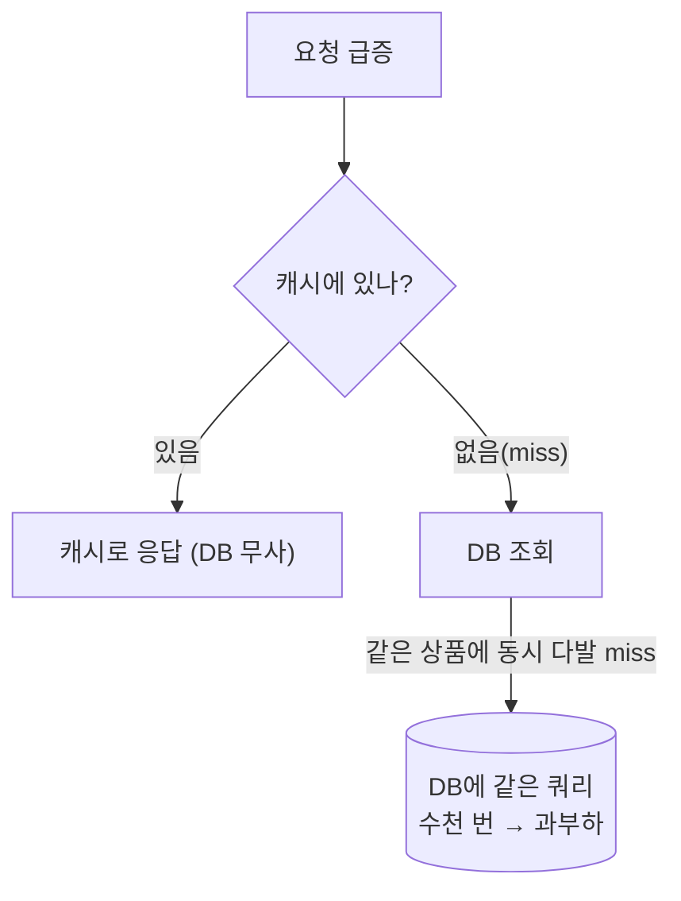

import {AnimatedLineChart} from '@site/src/components/blog/MonitorCharts';

<!-- truncate -->

상품이 수백만 개인 커머스에서 **모든 상품을 캐시에 올려두는 건 불가능**합니다(메모리도 비용도 안 됩니다). 그래서 보통은 "요청이 오는 상품만 캐시에 담고, 안 쓰는 건 밀어내는" 방식으로 운영합니다. 문제는 <mark>캐시에 없는 상품에 갑자기 트래픽이 몰릴 때 — 그 부하가 그대로 DB로 쏟아진다는 것</mark>입니다. 평소 조용하다 입소문으로 뜬 상품, 방금 나온 신상품처럼요. 이런 상황을 케이스별로 나눠 "부하가 DB로 쏠리지 않게" 대응하는 방법을 정리합니다. (Redis 운영 일반 이슈는 [대용량 Redis 대응](./redis-large-scale-pitfalls) 글을 참고하세요.)

## 전제 — "전량 캐싱"이 아니라 "요청 오는 것만"

상품 전체를 못 담으니, 실제로는 이렇게 씁니다.

- **요청 시 채우기(lazy/read-through)**: 캐시에 없으면 DB에서 읽어 캐시에 넣고 응답. 자주 조회되는 상품만 자연히 캐시에 남습니다.
- **밀어내기(eviction)**: 메모리가 차면 `allkeys-lfu`(자주 안 쓰는 것부터) 정책으로 정리.

Spring Boot(Spring Data Redis)라면 이 read-through는 `@Cacheable` 한 줄로 표현됩니다 — 캐시에 없을 때만 메서드가 실행되고 결과가 캐시에 담깁니다.

```java
@Cacheable(cacheNames = "product", key = "#id")
public Product getProduct(Long id) {
    return productRepository.findById(id).orElseThrow();   // miss일 때만 실행
}

// 캐시별 TTL — product 캐시는 10분
@Bean
RedisCacheManagerBuilderCustomizer cacheTtl() {
    return b -> b.withCacheConfiguration("product",
        RedisCacheConfiguration.defaultCacheConfig().entryTtl(Duration.ofMinutes(10)));
}
```

이 구조에서 <mark>위험은 언제나 "캐시에 없을 때(miss)"에 발생합니다.</mark> miss 하나가 DB를 한 번 치는 건 괜찮지만, **같은 상품에 miss가 동시에 몰리면** DB가 같은 쿼리를 수천 번 받습니다.



## 케이스 1 — 평소 조용하다 갑자기 몰림 (핫키 급등)

**상황**: 평소 인기 없던 상품이 입소문·SNS로 갑자기 뜬다. 트래픽이 **한 상품 키**에 집중됩니다.

**무엇이 문제**: 그 키가 캐시에 없으면 초반에 DB로 몰리고, 캐시에 올라간 뒤에도 그 키가 있는 **Redis 한 노드**만 과열됩니다(핫키).

**대응**:
- **로컬(인메모리) 캐시**를 애플리케이션 서버 앞단에 둔다 — TTL 몇 초짜리라도, 서버당 그 상품 조회를 대부분 흡수합니다.
- **요청 병합(single-flight)**: 같은 상품에 대한 동시 요청을 **하나로 묶어** 원본 조회는 1번만 하고, 나머지는 그 결과를 공유받습니다.
- **읽기 복제본(replica)** 으로 읽기를 분산.
- 값이 잘 안 바뀌면 **핫키를 여러 벌 복제**해 여러 노드로 분산(`product:123#1`~`#N` 중 랜덤 읽기).

<mark>핵심은 "여러 서버·여러 요청이 같은 상품을 각자 조회하지 않도록" 앞단에서 합치고 흡수하는 것입니다.</mark>

Spring Boot에선 로컬 캐시 + 요청 병합을 Caffeine으로 간단히 얻습니다.

```java
// 서버 로컬 캐시 — 몇 초짜리 TTL로 급등을 흡수.
// 같은 키에 동시 요청이 몰려도 로더(build 인자)는 딱 1번만 실행됨(요청 병합).
LoadingCache<Long, Product> local = Caffeine.newBuilder()
                                            .maximumSize(10_000)
                                            .expireAfterWrite(Duration.ofSeconds(3))
                                            .build(id -> productService.getProduct(id));
```

> Caffeine의 `build(loader)`는 같은 키에 동시 요청이 몰려도 로더를 **한 번만** 호출합니다 — 이게 곧 요청 병합(single-flight)입니다.

<AnimatedLineChart
  title="핫키 급등 — 유입은 치솟아도 DB 도달은 낮게 유지"
  data={[20, 28, 45, 85, 140, 180, 172, 150, 120, 92]}
  data2={[18, 20, 22, 24, 26, 27, 26, 24, 22, 20]}
  yMax={200}
  tone="accent"
  tone2="good"
  legend={["유입 요청", "DB 도달"]}
  unit="요청(req/s)"
/>

## 케이스 2 — 신상품 콜드 스타트 (캐시 스탬피드)

**상황**: 방금 출시된 상품은 **한 번도 캐시된 적이 없습니다(콜드 스타트)**. 노출되는 순간 수많은 요청이 동시에 들어오는데 전부 miss입니다.

**무엇이 문제**: 전부 캐시에 없으니 동시에 DB로 몰립니다 — 이게 **캐시 스탬피드**입니다(만료 순간에도 같은 일이 납니다).

**대응**:
- **프리워밍(pre-warming)**: 노출 전에 캐시를 미리 채운다. 신상품 등록/기획전 오픈 직전에 배치로 넣어두면 콜드 스타트 자체가 사라집니다.
- **재생성 잠금(mutex)**: `SET NX`로 **한 요청만** DB를 조회해 캐시를 채우고, 나머지는 잠깐 대기하거나 직전 값을 받습니다. (분산락은 [Redis 분산락](./redis-distributed-lock) 참고)

```java
// 한 요청만 DB를 재조회해 캐시를 채운다 (SET NX)
Boolean acquired = redis.opsForValue()
                        .setIfAbsent("lock:product:" + id, "1", Duration.ofSeconds(5));
if (Boolean.TRUE.equals(acquired)) {
    try {
        Product p = productRepository.findById(id).orElseThrow();
        redis.opsForValue().set("product:" + id, p, Duration.ofMinutes(10));
        return p;
    } finally {
        redis.delete("lock:product:" + id);
    }
}
// 못 잡았으면: 잠깐 뒤 캐시를 다시 보거나, 직전 값을 응답
```

- **stale-while-revalidate**: 만료된 값이라도 잠깐 그대로 응답하고, 갱신은 백그라운드에서. 사용자는 안 기다리고 DB는 한 번만 갱신됩니다.

<AnimatedLineChart
  title="캐시 스탬피드 — 대응 전후 DB 부하"
  data={[10, 12, 16, 55, 90, 96, 88, 70, 48, 30]}
  data2={[10, 11, 12, 14, 16, 18, 17, 16, 14, 13]}
  yMax={100}
  tone="bad"
  tone2="good"
  legend={["대응 없음", "잠금·프리워밍"]}
  unit="부하(DB QPS)"
/>

## 케이스 3 — 없는 상품을 반복 조회 (네거티브 캐시)

**상황**: 품절·삭제·잘못된 링크·봇 때문에 **존재하지 않는 상품 id**가 계속 조회된다.

**무엇이 문제**: "없음"은 캐시에 안 남기는 경우가 많아, 매번 miss → DB 조회가 반복됩니다.

**대응**:
- **네거티브 캐시**: "없음"도 **짧은 TTL로 캐시**해 반복 조회를 막습니다.
- 규모가 크면 **블룸 필터**로 "확실히 없는 id"를 DB 가기 전에 걸러냅니다(있을 수도 있음은 통과).

```java
Product p = productRepository.findById(id).orElse(null);
if (p == null) {
    // 없음도 짧게 캐시해 반복 조회가 DB로 안 가게
    redis.opsForValue().set("product:" + id, NONE_MARKER, Duration.ofSeconds(30));
    return null;
}
```

> 참고로 `@Cacheable`은 기본적으로 `null`도 캐시합니다(끄려면 `unless = "#result == null"`). 없음에 **더 짧은 TTL**을 주고 싶으면 위처럼 직접 다루면 됩니다.

## 케이스 4 — 세일 오픈 등 예고된 스파이크

**상황**: 타임세일·쿠폰 오픈처럼 **특정 시각에 트래픽이 튀는 게 예측**되는 경우.

**대응**:
- 대상 상품을 **미리 프리워밍**.
- 캐시 **만료 시각에 지터(랜덤 편차)** 를 줘서 대량 동시 만료를 피함.
- 그래도 넘치면 **대기열/로드 셰딩**으로 유입을 고른다(아래).

## 마지막 방어선 — 로드 셰딩·서킷 브레이커

위 대응을 다 해도 DB 용량을 넘는 순간이 옵니다. 그땐 **전부 받다 전부 죽기**보다 일부를 포기해 전체를 살립니다.

- **로드 셰딩**: DB 부하가 임계치를 넘으면 초과 요청을 빠르게 거절(`429`)하거나 기본 화면을 준다.
- **서킷 브레이커**: DB가 흔들리면 잠깐 호출을 끊고 캐시/기본값으로 버틴 뒤 회복되면 재개.

Spring Boot에선 Resilience4j 애노테이션으로 붙일 수 있습니다.

```java
@RateLimiter(name = "productDb")                        // 초과 요청은 빠르게 거절(로드 셰딩)
@CircuitBreaker(name = "productDb", fallbackMethod = "fallback")
public Product getProduct(Long id) {
    return productRepository.findById(id).orElseThrow();
}

// 거절·차단 시 대신 응답할 값(기본값/직전 값)
private Product fallback(Long id, Throwable t) {
    return Product.placeholder(id);
}
```

관련 개념(백프레셔·로드 셰딩·캐시 스탬피드)은 [서버 지표 읽기](./server-monitoring-analysis) 글에서도 다뤘습니다.

## 정리 — 케이스별 대응 요약

| 케이스 | 핵심 위험 | 주 대응 |
|---|---|---|
| 갑작스런 인기(핫키) | 한 키에 트래픽 집중 | 로컬 캐시, 요청 병합, 복제본, 핫키 분산 |
| 신상품 콜드 스타트 | 전부 miss → 스탬피드 | 프리워밍, 재생성 잠금, stale-while-revalidate |
| 없는 상품 반복 조회 | miss 반복 | 네거티브 캐시, 블룸 필터 |
| 예고된 스파이크 | 동시 몰림·대량 만료 | 프리워밍, TTL 지터, 로드 셰딩 |
| 한계 초과 | DB 붕괴 위험 | 로드 셰딩, 서킷 브레이커 |

<mark>큰 그림은 3중 방어입니다 — ①앞단에서 흡수(로컬 캐시·요청 병합), ②DB로 가는 건 한 번만(재생성 잠금·프리워밍), ③넘치면 일부를 포기(로드 셰딩).</mark> 전량 캐싱이 불가능한 규모에서는 "캐시에 없을 때 어떻게 행동하느냐"를 설계해 두는 것이 곧 트래픽 대응입니다.
