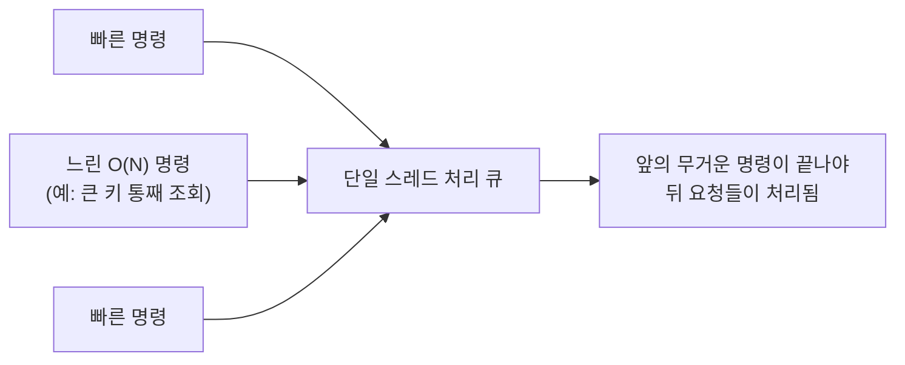

<!-- truncate -->

[Redis 자료구조 총정리](./redis-data-structures)에서 "무엇을 언제 쓰나"를 봤습니다. 그런데 트래픽이 커지면 같은 자료구조라도 **어떻게 쓰느냐**가 성패를 가릅니다. 핵심 전제는 하나입니다. <mark>Redis는 명령을 (대부분) 한 번에 하나씩, 단일 스레드로 처리합니다 — 그래서 느린 명령 하나가 그 뒤의 모든 요청을 기다리게 만듭니다.</mark> 이 성질에서 대부분의 문제가 나옵니다. 상황별로 무엇이 문제이고 어떻게 대비하는지 정리합니다.

## 왜 명령 하나가 전체를 막나

Redis는 빠르지만, 명령 실행은 **단일 스레드**입니다. 요청들이 한 줄로 서서 차례로 처리되죠. 그래서 O(N)짜리 무거운 명령 하나가 들어오면, 그게 끝날 때까지 **나머지 요청이 전부 대기**합니다.



<mark>즉 평균은 멀쩡해도, 무거운 명령 한 번이 그 순간 전체 지연을 튀게 합니다.</mark> 아래 문제들은 결국 "무거운 명령·큰 키·몰림을 어떻게 피하느냐"의 변주입니다.

## 1. O(N) 명령 — 컬렉션을 통째로 건드리기

원소 수에 비례해 시간이 드는 명령이 위험합니다. 대표적으로 `KEYS *`, 큰 컬렉션의 `SMEMBERS`·`HGETALL`·`LRANGE 0 -1`·`ZRANGE` 전체 조회입니다. 운영 중엔 절대 쓰면 안 되는 게 `KEYS`입니다 — 전체 키를 훑어 그동안 서버가 멈춥니다.

**대처**: 커서로 조금씩 훑는 `SCAN` 계열을 쓰고, 조회는 범위를 제한합니다.

```bash
# 나쁨: 전체를 한 번에
KEYS user:*
LRANGE feed:1 0 -1

# 좋음: 커서로 나눠서 / 범위 제한
SCAN 0 MATCH user:* COUNT 100
LRANGE feed:1 0 49          # 페이지 단위
HSCAN big:hash 0 COUNT 100
```

## 2. 빅키(big key) — 한 키가 너무 크다

한 키에 원소가 수십만~수백만 개면, 그 키를 만지는 모든 명령이 느려지고 메모리가 출렁입니다. **삭제조차** 위험합니다 — 큰 키를 `DEL`하면 그 순간 서버가 멈춥니다.

**대처**: 컬렉션을 **여러 키로 쪼개고**(예: 날짜·구간별), 삭제는 백그라운드로 지우는 `UNLINK`를 씁니다.

```bash
UNLINK big:key             # DEL 대신 — 비동기 삭제
redis-cli --bigkeys        # 큰 키 탐지
```

<mark>"컬렉션 하나가 무한정 커질 수 있는 구조"라면 설계 단계에서 상한·분할을 정해 둡니다.</mark>

## 3. 핫키(hot key) — 한 키에 트래픽이 몰린다

특정 키(예: 인기 상품, 전역 설정)에 읽기가 집중되면, 클러스터라도 그 키가 있는 **한 노드**만 과부하가 됩니다. 자료구조가 아니라 **분포**가 문제입니다.

**대처**:
- **애플리케이션 로컬 캐시**(짧은 TTL)로 Redis 앞단에서 흡수.
- 읽기는 **복제본(replica)** 으로 분산.
- 값이 잘 안 바뀌면 키를 여러 벌 복제해 분산(`hotkey:1`~`hotkey:N` 랜덤 읽기).

## 4. 메모리·eviction·TTL

Redis는 메모리 저장소라, 한계에 닿으면 `maxmemory-policy`에 따라 키를 **밀어냅니다(eviction)**. TTL 없이 계속 넣기만 하면 메모리가 무한정 늘어 결국 eviction이나 쓰기 거부가 납니다.

**대처**:
- 캐시 용도면 `maxmemory` + **`allkeys-lru`/`allkeys-lfu`** 정책을 명시(자주 안 쓰는 키부터 밀어냄).
- 캐시 키엔 **반드시 TTL**. 단, 많은 키의 TTL이 같은 시각에 몰리면 대량 만료가 한꺼번에 일어나니 **만료 시각에 지터(랜덤 편차)** 를 준다.
- `evicted_keys`·`used_memory`를 모니터링([서버 지표 읽기](./server-monitoring-analysis) 참고).

## 5. 캐시 스탬피드 — 인기 키가 만료되는 순간

인기 키의 캐시가 만료되면, 그 찰나에 수많은 요청이 **동시에 원본(DB)을 다시 조회**해 부하가 튑니다. Redis가 느려진 게 아니라 재생성이 몰린 것입니다.

**대처**:
- **재생성 잠금**: `SET lock NX EX`로 한 요청만 원본을 조회하고 나머지는 잠깐 대기하거나 이전 값을 씁니다. (분산락은 [Redis 분산락](./redis-distributed-lock) 참고)
- **만료 전에 미리 갱신**(백그라운드 리프레시)하거나, 만료 시각을 살짝 흩뜨립니다.

```bash
# 한 요청만 재생성하도록 잠금
SET cache:rebuild:key 1 NX EX 5    # 성공한 요청만 원본 조회
```

## 6. 큐 적체 — Stream·List가 무한히 쌓인다

List나 Stream을 큐로 쓸 때, **소비가 생산을 못 따라가면** 키가 끝없이 커져 3·4번 문제로 이어집니다.

**대처**: 길이 상한을 두고 오래된 것부터 잘라냅니다. Stream은 `MAXLEN`으로 트리밍하고, 소비 지연(lag)을 모니터링합니다.

```bash
XADD orders MAXLEN ~ 100000 * type created   # 대략 10만 개로 제한(~는 근사 트리밍)
XLEN orders                                   # 적체 확인
```

## 7. 네트워크 왕복(RTT) — 작은 명령을 너무 자주

명령 하나하나가 네트워크 왕복입니다. 1만 개 키를 개별 `GET`으로 가져오면 왕복만 1만 번이라, Redis가 빨라도 느립니다.

**대처**: 여러 명령을 **파이프라이닝**으로 묶어 보내거나, `MGET`/`MSET`·Lua 스크립트로 한 번에 처리합니다.

```bash
MGET k1 k2 k3 ...           # 여러 키 한 번에
# 파이프라인: 여러 명령을 모아 한 번에 전송(왕복 1회)
```

> 단, 파이프라인·`MULTI`에 명령을 **너무 많이** 몰면 그것 자체가 무거운 처리가 되니, 수백~수천 단위로 나눠 보냅니다.

## 8. 클러스터 — 멀티키 연산과 해시 태그

Redis 클러스터는 키를 슬롯으로 나눠 여러 노드에 분산합니다. 그래서 `MGET`·`SINTER` 같은 **여러 키를 함께 다루는 명령은 키들이 같은 노드(슬롯)에 있어야** 합니다. 안 그러면 `CROSSSLOT` 오류가 납니다.

**대처**: 함께 다룰 키들을 같은 슬롯에 두도록 **해시 태그**(`{...}`)를 씁니다 — 중괄호 안 부분만 슬롯 계산에 쓰이므로 같은 태그면 같은 노드로 갑니다.

```bash
# 같은 슬롯으로 모으기 — {user:1000} 부분만 해시에 사용
MSET {user:1000}:name "Kim" {user:1000}:tier "gold"
```

<mark>클러스터에선 "함께 조회·연산할 키는 같은 해시 태그로 묶는다"를 키 설계 단계에서 정합니다.</mark>

## 정리 — 대용량 체크리스트

| 상황 | 신호 | 대처 |
|---|---|---|
| O(N) 명령 | 간헐적 지연 급등 | `KEYS`→`SCAN`, 범위 제한 |
| 빅키 | 특정 키만 느림·메모리 출렁 | 분할, `UNLINK`, `--bigkeys` |
| 핫키 | 한 노드만 과부하 | 로컬 캐시, 복제본, 키 복제 |
| 메모리/TTL | `evicted_keys` 증가·OOM | `maxmemory`+LRU/LFU, TTL+지터 |
| 캐시 스탬피드 | 만료 순간 DB 부하 급등 | 재생성 잠금, 사전 갱신 |
| 큐 적체 | Stream/List 길이 증가 | `MAXLEN` 트리밍, lag 모니터 |
| 네트워크 왕복 | 명령은 빠른데 전체 느림 | 파이프라이닝, `MGET`, Lua |
| 클러스터 멀티키 | `CROSSSLOT` 오류 | 해시 태그로 같은 슬롯 |

<mark>거의 모든 대처가 "무거운 명령을 피하고, 큰 키를 만들지 말고, 몰림을 분산한다" 세 가지로 수렴합니다.</mark> 자료구조를 고를 때부터 이 규모 문제를 함께 떠올리면, 운영에서 크게 데일 일이 줄어듭니다.
