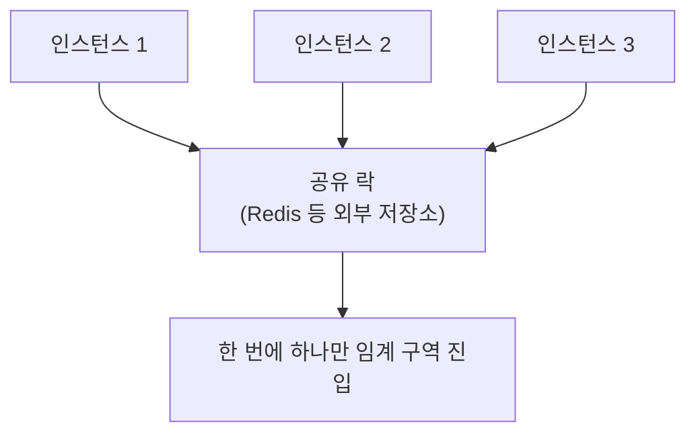

<!-- truncate -->

서버가 한 대일 때는 자바 `synchronized`나 `ReentrantLock`으로 동시성을 막습니다. 그런데 <mark>서버를 여러 대로 늘리는 순간, 언어 차원의 락은 "그 프로세스 안에서만" 통해서 무력해집니다.</mark> 그래서 여러 인스턴스가 공유하는 **분산락**이 등장합니다. 이 글은 분산락이 왜·언제 꼭 필요한지, 그리고 그 락을 얹은 Redis에 장애가 나도 서비스가 멈추지 않게 하려면 무엇을 해야 하는지 정리합니다. (Redisson 구현·워치독은 [Redis 분산락](./redis-distributed-lock) 글 참고)

## 왜 필요한가 — 서버가 여러 대면 언어 락이 안 통한다

인스턴스 3대가 같은 자원(예: 재고, 포인트, "이번 배치를 한 번만 실행")을 동시에 건드린다고 해봅시다. 각 서버의 `ReentrantLock`은 **자기 프로세스 안 스레드끼리만** 막을 뿐, 서버 사이 경쟁은 못 막습니다. 결국 세 서버가 동시에 "재고 1개"를 팔아버리는 식의 문제가 납니다.



<mark>분산락은 "여러 노드가 함께 보는 하나의 락"을 외부 저장소(Redis 등)에 둬서, 전체에서 한 번에 하나만 임계 구역에 들어가게 하는 것</mark>입니다.

## 꼭 필요한 상황 vs 사실은 불필요한 경우

분산락을 반사적으로 쓰기 전에, **DB로 이미 풀리는 문제인지** 먼저 봐야 합니다.

**분산락이 어울리는 상황 (구체 예시)**

- **여러 인스턴스에 걸린 스케줄러·배치의 중복 실행 방지** — 서버 3대에 같은 크론(`@Scheduled`)이 붙어 있으면 "매일 새벽 정산 배치"가 3번 돕니다. 분산락으로 **그 시각에 한 대만** 실행하게 합니다. 예: 정산 배치, 만료 포인트·쿠폰 일괄 회수, 리포트 생성, 대량 푸시 발송. (이 용도의 라이브러리로 ShedLock이 있습니다.)
- **서드파티·외부 자원의 동시 호출 제한** — DB 트랜잭션 밖이라 DB 락으로 못 감싸는 자원. 예: "이 외부 API는 계정당 동시에 한 번만" 호출해 레이트리밋 초과를 막기, 공유 스토리지의 **같은 파일/객체를 한 워커만** 쓰기, 외부 결제·발송 게이트웨이에 같은 작업을 두 번 보내지 않기.
- **캐시 재생성 직렬화(스탬피드 방지)** — 인기 키가 만료된 순간 여러 요청이 동시에 원본을 다시 만들지 않도록 **한 요청만** 재생성하고 나머지는 대기하거나 이전 값을 씁니다. (자세히는 [커머스 캐시 트래픽 대응](./commerce-cache-traffic-strategy))
- **여러 자원·단계를 아우르는 임계 구역** — 한 행(row) 락으로 감싸기 어려운, "사용자별로 이 복합 절차를 한 번에 하나만" 같은 경우. 예: 한 사용자의 (포인트 적립 → 등급 재계산 → 알림)이 동시에 두 번 실행되면 꼬이는 절차를 **사용자 키로 잠가 직렬화**.
- **단일 워커·리더 보장** — 여러 인스턴스 중 하나만 특정 역할을 맡게. 예: 특정 큐를 폴링하는 컨슈머를 한 대만, 외부 트리거를 한 노드만 수신. (엄격한 리더 선출이 필요하면 뒤에서 말할 ZooKeeper·etcd)

**사실은 DB가 더 나은 경우**
- **재고 차감** — 원자적 조건부 업데이트로 끝납니다.

```sql
UPDATE product SET stock = stock - 1 WHERE id = ? AND stock > 0;
-- 영향 행 0이면 품절. 락 없이도 과판매가 안 남
```

- **중복 생성 방지** — 유니크 제약(unique index)이 가장 확실.
- **동시 수정 충돌** — 낙관적 락(`version` 컬럼)이나 비관적 락(`SELECT ... FOR UPDATE`).

<mark>정합성 그 자체는 DB(제약·원자 연산·트랜잭션)가 지키는 게 가장 튼튼합니다. 분산락은 그걸 대체하는 게 아니라, 경합을 줄이는 "최적화·편의"에 가깝습니다.</mark> 이 관점이 다음 장의 장애 대비로 이어집니다.

## Redis에 장애가 나면 무슨 일이 나나

분산락을 Redis로 구현하면 Redis가 **단일 장애점(SPOF)** 이 됩니다. 두 가지 문제가 있습니다.

1. **가용성** — Redis에 장애가 나면 락을 못 잡아 그 기능이 멈춥니다.
2. **안전성(상호배제)** — HA로 살려도, <mark>복제가 비동기라 페일오버 순간 방금 잡은 락이 사라질 수 있습니다.</mark>


즉 Sentinel·Cluster로 가용성은 올려도, **락의 상호배제까지 100% 보장되진 않습니다.** 여러 독립 마스터의 과반 획득을 요구하는 **Redlock**은 이 위험을 줄이려는 시도지만, GC 정지·시계 문제 등으로 완벽하진 않다는 논쟁이 있고 구성도 무겁습니다.

## 그래서 Redis 장애에도 견디게 하려면

핵심은 하나입니다 — <mark>"락이 잠깐 풀려도 데이터는 안전"하도록, 정합성의 최종 방어선을 DB에 둔다.</mark>

- **정합성 최종 보장은 DB에** — 분산락으로 대부분의 경합을 없애되, 실제 올바름은 DB 원자 연산·유니크 제약·낙관적 락이 지키게 합니다. 락이 페일오버로 잠깐 이중 획득돼도 `WHERE stock > 0` 같은 조건이 과판매를 막습니다.
- **펜싱 토큰(fencing token)** — 락 획득 시 단조 증가 토큰을 받아 자원이 검증하면, 멈췄다 되살아난 옛 소유자의 쓰기를 거부할 수 있습니다. (예시는 [Redis 분산락](./redis-distributed-lock)의 워치독 절)
- **HA 구성** — Sentinel/Cluster로 가용성을 확보(안전성까지는 DB·펜싱이 보완).
- **락 실패 시 동작을 정의** — Redis가 불가할 때 **빠른 실패(요청 거절)** 인지, **폴백(DB 락으로 전환)** 인지 미리 정합니다. 무한 대기 대신 `tryLock`에 대기 상한을 둡니다.
- **재시도는 백오프로** — 순간 장애·경합은 짧은 지수 백오프 재시도로 흡수하되, 한도를 둬 폭주를 막습니다.
- **정말 강한 합의가 필요하면** — 리더 선출처럼 엄격한 상호배제가 필수면 ZooKeeper·etcd 같은 합의 기반 코디네이터를 고려합니다(대신 운영·지연 비용).

## 정리

- 서버가 여러 대면 언어 락이 안 통한다 → **분산락**이 여러 노드가 공유하는 락을 제공한다.
- 그러나 **재고·중복 생성·동시 수정은 대개 DB(원자 연산·유니크·낙관/비관 락)로** 풀린다. 분산락은 스케줄러 중복 방지·외부 자원처럼 DB로 어려운 곳에.
- Redis는 SPOF이고, **비동기 복제 탓에 페일오버 시 락이 이중 획득될 수 있다.**
- 그래서 <mark>분산락은 "최적화", 정합성의 최종 보루는 DB에 두고, 펜싱 토큰·락 실패 처리·HA로 장애를 견디게 설계한다.</mark>

락을 쓰든 안 쓰든 "Redis에 장애가 난다"를 전제로 설계하면, 장애가 데이터 손상이 아니라 잠깐의 가용성 저하로 그칩니다.

### 용어 한 줄 정리

| 용어 | 쉬운 뜻 |
|---|---|
| 분산락 | 여러 서버가 공유하는 하나의 락(외부 저장소에 보관) |
| SPOF | 단일 장애점 — 그것만 중단돼도 전체가 멈추는 지점 |
| 페일오버 | 마스터 장애 시 복제본을 새 마스터로 승격 |
| 낙관적 락 | `version` 비교로 동시 수정 충돌을 감지 |
| 비관적 락 | `SELECT ... FOR UPDATE`로 행을 미리 잠금 |
| 펜싱 토큰 | 단조 증가 번호로 옛 소유자의 쓰기를 거부 |
