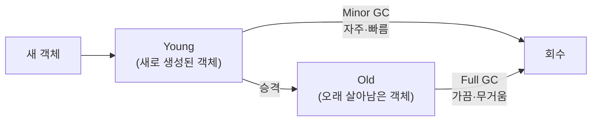
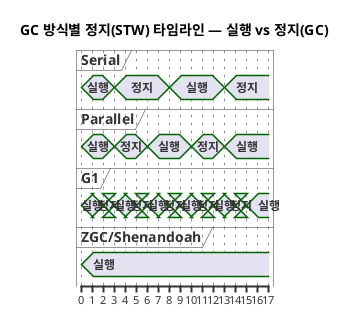
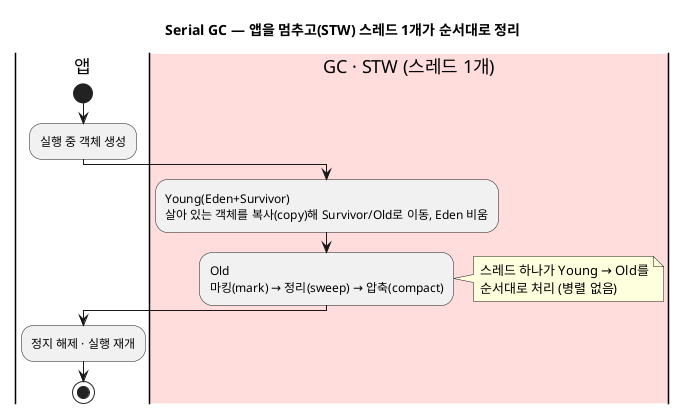
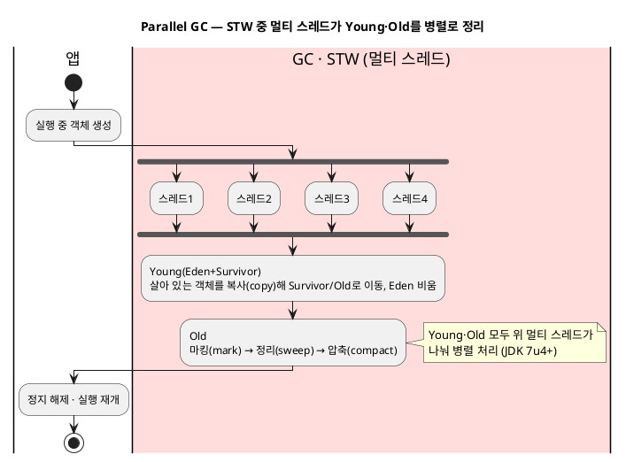
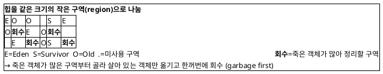
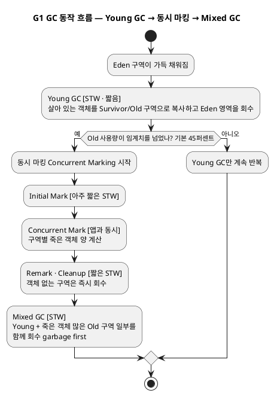
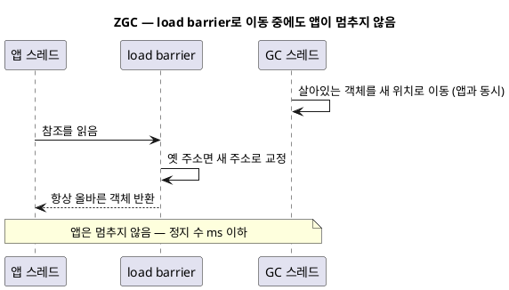
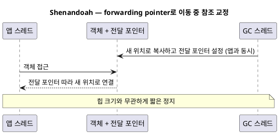
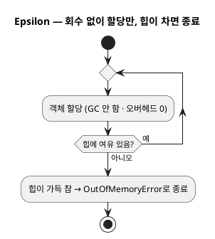
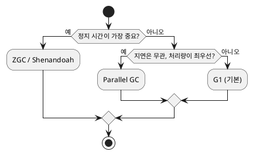

import {AnimatedBars} from '@site/src/components/blog/MonitorCharts';

<!-- truncate -->

가비지 컬렉터(GC)는 앱이 안 쓰는 객체를 대신 정리해 주는 일입니다. **앱을 달리는 자동차**에 비유하면 GC는 그 차를 **세차**하는 셈이라, 세차 방식이 여러 가지고 "차를 얼마나 세우느냐 vs 얼마나 빨리 세차하느냐"가 성능을 좌우합니다. <mark>핵심 기준은 하나입니다 — "세차를 빠르게 끝내기(처리량)" vs "세차하느라 차를 세우는 시간 줄이기(정지 시간)".</mark> 이 글은 이 기준으로 GC 종류를 최대한 쉽게 풀어 봅니다. (실제 튜닝 상황은 [JVM 튜닝 시나리오](./jvm-tuning-scenarios) 참고)

## GC가 하는 일 — 1분 복습

객체는 대부분 **생성 직후 짧게 쓰이고 버려집니다**(임시 객체가 많습니다). GC는 이 성질을 이용해 메모리를 두 구역으로 나눠 관리합니다.

- **Minor GC (Young 영역)** — 새로 생성된 영역을 **자주, 빠르게** 정리합니다. 대부분 여기서 끝납니다.
- **Major/Full GC (Old 영역)** — 오래 남은 영역까지 **가끔 크게** 정리합니다. 무겁고 느립니다.

<mark>"오래된 부분까지 크게 하는 Full GC"가 길어질 때가 문제라, GC 종류마다 이걸 어떻게 다루느냐가 달라집니다.</mark> 세차하려고 **달리던 차(앱)를 잠깐 세우는 것**을 **stop-the-world(STW)** 라고 부릅니다.

## 핵심 기준 하나 — 처리량 vs 정지 시간

GC를 고르는 기준은 사실상 이 둘 사이의 **트레이드오프**입니다.

- **처리량(throughput)** — 같은 시간에 앱이 실제 일한 비율. GC에 시간을 적게 뺏길수록 높음.
- **정지 시간(pause)** — 세차하느라 차(앱)가 멈추는 시간. 짧을수록 사용자가 느끼는 지연이 작음.

<AnimatedBars
  title="처리량 — 높을수록 좋음(개념 예시)"
  labels={['Serial', 'Parallel', 'G1', 'ZGC·Shenandoah']}
  data={[55, 100, 90, 82]}
  yMax={100}
  unit="처리량(상대)"
/>

<AnimatedBars
  title="정지 시간 — 짧을수록 좋음(개념 예시)"
  labels={['Serial', 'Parallel', 'G1', 'ZGC·Shenandoah']}
  data={[95, 80, 35, 3]}
  yMax={100}
  unit="정지 시간(상대)"
  tone="accent2"
/>

<mark>둘을 동시에 만족하는 방식은 없습니다 — 처리량을 높이면 정지가 다소 길어지고, 정지를 줄이면 처리량이 약간 낮아집니다.</mark> 그래서 "내 서비스가 무엇을 더 중요하게 여기나"가 선택의 출발점입니다.

### 정지 시간이 어떻게 다른지 — STW 타임라인

같은 시간 흐름에서 **앱이 실행되는 구간**과 **GC 때문에 멈추는 구간(정지)** 을 함께 그려 보면 방식 차이가 한눈에 보입니다.

PlantUML 코드

<mark>Parallel은 총 정지 시간이 짧아 처리량이 유리하고, ZGC·Shenandoah는 **한 번의 정지**가 가장 짧습니다(막대가 끊기지 않고 이어짐 = 앱과 **동시에** 정리). G1은 그 사이의 균형입니다.</mark> STW 방식(Serial·Parallel·G1)은 "멈추고 → 정리 → 다시 실행"을 반복하지만, 동시(concurrent) 방식(ZGC·Shenandoah)은 앱을 멈추지 않고 GC가 나란히 실행됩니다.

## 종류별로 — 어떻게 세차하나

**Serial GC** — 작업자 **한 명**이 차를 세워 놓고 혼자 세차합니다. 
- 원리: GC 스레드 **하나**가 모든 작업을 합니다. Young은 살아 있는 객체만 다른 영역으로 **복사(copy)** 한 뒤 Eden 영역을 회수하고, Old는 **마킹(mark) → 제거(sweep) → 압축(compact)** 순으로 정리합니다. 작업 내내 앱을 멈춥니다(STW).
- 특징: 단순·가벼움. 힙이 작으면 충분. 힙이 크면 정지가 길어짐.
- 언제: 아주 작은 앱, CLI 도구, 메모리 적은 환경.
- 플래그: `-XX:+UseSerialGC`

PlantUML 코드

**Parallel GC** — 작업자 **여러 명**이 차를 세워 놓고 **한꺼번에 빠르게** 세차합니다. 
- 원리: Serial과 같은 방식(Young 복사, Old 마킹-정리-압축)을 **멀티 스레드가 병렬로** 처리합니다. 같은 양을 나눠 처리하니 **GC에 쓰는 전체 시간이 줄어** 처리량이 높습니다. 다만 **정지 시간 상한을 목표로 잡지는 않아서**, 세대가 차면 그 세대 전체를 한 번의 STW로 수거합니다.
- 참고: 예전(**JDK 7 업데이트 4**, 즉 `7u4`·2012년 이전)엔 **Young만 병렬**이고 Old는 단일 스레드였지만, **`7u4`부터 `-XX:+UseParallelGC`가 `UseParallelOldGC`를 함께 적용해** Young·Old를 모두 병렬로 수거합니다(Young만 병렬로 두려면 `-XX:-UseParallelOldGC`).
- 특징: **총 처리량(GC에 쓰는 전체 시간)이 가장 좋음**. 대신 정지 시간을 목표로 잡지 않아, **큰 힙에선 한 번의 정지(특히 Full GC)가 길어질 수 있음**.
- 언제: **지연은 상관없고 처리량이 중요한 배치**·백그라운드 작업.
- 플래그: `-XX:+UseParallelGC`

> **`JDK 7u4`란?**
>
> `JDK 7u4`는 "JDK 7 Update 4", 즉 **Java 7의 4번째 업데이트 릴리스**(2012년)입니다. 메이저 버전은 **7**이고 `u4`는 그 안의 **마이너 업데이트 번호**입니다. 그래서 "`7u4` 이전"은 **Java 6, 그리고 Java 7 초기(u1~u3)까지**를 가리킵니다 — 같은 Java 7이라도 업데이트 번호에 따라 기본 동작(여기선 Old 세대 병렬 여부)이 달라집니다.

PlantUML 코드

**G1 GC (기본값)** — 차를 **여러 구역으로 나눠** 더러운 곳부터 조금씩 세차합니다. 
- 원리: 힙을 같은 크기의 **작은 구역(region) 수천 개**로 나누고, 백그라운드에서 어느 구역에 죽은 객체가 많은지 마킹합니다(concurrent marking). 그다음 **죽은 객체가 많은 구역부터(garbage first)** 골라 살아 있는 객체만 다른 구역으로 복사해 회수합니다. 한 번에 **일부 구역만** 처리해 정지 시간을 목표치(`MaxGCPauseMillis`) 안에 맞춥니다.
- 특징: **정지 시간과 처리량의 균형**. "정지를 이 정도로 맞춰 줘"라는 목표를 줄 수 있음.
- 언제: **대부분의 일반 서비스**(고민되면 우선 이것).
- 플래그: `-XX:+UseG1GC` (JDK 9부터 기본), 목표 정지 `-XX:MaxGCPauseMillis=100`

G1의 **구역(region)** 개념을 그림으로 보면 이렇습니다. 힙을 작은 구역들로 나누고, 죽은 객체가 많은 구역부터 골라 회수합니다.

PlantUML 코드

**G1의 동작 과정** — 크게 세 단계입니다.

1. **Young GC (STW·짧음)** — Eden 구역이 가득 채워지면 발생합니다. 살아 있는 객체만 Survivor/Old 구역으로 **복사(evacuation)** 하고 Eden 영역을 회수합니다. 대부분의 회수는 여기서 끝납니다.
2. **동시 마킹(Concurrent Marking)** — Old 사용량이 임계치(기본 45%)를 넘으면 시작합니다. **앱과 동시에** 객체 그래프를 따라가며 구역마다 **죽은 객체가 얼마나 있는지** 계산합니다. 시작·마무리에만 아주 짧은 STW(Initial Mark·Remark)가 발생하고, Cleanup에서 객체가 하나도 없는 구역은 곧바로 회수합니다.
3. **Mixed GC (STW)** — 마킹이 끝나면 이후 Young GC가 Young 구역 + **죽은 객체가 많은 Old 구역 일부**를 **함께** 회수합니다(그래서 "mixed"). **죽은 객체가 많은 구역부터(garbage first)** 고르고, 목표 정지 시간(`MaxGCPauseMillis`, 기본 200ms) 안에 끝낼 만큼만 골라 회수합니다. G1은 예측 모델로 "몇 구역을 회수해야 목표를 지킬까"를 계산합니다.

> 공간이 정말 부족하면 전체를 멈추는 **Full GC**가 실행되는데, 이건 피해야 할 상황입니다(대개 힙을 늘리거나 튜닝으로 예방).

PlantUML 코드

**ZGC** — 차를 거의 **세우지 않고** 달리는 중에 세차합니다. 
- 원리: 마킹과 객체 이동(relocation)을 **대부분 앱과 동시에(concurrent)** 진행합니다. 참조 포인터에 표식을 넣어 두고 그 참조를 **읽는 순간 위치를 바로잡는**(load barrier) 방식이라, 객체를 옮기는 도중에도 앱이 계속 돌 수 있습니다. 그래서 힙이 커져도 정지가 거의 안 늘어납니다.
- 특징: 힙이 수십~수백 GB로 커도 **정지가 수 ms 이하**. 최신 저지연 방식.
- 언제: **정지 시간 목표(SLO)가 엄격한** 대용량·저지연 서비스.
- 플래그: `-XX:+UseZGC` (JDK 15 정식화. 세대 구분(generational) ZGC는 JDK 21 도입 → JDK 23부터 기본)

PlantUML 코드

**Shenandoah** — ZGC처럼 차를 **거의 세우지 않는** 저지연 방식(OpenJDK 계열). 
- 원리: 마킹과 압축(compaction)을 **앱과 동시에** 수행합니다. 객체마다 새 위치를 가리키는 **전달 포인터(forwarding pointer)** 를 두고, 앱이 그 객체를 **읽을 때 JVM이 자동으로 끼워 넣는 검사 코드(배리어)** 가 전달 포인터를 따라가 항상 올바른(옮겨진) 객체로 연결합니다. 접근 방식은 다르지만 목표(힙 크기와 무관한 짧은 정지)는 ZGC와 같습니다.
- 특징: 힙 크기와 무관하게 짧은 정지. ZGC의 대안.
- 언제: 저지연이 필요하고 OpenJDK 배포판을 쓸 때.
- 플래그: `-XX:+UseShenandoahGC`

PlantUML 코드

**Epsilon** — **아예 세차하지 않는** 방식(세차 안 함). 
- 원리: 메모리를 **할당만 하고 회수는 전혀 하지 않습니다.** 힙이 다 차면 그대로 종료합니다. GC 오버헤드가 0이라, 순수 실행 성능이나 할당량을 재는 실험에만 씁니다.
- 특징: 메모리가 차면 그냥 종료. 오직 성능 측정·아주 짧게 실행되고 끝나는 작업용.
- 언제: 벤치마크·실험. 일반 서비스엔 쓰지 않음.
- 플래그: `-XX:+UseEpsilonGC`

PlantUML 코드

## 상황별로 무엇을 고를까

| 상황 | 추천 | 왜 |
|---|---|---|
| 일반 웹 서비스(고민되면) | **G1** | 정지·처리량 균형, 기본값 |
| 야간 배치·대량 처리(지연 무관) | Parallel | 총 처리량 최고 |
| 응답 지연 SLO가 엄격함 | ZGC / Shenandoah | 정지 수 ms |
| 대용량 힙(수십 GB+)인데 정지 싫음 | ZGC | 힙 커도 짧은 정지 |
| 아주 작은 앱·CLI | Serial | 단순·가벼움 |
| 성능 측정·초단명 작업 | Epsilon | 세차 오버헤드 0 |

간단한 결정 흐름으로 보면 이렇습니다.

PlantUML 코드

## 버전·기본값 주의

- **JDK 9부터 기본 GC는 G1**입니다(그 이전 기본은 Parallel). 특별한 이유 없이 옛 플래그로 Parallel을 강제하고 있지 않은지 확인하세요.
- **ZGC/Shenandoah**는 비교적 최신이라 JDK 버전과 배포판(OpenJDK 등)을 확인해야 합니다.
- <mark>대부분은 기본 G1로 충분하고, "정지가 목표치를 넘는다"가 지표로 확인될 때만 ZGC/Shenandoah로 옮기면 됩니다.</mark> 지표 보는 법은 [서버 지표 읽기](./server-monitoring-analysis).

## 정리

- GC 선택은 **처리량 vs 정지 시간** 트레이드오프 하나로 요약된다.
- **Serial**(작은 앱)·**Parallel**(처리량 배치)·**G1**(균형·기본)·**ZGC/Shenandoah**(저지연)·**Epsilon**(측정용).
- 고민되면 **G1**, 지연이 중요하면 **ZGC**, 배치면 **Parallel**.
- <mark>먼저 기본값으로 두고, 문제를 지표로 확인한 뒤 바꾸는 순서가 정답입니다.</mark>

GC가 트래픽에 밀려 나빠지는 양상은 [트래픽이 늘면 어디부터 문제가 생기나](./traffic-growth-problems), 누수로 인한 잦은 Full GC는 [힙 덤프 분석](./jvm-heap-dump-analysis)을 함께 보세요.

### 용어 한 줄 정리

| 용어 | 쉬운 뜻 |
|---|---|
| Young / Old | 새로 생성된 객체 구역 / 오래 살아남은 구역 |
| Minor GC | Young 영역을 자주·빠르게 세차 |
| Major/Full GC | Old 영역까지 크게 세차(무겁고 느림) |
| stop-the-world | 세차하느라 차(앱)를 잠깐 멈추는 구간 |
| 처리량 | 같은 시간에 앱이 실제 일한 비율 |
| 정지 시간 | 세차로 차(앱)가 멈추는 시간(짧을수록 좋음) |
