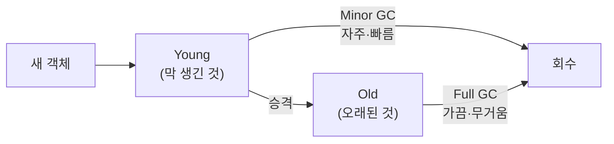
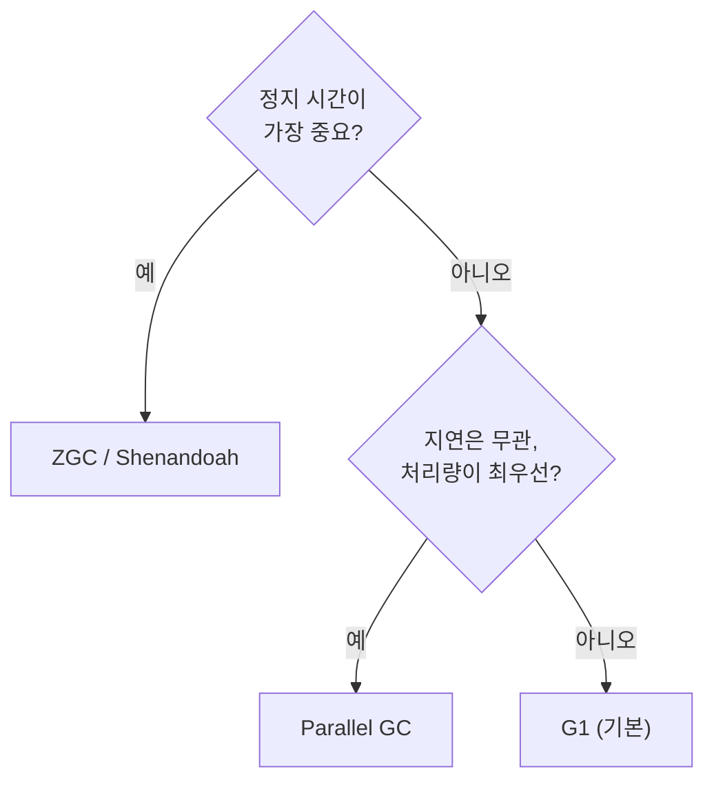

import {AnimatedBars} from '@site/src/components/blog/MonitorCharts';

<!-- truncate -->

가비지 컬렉터(GC)는 앱이 안 쓰는 객체를 대신 정리해 주는 일입니다. **앱을 달리는 자동차**에 비유하면 GC는 그 차를 **세차**하는 셈이라, 세차 방식이 여러 가지고 "차를 얼마나 세우느냐 vs 얼마나 빨리 세차하느냐"가 성능을 좌우합니다. <mark>겁먹을 필요 없이 딱 하나의 축만 기억하면 됩니다 — "세차를 빠르게 끝내기(처리량)" vs "세차하느라 차를 세우는 시간 줄이기(정지 시간)".</mark> 이 글은 이 축을 기준으로 GC 종류를 최대한 쉽게 풀어 봅니다. (실제 튜닝 상황은 [JVM 튜닝 시나리오](./jvm-tuning-scenarios) 참고)

## GC가 하는 일 — 1분 복습

객체는 대부분 **금방 안 쓰게 됩니다**(잠깐 쓰고 버려지는 임시 객체가 많음). GC는 이 성질을 이용해 메모리를 두 구역으로 나눠 관리합니다.

- **Young 세차(Minor GC)** — 막 생긴 부분을 **자주, 빠르게** 세차. 대부분 여기서 끝.
- **Old 세차(Major/Full GC)** — 오래 남은 부분까지 **가끔 크게** 세차. 무겁고 느림.

<mark>"오래된 부분까지 크게 하는 Full GC"가 길어질 때가 문제라, GC 종류마다 이걸 어떻게 다루느냐가 갈립니다.</mark> 세차하려고 **달리던 차(앱)를 잠깐 세우는 것**을 **stop-the-world(STW)** 라고 부릅니다.

## 핵심 축 하나 — 처리량 vs 정지 시간

GC를 고르는 기준은 사실상 이 둘의 저울질입니다.

- **처리량(throughput)** — 같은 시간에 앱이 실제 일한 비율. GC에 시간을 적게 뺏길수록 높음.
- **정지 시간(pause)** — 세차하느라 차(앱)가 멈추는 시간. 짧을수록 사용자가 느끼는 지연이 작음.

<AnimatedBars
  title="처리량 — 높을수록 좋음(개념 예시)"
  labels={['Serial', 'Parallel', 'G1', 'ZGC·Shenandoah']}
  data={[55, 100, 90, 82]}
  yMax={100}
  unit="처리량(상대)"
/>

<AnimatedBars
  title="정지 시간 — 짧을수록 좋음(개념 예시)"
  labels={['Serial', 'Parallel', 'G1', 'ZGC·Shenandoah']}
  data={[95, 80, 35, 3]}
  yMax={100}
  unit="정지 시간(상대)"
  tone="accent2"
/>

<mark>둘 다 최고인 방식은 없습니다 — 처리량을 높이면 정지가 다소 길어지고, 정지를 줄이면 처리량이 약간 낮아집니다.</mark> 그래서 "내 서비스가 무엇을 더 중요하게 여기나"가 선택의 출발점입니다.

## 종류별로 — 어떻게 세차하나

**Serial GC** — 정비공 **한 명**이 차를 세워 놓고 혼자 세차합니다. 
- 특징: 단순·가벼움. 힙이 작으면 충분. 힙이 크면 멈춤이 길어짐.
- 언제: 아주 작은 앱, CLI 도구, 메모리 적은 환경.
- 플래그: `-XX:+UseSerialGC`

**Parallel GC** — 정비공 **여러 명**이 차를 세워 놓고 **한꺼번에 빠르게** 세차합니다. 
- 특징: 멈추긴 하지만 **총 처리량이 가장 좋음**. 대신 한 번 멈추면 길 수 있음.
- 언제: **지연은 상관없고 처리량이 중요한 배치**·백그라운드 작업.
- 플래그: `-XX:+UseParallelGC`

**G1 GC (기본값)** — 차를 **여러 구역으로 나눠** 더러운 곳부터 조금씩 세차합니다. 
- 특징: **정지 시간과 처리량의 균형**. "정지를 이 정도로 맞춰 줘"라는 목표를 줄 수 있음.
- 언제: **대부분의 일반 서비스**(고민되면 이걸로).
- 플래그: `-XX:+UseG1GC` (JDK 9부터 기본), 목표 정지 `-XX:MaxGCPauseMillis=100`

**ZGC** — 차를 거의 **세우지 않고** 달리는 중에 세차합니다. 
- 특징: 힙이 수십~수백 GB로 커도 **정지가 수 ms 이하**. 최신 저지연 방식.
- 언제: **정지 시간 목표(SLO)가 엄격한** 대용량·저지연 서비스.
- 플래그: `-XX:+UseZGC` (JDK 21부터 세대 구분 방식이 기본)

**Shenandoah** — ZGC처럼 차를 **거의 세우지 않는** 저지연 방식(OpenJDK 계열). 
- 특징: 힙 크기와 무관하게 짧은 정지. ZGC의 대안.
- 언제: 저지연이 필요하고 OpenJDK 배포판을 쓸 때.
- 플래그: `-XX:+UseShenandoahGC`

**Epsilon** — **아예 세차하지 않는** 방식(세차 없음). 
- 특징: 메모리가 차면 그냥 종료. 오직 성능 측정·아주 짧게 실행되고 끝나는 작업용.
- 언제: 벤치마크·실험. 일반 서비스엔 쓰지 않음.
- 플래그: `-XX:+UseEpsilonGC`

## 상황별로 무엇을 고를까

| 상황 | 추천 | 왜 |
|---|---|---|
| 일반 웹 서비스(고민되면) | **G1** | 정지·처리량 균형, 기본값 |
| 야간 배치·대량 처리(지연 무관) | Parallel | 총 처리량 최고 |
| 응답 지연 SLO가 엄격함 | ZGC / Shenandoah | 정지 수 ms |
| 대용량 힙(수십 GB+)인데 정지 싫음 | ZGC | 힙 커도 짧은 정지 |
| 아주 작은 앱·CLI | Serial | 단순·가벼움 |
| 성능 측정·초단명 작업 | Epsilon | 세차 오버헤드 0 |

간단한 결정 흐름으로 보면 이렇습니다.

## 버전·기본값 주의

- **JDK 9부터 기본 GC는 G1**입니다(그 이전 기본은 Parallel). 특별한 이유 없이 옛 플래그로 Parallel을 강제하고 있지 않은지 확인하세요.
- **ZGC/Shenandoah**는 비교적 최신이라 JDK 버전과 배포판(OpenJDK 등)을 확인해야 합니다.
- <mark>대부분은 기본 G1로 충분하고, "정지가 목표를 깬다"가 지표로 확인될 때만 ZGC/Shenandoah로 옮기면 됩니다.</mark> 지표 보는 법은 [서버 지표 읽기](./server-monitoring-analysis).

## 정리

- GC 선택은 **처리량 vs 정지 시간** 저울질 하나로 요약된다.
- **Serial**(작은 앱)·**Parallel**(처리량 배치)·**G1**(균형·기본)·**ZGC/Shenandoah**(저지연)·**Epsilon**(측정용).
- 고민되면 **G1**, 지연이 중요하면 **ZGC**, 배치면 **Parallel**.
- <mark>먼저 기본값으로 두고, 문제를 지표로 확인한 뒤 바꾸는 순서가 정답입니다.</mark>

GC가 트래픽에 밀려 나빠지는 양상은 [트래픽이 늘면 어디부터 문제가 생기나](./traffic-growth-problems), 누수로 인한 잦은 Full GC는 [힙 덤프 분석](./jvm-heap-dump-analysis)을 함께 보세요.

### 용어 한 줄 정리

| 용어 | 쉬운 뜻 |
|---|---|
| Young / Old | 막 생긴 객체 구역 / 오래 살아남은 구역 |
| Minor GC | Young을 자주·빠르게 세차 |
| Major/Full GC | Old까지 크게 세차(무겁고 느림) |
| stop-the-world | 세차하느라 차(앱)를 잠깐 멈추는 구간 |
| 처리량 | 같은 시간에 앱이 실제 일한 비율 |
| 정지 시간 | 세차로 차(앱)가 멈추는 시간(짧을수록 좋음) |
