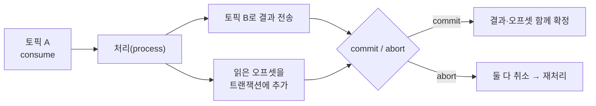

<!-- truncate -->

Kafka에서 "메시지를 정확히 한 번" 처리하기는 쉽지 않습니다. 재시도하면 중복(at-least-once), 안 하면 유실(at-most-once) 위험이 있죠([전달 보장 정리](./kafka-delivery-semantics) 참고). Kafka는 이 사이를 메우려고 **exactly-once(EOS)** 를 제공하는데, 그 핵심은 세 가지 조합입니다 — **멱등 프로듀서 · 트랜잭션 · `read_committed` 컨슈머**. <mark>특히 "읽고 → 처리하고 → 결과를 쓰고 → 어디까지 읽었는지 기록"을 **하나의 원자적 트랜잭션**으로 묶는 read-process-write 패턴이 EOS의 중심입니다.</mark> 이 글은 Kafka 네이티브 트랜잭션으로 그걸 어떻게 달성하는지 정리합니다.

## 두 개의 축 — 멱등 프로듀서 + 트랜잭션

EOS는 두 기능이 함께 받쳐줍니다.

**① 멱등 프로듀서(idempotent producer)** — 프로듀서가 재시도하다 **같은 메시지를 중복 전송**하는 걸 막습니다. 브로커가 프로듀서마다 ID(PID)와 파티션별 시퀀스 번호를 보고, 이미 받은 번호면 버립니다. `enable.idempotence=true`(트랜잭션을 켜면 자동), `acks=all`이 전제입니다. <mark>다만 이건 "한 프로듀서의 전송 재시도 중복"만 막습니다 — 여러 파티션·오프셋을 아우르는 원자성은 트랜잭션의 몫입니다.</mark>

**② 트랜잭션(transactions)** — **여러 파티션에 대한 쓰기 + 컨슈머 오프셋 커밋**을 전부 성공 아니면 전부 취소로 묶습니다. 이걸 켜는 스위치가 `transactional.id`입니다(뒤의 좀비 펜싱에서 다시 봅니다).

## read-process-write — EOS의 핵심 패턴

가장 흔한 EOS 시나리오는 "토픽 A를 읽어 가공해 토픽 B로 보내는" 처리입니다. 여기서 문제는 **두 가지 상태가 따로 논다**는 것입니다 — (1) 결과를 B에 썼는가, (2) A를 어디까지 읽었다고 커밋했는가. 이 둘이 어긋나면 중복 또는 유실이 납니다.

<mark>해법은 "결과 쓰기"와 "읽은 위치(오프셋) 커밋"을 **같은 트랜잭션 안에** 넣는 것입니다.</mark> 오프셋 커밋을 컨슈머가 따로 하지 않고, 프로듀서의 `sendOffsetsToTransaction`으로 트랜잭션에 포함시킵니다.



commit되면 결과와 오프셋이 함께 확정되고, 중간에 실패해 abort되면 **둘 다 없던 일**이 되어 그 배치를 다시 처리합니다. 그래서 "한 번 처리한 효과"가 정확히 한 번만 남습니다.

## 코드 — Raw Producer API

트랜잭션 프로듀서의 흐름은 정형화돼 있습니다.

```java
// 설정: transactional.id 를 주면 트랜잭션 활성화(+ 멱등성 자동)
props.put(ProducerConfig.TRANSACTIONAL_ID_CONFIG, "order-processor-1");
props.put(ProducerConfig.ENABLE_IDEMPOTENCE_CONFIG, true);
props.put(ProducerConfig.ACKS_CONFIG, "all");

producer.initTransactions();   // 앱 시작 시 1회
while (true) {
    var records = consumer.poll(Duration.ofMillis(200));
    producer.beginTransaction();
    try {
        for (var rec : records) {
            producer.send(new ProducerRecord<>("B", transform(rec.value())));
        }
        // 읽은 위치(오프셋)를 '이 트랜잭션'에 포함 — 컨슈머가 따로 커밋하지 않는다
        producer.sendOffsetsToTransaction(offsetsOf(records), consumer.groupMetadata());
        producer.commitTransaction();   // 결과 + 오프셋 원자적 확정
    } catch (Exception e) {
        producer.abortTransaction();    // 실패 시 전부 취소 → 다음 poll에서 재처리
    }
}
```

포인트는 `sendOffsetsToTransaction` — <mark>오프셋 커밋을 트랜잭션에 넣어야 "처리 결과"와 "읽은 위치"가 하나로 묶입니다.</mark> 그래서 컨슈머는 자동 커밋을 꺼야 합니다(`enable.auto.commit=false`).

## 코드 — Spring Kafka

Spring에선 설정 몇 줄과 애노테이션으로 상당 부분이 자동화됩니다.

```yaml
spring:
  kafka:
    producer:
      transaction-id-prefix: tx-          # 이걸 주면 트랜잭션 + KafkaTransactionManager 자동 구성
      acks: all
    consumer:
      isolation-level: read_committed      # 커밋된 메시지만 읽기(아래 설명)
      enable-auto-commit: false
```

리스너 컨테이너에 `KafkaTransactionManager`가 물리면, 리스너 안에서 보낸 메시지와 그 레코드의 오프셋이 **한 트랜잭션으로** 묶여 자동 커밋됩니다.

```java
@KafkaListener(topics = "A")
public void onMessage(ConsumerRecord<String, String> rec) {
    // 이 안의 send 와 이 레코드의 오프셋이 하나의 트랜잭션으로 처리된다
    kafkaTemplate.send("B", transform(rec.value()));
    // 예외가 나면 트랜잭션 abort → 오프셋 미커밋 → 재처리
}
```

## 컨슈머가 `read_committed`가 아니면 소용없다

트랜잭션으로 아무리 잘 써도, **다운스트림 컨슈머가 그걸 존중하지 않으면** 의미가 없습니다. 컨슈머의 `isolation.level`이 기본값 `read_uncommitted`이면 **아직 커밋 안 됐거나 abort된 메시지까지** 읽어버립니다.

<mark>EOS 파이프라인의 모든 컨슈머는 `isolation.level=read_committed`여야 합니다.</mark> 이러면 커밋된 메시지만 보이고, abort된 것은 건너뜁니다. 브로커는 트랜잭션 경계에 **커밋/취소 마커**를 남기고, 컨슈머는 아직 확정 안 된 지점(LSO, last stable offset) 이후는 읽지 않습니다.

## 좀비 펜싱 — `transactional.id`의 진짜 역할

분산 환경에선 "종료된 줄 알았던 옛 프로듀서(좀비)"가 되살아나 중복을 쓸 수 있습니다. `transactional.id`는 트랜잭션을 켜는 것 외에 **이 문제를 막는 핵심**입니다.

<mark>같은 `transactional.id`로 새 프로듀서가 트랜잭션을 시작하면 브로커가 epoch를 올리고, 이전 epoch(좀비)의 쓰기·커밋을 거절합니다.</mark> 그래서 `transactional.id`는 **논리적 프로듀서마다 고정·유일**해야 합니다(재시작해도 같은 값). read-process-write에서는 보통 입력 파티션 기준으로 안정적으로 배정합니다.

## 경계 — EOS는 "Kafka 안에서"만이다

가장 자주 오해하는 지점입니다. Kafka 트랜잭션의 exactly-once는 **Kafka 토픽 읽기·쓰기와 오프셋 커밋** 사이에서 성립합니다. <mark>처리 중간에 **외부 DB에 쓰거나 외부 API를 호출**하면, 그건 Kafka 트랜잭션이 되돌려 주지 않습니다.</mark> "Kafka로 보내면서 DB에도 확실히 한 번"이 필요하면 트랜잭션만으로는 안 되고, [Outbox 패턴](./kafka-outbox-exactly-once) 같은 방식으로 DB 트랜잭션과 발행을 엮어야 합니다.

## Kafka Streams는 자동으로 해준다

직접 프로듀서/컨슈머를 다루지 않고 Kafka Streams를 쓴다면, 설정 하나면 됩니다.

```properties
processing.guarantee=exactly_once_v2
```

Streams가 트랜잭션·오프셋·`read_committed`를 알아서 처리합니다. `exactly_once_v2`(KIP-447)는 인스턴스당 프로듀서 하나로 여러 파티션을 처리할 수 있어, 예전 방식보다 확장성이 좋습니다(브로커 2.5+).

## 정리

- Kafka EOS = **멱등 프로듀서(전송 중복 방지) + 트랜잭션(원자적 쓰기·오프셋) + `read_committed`(커밋된 것만 읽기)**.
- 핵심 패턴은 **read-process-write**: 결과 쓰기와 오프셋 커밋을 `sendOffsetsToTransaction`으로 한 트랜잭션에.
- `transactional.id`는 트랜잭션 활성화 + **좀비 펜싱**(epoch로 옛 프로듀서 차단). 논리 프로듀서마다 고정·유일하게.
- **경계**: Kafka 내부에서만 EOS. 외부 DB까지 필요하면 [Outbox](./kafka-outbox-exactly-once).
- Kafka Streams면 `processing.guarantee=exactly_once_v2` 한 줄.

<mark>정확히 한 번의 진짜 의미는 "메시지가 딱 한 번 전달된다"가 아니라 "처리 결과가 정확히 한 번 반영된다"입니다.</mark> Kafka 트랜잭션은 그 결과 반영과 읽은 위치를 하나로 묶어 그 보장을 만들어 냅니다.

### 용어 한 줄 정리

| 용어 | 쉬운 뜻 |
|---|---|
| 멱등 프로듀서 | 재시도로 인한 전송 중복을 브로커가 걸러 줌 |
| transactional.id | 트랜잭션 활성화 + 좀비(옛 프로듀서) 차단 키 |
| sendOffsetsToTransaction | 읽은 오프셋 커밋을 트랜잭션에 포함 |
| read_committed | 커밋된 메시지만 읽는 컨슈머 설정 |
| 트랜잭션 마커 | 파티션에 남는 커밋/취소 경계 표시 |
| 좀비 펜싱 | epoch로 되살아난 옛 프로듀서의 쓰기를 거절 |
