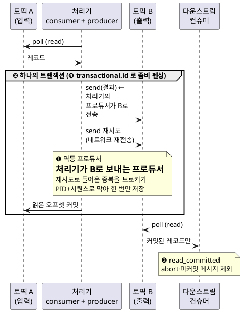
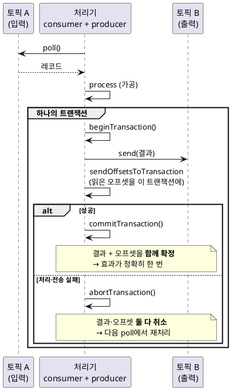
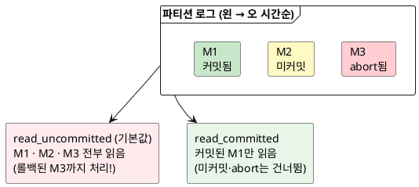
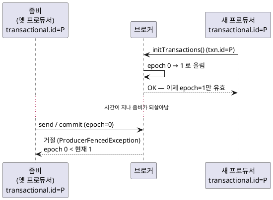
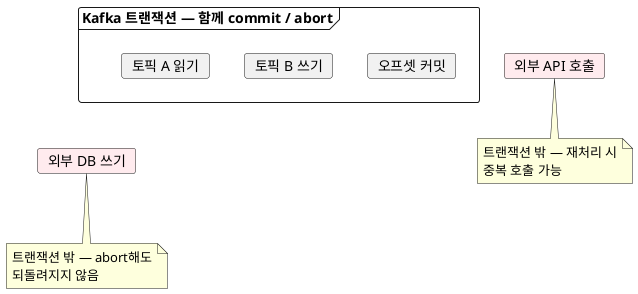
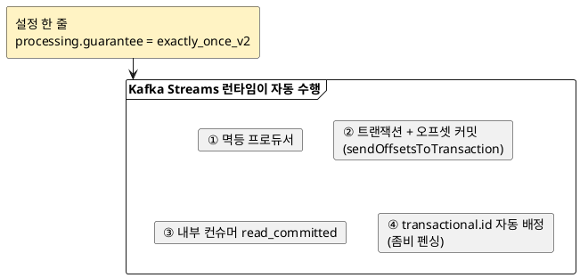

<!-- truncate -->

Kafka에서 "메시지를 정확히 한 번" 처리하기는 쉽지 않습니다. 재시도하면 중복(at-least-once), 안 하면 유실(at-most-once) 위험이 있죠([전달 보장 정리](./kafka-delivery-semantics) 참고). Kafka는 이 사이를 메우려고 **exactly-once(EOS)** 를 제공합니다. 이 글은 세 가지를 차례로 정리합니다 — <mark>**EOS가 정확히 무슨 뜻인지**, **Kafka의 어느 지점에서 그것을 충족하는지**, 그러려면 **무슨 설정·조건이 필요한지**.</mark>

## EOS란 — "한 번 전달"이 아니라 "결과가 한 번 반영"

먼저 뜻부터 분명히 합니다. 전달 보장은 세 가지입니다.

- **at-most-once** — 재시도하지 않아 유실 가능(중복은 없음).
- **at-least-once** — 실패하면 재시도해 유실은 없지만 **중복 가능**.
- **exactly-once(EOS)** — 유실도 중복도 없이 **정확히 한 번**.

여기서 가장 흔히 오해하는 지점이 있습니다. <mark>EOS는 "메시지가 네트워크로 딱 한 번 전송된다"는 뜻이 아닙니다.</mark> 재시도 때문에 물리적 전송은 여러 번 발생할 수 있습니다. EOS가 보장하는 건 **그 처리 결과가 정확히 한 번만 반영**된다는 것입니다 — 중복 전송은 브로커가 막아 내고, 중간에 실패한 처리는 전부 취소됩니다.

Kafka는 이 보장을 **세 가지 메커니즘의 조합**으로 만듭니다: **멱등 프로듀서 · 트랜잭션 · `read_committed` 컨슈머**. 각각이 **중복이나 유실이 생기는** 서로 다른 지점을 막습니다.

## EOS는 어디서 충족되나 — 중복·유실이 생기는 네 지점을 막는다

중복이나 유실이 생길 수 있는 지점은 네 곳이고, 각 지점을 담당 메커니즘이 하나씩 막습니다.

| 문제 지점 | 무슨 일이 나나 | 막는 메커니즘 | 핵심 설정 |
|---|---|---|---|
| ① 프로듀서 재시도 | 같은 메시지를 **중복 전송** | 멱등 프로듀서 | `enable.idempotence=true`, `acks=all` |
| ② 결과 쓰기 vs 오프셋 커밋 | 한쪽만 성공 → **중복/유실** | 트랜잭션(read-process-write) | `transactional.id`, `sendOffsetsToTransaction` |
| ③ 다운스트림 읽기 | abort·미커밋 메시지를 **읽어 버림** | `read_committed` 컨슈머 | `isolation.level=read_committed` |
| ④ 좀비 프로듀서 | 되살아난 옛 인스턴스가 **중복 기록** | 좀비 펜싱(epoch) | `transactional.id` 고정·유일 |

<mark>중요한 전제: 이 네 지점은 전부 "Kafka 토픽 안"에서의 이야기입니다.</mark> 처리 중 외부 DB·API까지 "정확히 한 번"으로 묶이지는 않습니다(아래 경계 섹션). 이어지는 섹션에서 ①~④를 차례로 봅니다.

①~④가 read-process-write 흐름의 어느 단계에 해당하는지 시간 순서로 보면 이렇습니다. 여기서 **멱등 프로듀서**는 토픽 A를 만든 상류가 아니라, **처리기가 토픽 B로 보내는 프로듀서**를 가리킵니다.

<details>
<summary>PlantUML 코드</summary>


```plantuml
@startuml
skinparam shadowing false
skinparam DefaultFontName sans-serif
skinparam maxMessageSize 95
participant "토픽 A\n(입력)" as A
participant "처리기\nconsumer + producer" as P
participant "토픽 B\n(출력)" as B
participant "다운스트림\n컨슈머" as D

P -> A : poll (read)
A --> P : 레코드
group ❷ 하나의 트랜잭션 (❹ transactional.id 로 좀비 펜싱)
  P -> B : send(결과) ← 처리기의 프로듀서가 B로 전송
  P --> B : send 재시도 (네트워크 재전송)
  note over P, B : ❶ 멱등 프로듀서\n= 처리기가 B로 보내는 프로듀서\n재시도로 들어온 중복을 브로커가\nPID+시퀀스로 막아 한 번만 저장
  P -> A : 읽은 오프셋 커밋
end
D -> B : poll (read)
B --> D : 커밋된 레코드만
note over D : ❸ read_committed\nabort·미커밋 메시지 제외
@enduml
```

</details>


## ① 멱등 프로듀서 — 전송 중복을 막는다

**멱등 프로듀서(idempotent producer)** 는 프로듀서가 재시도하다 **같은 메시지를 중복 전송**하는 걸 막습니다. 브로커가 프로듀서마다 ID(PID)와 파티션별 시퀀스 번호를 보고, 이미 받은 번호면 버립니다. `enable.idempotence=true`(트랜잭션을 활성화하면 자동), `acks=all`이 전제입니다.

> **`PID`와 `acks=all`은 무엇인가**
>
> **PID**(Producer ID)는 브로커가 프로듀서 세션에 발급하는 고유 번호로, "누가 보낸 메시지인지"를 식별합니다(그래서 재시작으로 PID가 달라지면 재처리 중복을 못 막습니다).
>
> `acks=all`은 **리더뿐 아니라 복제본(replica)까지 저장을 확인한 뒤** 성공으로 처리하는 설정입니다. 멱등성은 브로커가 "이 프로듀서한테 몇 번까지 받았다"(시퀀스 번호)를 **기억**해 중복을 막습니다 — 그런데 `acks=1`(리더만)이면, 리더가 그 기록을 복제본에 넘기기 전에 장애가 생기면 새 리더엔 기록이 없어 **재전송을 새 메시지로 받아 중복**이 됩니다. `acks=all`이면 복제본에도 그 기록이 남아, 리더가 중단돼도 다음 리더가 "어디까지 받았는지"를 알아 중복을 계속 막습니다(`enable.idempotence=true`면 Kafka가 사실상 강제).

<mark>다만 멱등성은 **프로듀서가 재시도로 같은 메시지를 다시 보낼 때 생기는 중복**만 막습니다.</mark> **여러 파티션에 걸친 전송과 오프셋 커밋을 전부 성공 아니면 전부 취소로 묶는 것**은 범위 밖이라, 그건 **트랜잭션**(②)이 맡습니다. 예를 들어 결과를 B로 보낸 뒤 오프셋 커밋 직전에 앱이 중단되면, 멱등성으로도 **결과는 보냈지만 오프셋은 미커밋**인 상태는 못 막습니다. 오프셋은 **컨슈머가 토픽 A를 어디까지 읽었는지 기록하는 북마크**인데, 그게 갱신되지 않았으니 Kafka는 그 레코드를 아직 읽지 않은 것으로 봅니다 — **재시작하면 마지막 커밋 지점부터 다시 읽어** 같은 입력을 또 처리하고, 결과도 B에 중복으로 들어갑니다.

> **"그 중복은 멱등성이 막지 않나?" — 아니요**
>
> 멱등성의 중복 제거는 **PID · 파티션 · 시퀀스 번호**를 키로, **같은 프로듀서 세션이 같은 `send`를 재전송**한 경우만 제거합니다. 재시작 후의 재처리는 "같은 send의 재전송"이 아니라 입력을 다시 읽어 **새로 만든** `send`입니다 — 재시작으로 PID가 새로 발급되고 시퀀스도 0부터 시작하니, 브로커 눈에는 **정상적인 새 메시지**로 보여 막히지 않습니다. 즉 멱등성은 "네트워크 재전송 중복"은 막아도 "오프셋 미커밋으로 인한 재처리 중복"은 막지 못합니다.

그래서 전송과 오프셋 커밋을 **한 트랜잭션**으로 묶어, 함께 확정하거나 함께 취소해야 합니다.

## ② 트랜잭션과 read-process-write — EOS의 핵심 패턴

**트랜잭션(transactions)** 은 **여러 파티션에 대한 쓰기 + 컨슈머 오프셋 커밋**을 전부 성공 아니면 전부 취소로 묶습니다. 이걸 켜는 스위치가 `transactional.id`입니다(뒤의 좀비 펜싱에서 다시 봅니다).

가장 흔한 EOS 시나리오는 "토픽 A를 읽어 가공해 토픽 B로 보내는" read-process-write 처리입니다. 여기서 문제는 **두 가지 상태가 따로 관리된다**는 것입니다 — (1) 결과를 B에 썼는가, (2) A를 어디까지 읽었다고 커밋했는가. 이 둘이 맞지 않으면 중복 또는 유실이 납니다.

<mark>해법은 "결과 쓰기"와 "읽은 위치(오프셋) 커밋"을 **같은 트랜잭션 안에** 넣는 것입니다.</mark> 오프셋 커밋을 컨슈머가 따로 하지 않고, 프로듀서의 `sendOffsetsToTransaction`으로 트랜잭션에 포함시킵니다.

<details>
<summary>PlantUML 코드</summary>


```plantuml
@startuml
skinparam shadowing false
skinparam DefaultFontName sans-serif
skinparam sequenceMessageAlign center
participant "토픽 A\n(입력)" as A
participant "처리기\nconsumer + producer" as App
participant "토픽 B\n(출력)" as B

App -> A : poll()
A --> App : 레코드
App -> App : process (가공)

group 하나의 트랜잭션
  App -> App : beginTransaction()
  App -> B : send(결과)
  App -> App : sendOffsetsToTransaction\n(읽은 오프셋을 이 트랜잭션에)
  alt 성공
    App -> App : commitTransaction()
    note over App, B : 결과 + 오프셋을 **함께 확정**\n→ 효과가 정확히 한 번
  else 처리·전송 실패
    App -> App : abortTransaction()
    note over App, B : 결과·오프셋 **둘 다 취소**\n→ 다음 poll에서 재처리
  end
end
@enduml
```

</details>


commit되면 결과와 오프셋이 함께 확정되고, 중간에 실패해 abort되면 **둘 다 없던 일**이 되어 그 레코드 묶음(한 번의 `poll()`로 가져온 레코드들)을 다음 번에 다시 처리합니다. 그래서 "한 번 처리한 효과"가 정확히 한 번만 남습니다.

### 코드 ① 순수 Kafka 클라이언트 — 트랜잭션을 직접 제어

**Spring 없이 순수 Kafka 클라이언트**로 작성할 때의 코드입니다. 보통 **독립 실행되는 Java 어플리케이션**(`main` 하나)이 이 루프를 실행합니다. 흐름은 네 단계입니다.

1. **설정값을 `Properties`(= `props`)에 넣습니다** — 서버 주소·`transactional.id`·직렬화기 등.
2. **그 `props`를 `new KafkaProducer<>(props)`에 넘겨 프로듀서를 생성합니다** — 바로 이 지점에서 설정이 적용됩니다(컨슈머도 자기 `Properties`로 똑같이 생성).
3. **`initTransactions()`를 앱 기동 때 한 번** 호출합니다.
4. **`while` 루프**에서 `poll → send → 오프셋 포함 → commit`을 반복합니다.

```java
// ── ① 프로듀서 설정(props)을 만든다 ──────────────────────────────
//    이 Properties 객체를 아래 ②의 new KafkaProducer(props)에 넘긴다
Properties props = new Properties();
props.put(ProducerConfig.BOOTSTRAP_SERVERS_CONFIG, "localhost:9092");
props.put(ProducerConfig.TRANSACTIONAL_ID_CONFIG, "order-processor-1"); // ★ 이 값이 트랜잭션을 켠다(+ 멱등성 자동)
props.put(ProducerConfig.ACKS_CONFIG, "all");
props.put(ProducerConfig.KEY_SERIALIZER_CLASS_CONFIG, StringSerializer.class);
props.put(ProducerConfig.VALUE_SERIALIZER_CLASS_CONFIG, StringSerializer.class);

// ── ② 그 props로 프로듀서를 생성 — 여기서 설정이 '적용'된다 ──────
Producer<String, String> producer = new KafkaProducer<>(props);

//    컨슈머도 자기 설정(cProps)으로 똑같이 생성 (read_committed · auto.commit=false)
Properties cProps = new Properties();
cProps.put(ConsumerConfig.ISOLATION_LEVEL_CONFIG, "read_committed");
cProps.put(ConsumerConfig.ENABLE_AUTO_COMMIT_CONFIG, false);
// ... bootstrap.servers · group.id · 역직렬화기 설정 생략
Consumer<String, String> consumer = new KafkaConsumer<>(cProps);
consumer.subscribe(List.of("A"));                 // 입력 토픽 A 구독

// ── ③ 앱 기동 시 한 번 ──────────────────────────────────────────
producer.initTransactions();

// ── ④ 메인 처리 루프 (앱이 실행되는 동안 계속) ──────────────────
while (true) {
    var records = consumer.poll(Duration.ofMillis(200));
    producer.beginTransaction();
    try {
        for (var rec : records) {
            producer.send(new ProducerRecord<>("B", transform(rec.value())));
        }
        // 읽은 위치(오프셋)를 '이 트랜잭션'에 포함 — 컨슈머가 따로 커밋하지 않는다
        producer.sendOffsetsToTransaction(offsetsOf(records), consumer.groupMetadata());
        producer.commitTransaction();   // 결과 + 오프셋 원자적 확정
    } catch (Exception e) {
        producer.abortTransaction();    // 실패 시 전부 취소 → 다음 poll에서 재처리
    }
}
```

포인트는 `sendOffsetsToTransaction` — <mark>오프셋 커밋을 트랜잭션에 넣어야 "처리 결과"와 "읽은 위치"가 하나로 묶입니다.</mark> 그래서 컨슈머는 자동 커밋을 꺼야 합니다(`enable.auto.commit=false`).

### 코드 ② Spring Kafka — 설정으로 자동 처리

Spring에선 설정 몇 줄과 애노테이션으로 상당 부분이 자동화됩니다.

```yaml
spring:
  kafka:
    producer:
      transaction-id-prefix: tx-          # 이걸 설정하면 트랜잭션 + KafkaTransactionManager 자동 구성
      acks: all
    consumer:
      isolation-level: read_committed      # 커밋된 메시지만 읽기(아래 설명)
      enable-auto-commit: false
```

위 `transaction-id-prefix`를 설정하면 스프링이 `KafkaTransactionManager`를 자동 구성해 **리스너 컨테이너에 연결**합니다. 그러면 `@KafkaListener` 메서드 실행 전체가 **하나의 트랜잭션으로 묶여**, 그 안에서 보낸 메시지와 지금 처리 중인 레코드의 **오프셋 커밋**이 한 트랜잭션으로 함께 처리됩니다 — 정상 반환하면 commit, 예외가 나면 abort(오프셋 미반영 → 재처리).

```java
@KafkaListener(topics = "A")
public void onMessage(ConsumerRecord<String, String> rec) {
    // 이 안의 send 와 이 레코드의 오프셋이 하나의 트랜잭션으로 처리된다
    kafkaTemplate.send("B", transform(rec.value()));
    // 예외가 나면 트랜잭션 abort → 오프셋 미커밋 → 재처리
}
```

## ③ `read_committed` 컨슈머 — 커밋된 메시지만 읽는다

프로듀서가 트랜잭션으로 아무리 정확히 기록해도, **읽는 쪽이 커밋 여부를 가리지 않으면** 의미가 없습니다. 컨슈머의 `isolation.level` 설정에 따라 **읽는 범위**가 달라지기 때문입니다.

예를 들어 한 파티션에 메시지가 이렇게 쌓였다고 합시다 — `M1`(커밋됨), `M2`(아직 커밋 안 된 트랜잭션), `M3`(그 트랜잭션이 결국 abort됨).

- **`read_uncommitted`(기본값)** — `M1`·`M2`·`M3`을 **전부 읽습니다.** 아직 확정도 안 됐고 심지어 롤백된 `M3`까지 처리해 버려, "없던 일"이 돼야 할 메시지가 다운스트림으로 전달됩니다.
- **`read_committed`** — **커밋된 `M1`만** 읽고, 미커밋·abort된 것은 건너뜁니다.

<details>
<summary>PlantUML 코드</summary>


```plantuml
@startuml
skinparam shadowing false
skinparam DefaultFontName sans-serif
frame "파티션 로그 (왼 → 오 시간순)" as LOG {
  card "M1\n커밋됨" as M1 #C8E6C9
  card "M2\n미커밋" as M2 #FFF9C4
  card "M3\nabort됨" as M3 #FFCDD2
  M1 -[hidden]right- M2
  M2 -[hidden]right- M3
}
rectangle "read_uncommitted (기본값)\nM1 · M2 · M3 전부 읽음\n(롤백된 M3까지 처리!)" as RU #FFEBEE
rectangle "read_committed\n커밋된 M1만 읽음\n(미커밋·abort는 건너뜀)" as RC #E8F5E9
LOG --> RU
LOG --> RC
@enduml
```

</details>


<mark>그래서 EOS 파이프라인의 모든 컨슈머는 `isolation.level=read_committed`여야 합니다.</mark> 이게 가능한 건, 브로커가 트랜잭션 경계에 **커밋/취소 마커**를 남기고 컨슈머는 아직 확정 안 된 지점(LSO, last stable offset) 이후를 읽지 않기 때문입니다.

## ④ 좀비 펜싱 — `transactional.id`의 또 다른 역할

분산 환경에선 "종료된 줄 알았던 옛 프로듀서(좀비)"가 되살아나 중복을 쓸 수 있습니다. `transactional.id`는 트랜잭션을 활성화하는 것 외에 **이 문제를 막는 핵심**입니다.

<mark>같은 `transactional.id`로 새 프로듀서가 트랜잭션을 시작하면 브로커가 epoch를 올리고, 이전 epoch(좀비)의 쓰기·커밋을 거절합니다.</mark> 그래서 `transactional.id`는 **논리적 프로듀서마다 고정·유일**해야 합니다(재시작해도 같은 값). read-process-write에서는 보통 입력 파티션 기준으로 안정적으로 배정합니다.

<details>
<summary>PlantUML 코드</summary>


```plantuml
@startuml
skinparam shadowing false
skinparam DefaultFontName sans-serif
participant "좀비\n(옛 프로듀서)\ntransactional.id=P" as Z
participant "브로커" as BK
participant "새 프로듀서\ntransactional.id=P" as N
N -> BK : initTransactions() (txn.id=P)
BK -> BK : epoch 0 → 1 로 올림
BK --> N : OK — 이제 epoch=1만 유효
... 시간이 지나 좀비가 되살아남 ...
Z -> BK : send / commit (epoch=0)
BK --> Z : 거절 (ProducerFencedException)\nepoch 0 < 현재 1
@enduml
```

</details>


## 경계 — EOS는 "Kafka 안에서"만이다

가장 자주 오해하는 지점입니다. Kafka 트랜잭션의 exactly-once는 **Kafka 토픽 읽기·쓰기와 오프셋 커밋** 사이에서 성립합니다. <mark>처리 중간에 **외부 DB에 쓰거나 외부 API를 호출**하면, 그건 Kafka 트랜잭션이 되돌려 주지 않습니다.</mark> "Kafka로 보내면서 DB에도 확실히 한 번"이 필요하면 트랜잭션만으로는 안 되고, [Outbox 패턴](./kafka-outbox-exactly-once) 같은 방식으로 DB 트랜잭션과 발행을 묶어야 합니다.

<details>
<summary>PlantUML 코드</summary>


```plantuml
@startuml
skinparam shadowing false
skinparam DefaultFontName sans-serif
frame "Kafka 트랜잭션 — 함께 commit / abort" as TX {
  card "토픽 A 읽기" as A
  card "토픽 B 쓰기" as B
  card "오프셋 커밋" as O
}
card "외부 DB 쓰기" as DB #FFEBEE
card "외부 API 호출" as API #FFEBEE
A -[hidden]right- B
B -[hidden]right- O
TX -[hidden]down- DB
note bottom of DB : 트랜잭션 밖 — abort해도\n되돌려지지 않음
note bottom of API : 트랜잭션 밖 — 재처리 시\n중복 호출 가능
@enduml
```

</details>


## Kafka Streams는 이 전부를 자동으로 해준다

Kafka Streams는 Kafka 위에서 도는 **스트림 처리 라이브러리**입니다(내부에 프로듀서·컨슈머를 감싸고 있습니다). 직접 트랜잭션을 다루지 않고 Streams로 파이프라인을 구성한다면, 앞의 ①~④를 손으로 구성할 필요 없이 **설정 한 줄**이면 됩니다.

```properties
processing.guarantee=exactly_once_v2
```

이 한 줄이 켜지면 Streams 런타임이 **앞에서 본 네 가지를 전부 대신** 합니다 — 멱등 프로듀서를 켜고, 처리 사이클마다 트랜잭션을 열어 결과 전송과 **오프셋 커밋(`sendOffsetsToTransaction`)을 한 트랜잭션에** 묶고, 내부 컨슈머를 `read_committed`로 설정하고, `transactional.id`를 자동 배정해 좀비를 펜싱합니다.

<details>
<summary>PlantUML 코드</summary>


```plantuml
@startuml
skinparam shadowing false
skinparam DefaultFontName sans-serif
rectangle "설정 한 줄\nprocessing.guarantee = exactly_once_v2" as CFG #FFF3C4
frame "Kafka Streams 런타임이 자동 수행" as RT {
  card "① 멱등 프로듀서" as C1
  card "② 트랜잭션 + 오프셋 커밋\n(sendOffsetsToTransaction)" as C2
  card "③ 내부 컨슈머 read_committed" as C3
  card "④ transactional.id 자동 배정\n(좀비 펜싱)" as C4
}
CFG --> RT
@enduml
```

</details>


> **`exactly_once_v2` vs 옛 `exactly_once`**
>
> v1(`exactly_once`)은 **입력 파티션마다 프로듀서를 하나씩** 만들어, 파티션이 많으면 프로듀서·트랜잭션이 함께 늘었습니다. v2(KIP-447, 브로커 2.5+)는 **인스턴스당 프로듀서 하나**로 여러 파티션을 처리하도록 오프셋 커밋 프로토콜을 개선해 확장성이 크게 좋아졌습니다. v1은 deprecated이므로 새로 작성한다면 **v2**를 선택합니다.

단, 경계는 그대로입니다 — Streams의 EOS도 **Kafka 토픽 사이에서만** 성립하고, 처리 중 외부 DB·API 호출까지 되돌려 주지는 않습니다.

## EOS 설정·조건 한눈에

직접 프로듀서/컨슈머를 다룬다면 아래 설정을 **전부** 갖춰야 EOS가 성립합니다 — 하나라도 빠지면 앞의 ①~④ 중 한 곳에서 중복·유실이 생깁니다. 각 설정이 **어느 지점을 막는지**까지 묶어 보면 이렇습니다.

| 어디 | 설정 | 값 | 무엇을 막나 |
|---|---|---|---|
| 프로듀서 | `transactional.id` | 고정·유일한 값 | ② 트랜잭션 활성화 + ④ 좀비 펜싱 |
| 프로듀서 | `enable.idempotence` | `true` (위를 설정하면 자동) | ① 전송 재시도 중복 |
| 프로듀서 | `acks` | `all` | ① 멱등성의 전제 |
| 컨슈머 | `isolation.level` | `read_committed` | ③ abort·미커밋 메시지 읽힘 |
| 컨슈머 | `enable.auto.commit` | `false` | ② 오프셋을 트랜잭션으로 커밋 |

설정 밖에서 챙길 것도 있습니다.

- **처리 코드 순서**: `initTransactions()` 1회 → `beginTransaction` → `send` + `sendOffsetsToTransaction` → `commit`/`abort`.
- **운영 조건**: `transactional.id`는 재시작해도 같은 값이어야 좀비 펜싱이 동작합니다(보통 입력 파티션 기준 배정). 트랜잭션은 브로커·클라이언트 0.11+, `exactly_once_v2`는 **브로커 2.5+** 가 필요합니다.

**Kafka Streams면** 위 표·조건 전부를 `processing.guarantee=exactly_once_v2` 한 줄이 대신합니다.

## 정리

<mark>Kafka EOS는 "메시지를 한 번 보낸다"가 아니라 "**처리 결과가 정확히 한 번 반영된다**"는 보장입니다.</mark>

- **뜻** — 전송은 여러 번일 수 있어도, 중복은 막히고 실패는 취소돼 **효과가 한 번만** 남습니다.
- **방법** — **멱등 프로듀서 · 트랜잭션(read-process-write) · `read_committed` 컨슈머**, 세 가지 조합.
- **네 지점을 각각 막습니다** (문제 → 막는 장치):
  - ① 전송 재시도 중복 → **멱등 프로듀서**
  - ② 결과·오프셋이 따로 커밋되는 것 → **트랜잭션(read-process-write)**
  - ③ 다운스트림이 abort·미커밋을 읽는 것 → **`read_committed` 컨슈머**
  - ④ 좀비(옛 프로듀서)의 중복 기록 → **`transactional.id` 좀비 펜싱**
- **핵심 패턴** — read-process-write: 결과와 오프셋을 **한 트랜잭션**에 묶습니다.
- **설정** — 프로듀서 `transactional.id`·`idempotence`·`acks=all` / 컨슈머 `read_committed`·`auto.commit=false`.
- **경계** — Kafka 토픽 사이에서만. 외부 DB까지면 [Outbox](./kafka-outbox-exactly-once).
- **Kafka Streams** — `processing.guarantee=exactly_once_v2` 한 줄로 위 전부를 대신.

### 용어 한 줄 정리

| 용어 | 쉬운 뜻 |
|---|---|
| 멱등 프로듀서 | 재시도로 인한 전송 중복을 브로커가 제거해 줌 |
| transactional.id | 트랜잭션 활성화 + 좀비(옛 프로듀서) 차단 키 |
| sendOffsetsToTransaction | 읽은 오프셋 커밋을 트랜잭션에 포함 |
| read_committed | 커밋된 메시지만 읽는 컨슈머 설정 |
| 트랜잭션 마커 | 파티션에 남는 커밋/취소 경계 표시 |
| 좀비 펜싱 | epoch로 되살아난 옛 프로듀서의 쓰기를 거절 |
