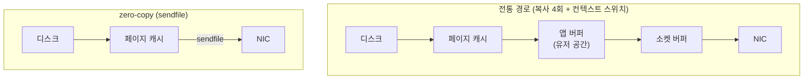
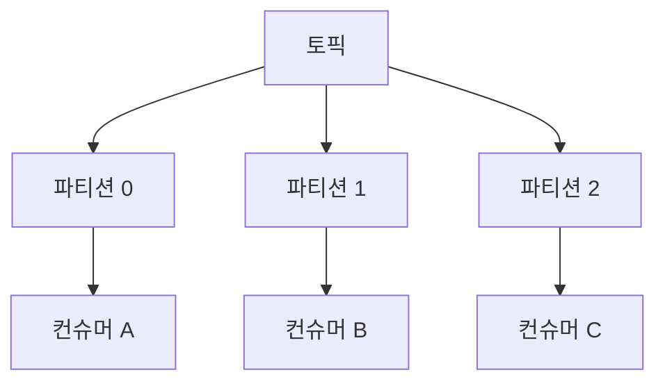

<!-- truncate -->

"Kafka는 빠르다"는 말은 흔한데, 정작 인메모리도 아니고 **디스크에 쓰는데** 어떻게 초당 수백만 건을 넘기는지는 잘 와닿지 않습니다. <mark>비결은 특별한 하드웨어가 아니라 "디스크를 순차적으로만 쓰고, OS·커널 기능을 최대한 빌려 쓰고, 메시지를 배치로 묶는" 설계입니다.</mark> 아키텍처 관점에서 하나씩 그림과 함께 봅니다. (다른 큐와의 비교는 [메시지 큐 비교](./message-queue-comparison), Redis가 빠른 이유는 [Redis는 왜 빠른가](./redis-single-thread-fast) 참고)

## 1. 순차 디스크 I/O — append-only 로그

"디스크는 느리다"는 말은 사실 **랜덤 접근** 얘기입니다. 헤드를 이리저리 옮기는 랜덤 I/O는 느리지만, **끝에만 덧붙이는 순차 I/O는 아주 빠릅니다**(순차 디스크 쓰기가 랜덤 메모리 접근보다 빠를 수 있을 정도).

Kafka의 파티션은 **끝에만 덧붙이는(append-only) 로그 파일**입니다. 쓰기는 항상 로그의 맨 뒤에, 읽기는 오프셋 위치부터 앞으로 순차적으로 진행됩니다.


<mark>수정·삭제 없이 뒤에만 쌓고 순서대로 읽으니, 디스크가 가장 잘하는 순차 접근만 쓰게 됩니다.</mark> 덤으로 로그가 남아 여러 소비자가 재생할 수 있는 것도 이 구조 덕분입니다.

## 2. OS 페이지 캐시에 얹기

Kafka 브로커는 **자체 캐시를 크게 만들지 않고 OS 페이지 캐시(page cache)** 에 의존합니다. 쓰기는 페이지 캐시에 기록하고 실제 디스크 반영(flush)은 OS에 맡기며, 읽기도 최근 데이터는 페이지 캐시에서 바로 나갑니다.

<mark>컨슈머가 대체로 최신을 따라잡은 클러스터에서는 읽기가 디스크까지 가지 않고 페이지 캐시에서 처리됩니다.</mark> 캐시를 JVM 힙 밖(커널)에 두니 **GC 부담이 없고**, 브로커가 재시작해도 페이지 캐시는 데워진 채 남습니다.

## 3. Zero-copy — sendfile로 커널에서 바로 전송

컨슈머로 데이터를 보낼 때가 핵심입니다. 전통적인 경로는 복사가 많습니다 — 디스크 → 페이지 캐시 → **앱 버퍼(유저 공간)** → 소켓 버퍼 → NIC. 유저 공간을 오가며 복사와 컨텍스트 스위치가 반복됩니다.

Kafka는 `sendfile` 시스템 콜로 **페이지 캐시에서 소켓(NIC)으로 커널 안에서 직접** 보냅니다. 유저 공간 복사를 건너뛰죠.



<mark>페이지 캐시에 한 번 올라온 데이터를 유저 공간으로 다시 퍼 나르지 않고 그대로 네트워크로 흘려보내, 전송 속도가 네트워크 한계에 가까워집니다.</mark>

## 4. 배치 + 압축 — 왕복 비용을 나눠 갚기

메시지를 하나씩 보내면 네트워크·I/O 왕복 오버헤드가 건마다 붙습니다. Kafka는 **메시지 세트(배치)** 를 기본 단위로 삼습니다.

- **프로듀서**는 잠깐 모아서(batch) 한 번에 보냅니다.
- **브로커**는 받은 배치를 통째로 로그에 덧붙입니다(개별 메시지로 풀지 않음).
- **컨슈머**는 큰 덩어리를 한 번에 fetch합니다.

```properties
linger.ms=10           # 최대 10ms까지 모았다가 전송
batch.size=32768       # 배치가 32KB 차면 전송
compression.type=lz4   # 배치 단위로 압축(lz4·snappy·zstd)
```

<mark>배치로 묶으면 왕복 오버헤드를 여러 건이 나눠 갚고, 압축도 배치 단위라 비슷한 메시지끼리 압축률이 좋아집니다.</mark> 게다가 브로커가 배치를 건드리지 않고 그대로 저장·전달하므로 앞의 zero-copy와도 잘 맞물립니다.

## 5. 파티션 — 병렬성으로 수평 확장

한 토픽을 여러 **파티션**으로 나눠 서로 다른 브로커·디스크에 분산합니다. 쓰기·읽기가 파티션별로 병렬로 일어나고, **컨슈머 그룹**은 파티션을 나눠 병렬 소비합니다.



<mark>처리량이 부족하면 파티션(과 컨슈머)을 늘려 선형에 가깝게 확장합니다 — 순서는 파티션 안에서만 보장됩니다.</mark>

## 6. 단순한 브로커, 똑똑한 클라이언트

Kafka 브로커는 라우팅·소비 상태를 짊어지지 않습니다. **"어디까지 읽었는지(오프셋)"는 컨슈머가 관리**하고, 컨슈머가 원하는 속도로 **pull** 해 갑니다. 브로커가 할 일이 적으니 그만큼 빠르고, 컨슈머는 자기 처리 능력에 맞춰 배치 크기를 조절할 수 있습니다.

## 트레이드오프 — 공짜는 아니다

이 설계는 **처리량(throughput)에 최적화**돼 있습니다. 반대로 배치·`linger.ms`는 **개별 메시지의 지연을 조금 늘립니다.** 건당 초저지연이나 정교한 라우팅·우선순위가 중요하면 RabbitMQ 같은 브로커 큐가 더 맞을 수 있습니다([메시지 큐 비교](./message-queue-comparison)). 또 순차 로그라 특정 메시지 하나를 지우거나 콕 집어 수정하는 건 맞지 않습니다.

## 정리

- **순차 append 로그** — 디스크의 순차 I/O만 사용.
- **페이지 캐시 + zero-copy(sendfile)** — 커널에서 바로 전송, 유저 공간 복사·GC 부담 제거.
- **배치 + 압축** — 왕복 오버헤드를 나눠 갚고 브로커는 배치를 그대로 전달.
- **파티션 병렬성 + 단순한 브로커 + pull** — 수평 확장과 낮은 브로커 부하.
- <mark>결국 "디스크·커널·네트워크를 거스르지 않고 결대로 쓰는" 설계가 Kafka 속도의 핵심입니다.</mark>

더 정확한 내용은 [Kafka 공식 Design 문서](https://kafka.apache.org/documentation/#design)를 참고하세요.

### 용어 한 줄 정리

| 용어 | 쉬운 뜻 |
|---|---|
| append-only 로그 | 끝에만 덧붙이고 지우지 않는 순차 파일 |
| 페이지 캐시 | OS가 파일을 메모리에 캐싱하는 커널 영역 |
| zero-copy(sendfile) | 유저 공간 복사 없이 캐시→네트워크로 직접 전송 |
| 메시지 세트(배치) | 여러 메시지를 묶어 다루는 단위 |
| 파티션 | 토픽을 나눈 병렬 처리·확장 단위 |
| pull 컨슈머 | 컨슈머가 원하는 속도로 가져가는 방식 |
