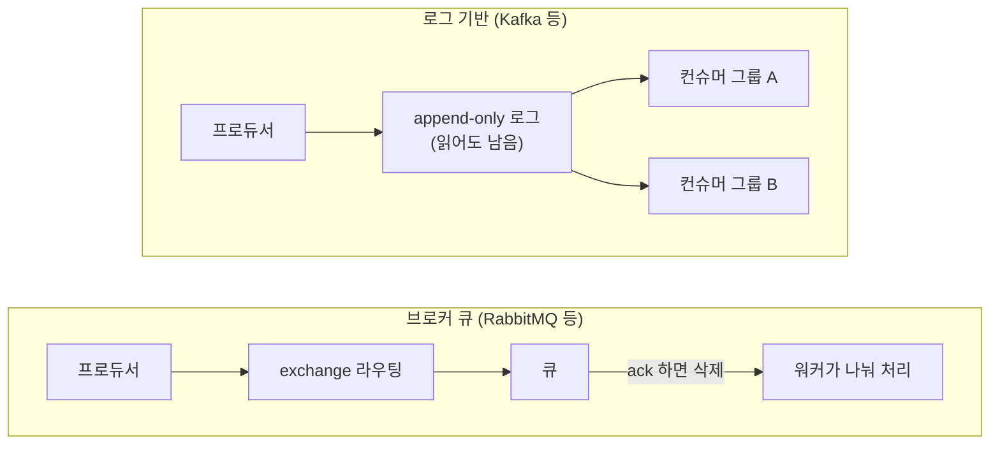
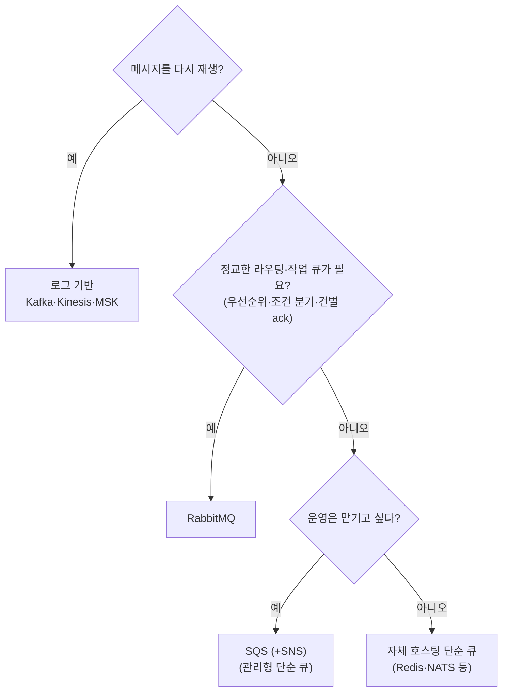
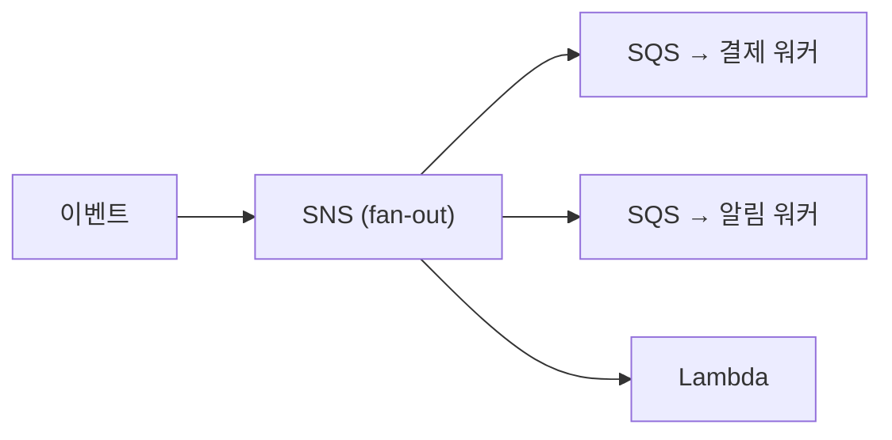

<!-- truncate -->

"비동기로 처리하자"는 결론까지는 쉬운데, 막상 **어떤 메시지 큐를 쓸지**에서 막힙니다. Kafka? RabbitMQ? SQS? 겉보기엔 다 "메시지를 보내고 받는" 도구라 비슷해 보이지만, <mark>먼저 "로그 기반이냐, 브로커 큐냐"라는 두 갈래 모델을 이해하면 선택의 절반이 끝납니다.</mark> 모델·성능·순서·전달보장·운영 같은 축으로 비교하고, 용도별 선택 기준을 정리합니다.

## 큰 두 갈래 — 로그 기반 vs 브로커 큐

메시지 큐는 크게 두 부류입니다.

- **로그 기반(log-based)** — Kafka, Pulsar, Redis Streams. 메시지를 **지우지 않고 로그에 차곡차곡 쌓고**, 컨슈머는 "어디까지 읽었는지(오프셋)"로 읽습니다. 읽어도 남아 있어 **여러 소비자·재처리(재생)** 가 됩니다.
- **브로커 큐(message broker)** — RabbitMQ, ActiveMQ. **브로커가 라우팅**해서 큐에 넣고, 컨슈머가 처리 후 확인(ack)하면 **큐에서 사라집니다(consume-and-delete)**. 유연한 라우팅과 저지연이 강점.

<mark>"읽어도 남아 재생되는" 로그 기반과, "처리하면 사라지는" 브로커 큐 — 이 차이가 재처리·순서·라우팅 성격을 전부 가릅니다.</mark>

## 축별 비교

| 축 | Kafka (로그) | RabbitMQ (브로커 큐) | SQS (관리형 큐) |
|---|---|---|---|
| 처리량 | 매우 높음(수십만~수백만/s) | 높지만 로그보다 낮음 | 스케일되지만 건당 지연 큼 |
| 지연 | 낮음(배치·풀 특성) | 매우 낮음(인메모리 라우팅) | 상대적으로 높음 |
| 순서 | 파티션 내 보장 | 큐 단위(경쟁 소비 시 흐트러질 수 있음) | FIFO 큐에서만 |
| 전달 보장 | at-least-once, 트랜잭션으로 EOS | at-least-once(confirm+ack) | at-least-once(FIFO는 중복 제거) |
| 소비 모델 | pull + 컨슈머 그룹(오프셋) | push + prefetch + ack | pull(폴링) |
| 라우팅 | 토픽·키 해시 위주 | exchange(direct·topic·fanout·headers) 강력 | 큐/주제(SNS 조합) |
| 재처리(재생) | 됨(오프셋 리셋) | 기본 안 됨(사라짐) | 안 됨 |
| 운영 부담 | 무거움(러닝커브) | 중간 | 거의 없음(완전관리형) |

전달 보장은 어느 큐든 기본이 at-least-once(중복 가능)입니다 — 자세한 개념은 [전달 보장 정리](./kafka-delivery-semantics), Kafka의 정확히 한 번은 [트랜잭션 EOS](./kafka-transactions-exactly-once)·[Outbox](./kafka-outbox-exactly-once) 글을 참고하세요.

## 대표 주자 한 줄 요약

- **Kafka** — 로그 기반의 표준. <mark>고처리량·재생·여러 소비자·이벤트 스트리밍에 최적</mark>. 대신 운영이 무겁고 세밀한 라우팅·우선순위는 약함.
- **RabbitMQ** — 스마트 브로커. **복잡한 라우팅, 작업 큐, 저지연, 메시지별 제어**(우선순위·TTL·데드레터)가 강점. 대규모 재생·초고처리량엔 로그 기반이 유리.
- **SQS** — AWS 완전관리형. **운영이 거의 없고** 무한히 스케일. 재생 없음, 건당 지연이 있는 편. AWS 생태계·단순 큐에 적합.
- **Redis Streams** — 이미 Redis를 쓰고 **가벼운 로그·소비자 그룹**이 필요할 때. 전용 브로커보다 기능·내구성은 제한적.
- **Pulsar** — 로그+큐 하이브리드, 계층형 저장·멀티테넌시·지오복제. 기능은 풍부하나 스택이 큼.
- **NATS(JetStream)** — 초경량·저지연 pub/sub. 마이크로서비스 내부 통신에.

## 용도별 선택 기준

세 가지만 물어보면 대개 좁혀집니다.

1. **읽은 메시지를 다시 재생해야 하나?** → 예면 **로그 기반(Kafka/Pulsar/Redis Streams)**, 아니면 브로커 큐도 후보.
2. **라우팅이 복잡한가?(조건별 분기·우선순위·TTL)** → 예면 **RabbitMQ**.
3. **운영에 쓸 여력이 있나?** → 적으면 **관리형(SQS/관리형 Kafka)**.

| 원하는 것 | 추천 |
|---|---|
| 이벤트 스트리밍·로그·재처리·고처리량 | Kafka (또는 Pulsar) |
| 복잡한 라우팅·작업 큐·저지연·메시지별 제어 | RabbitMQ |
| 운영 최소·AWS·단순 큐 | SQS |
| 이미 Redis 사용·가벼운 스트림 | Redis Streams |
| 멀티테넌시·지오복제·계층 저장 | Pulsar |
| 초경량 서비스 간 메시징 | NATS |

## 아키텍처 관점 — 어떤 상황에 왜 그 선택인가

각 큐가 "무엇을 잘하도록 설계됐는지"를 보면 선택이 분명해집니다. 큰 갈림길을 먼저 그림으로 보면 이렇습니다.

**RabbitMQ는 라우팅·작업 큐 제어가 필요할 때만** 고르는 자리입니다. 맨 아래(재생·라우팅 요구가 없고 관리형도 싫을 때)는 Redis·NATS 같은 가벼운 자체 호스팅 큐로 충분합니다. 특히 많이 저울질하는 셋을 시나리오로 봅니다.

### Kafka — "이벤트를 흐름의 원장으로"

**상황**: 주문 이벤트 하나를 결제·배송·정산·추천·데이터 분석이 **각자** 소비하고, 나중에 새 소비자가 붙어 **과거부터 다시** 읽어야 한다.

**왜 이점인가**: 로그가 남으니 컨슈머 그룹마다 **독립된 오프셋**으로 읽습니다 — 한 소비자가 느려도 다른 소비자에 영향 없고(각자 lag), 새 소비자를 붙여 처음부터 재생하는 게 공짜입니다. 파티션으로 수평 확장해 처리량을 올리고, 파티션 안에서는 순서가 보장됩니다. <mark>프로듀서와 컨슈머를 "시간적으로" 분리 — 이벤트를 사실의 원장처럼 쌓아 여러 곳이 원할 때 소비합니다.</mark>

구체적으로 이런 설계에 강합니다.

- **확장·순서 모델** — 파티션이 병렬성과 순서의 단위입니다. 처리량은 파티션·컨슈머를 늘려 키우고, 순서가 필요한 것은 **같은 키로 같은 파티션**에 보냅니다(전역 순서 대신 키 단위 순서).
- **보존·백필(backfill)** — 리텐션 기간 안에서 오프셋을 되감아 재처리하고, 새 서비스를 붙여 **과거부터 다시 읽어** 상태를 채웁니다. 버그로 잘못 처리한 구간을 다시 돌리는 것도 됩니다.
- **스트림 처리와 결합** — CDC(변경 데이터 캡처)·이벤트 소싱·Kafka Streams/ksqlDB와 맞물려 "흐르는 데이터를 그 자리에서 가공"하는 파이프라인의 중심이 됩니다.

한마디로 **"한 번 발생한 이벤트를 여러 곳이, 원할 때, 다시 볼 수 있어야 한다"** 면 Kafka입니다.

### RabbitMQ — "브로커가 라우팅·작업 분배의 중심"

**상황**: 이미지 리사이즈·메일 발송 같은 **작업**을 워커 여러 대가 나눠 처리한다(한 작업은 한 워커만). 속성별 라우팅·우선순위·TTL·실패 시 데드레터 같은 정교한 제어가 필요하다.

**왜 이점인가**: exchange가 조건에 따라 알맞은 큐로 꽂아 주고(브로커가 똑똑함), push+prefetch로 워커 부하를 고르게 나눕니다. ack하면 사라지는 소비-삭제 모델이 "작업 큐"에 딱 맞고, 인메모리 라우팅이라 지연이 낮습니다. <mark>"무엇을 누구에게, 어떻게 나눠 줄지"를 브로커가 책임지는 구조입니다.</mark>

라우팅과 제어 수단이 풍부합니다.

- **exchange 타입** — `direct`(정확 매칭)·`topic`(패턴 매칭)·`fanout`(전체 브로드캐스트)·`headers`(속성 매칭)로 "어떤 메시지를 어느 큐로" 유연하게 정합니다.
- **작업 분배** — 경쟁 소비자(여러 워커가 한 큐를 나눠 처리) + `prefetch`로 부하를 고르게 나눠, 느린 워커에 일이 몰리지 않게 합니다.
- **메시지별 제어** — 우선순위 큐, 메시지 TTL, 실패 시 **데드레터 큐(DLQ)**, 지연·재시도 큐까지 건 단위로 세밀하게 다룹니다.

한마디로 **"작업을 정교하게 라우팅해 워커들에 나눠 시키고, 처리하면 끝"** 이면 RabbitMQ입니다.

### AWS(SQS·SNS·Kinesis·EventBridge) — "운영을 클라우드에 위임"

**상황**: AWS 환경에서 서비스를 비동기로 느슨하게 연결하고 싶고, 브로커를 직접 운영하긴 싫다. Lambda 같은 서버리스와 자연스럽게 붙이고 싶다.

**왜 이점인가**: 완전관리형이라 스케일·가용성·패치를 클라우드가 맡고, 종량제에 IAM·Lambda 트리거가 통합됩니다. 조합으로 대부분을 커버합니다.

- **SQS** — 단순 큐(버퍼·작업 분배). **Standard**(사실상 무제한 처리량·best-effort 순서·at-least-once) / **FIFO**(엄격한 순서·중복 제거, 대신 처리량 상한). 실패 대비 DLQ, 가시성 타임아웃으로 재처리.
- **SNS + SQS** — SNS로 **fan-out**(여러 SQS·Lambda에 브로드캐스트)해 Kafka식 다중 소비를 관리형으로 흉내 냅니다. 소비자마다 독립 큐라 서로 영향이 적습니다.
- **Kinesis / MSK** — **재생·순서**가 있는 스트리밍이 필요하지만 운영은 싫을 때. Kinesis는 샤드 단위 확장, MSK는 관리형 Kafka(기존 Kafka 자산을 그대로).
- **EventBridge** — 이벤트 버스. **규칙(rule) 기반 라우팅**·SaaS 이벤트 통합·스케줄(cron)에 강합니다(고처리량 스트리밍용은 아님).
- **Lambda 연동** — SQS·Kinesis·SNS를 이벤트 소스로 걸어 **서버리스 소비자**를 자동 스케일합니다.

<mark>"AWS에 얹어 운영 부담 없이 붙인다"</mark> 면 SQS/SNS를 기본으로, 스트리밍은 Kinesis·MSK, 이벤트 라우팅은 EventBridge를 더합니다.

### 잘못 고르면 — 흔한 어긋남

설계 의도와 반대로 쓰면 고생합니다.

- **Kafka를 작업 큐처럼** — 건당 ack·우선순위·수만 개의 개별 큐·건당 초저지연이 필요하면 결이 안 맞습니다(그건 RabbitMQ 몫).
- **RabbitMQ로 대규모 재생·장기 보관** — 메시지는 처리하면 사라지고, 많이 쌓일수록 성능이 떨어집니다. 이벤트 재생·이력 보관은 로그 기반(Kafka)으로.
- **SQS에 복잡한 라우팅·초저지연을 기대** — SQS는 단순 큐입니다. 조건 라우팅은 EventBridge·SNS, 스트림 재생은 Kinesis·MSK로 나눠야 합니다.

<mark>설계 의도대로 쓰면 셋 다 훌륭하고, 의도에서 벗어나면 어느 것도 편하지 않습니다.</mark>

### 목표로 되짚기

| 아키텍처 목표 | 선택 |
|---|---|
| 이벤트를 여러 곳이 재생·독립 소비 | Kafka (관리형이면 MSK·Kinesis) |
| 작업을 워커에 분배 + 정교한 라우팅 | RabbitMQ |
| AWS에서 운영 없이 디커플링·서버리스 연동 | SQS (+ SNS fan-out) |

## 정리

- 먼저 **로그 기반(재생됨) vs 브로커 큐(처리하면 사라짐)** 를 가른다.
- **Kafka**=고처리량·스트리밍·재생, **RabbitMQ**=라우팅·저지연·작업 큐, **SQS**=운영 최소·관리형.
- "재생 필요?·라우팅 복잡?·운영 여력?" 세 질문으로 대개 좁혀진다.

<mark>"제일 좋은 메시지 큐"는 없고, 워크로드의 성격(재생·순서·라우팅·처리량·운영)에 맞는 큐가 있을 뿐입니다.</mark> 정확히 한 번 처리 같은 보장이 필요하면 큐 선택과 함께 [전달 보장](./kafka-delivery-semantics)·[EOS](./kafka-transactions-exactly-once) 설계를 같이 봐야 합니다.

### 용어 한 줄 정리

| 용어 | 쉬운 뜻 |
|---|---|
| 로그 기반 | 메시지를 지우지 않고 쌓아 오프셋으로 읽음(재생 가능) |
| 브로커 큐 | 브로커가 라우팅, ack하면 큐에서 삭제 |
| 컨슈머 그룹 | 로그의 파티션을 그룹 안에서 나눠 읽는 단위 |
| prefetch/ack | 브로커 큐에서 미리 받고 처리 확인하는 방식 |
| 재생(replay) | 이미 읽은 메시지를 처음부터 다시 처리 |
| 데드레터(DLQ) | 처리 실패 메시지를 따로 보관하는 큐 |
