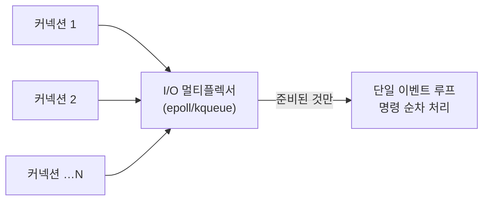

<!-- truncate -->

"코어 수십 개짜리 서버에서 Redis는 명령을 **한 스레드**로 처리한다"고 하면 대부분 의아해합니다. 멀티스레드로 굴려야 빠른 것 아닌가? 그런데 Redis는 싱글스레드인 채로 초당 수십만 건을 처리합니다. <mark>비결은 "스레드를 많이 쓰는 것"이 아니라 "느려질 요소를 애초에 없앤 구조"에 있습니다.</mark> 인메모리·이벤트 루프·I/O 멀티플렉싱이 어떻게 맞물리는지, 그리고 그 한계까지 정리합니다.

## 1. 인메모리 — 애초에 디스크를 가지 않습니다

가장 큰 이유. Redis는 데이터를 **메모리(RAM)** 에 둬 디스크 I/O를 아예 없앴습니다. 일반 DB가 디스크에서 읽고 쓰느라 밀리초를 쓰는 동안, Redis는 메모리에서 **마이크로초** 단위로 끝냅니다. <mark>연산 하나가 워낙 빨라서, 여러 스레드로 나눌 필요 자체가 크지 않습니다.</mark>

접근 지연(latency)의 차이를 숫자로 보면 격차가 분명합니다.

| 저장소 | 접근 지연 | RAM 대비 |
|---|---|---|
| RAM | 약 100ns | 1× |
| NVMe SSD | 약 20~200μs | 수백~수천 배 느림 |
| SATA SSD | 약 0.5ms | 약 9,000배 느림 |
| HDD | 약 10ms | 최대 약 10만 배 느림 |

SSD가 아무리 빨라도 RAM과의 격차는 여전히 큽니다. 대신 메모리라 데이터 유실 위험이 있어, 영속화(RDB 스냅샷·AOF 로그)로 디스크에 보관하는 장치를 두되 그마저 대개 백그라운드로 처리합니다.

## 2. 단일 스레드 이벤트 루프 — 락도, 컨텍스트 스위치도 없습니다

Redis는 명령을 **하나의 스레드가 순서대로** 처리합니다. 언뜻 손해 같지만, 멀티스레드가 치르는 비용을 통째로 안 냅니다.

- **락(lock)이 필요 없다** — 공유 자료구조를 여러 스레드가 동시에 건드리지 않으니 잠금·동기화 오버헤드가 0. 각 명령이 자연히 원자적입니다.
- **컨텍스트 스위치가 없다** — 스레드를 오가며 CPU 상태를 저장·복원하는 비용이 없습니다.
- **자료구조가 단순해진다** — 동시성을 고려한 복잡한 락-프리 구조가 필요 없어 구현이 단순하고 빠릅니다.

<mark>멀티스레드의 "이론상 병렬"이 주는 이득보다, 락·컨텍스트 스위치를 없앤 단일 스레드의 이득이 이 워크로드에선 더 큽니다.</mark>

## 3. I/O 멀티플렉싱 — 한 스레드로 수천 커넥션

"한 스레드면 커넥션 하나 처리하는 동안 나머지는 노나?" 아닙니다. Redis는 **I/O 멀티플렉싱**(`epoll`(리눅스)·`kqueue`(맥/BSD) 등)을 씁니다. 수천 개 소켓을 논블로킹으로 등록해 두고, **데이터가 준비된 소켓만** 골라 처리합니다.

<mark>커넥션마다 스레드를 만드는 대신, 한 스레드가 "준비된 이벤트"만 돌아가며 처리해 수천 연결을 감당합니다.</mark> 이게 단일 스레드로도 높은 동시성을 내는 핵심입니다.

식당에 빗대면 이렇습니다. **커넥션당 스레드 하나**를 붙이는 블로킹 방식은, 웨이터(스레드)가 손님(커넥션) 주문을 받으면 그 요리가 나올 때까지 옆에서 기다립니다 — 다른 손님을 받으려면 웨이터를 더 고용(스레드 추가)해야 하고, 커넥션 수만큼 스레드가 늘면 메모리가 견디지 못합니다. 반면 **I/O 멀티플렉싱**은 웨이터가 한 명이어도, 모든 주문을 주방장(커널의 `epoll`)에게 맡겨 두고 "**준비된 것만** 알려 주세요" 하고 다른 일을 계속합니다. 이 방식이 바로 1999년 제기된 **C10K 문제**(한 서버로 동시 커넥션 1만 개를 어떻게 감당하나)의 해법이고, Redis뿐 아니라 Node.js·Nginx도 같은 원리로 고성능 I/O를 냅니다.

## 4. O(1) 자료구조 — 대부분의 연산이 상수 시간

키 조회부터가 빠릅니다. Redis는 전역 키 공간을 **해시테이블**로 관리해, 키의 해시값으로 슬롯을 바로 찾아갑니다 — 처음부터 스캔할 필요 없이 **시간 복잡도 O(1)** 로 점프합니다(해시 충돌은 체이닝으로 해결). 내부 타입들도 상황에 맞게 최적화돼, 대부분의 연산이 **상수 시간**에 끝납니다.

- 문자열(SDS), 해시테이블, 작은 데이터를 위한 listpack/intset 등 각 상황에 맞는 표현을 써서 메모리와 연산을 아낍니다. 데이터가 작으면 더 촘촘한 인코딩으로 자동 전환합니다.
- sorted set은 보통 레드-블랙 트리를 쓰는 대신 **skiplist**를 씁니다. 성능은 비슷하되 구현이 단순해서인데, 만든이(antirez)도 "성능 최적이 아니라 **단순함**을 택했다"고 밝혔습니다.

<mark>연산이 상수 시간이라 명령 하나가 짧게 끝나고, 그래서 단일 스레드로 순서대로 처리해도 처리량이 나옵니다.</mark>

## 5. RESP 프로토콜 — 파싱 비용을 극단적으로 줄입니다

Redis가 클라이언트와 주고받는 통신 규약 **RESP**(REdis Serialization Protocol)의 핵심은 "**길이를 먼저 알려 준다**"입니다.

쉼표·공백 같은 구분자로 데이터를 나누는 텍스트 프로토콜은, 구분자가 나올 때까지 **한 글자씩 스캔**해야 하고 그 전엔 크기를 몰라 버퍼를 미리 잡을 수도 없습니다. RESP는 반대로 인자의 **바이트 길이를 앞에** 붙입니다. 예컨대 `$5`를 읽으면 뒤따르는 데이터가 정확히 5바이트임을 알기에, 스캔 없이 버퍼 크기를 확정해 곧장 읽습니다. 파싱 루프가 단순해지고 오버헤드가 작아, 단일 스레드로도 초당 수십만~수백만 건을 감당합니다.

## 6. 파이프라인 — 왕복 시간(RTT)을 없앱니다

명령을 하나 보내고 응답을 기다렸다가 다음을 보내면, 매 명령마다 **네트워크 왕복 시간(RTT)** 이 붙습니다. **파이프라인(pipelining)** 은 여러 명령을 한 번에 묶어 보내고 결과를 한 번에 받아, 이 왕복을 없앱니다.

- RTT가 1ms인 환경에서 명령 100개를 낱개로 보내면 100ms가 넘게 걸리지만, 파이프라인으로 묶으면 왕복 한 번(약 1ms)으로 끝납니다.
- Redis 공식 벤치마크에서도 파이프라인 없이 초당 약 10만 건 수준이던 처리량이, 파이프라인을 쓰면 **초당 약 180만 건**까지 오릅니다.

<mark>파이프라인은 Redis를 더 빠르게 "실행"하는 게 아니라, 명령 사이에 낭비되던 네트워크 왕복을 접어 처리량을 끌어올립니다.</mark>

## 7. 그래서 병목은 CPU가 아닙니다

정리하면, Redis의 대부분 명령은 CPU를 거의 안 쓰고 메모리 접근으로 끝납니다. <mark>실질 병목은 CPU 계산이 아니라 메모리 대역폭과 네트워크</mark>라서, 코어를 더 쓴다고 크게 빨라지지 않습니다. 그러니 "명령 처리는 단일 스레드"가 합리적 선택이 됩니다. 코어를 더 쓰고 싶으면 **인스턴스를 여러 개(샤딩/클러스터)** 돌려 수평 확장합니다.

## 한계 — 단일 스레드의 그림자

빠름의 대가가 있습니다. <mark>명령을 한 줄로 처리하니, 무거운 O(N) 명령 하나가 그 뒤 모든 요청을 멈추게 합니다.</mark> `KEYS *`, 큰 컬렉션의 통째 조회, 큰 키(빅키) 삭제 등이 그렇습니다. 뒤집어 말하면 Redis가 느려지는 원인은 **스레드 수가 아니라** 이런 것들 — O(N) 명령, 값이 지나치게 큰 키, 한 키에 요청이 몰리는 핫키 — 이므로, 단일 스레드에선 이런 연산을 늘 조심해야 합니다. 이 블로킹 문제와 대처(SCAN·UNLINK·빅키 분할 등)는 [대용량 트래픽에서의 Redis 대응](./redis-large-scale-pitfalls) 글에서 자세히 다뤘습니다.

## Redis는 사실 일부 멀티스레드 — 그래도 명령은 여전히 싱글

Redis는 완전한 단일 스레드로 출발했지만, 느린 작업을 조금씩 백그라운드로 분리해 왔습니다.

- **Redis 4.0** — 백그라운드 스레드(`bio`)를 추가해 **비동기 삭제(lazy free)** 와 **AOF fsync** 같은 느린 작업을 분리했습니다. 덕분에 수백만 항목을 지울 때도 메인 스레드가 멈추지 않습니다.
- **Redis 6.0** — **I/O 멀티스레딩**(`io-threads`)을 선택 옵션으로 넣었습니다. 오해하기 쉬운데, <mark>멀티스레드로 바뀐 건 "명령 실행"이 아니라 "네트워크 I/O(소켓 읽기·쓰기, 프로토콜 파싱)"입니다.</mark> 커넥션이 많거나 응답이 클 때 활성화하면 처리량이 30~60%까지 오르지만, 명령이 가벼우면 스레드 전환 비용 때문에 오히려 느려질 수 있어 보통 **코어 수보다 1~2개 적게**(8코어면 6~7) 두고 벤치마크로 조정합니다.

핵심은 그대로입니다 — **명령 실행 경로는 지금도 단일 스레드**라, 원자성·단순함이 유지됩니다. "Redis는 싱글스레드"란 곧 "명령 실행이 싱글스레드"라는 뜻이지, 프로세스 전체가 그렇다는 말은 아닙니다.

## 정리

- **인메모리**라 연산이 마이크로초 단위여서 나눌 필요가 적습니다(RAM은 HDD보다 최대 10만 배 빠릅니다).
- **단일 스레드 이벤트 루프**라 락·컨텍스트 스위치 비용이 없습니다(명령은 원자적입니다).
- **I/O 멀티플렉싱**(`epoll`)으로 한 스레드가 수천 커넥션을 감당합니다(C10K 해법입니다).
- **O(1) 자료구조 + 길이 프리픽스 RESP**로 명령당 비용·파싱 비용이 작습니다.
- **파이프라인**으로 왕복(RTT)을 접어 처리량을 끌어올립니다.
- 병목은 CPU가 아니라 메모리·네트워크라, 코어는 **인스턴스 여러 개**로 확장합니다.
- 대가는 **느린 명령의 블로킹**이고, Redis 4.0은 백그라운드 스레드를, 6.0은 **I/O만 멀티스레드**를 도입했습니다(명령은 여전히 싱글입니다).

<mark>Redis가 빠른 건 스레드를 많이 써서가 아니라, 느려질 이유를 구조적으로 없앴기 때문입니다.</mark>

### 용어 한 줄 정리

| 용어 | 쉬운 뜻 |
|---|---|
| 인메모리 | 데이터를 디스크가 아닌 RAM에 둠 |
| 이벤트 루프 | 한 스레드가 준비된 일을 순서대로 처리하는 구조 |
| I/O 멀티플렉싱 | 한 스레드가 여러 소켓을 감시(epoll·kqueue) |
| 컨텍스트 스위치 | 스레드 전환 시 CPU 상태 저장·복원 비용 |
| RESP | 길이를 앞에 붙여 파싱이 빠른 Redis 프로토콜 |
| 파이프라인 | 여러 명령을 묶어 보내 왕복(RTT)을 없앰 |
| C10K | 한 서버로 동시 커넥션 1만 개를 감당하는 문제 |
| io-threads | Redis 6+의 네트워크 I/O 전용 멀티스레딩 |
