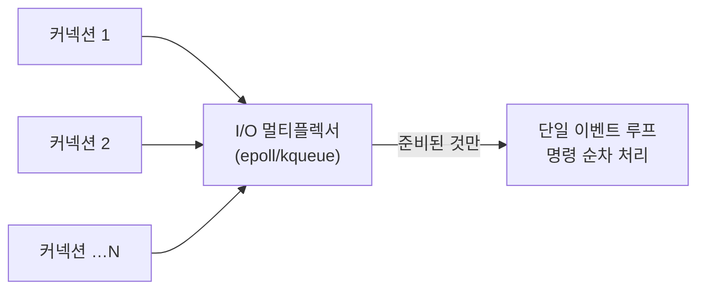

<!-- truncate -->

"코어 수십 개짜리 서버에서 Redis는 명령을 **한 스레드**로 처리한다"고 하면 대부분 의아해합니다. 멀티스레드로 굴려야 빠른 것 아닌가? 그런데 Redis는 싱글스레드인 채로 초당 수십만 건을 처리합니다. <mark>비결은 "스레드를 많이 쓰는 것"이 아니라 "느려질 요소를 애초에 없앤 구조"에 있습니다.</mark> 인메모리·이벤트 루프·I/O 멀티플렉싱이 어떻게 맞물리는지, 그리고 그 한계까지 정리합니다.

## 1. 인메모리 — 애초에 디스크를 안 간다

가장 큰 이유. Redis는 데이터를 **메모리(RAM)** 에 둡니다. 일반 DB가 디스크에서 읽고 쓰느라 밀리초를 쓰는 동안, Redis는 메모리에서 **마이크로초** 단위로 끝냅니다. <mark>연산 하나가 워낙 빨라서, 여러 스레드로 나눌 필요 자체가 크지 않습니다.</mark> (디스크는 영속화(RDB·AOF) 때만 쓰고, 그마저 백그라운드로 처리)

## 2. 단일 스레드 이벤트 루프 — 락도, 컨텍스트 스위치도 없다

Redis는 명령을 **하나의 스레드가 순서대로** 처리합니다. 언뜻 손해 같지만, 멀티스레드가 치르는 비용을 통째로 안 냅니다.

- **락(lock)이 필요 없다** — 공유 자료구조를 여러 스레드가 동시에 건드리지 않으니 잠금·동기화 오버헤드가 0. 각 명령이 자연히 원자적입니다.
- **컨텍스트 스위치가 없다** — 스레드를 오가며 CPU 상태를 저장·복원하는 비용이 없습니다.
- **자료구조가 단순해진다** — 동시성을 고려한 복잡한 락-프리 구조가 필요 없어 구현이 단순하고 빠릅니다.

<mark>멀티스레드의 "이론상 병렬"이 주는 이득보다, 락·컨텍스트 스위치를 없앤 단일 스레드의 이득이 이 워크로드에선 더 큽니다.</mark>

## 3. I/O 멀티플렉싱 — 한 스레드로 수천 커넥션

"한 스레드면 커넥션 하나 처리하는 동안 나머지는 노나?" 아닙니다. Redis는 **I/O 멀티플렉싱**(`epoll`(리눅스)·`kqueue`(맥/BSD) 등)을 씁니다. 수천 개 소켓을 논블로킹으로 등록해 두고, **데이터가 준비된 소켓만** 골라 처리합니다.

<mark>커넥션마다 스레드를 만드는 대신, 한 스레드가 "준비된 이벤트"만 돌아가며 처리해 수천 연결을 감당합니다.</mark> 이게 단일 스레드로도 높은 동시성을 내는 핵심입니다.

## 4. 메모리 친화적 자료구조 + 단순 프로토콜

- **최적화된 자료구조** — 문자열(SDS), 해시테이블, sorted set의 skiplist, 작은 데이터를 위한 listpack/intset 등 각 상황에 맞는 표현을 써서 메모리와 연산을 아낍니다. 데이터가 작으면 더 촘촘한 인코딩으로 자동 전환합니다.
- **단순한 프로토콜(RESP)** — 요청·응답 포맷이 가벼워 파싱이 빠릅니다. 무거운 직렬화나 쿼리 플래닝이 없습니다.

## 5. 그래서 병목은 CPU가 아니다

정리하면, Redis의 대부분 명령은 CPU를 거의 안 쓰고 메모리 접근으로 끝납니다. <mark>실질 병목은 CPU 계산이 아니라 메모리 대역폭과 네트워크</mark>라서, 코어를 더 쓴다고 크게 빨라지지 않습니다. 그러니 "명령 처리는 단일 스레드"가 합리적 선택이 됩니다. 코어를 더 쓰고 싶으면 **인스턴스를 여러 개(샤딩/클러스터)** 돌려 수평 확장합니다.

## 한계 — 단일 스레드의 그림자

빠름의 대가가 있습니다. <mark>명령을 한 줄로 처리하니, 무거운 O(N) 명령 하나가 그 뒤 모든 요청을 멈춰 세웁니다.</mark> `KEYS *`, 큰 컬렉션의 통째 조회, 큰 키 삭제 등이 그렇습니다. 이 블로킹 문제와 대처(SCAN·UNLINK·빅키 분할 등)는 [대용량 트래픽에서의 Redis 대응](./redis-large-scale-pitfalls) 글에서 자세히 다뤘습니다.

## Redis 6+ I/O 멀티스레딩 — 그래도 명령은 여전히 싱글

Redis 6.0부터 **I/O 멀티스레딩**(`io-threads`)이 들어왔습니다. 오해하기 쉬운데, <mark>멀티스레드로 바뀐 건 "명령 실행"이 아니라 "네트워크 I/O(소켓 읽기·쓰기, 프로토콜 파싱)"입니다.</mark> 명령 자체는 지금도 단일 스레드가 순서대로 실행합니다 — 그래서 원자성·단순함은 그대로 유지한 채, 커넥션이 아주 많을 때 I/O 부분만 여러 코어로 나눠 처리량을 올립니다. (참고로 큰 키의 lazy free 같은 일부 작업은 예전부터 백그라운드 스레드가 맡습니다.)

## 정리

- **인메모리**라 연산이 마이크로초 → 나눌 필요가 적다.
- **단일 스레드 이벤트 루프**라 락·컨텍스트 스위치 비용이 없다(명령은 원자적).
- **I/O 멀티플렉싱**으로 한 스레드가 수천 커넥션을 감당한다.
- **효율적 자료구조 + 단순 프로토콜**로 명령당 비용이 작다.
- 병목은 CPU가 아니라 메모리·네트워크 → 코어는 **인스턴스 여러 개**로 확장.
- 대가는 **느린 명령의 블로킹**, 그리고 Redis 6+는 **I/O만 멀티스레드**(명령은 여전히 싱글).

<mark>Redis가 빠른 건 스레드를 많이 써서가 아니라, 느려질 이유를 구조적으로 없앴기 때문입니다.</mark>

### 용어 한 줄 정리

| 용어 | 쉬운 뜻 |
|---|---|
| 인메모리 | 데이터를 디스크가 아닌 RAM에 둠 |
| 이벤트 루프 | 한 스레드가 준비된 일을 순서대로 처리하는 구조 |
| I/O 멀티플렉싱 | 한 스레드가 여러 소켓을 감시(epoll·kqueue) |
| 컨텍스트 스위치 | 스레드 전환 시 CPU 상태 저장·복원 비용 |
| RESP | Redis의 단순한 요청·응답 프로토콜 |
| io-threads | Redis 6+의 네트워크 I/O 전용 멀티스레딩 |
