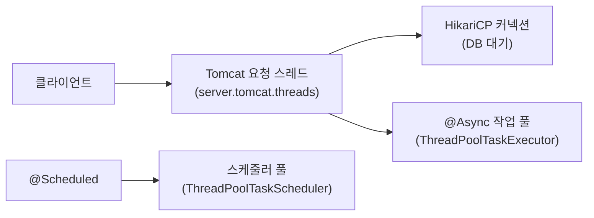

<!-- truncate -->

스프링부트에서 "스레드 풀"은 하나가 아닙니다. <mark>웹 요청을 받는 풀, `@Async` 작업 풀, `@Scheduled` 스케줄러 풀, DB 커넥션 풀이 각각 따로 있고 서로 얽혀 있습니다.</mark> 어떤 풀이 무엇을 하고, 어디에 설정하며, 어떤 상황에 무엇을 조절해야 하는지 정리합니다. (부하가 늘 때 어디가 먼저 깨지는지는 [트래픽이 늘면 어디서 깨지나](./traffic-growth-problems), 지표 읽는 법은 [서버 지표 읽기](./server-monitoring-analysis) 참고)

## 스프링부트엔 풀이 여러 개다

전통적인 MVC(블로킹) 앱에서 요청 하나가 흘러가는 경로를 보면 풀이 어디에 있는지 보입니다.



<mark>이 풀들의 크기가 서로 맞지 않으면, 한 곳이 병목이 돼 나머지가 그 앞에서 대기합니다.</mark> 그래서 개별 튜닝이 아니라 "함께" 맞춰야 합니다.

## 1. 웹 요청 스레드 — Tomcat

내장 Tomcat이 요청마다 스레드를 하나씩 물려 처리합니다(블로킹 모델). 관련 설정:

```yaml
server:
  tomcat:
    threads:
      max: 200          # 동시에 요청을 처리하는 최대 워커 스레드(기본 200)
      min-spare: 10     # 미리 떠 있는 최소 스레드(기본 10)
    accept-count: 100   # 스레드가 다 찼을 때 대기 큐 길이(기본 100)
    max-connections: 8192  # 동시에 수락하는 최대 커넥션(기본 8192)
```

동작 순서는 이렇습니다 — **`max-connections`까지 연결을 수락 → `threads.max`개까지 동시 처리 → 처리 스레드가 다 차면 `accept-count` 큐에서 대기 → 그마저 넘으면 거절**.

<mark>대부분의 요청 스레드가 DB·외부 API 응답을 기다리는 IO 대기 상태라면, 스레드 수를 늘려야 처리량이 오릅니다.</mark> 단, 이때 뒤의 HikariCP·다운스트림 한도도 같이 올려야 의미가 있습니다(안 그러면 늘린 스레드가 커넥션을 기다리며 다시 막힘). 반대로 CPU를 태우는 작업이면 스레드를 코어 수 이상으로 늘려도 컨텍스트 스위칭만 늘어납니다.

> 참고: Java 21 + 스프링부트 3.2부터 `spring.threads.virtual.enabled: true`로 **가상 스레드**를 켜면 요청당 스레드의 개수 제약이 크게 완화됩니다(블로킹 IO에 유리). 이땐 "스레드 수 튜닝"의 무게가 커넥션 풀·다운스트림 쪽으로 옮겨갑니다.

## 2. @Async 작업 풀 — ThreadPoolTaskExecutor

`@Async`로 비동기 작업을 던지면 별도 실행기(`ThreadPoolTaskExecutor`)가 처리합니다. 스프링부트가 자동 구성하며 `spring.task.execution`으로 조절합니다.

```yaml
spring:
  task:
    execution:
      pool:
        core-size: 8            # 평상시 유지 스레드
        max-size: 64            # 최대 스레드
        queue-capacity: 100     # 대기 큐 용량
        keep-alive: 60s         # 유휴 스레드 회수 시간
```

여기서 **동작 순서를 꼭 이해해야 합니다** — 스레드가 `core-size`까지 찬 뒤에는 **먼저 큐를 채우고, 큐가 가득 차야 비로소 `max-size`까지 스레드를 늘립니다.** 큐가 다 차고 스레드도 `max-size`면 그때 거절(rejection)합니다.

<mark>그래서 큐 용량을 무한(기본값 `Integer.MAX_VALUE`)으로 두면 `max-size`는 영영 쓰이지 않고, 작업이 큐에 무한정 쌓입니다.</mark> 병렬도를 높이고 싶으면 큐를 유한하게 잡아야 합니다. 거절 시 정책은 커스텀 빈으로 정합니다.

```java
@Bean
ThreadPoolTaskExecutor taskExecutor() {
    var ex = new ThreadPoolTaskExecutor();
    ex.setCorePoolSize(8);
    ex.setMaxPoolSize(64);
    ex.setQueueCapacity(100);
    ex.setRejectedExecutionHandler(new ThreadPoolExecutor.CallerRunsPolicy()); // 넘치면 호출 스레드가 직접 실행(자연스러운 백프레셔)
    ex.setThreadNamePrefix("async-");
    ex.initialize();
    return ex;
}
```

`CallerRunsPolicy`는 넘칠 때 호출한 스레드가 직접 실행해 유입 속도를 늦추는 **자연스러운 백프레셔(backpressure)**가 됩니다. 반대로 기본 `AbortPolicy`는 예외를 던져 빠르게 실패합니다.

## 3. @Scheduled 스케줄러 — ThreadPoolTaskScheduler

`@Scheduled` 작업들은 별도 스케줄러 풀에서 돕니다. <mark>기본 풀 크기가 1이라, 스케줄 작업 하나가 오래 걸리면 다른 스케줄이 그 뒤에서 밀립니다.</mark>

```yaml
spring:
  task:
    scheduling:
      pool:
        size: 4   # 스케줄 작업이 여러 개면 1보다 키운다(기본 1)
```

정기 작업이 여러 개거나 하나가 길게 도는 경우 이 값을 올려야 서로 방해하지 않습니다.

## 4. DB 커넥션 풀 — HikariCP

커넥션 풀은 스레드 풀은 아니지만 **반드시 함께 사이징**해야 합니다. 요청 스레드가 아무리 많아도 커넥션이 부족하면 거기서 줄을 섭니다.

```yaml
spring:
  datasource:
    hikari:
      maximum-pool-size: 10   # 최대 커넥션(기본 10)
      minimum-idle: 10
      connection-timeout: 3000  # 커넥션 못 얻으면 3초 후 실패
```

<mark>Tomcat 스레드가 200인데 Hikari 풀이 10이면, 최대 10개만 실제로 DB 작업을 하고 나머지는 커넥션을 기다리며 블록됩니다.</mark> HikariCP는 오히려 **작은 풀**을 권장합니다(경합·컨텍스트 스위칭 감소). 경험칙으로 `커넥션 ≈ 코어 수 × 2 + 디스크 수` 정도에서 시작해, 뒤의 리틀의 법칙으로 조정합니다.

## 5. 리액티브(WebFlux)는 접근이 다르다

WebFlux는 요청마다 스레드를 물리지 않고, **소수의 이벤트 루프 스레드(Netty, 보통 코어 수)가 논블로킹으로** 많은 요청을 번갈아 처리합니다. 여기서는 스레드 풀을 키우는 게 답이 아닙니다.

<mark>핵심은 "이벤트 루프에서 블로킹 코드를 몰아내는 것"입니다 — 블로킹 호출을 이벤트 루프에서 실행하면 소수 스레드가 막혀 전체가 멈춥니다.</mark> 불가피한 블로킹은 `Schedulers.boundedElastic()` 같은 별도 스케줄러로 분리합니다.

## 사이징 기준 — CPU바운드 vs IO바운드

풀 크기의 출발점은 작업 성격에서 나옵니다.

- **CPU바운드**(계산 위주) — 스레드 ≈ **코어 수(+1)**. 더 늘리면 컨텍스트 스위칭 손해만.
- **IO바운드**(대기 위주) — 스레드 ≈ 코어 수 × (1 + 대기시간 / 연산시간). 대기가 길수록 스레드를 더 둬야 처리량이 오릅니다.
- **리틀의 법칙으로 역산** — 필요한 동시 처리 수 = 목표 처리율(TPS) × 평균 처리시간(s). 예: 초당 500건 × 0.2초 = 동시 100개 → 스레드/커넥션을 이 수준으로. (아래에서 조금 더)

### 리틀의 법칙 조금 더 파보기

리틀의 법칙은 대기행렬 이론의 기본 공식으로, **안정 상태(들어오는 만큼 빠져나가는 상태)** 에서 성립합니다.

```
L = λ × W
```

- **L** — 시스템 안에 동시에 머무는 평균 개수(처리 중 + 대기 중)
- **λ**(람다) — 단위 시간당 도착률(예: 초당 요청 수 = TPS)
- **W** — 하나가 시스템에 머무는 평균 시간(대기 + 처리)

직관적으로 보면 쉽습니다 — <mark>카페에 1분에 2명씩 들어오고 한 명이 평균 30분 머문다면, 가게 안엔 늘 2 × 30 = 60명이 있습니다.</mark> 도착률과 체류시간만 알면 "안에 몇 개가 동시에 있는지"가 정해집니다.

이걸 스레드 풀 사이징에 그대로 옮기면:

- **필요한 동시 처리 수(L) ≈ 목표 TPS(λ) × 평균 처리시간(W)**
- 예: 초당 500건(λ), 건당 0.2초(W) → **500 × 0.2 = 100개**를 동시에 처리해야 밀리지 않습니다. 그러니 Tomcat 스레드·Hikari 커넥션·`@Async` 풀을 이 언저리에서 시작합니다.
- 뒤집어 읽으면 병목 진단도 됩니다 — 관측한 동시 처리 수(L)와 처리시간(W)이 있으면 실제 처리율 λ = L / W. 스레드는 100인데 처리시간이 2초로 늘어졌다면 처리율은 초당 50건까지 떨어진 것.

한 가지 주의할 점 — 이 식은 **W가 일정할 때** 성립합니다. 그런데 포화에 가까워지면 대기가 늘어 W(체류시간)가 스스로 커지고, 그러면 필요한 L도 함께 불어나는 악순환이 됩니다. 그래서 계산값에 딱 맞추지 말고 **여유를 두고 [무릎 곡선](./traffic-growth-problems) 앞에서** 잡아야 합니다.

그리고 **큐는 짧게** 잡습니다. 큐가 길면 처리는 안 되고 지연만 쌓여, 결국 타임아웃으로 몰립니다([무릎 곡선](./traffic-growth-problems)). 마지막으로 <mark>Tomcat 스레드 ↔ Hikari 풀 ↔ 다운스트림 한도를 한 세트로 맞춰야</mark> 한 곳만 터지는 일을 막습니다.

## 상황별 요약

| 상황·증상 | 조절할 풀 |
|---|---|
| 요청이 몰려 처리 스레드가 부족(IO 대기 많음) | `server.tomcat.threads.max` ↑ + Hikari·다운스트림 동반 |
| 커넥션 얻으려 스레드가 대기·타임아웃 | `spring.datasource.hikari.maximum-pool-size` 조정 |
| `@Async` 작업이 병렬로 안 돌고 큐만 쌓임 | `queue-capacity` 유한하게 + `max-size` ↑ |
| 비동기 작업 폭주로 메모리 위험 | 유한 큐 + `CallerRunsPolicy`(백프레셔) |
| 스케줄 작업이 서로 밀림 | `spring.task.scheduling.pool.size` ↑ |
| WebFlux에서 전체가 가끔 멈춤 | 블로킹 코드를 `boundedElastic`로 분리 |

## 정리

- 스프링부트엔 **요청(Tomcat)·작업(@Async)·스케줄(@Scheduled)·커넥션(Hikari)** 풀이 따로 있고 서로 얽힌다.
- `ThreadPoolTaskExecutor`는 **core → 큐 → max → 거절** 순서라, 큐가 무한이면 max가 안 쓰인다.
- 커넥션 풀은 스레드 풀과 **함께** 사이징 — Tomcat 스레드만 늘리면 커넥션 앞에서 막힌다.
- <mark>사이징은 CPU/IO 성격과 리틀의 법칙으로 정하고, 큐는 짧게, 전 구간 한도를 한 세트로 맞춘다.</mark>

### 용어 한 줄 정리

| 용어 | 쉬운 뜻 |
|---|---|
| accept-count | 처리 스레드가 다 찼을 때 대기하는 연결 큐 길이 |
| core/max size | 평상시 유지 / 최대로 늘어나는 스레드 수 |
| queue-capacity | 스레드가 다 찼을 때 작업이 대기하는 큐 크기 |
| rejection policy | 큐·스레드가 다 찼을 때의 처리(거절·호출자 실행 등) |
| 리틀의 법칙 | 동시 처리 수 = 처리율 × 평균 처리시간 |
| boundedElastic | 리액티브에서 블로킹 작업을 분리 실행하는 스케줄러 |
