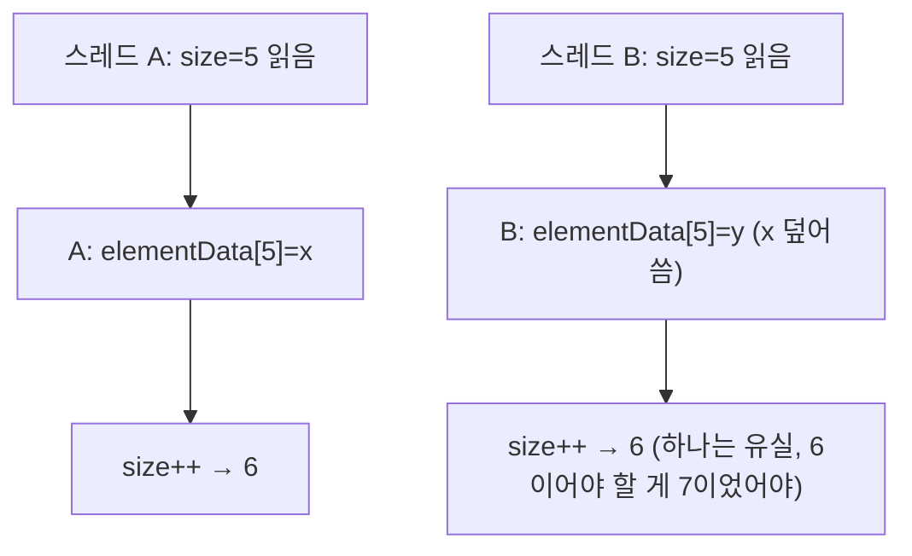

<!-- truncate -->

병렬로 빨리 처리하려고 `CompletableFuture`로 여러 스레드에 일을 나눈 뒤, 결과를 **하나의 리스트에 모으는** 코드는 흔합니다. 그런데 가끔 결과 개수가 모자라거나, `null`이 섞이거나, `ArrayIndexOutOfBoundsException`이 납니다. <mark>원인은 로직이 아니라 "여러 스레드가 스레드 안전하지 않은 `ArrayList`에 동시에 `add`한 것"입니다.</mark> 왜 깨지는지와 올바른 대안을 정리합니다.

```java
List<Result> results = new ArrayList<>(); // 공유 — 스레드 안전하지 않음
List<CompletableFuture<Void>> futures = ids.stream()
    .map(id -> CompletableFuture.runAsync(() -> {
        Result r = call(id);
        results.add(r);            // 여러 스레드가 동시에 add → 문제
    }))
    .toList();
CompletableFuture.allOf(futures.toArray(new CompletableFuture[0])).join();
```

## 왜 깨지나 — `ArrayList.add`는 원자적이지 않다

`add(e)`는 사실 여러 단계입니다 — 대략 ① 공간이 부족하면 내부 배열을 늘리고(리사이즈) ② `elementData[size] = e` 로 넣고 ③ `size++`. 이 셋은 한 덩어리로 묶여 있지 않아, 여러 스레드가 동시에 하면 이렇게 어긋납니다.



- **덮어쓰기 손실** — 두 스레드가 같은 `size`를 읽어 같은 칸에 써, 하나가 사라집니다.
- **size 경합** — `size++`가 겹쳐 실제보다 작게 세어집니다(개수가 모자람).
- **리사이즈 레이스** — 늘리는 도중 다른 스레드가 옛 배열을 참조해 `null` 구멍이나 `ArrayIndexOutOfBoundsException`.

<mark>`ArrayList`는 단일 스레드용이라, 동시 `add`에서는 "가끔" 조용히 데이터가 사라집니다 — 매번이 아니라 가끔이라 더 찾기 어렵습니다.</mark>

## 해결 ① 공유하지 말고, 결과를 모아 병합 (권장)

가장 단순하고 안전한 길은 **애초에 공유 상태를 만들지 않는 것**입니다. 각 작업은 자기 결과만 반환하고, 마지막에 한 스레드가 모읍니다.

```java
List<Result> results = ids.stream()
    .map(id -> CompletableFuture.supplyAsync(() -> call(id))) // 결과를 '반환'
    .toList()
    .stream()
    .map(CompletableFuture::join)   // 여기서 한 스레드가 순서대로 수집
    .toList();                      // 공유 add 없음 → 경합 자체가 없음
```

<mark>동기화를 고민하기 전에 "공유를 없앨 수 있나"를 먼저 봅니다 — 공유가 없으면 스레드 안전 문제도 없습니다.</mark>

## 해결 ② 꼭 공유해야 하면, 동시성 자료구조

여러 스레드가 정말 한 자료구조에 써야 한다면, 스레드 안전한 것을 씁니다.

| 자료구조 | 언제 |
|---|---|
| `ConcurrentLinkedQueue` | 여러 스레드가 마구 담기만 할 때(순서 무관 수집) |
| `ConcurrentHashMap` | 키-값으로 모을 때 |
| `CopyOnWriteArrayList` | **읽기가 대부분, 쓰기가 드물 때**(쓰기마다 통째 복사라 비쌈) |
| `Collections.synchronizedList(...)` | 리스트 전체에 락을 걸 때(간단하지만 경합 큼) |

`ConcurrentLinkedQueue`는 락 없이(내부적으로 CAS로) 동시 `add`를 안전하게 처리합니다. 여러 스레드가 동시에 담아도 유실이 없고, 별도 동기화도 필요 없습니다. 다 담은 뒤 한 번에 읽어 리스트로 옮기면 됩니다.

```java
Queue<Result> results = new ConcurrentLinkedQueue<>();
// ... 각 스레드에서
results.add(r);                          // 스레드 안전, 외부 동기화 불필요
// ... 모든 작업이 끝난 뒤
List<Result> list = new ArrayList<>(results);   // 이제 한 스레드가 읽어 옮김
```

**`Collections.synchronizedList`의 주의점 — 순회는 따로 감싸야 한다.** 이건 `add`·`get` 같은 **개별 메서드에만** 락이 걸립니다. 그래서 `add(r)` 한 번은 안전하지만, `for`/`iterator`로 **순회**할 때는 내부적으로 `hasNext()`·`next()`가 이어지는데, 그 사이 다른 스레드가 `add`하면 `ConcurrentModificationException`이 납니다. 순회 구간은 이렇게 **직접 락으로 감싸야** 합니다.

```java
List<Result> results = Collections.synchronizedList(new ArrayList<>());
// 순회할 때는 반드시 이 블록으로 직접 동기화
synchronized (results) {
    for (Result r : results) { ... }   // 이 동안 다른 스레드의 add는 대기(경합)
}
```

이렇게 순회를 통째로 잠그면 그 동안 모든 쓰기가 막혀 느려지고, 순회할 때마다 직접 잠가 줘야 해 번거롭습니다. <mark>그래서 값을 담기만 하고 마지막에 한 번 읽는 수집이라면, 이런 손이 가는 `synchronizedList`보다 다음이 낫습니다.</mark>

- **`ConcurrentLinkedQueue`로 담기** — 직접 락을 걸 필요가 없어 담는 코드가 단순합니다.
- **공유 컬렉션을 아예 두지 않기** — 해결 ①처럼 각자 결과를 반환하고, 마지막에 한 스레드가 모읍니다.

## 비슷한 실수 — 람다 안의 `int[]` 카운터도 원자적이지 않다

병렬 코드에서 이런 걸 종종 봅니다. 람다 안에서 값을 바꾸려고 배열 트릭을 쓰는 것이죠.

```java
int[] count = {0};
ids.parallelStream().forEach(id -> {
    if (call(id).ok()) count[0]++;   // effectively-final 우회 + 비원자 증가
});
```

배열을 쓴 건 람다가 **`effectively final` 변수만 캡처**할 수 있어서입니다(지역 변수 `int`는 람다 안에서 재할당 불가라, 참조가 고정된 배열의 원소를 바꾸는 우회). 하지만 이렇게 해도 `count[0]++` 한 줄은 사실 **세 단계**라 원자적이지 않습니다.

```text
1) 읽기   : v = count[0]      (예: 5)
2) 더하기 : v + 1             (6)
3) 쓰기   : count[0] = 6
```

두 스레드가 거의 동시에 이 셋을 하면 이렇게 어긋납니다 — A와 B가 **둘 다 5를 읽고**, 둘 다 6을 써서, 두 번 증가했는데 결과는 6(한 번이 유실).

| 시점 | 스레드 A | 스레드 B | count[0] |
|---|---|---|---|
| t1 | 5 읽음 | | 5 |
| t2 | | 5 읽음 | 5 |
| t3 | 6 씀 | | 6 |
| t4 | | 6 씀 | 6 ← 7이어야 함 |

<mark>"읽고-더하고-쓰기"가 하나로 묶이지 않아, 그 사이에 다른 스레드가 끼어들면 증가가 사라지는 것</mark>입니다. 그래서 카운터는 이 세 단계를 원자적으로 묶어 주는 `AtomicInteger`(`incrementAndGet`), 고경합이면 `LongAdder`로 해야 합니다.

```java
LongAdder count = new LongAdder();
ids.parallelStream().forEach(id -> { if (call(id).ok()) count.increment(); });
```

`AtomicLong`과 `LongAdder`의 차이는 [LongAdder는 왜 빠른가](./java-longadder)에서 다뤘습니다.

## 정리

- `ArrayList`·평범한 컬렉션은 단일 스레드용 — **동시 `add`는 조용한 데이터 손실**을 부른다.
- **가장 먼저 "공유를 없애라"** — 결과를 반환해 한 스레드가 모으면 문제가 사라진다.
- 꼭 공유하면 `ConcurrentLinkedQueue`·`ConcurrentHashMap` 등 **동시성 자료구조**를.
- 람다 안 `int[]` 카운터도 비원자 — 카운터는 `AtomicInteger`·`LongAdder`.
- <mark>동시성 버그는 "가끔"만 재현돼 찾기 어려우니, 공유 상태를 처음부터 만들지 않는 게 최선입니다.</mark>

### 용어 한 줄 정리

| 용어 | 쉬운 뜻 |
|---|---|
| 스레드 안전 | 여러 스레드가 동시에 써도 결과가 깨지지 않음 |
| 원자적 | 중간에 끼어들 수 없는 하나의 동작 |
| effectively final | 값이 재할당되지 않아 람다가 캡처할 수 있는 지역 변수 |
| ConcurrentLinkedQueue | 락 없이 동시 담기에 강한 큐 |
| CopyOnWriteArrayList | 쓰기마다 복사 — 읽기 위주에 적합 |
