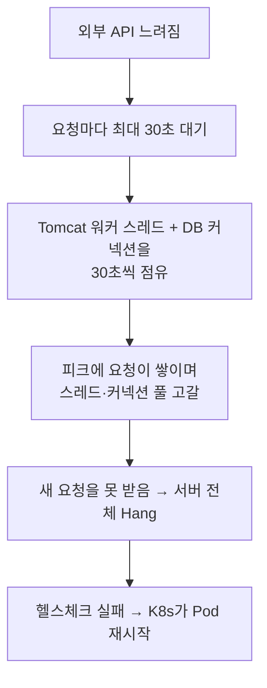

<!-- truncate -->

**상황** — 결제 단계에서 외부 결제 승인 API 호출에 read timeout(30초)이 나기 시작하더니, **몇 분 뒤 서버 전체가 응답 불가(Hang)** 가 됐습니다. 결국 Kubernetes가 헬스체크 실패로 Pod를 재시작했습니다. <mark>느려진 건 외부 API 하나인데 왜 서버 전체가 멈췄을까요?</mark> (Spring Boot 3.x · Kotlin · MySQL 8.0 · Kubernetes)

```text
ERROR c.e.PaymentService : payment approval failed
org.springframework.web.client.ResourceAccessException:
  I/O error on POST request for "https://pay-api.example.com/v1/approve": Read timed out;
  nested exception is java.net.SocketTimeoutException: Read timed out
    at o.s.web.client.RestTemplate.postForEntity(...)
    at c.e.PaymentApproveClient.approve(PaymentApproveClient.java:78)
    at c.e.OrderService.approvePayment(OrderService.java:245)
    at c.e.OrderService.placeOrder(OrderService.java:178)
```

## 무슨 일이 벌어졌나

문제 코드의 특징은 두 가지였습니다 — **동기 블로킹 호출**(RestTemplate)을, 그것도 **트랜잭션 안에서** 했다는 점.

```java
@Transactional
public void placeOrder(...) {
    // ...
    approvePayment(...); // 내부에서 RestTemplate으로 외부 결제 승인 API 동기 호출(read timeout 30s)
    // ...
}
```

외부 API가 느려지자 이런 연쇄가 일어났습니다.



<mark>느린 외부 호출 하나가 요청마다 공유 자원(스레드·DB 커넥션)을 30초씩 붙잡고, 피크에 그게 쌓이며 풀이 바닥나 서버 전체가 멈춘 것</mark>입니다. 특히 트랜잭션 안에서 호출해 **DB 커넥션까지** 30초씩 물고 있었던 게 컸습니다.

## 왜 "하나 느려졌는데 전체가"

서버의 동시 처리량은 **스레드 풀·커넥션 풀 크기**로 정해집니다(리틀의 법칙: 동시 처리 = 유입 × 처리시간 — [서버 지표 읽기](./server-monitoring-analysis)). 처리시간이 30초로 늘면 같은 유입에도 동시 점유가 폭증해 풀이 금방 마릅니다. 풀이 마르면 그 뒤 요청은 전부 대기 → 전체 Hang. <mark>타임아웃 30초는 "실패를 30초나 늦게 인정"하는 설정이라, 장애 시 자원을 오래 묶는 지뢰가 됩니다.</mark>

## 해결 — 짧게 끊고, 밖으로 빼고, 격리한다

- **타임아웃을 짧게** — connect/read를 나눠 초 단위로. 외부가 느리면 빨리 실패해 자원을 즉시 놓아줍니다.
- **외부 호출을 트랜잭션 밖으로** — DB 커넥션을 외부 응답 동안 붙잡지 않게. (rollback-only 문제도 함께 피함 — [try-catch로 잡았는데 왜 롤백될까](./spring-transaction-rollback-only))
- **서킷 브레이커** — 외부가 계속 실패하면 잠깐 호출을 끊어 빠르게 대체 응답(전파 차단).
- **벌크헤드(격리)** — 외부 호출용 스레드 풀을 따로 둬, 그게 막혀도 나머지 요청은 살립니다.
- **타임아웃 예산** — 바깥일수록 길게·안쪽일수록 짧게 차등. 재시도는 백오프+상한.

```java
var factory = new SimpleClientHttpRequestFactory();
factory.setConnectTimeout(1000); // 1s
factory.setReadTimeout(2000);    // 2s — 30s는 너무 길다
```

<mark>외부 의존은 "언젠가 느려진다"를 전제로, 빨리 실패하고 국소적으로 격리하도록 설계해야 합니다.</mark>

## 정리

- 동기 외부 호출이 느려지면 **요청마다 스레드·커넥션을 오래 점유** → 풀 고갈 → 서버 전체 Hang.
- **긴 타임아웃 + 트랜잭션 안 외부 호출**이 피해를 키운다.
- 해결은 **짧은 타임아웃 · 트랜잭션 밖 호출 · 서킷 브레이커 · 벌크헤드 · 백오프 재시도**.
- 부하가 늘 때 어디부터 문제가 생기는지는 [트래픽이 늘면 어디부터 문제가 생기나](./traffic-growth-problems), 풀 사이징은 [스레드 풀](./spring-boot-thread-pools) 참고.

### 용어 한 줄 정리

| 용어 | 쉬운 뜻 |
|---|---|
| read timeout | 응답을 기다리는 최대 시간(초과 시 실패) |
| 풀 고갈 | 스레드·커넥션이 다 점유돼 새 요청을 못 받는 상태 |
| 서킷 브레이커 | 계속 실패하면 잠깐 호출을 끊어 전파를 막는 장치 |
| 벌크헤드 | 자원을 칸막이로 나눠 한 곳 장애가 전체로 안 번지게 |
