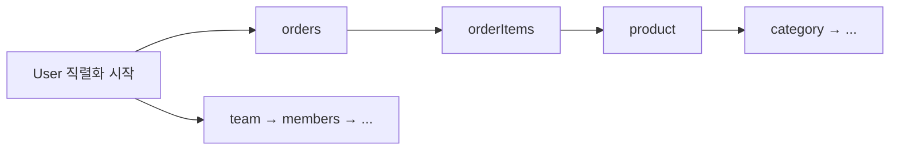

<!-- truncate -->

엔티티 클래스에 습관처럼 `implements Serializable`을 붙이는 경우가 많습니다. IDE가 권하기도 하고, "세션에 담으려면", "캐시하려면", "API로 내보내려면" 같은 이유로요. 그런데 <mark>대부분의 경우 엔티티에 `Serializable`은 필요 없고, 오히려 지연 로딩·객체 그래프·버전 관리에서 문제를 부릅니다.</mark> 왜 붙이게 되는지(오해), 붙이면 무엇이 문제인지, 그리고 어떻게 해야 하는지 정리합니다. (영속성 컨텍스트 이야기는 [@DataJpaTest 컨텍스트 OOM](./spring-datajpatest-context-oom)도 참고)

## 왜 엔티티에 Serializable을 붙이게 되나

대부분은 "필요하다고 오해"해서입니다.

- **API 응답으로 내보내려고** — 가장 흔한 오해. JSON 응답은 자바 직렬화(`Serializable`)와 **무관**합니다. Jackson은 필드·게터를 읽어 JSON을 만들 뿐, `Serializable`을 요구하지 않습니다.
- **HttpSession에 담으려고** — 세션 클러스터링(세션을 디스크·다른 서버로 복제)하면 자바 직렬화가 일어나긴 합니다. 하지만 엔티티를 세션에 담는 것 자체가 권장되지 않습니다.
- **2차 캐시에 올리려고** — 분산 캐시 등 일부 구성은 직렬화를 요구할 수 있습니다(뒤의 "예외").
- **레거시 습관·자바빈 규약** — 그냥 관성적으로.

<mark>특히 "JSON으로 응답하니까 Serializable이 필요하다"는 건 사실이 아닙니다 — 그 목적이라면 붙일 이유가 전혀 없습니다.</mark>

## 붙이면 생기는 문제

### 1. 지연 로딩 프록시가 직렬화를 깨뜨린다

연관관계가 `FetchType.LAZY`면, 실제 값 대신 **하이버네이트 프록시/지연 컬렉션**이 들어 있습니다. 이걸 **영속성 컨텍스트 밖(detached)** 에서 자바 직렬화하면, 아직 초기화되지 않은 프록시를 건드리다 `LazyInitializationException`이 나거나 불완전하게 직렬화됩니다.

```java
// 트랜잭션 안에서 조회 (order.items 는 LAZY → 아직 프록시)
User user = userRepository.findById(id).get();
session.setAttribute("user", user);   // 세션 복제 시점엔 트랜잭션이 끝나 detached
// → 세션을 직렬화하며 미초기화 프록시 접근 → LazyInitializationException
```

<mark>세션·캐시에 담기는 시점은 대개 트랜잭션 밖이라, 지연 로딩 상태의 엔티티 직렬화는 터지기 쉽습니다.</mark>

### 2. 연관관계를 타고 객체 그래프 전체가 딸려간다

자바 직렬화는 **참조로 도달 가능한 모든 객체**를 통째로 직렬화합니다. 엔티티는 양방향 연관·컬렉션으로 얽혀 있어, 하나를 직렬화하려다 연결된 그래프가 줄줄이 끌려옵니다.



<mark>User 하나 저장하려다 주문·상품·팀까지, 사실상 DB의 절반이 세션·캐시로 딸려갈 수 있습니다.</mark> `transient`로 끊을 수 있지만, 연관마다 챙겨야 해 관리 부담이 큽니다.

### 3. serialVersionUID 관리 부담과 버전 불일치

`Serializable`을 쓰면 `serialVersionUID`를 신경 써야 합니다. 엔티티는 **필드가 자주 바뀌는데**, 세션·캐시에 직렬화해 둔 옛 바이트와 바뀐 클래스가 안 맞으면 역직렬화가 `InvalidClassException`으로 실패합니다.

```java
private static final long serialVersionUID = 1L; // 명시 안 하면 변경마다 자동값이 달라져 역직렬화 실패
```

<mark>자주 바뀌는 엔티티를 직렬화 저장하면 배포 사이에 버전이 어긋나 깨지기 쉽습니다.</mark>

### 4. detached 스냅샷을 "엔티티처럼" 착각한다

역직렬화된 엔티티는 영속성 컨텍스트와 분리된 **과거 스냅샷**입니다. 다시 `merge`로 붙이지 않으면 변경 감지·지연 로딩이 전혀 안 되는 그냥 데이터 덩어리인데, 생김새가 엔티티라 "관리되는 엔티티"로 착각하기 쉽습니다.

## 평소엔 멀쩡하다가 갑자기 터지는 상황

먼저 핵심 하나 — **세션에 담은 객체는 "그 서버 밖으로 나갈 때"만 직렬화(바이트로 변환)됩니다.** 서버 안 메모리에 있는 동안엔 그냥 자바 객체라, 직렬화가 일어나지 않습니다. 그래서 문제가 이런 순서로 숨어 있습니다.

1. 로그인할 때 편의로 엔티티를 세션에 담아 둡니다 — `session.setAttribute("loginUser", user)`. (`User`엔 `Serializable`, `orders`는 `LAZY`)
2. **서버가 1대**거나 "같은 사용자는 늘 같은 서버로" 붙는 스티키 세션이면, 세션은 그 서버 메모리에만 머뭅니다 → **직렬화가 아예 안 일어남** → 몇 달간 아무 문제 없음.
3. 그러다 세션을 **서버 메모리가 아니라 외부 저장소(예: Redis)에 저장**하도록 바꿉니다 — 서버가 여러 대면 어느 서버로 붙어도 로그인이 유지돼야 하고, 서버를 재시작·배포해도 로그인이 안 풀려야 하니까요. 그런데 세션을 Redis로 보내려면 자바 객체를 **바이트로 변환(=직렬화)** 해야 합니다. **바로 이 순간 `user`가 처음으로 직렬화**됩니다.
4. 그 순간 `user`를 바이트로 바꾸다가 아직 안 불러온 `orders`(LAZY 프록시)를 건드립니다 → 트랜잭션은 이미 끝나 `LazyInitializationException`.
5. (겹치면) 직전 배포에서 `User`에 필드를 추가했다면, 이미 Redis에 저장돼 있던 옛 세션을 되읽을 때 `serialVersionUID`가 안 맞아 `InvalidClassException`까지 납니다.

<mark>여기서 "안 쓰던 기능"이란 세션을 서버 밖으로 내보내는 동작(다중 서버·배포·장애 복구)이고, 그게 처음 발동하는 순간에야 직렬화가 실행돼 문제가 드러납니다.</mark> 캐시도 똑같습니다 — 로컬 캐시일 땐 직렬화가 없다가, 분산 캐시로 바꾸면 그때 처음 직렬화되며 같은 문제가 납니다.

## 예외 — 정말 필요한 경우

- **복합 키 클래스**(`@EmbeddedId`·`@IdClass`)는 **JPA 스펙상 `Serializable`이어야 합니다.** 이건 정당한 사용입니다. (식별자 클래스이지 엔티티 본체가 아님)
- **분산 2차 캐시·세션 클러스터링**처럼 직렬화가 실제로 요구되는 구성이라면 붙여야 합니다. 이땐 `serialVersionUID` 명시, 지연 로딩 초기화 상태 관리, 직렬화 그래프 범위 통제가 함께 필요합니다.

<mark>정리하면 "식별자(PK) 클래스"는 Serializable이 맞고, "엔티티 본체"는 대부분 불필요합니다.</mark>

## 헷갈리기 쉬운 것 — API가 엔티티를 반환할 때 (Serializable과는 별개)

지금까지는 자바 직렬화(`Serializable`) 이야기였습니다. 그런데 컨트롤러가 `return user;`처럼 **엔티티를 그대로 응답으로 내보내는 것**도 비슷한 함정이 있는데, 이건 `Serializable`이 아니라 **JSON 직렬화(Jackson)** 에서 나는 **별개의** 문제입니다(Jackson은 `Serializable`을 보지 않습니다).

- 평소 쓰는 API는 응답에 필요한 연관이 우연히 이미 초기화됐거나, OSIV(뷰까지 트랜잭션 유지)로 `LAZY`가 그때그때 로딩돼 무탈합니다.
- 그러다 **어쩌다 한 번 호출되는 엔드포인트**가 초기화 안 된 다른 `LAZY` 연관을 건드리면, Jackson이 미초기화 프록시를 직렬화하다 `LazyInitializationException`이 납니다.

<mark>즉 `Serializable`을 붙였는지와 무관하게, 엔티티를 응답으로 내보내는 것 자체가 LAZY·그래프라는 같은 뿌리의 문제를 부릅니다.</mark> 그래서 해법도 같습니다 — DTO로 분리.

> **Q. `fetch join`·`@EntityGraph`로 미리 로딩하면 되지 않나?**
>
> **A.** 부분적으로만 맞습니다. 미리 초기화한 연관은 `LazyInitializationException`을 피하지만, ① **그래프에 안 넣은 다른 `LAZY` 연관**은 여전히 프록시라 터질 수 있고, ② 이건 **쿼리마다** 지정해야 해 하필 "어쩌다 호출되는 엔드포인트"에서 빠뜨리기 쉽습니다. 게다가 자바 직렬화(세션·캐시)에서는 미리 초기화해봐야 **초기화된 그래프가 오히려 더 크게 딸려가고**, `serialVersionUID`·detached 문제는 그대로입니다. 미리 로딩은 증상 하나를 가릴 뿐, 경계를 넘기는 문제는 DTO로 끊어야 합니다.

## 그럼 어떻게 — DTO로 분리

계층 밖(응답·세션·캐시)으로 나갈 데이터는 **엔티티 대신 DTO**로 옮겨, 필요한 필드만 명시적으로 담습니다.

```java
public record UserResponse(Long id, String name, int orderCount) {
    static UserResponse from(User u) {
        return new UserResponse(u.getId(), u.getName(), u.getOrders().size());
    }
}
```

- **API 응답** — DTO + Jackson(JSON). `Serializable` 불필요.
- **세션** — 엔티티 대신 식별자나 최소 DTO만.
- **캐시** — 엔티티 대신 필요한 필드만 담은 DTO/값 객체(직렬화 범위·버전이 명확).

<mark>DTO로 경계를 명확히 하면 지연 로딩·그래프 폭발·버전 문제를 원천적으로 피하면서, 나갈 데이터를 의도대로 통제할 수 있습니다.</mark>

## 정리

- 엔티티에 `Serializable`은 **대부분 불필요** — 특히 JSON 응답 목적이면 아무 상관이 없다.
- 붙이면 **지연 로딩 프록시 예외·그래프 전체 직렬화·`serialVersionUID` 버전 깨짐·detached 혼동**을 부른다.
- **복합 키 클래스**와 **직렬화를 요구하는 캐시/세션 구성**만 예외.
- <mark>경계를 넘는 데이터는 DTO로 분리하는 것이 정답입니다.</mark>

### 용어 한 줄 정리

| 용어 | 쉬운 뜻 |
|---|---|
| Serializable | 객체를 바이트로 직렬화 가능하게 하는 자바 표준 인터페이스 |
| 지연 로딩 프록시 | LAZY 연관을 실제 값 대신 채워두는 대리 객체 |
| detached | 영속성 컨텍스트에서 분리된 엔티티(변경 감지 안 됨) |
| serialVersionUID | 직렬화 클래스의 버전 식별자(불일치 시 역직렬화 실패) |
| DTO | 계층 간 전송용 데이터 객체(필요한 필드만) |
