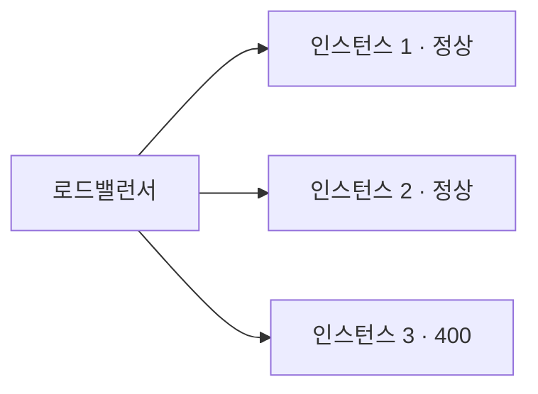
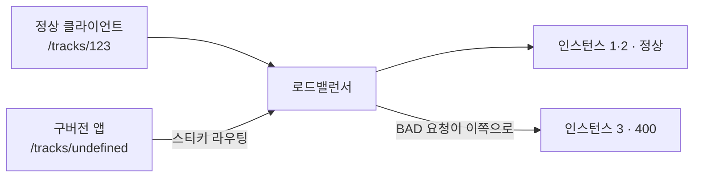

<!-- truncate -->

**상황** — 같은 서비스를 서버 3대로 돌리고 있는데, **두 대는 정상인데 한 대만 400(Bad Request)** 을 냅니다. 코드도, 배포한 도커 이미지도 세 대가 같다고 합니다. 로그엔 "유효하지 않은 파라미터", `IllegalArgumentException`, `Integer` 같은 단서가 보입니다. <mark>코드가 같은데 왜 한 대만 다르게 굴까요?</mark> 이 질문의 범위를 어떻게 줄여 가는지 정리합니다.

## 먼저 400이 무슨 뜻인가

`400 Bad Request`는 **"요청이 잘못됐다"** — 서버 코드의 버그라기보다 **들어온 요청(파라미터·본문·타입)이 서버가 받을 수 있는 형태가 아니다**라는 신호입니다. (HTTP 메서드가 틀리면 400이 아니라 `405 Method Not Allowed`라, 400은 대개 값·형식 문제)

스프링 MVC에서 흔한 400 하나는 **경로 변수(PathVariable) 타입 불일치**입니다.

```text
WARN o.s.w.s.m.s.DefaultHandlerExceptionResolver :
  Resolved [MethodArgumentTypeMismatchException:
   Failed to convert value of type 'String' to required type 'Integer';
   nested exception is java.lang.NumberFormatException: For input string: "..."]
```

```java
@GetMapping("/tracks/{trackId}")
public TrackResponse get(@PathVariable Integer trackId) { ... } // trackId가 정수로 변환 안 되면 400
```

<mark>즉 이 400은 "그 요청의 `trackId` 값이 정수로 바꿀 수 없는 값"이라는 뜻입니다.</mark> 그런데 코드는 세 대가 같으니, 같은 요청이면 세 대 다 같은 400이 나야 정상입니다.

## 핵심 질문 — 같은 코드인데 왜 한 대만?



같은 코드로 **입력이 같으면 결과도 같아야** 합니다. 한 대만 다르다면, 셋 중 하나가 실제로는 **같지 않다**는 뜻입니다 — 무엇이 다른지부터 찾아야 합니다.

## 무엇이 다를 수 있나 (의심할 곳)

<mark>"특정 한 대만" 문제의 원인은 십중팔구 코드가 아니라 배포·요청·환경 중 무엇이 다른가입니다.</mark> 후보를 예시로 봅니다.

### ① 배포가 사실은 다르다 (가장 흔함)

롤링 배포 중 한 대만 구버전이 남았거나, **태그는 같은데 실제 이미지 다이제스트가 다른** 경우입니다. 태그(`:latest`, `:2026.08`)는 같아도 내용은 다를 수 있으니, **다이제스트**로 확인합니다.

```bash
# 파드별 실제 이미지 다이제스트 비교 — 한 대만 다르면 배포 불일치
kubectl get pods -l app=track \
  -o jsonpath='{range .items[*]}{.metadata.name}{"\t"}{.status.containerStatuses[0].imageID}{"\n"}{end}'

# track-1  ...@sha256:aaaa   ← 신버전
# track-2  ...@sha256:aaaa
# track-3  ...@sha256:bbbb   ← 이 한 대만 구버전
```

`/actuator/info`의 git 커밋 해시를 세 대에서 비교해도 같은 걸 잡을 수 있습니다.

### ② 그 인스턴스로 오는 요청이 다르다

서버가 이상한 게 아니라 **그 서버로 라우팅된 요청만 이상한** 경우입니다. 스티키 세션이나 특정 클라이언트(구버전 앱 등)가 그 한 대로 몰려, 정수가 아닌 `trackId`를 보내고 있을 수 있습니다.



그 한 대의 접근 로그를 보면 요청 값이 드러납니다.

```text
# 인스턴스 3 접근 로그 — 정수 자리에 문자열이 들어옴
GET /tracks/undefined  → 400
GET /tracks/           → 400   (빈 값)
```

<mark>이 경우 "그 서버가 고장"이 아니라 "그 서버로 온 요청이 잘못"이라, 고칠 곳은 서버가 아니라 클라이언트/라우팅입니다.</mark>

### ③ 환경이 다르다

> 참고: 이번의 "정수 변환 실패" 400은 **프레임워크가 입력값만 보고** 내는 것이라 설정(env)으로 갈리지 않습니다. ③·④는 그와 **별개로** "한 대만 다르게 동작"하는 더 일반적인 원인으로, 보통 **다른 형태의 400·오류**로 나타납니다.

그 노드만 환경변수·설정이 달라, **앱이 스스로 하는 파라미터 검증**이 갈리는 경우입니다. 예를 들어 "ID 범위 검증"을 설정으로 켜고 끄게 해뒀다면, 그 값이 노드마다 다를 때 한 대만 특정 요청을 거부(400)합니다.

```bash
kubectl exec track-1 -- printenv | sort   # 정상 노드
kubectl exec track-3 -- printenv | sort   # 문제 노드
```

```text
정상 노드(track-1):  ID_RANGE_CHECK=off
문제 노드(track-3):  ID_RANGE_CHECK=on     ← 이 노드만 범위 검증을 켜 둠 → 같은 요청도 400
```

배포 때 그 노드에만 옛 설정이 남았거나, 설정을 잘못 주입한 경우입니다.

### ④ 상태·초기화가 다르다

배포·환경이 같아도, **시작할 때 메모리에 채워 넣는 것**(캐시·매핑 테이블·컨버터)이 인스턴스마다 다르게 채워질 수 있습니다. 부팅 순간 외부(DB·설정 서버) 응답이 잠깐 느리거나 실패하면, 한 대만 **불완전한 상태**로 뜨는 것이죠.

예를 들어 시작 시 "유효한 ID 목록"을 외부에서 불러와 메모리에 캐시하고, 요청이 오면 그 캐시로 검증한다고 해봅시다.

```java
@Component
class IdCache {
    private Set<Integer> validIds = Set.of();

    @PostConstruct
    void load() {
        try {
            validIds = api.fetchValidIds();   // 부팅 때 한 번 로드
        } catch (Exception e) {
            log.warn("ID 캐시 로드 실패", e);   // 예외를 삼켜 '빈 캐시'로 그냥 뜬다
        }
    }
}
```

그 한 대만 부팅 중 로드에 실패하면 `validIds`가 비어, **정상 요청도 "없는 ID"로 보고 거부(400)** 합니다. 나머지 두 대는 정상이라 "한 대만 다른" 모양이 됩니다.

확인법과 특징:
- 액추에이터/헬스에 **캐시 크기·초기화 성공 여부**를 노출해 세 대를 비교(정상 1,000개 / 문제 노드 0개 식).
- 시작 로그에 "로드 실패" 경고가 **그 노드에만** 있는지.
- <mark>재시작하면 증상이 사라지거나 다른 노드로 옮겨 다니는 것이 이 유형의 전형적 신호입니다 — 부팅 타이밍에 좌우되기 때문입니다.</mark>

정리하면 이번 "정수 변환 400"에는 **①·②가 직접 맞고**, ③·④는 "한 대만 다르게 동작"하는 더 일반적인 원인입니다. 어느 쪽이든 코드를 뜯기 전에 이 넷 중 "무엇이 다른가"부터 비교하는 게 빠릅니다.

## 어떻게 범위를 줄이나 (거꾸로 질문하기)

면접에서 면접관이 기대한 건 "코드의 어느 줄" 이전에 **차이를 줄여 가는 질문**이었습니다.

1. **정말 같은 빌드인가** — 세 대의 **이미지 다이제스트·커밋 해시·`/actuator/info` 버전**을 직접 비교. "태그가 같다"가 아니라 다이제스트로 확인.
2. **그 400 요청이 실제로 무엇인가** — 접근 로그에서 그 한 대에 온 400 요청의 **실제 URL·`trackId` 값**을 본다. 값이 비정상이면 원인은 서버가 아니라 요청(②).
3. **그 인스턴스만 오는 요청인가** — 같은(정상) 요청을 세 대에 **직접** 보내 본다. 셋 다 정상이면 "그 서버 문제"가 아니라 "그 서버로 온 요청 문제".
4. **환경을 비교** — env·설정·JVM·로케일을 나란히 diff.

<mark>즉 "코드 어디가 문제냐"보다 "세 대 중 무엇이 다르냐(빌드·요청·환경)"를 먼저 비교하는 게 지름길입니다.</mark> 스택트레이스는 그 첫 힌트이고(여기선 `Integer` 변환 실패 → `trackId`), 로그는 항상 가장 많은 단서를 줍니다.

## 정리

- `400`은 대개 **요청(파라미터·타입) 문제** — 여기선 `PathVariable`의 정수 변환 실패.
- 코드가 같은데 **한 대만** 다르면, 셋 중 하나가 실제로 다른 것 — **배포 불일치·요청 차이·환경 차이·상태 차이**를 의심.
- 진단은 **이미지 다이제스트/버전 비교 → 그 요청의 실제 값 확인 → 세 대에 같은 요청 재현 → 환경 diff** 순.
- <mark>"특정 인스턴스만"은 코드보다 "무엇이 다른가"를 비교하는 문제입니다.</mark>

지표·로그로 범위를 줄여 가는 일반 원칙은 [서버 지표 읽기](./server-monitoring-analysis)도 함께 보세요.

### 용어 한 줄 정리

| 용어 | 쉬운 뜻 |
|---|---|
| 400 Bad Request | 요청 자체가 잘못됨(값·형식·타입) |
| PathVariable | URL 경로에 담긴 값(예: `/tracks/{trackId}`) |
| MethodArgumentTypeMismatchException | 파라미터를 요구 타입으로 못 바꿀 때 나는 스프링 예외(→400) |
| 이미지 다이제스트 | 태그와 별개로 이미지 내용을 식별하는 해시 |
| 롤링 배포 | 인스턴스를 차례로 교체하는 배포(일부만 남을 수 있음) |
