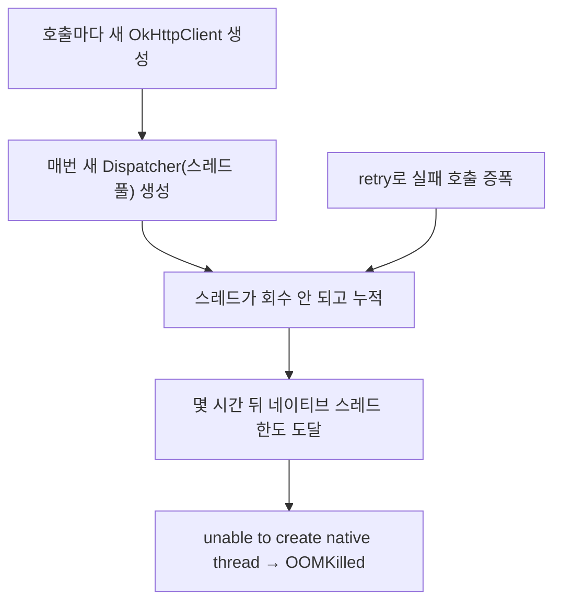

<!-- truncate -->

**상황** — 배포 후 **반나절쯤 지나** 간헐적으로 Pod가 `OOMKilled`로 재시작됐습니다. 트래픽은 평소와 큰 차이가 없었고, 최근 변경은 **외부 추천 API 호출을 OkHttp로 추가하고 retry·timeout을 설정**한 것뿐이었습니다. <mark>힙을 아무리 봐도 여유가 있는데 왜 OOM이 날까요?</mark> (Spring Boot 3.x · Kotlin 1.9.x · Java 17 · OkHttp · Kubernetes)

```text
ERROR c.e.RecommendController : Unexpected error
java.lang.OutOfMemoryError: unable to create native thread:
  possibly out of memory or process/resource limits reached
    at java.base/java.lang.Thread.start0(Native Method)
    at java.base/java.lang.Thread.start(Thread.java:809)
    at java.base/j.u.concurrent.ThreadPoolExecutor.addWorker(ThreadPoolExecutor.java:945)
    at java.base/j.u.concurrent.ThreadPoolExecutor.execute(ThreadPoolExecutor.java:1364)
    at okhttp3.Dispatcher.enqueue(Dispatcher.kt)
    at okhttp3.RealCall.enqueue(RealCall.kt)
    at c.e.RecommendApiClient.fetchAsync(RecommendApiClient.java:87)
```

## 이 OOM은 "힙 부족"이 아니다

이름은 `OutOfMemoryError`지만, `unable to create native thread`는 **힙이 부족한 게 아니라 스레드를 더 못 만드는 것**입니다. 스레드 하나는 힙 밖 **네이티브 메모리(스레드 스택)** 를 쓰고, OS의 **스레드/프로세스 개수 한도**도 있습니다. <mark>스레드가 계속 쌓여 이 한도에 부딪히면 이 예외가 나고, 그 스택들이 컨테이너 메모리를 넘기면 커널이 `OOMKilled`로 종료합니다.</mark> 힙과 별개라 힙 그래프만 봐선 안 보입니다. (힙 밖 메모리 이야기는 [JVM 튜닝 시나리오](./jvm-tuning-scenarios) 상황 4 참고)

## 무슨 일이 벌어졌나

`OkHttp Dispatcher`의 스레드가 계속 쌓이는 구조였습니다. 흔한 원인 두 가지:

- **OkHttpClient를 호출마다 새로 생성** — `OkHttpClient`는 자체 `Dispatcher`(스레드 풀)와 커넥션 풀을 가집니다. 요청마다 새로 만들면 스레드 풀도 계속 생겨 **회수되지 않고 누적**됩니다.
- **비동기 `enqueue`를 상한 없이 + retry 증폭** — 실패가 재시도로 늘어나 대기·실행 스레드가 더 쌓입니다.



<mark>트래픽이 그대로여도, 스레드가 조금씩 누적되면 몇 시간에 걸쳐 한도에 부딪힙니다 — 그래서 배포 직후가 아니라 반나절쯤 지나 터진 것</mark>입니다.

## 어떻게 찾나

- **스레드 수 추이**를 본다 — 시간이 지날수록 우상향이면 스레드 누수. (`jcmd <pid> Thread.print`, 리눅스면 `/proc/<pid>/status`의 `Threads`)
- 스레드 덤프에서 `OkHttp Dispatcher` 같은 이름의 스레드가 **수천 개**로 불어나 있는지 확인.

## 해결 — 클라이언트는 재사용, 동시성엔 상한

- **`OkHttpClient`는 싱글톤으로 재사용** — 앱 전체가 하나(또는 소수)를 공유해 `Dispatcher`·커넥션 풀을 재사용합니다. **호출마다 생성 금지.**
- **Dispatcher에 동시 요청 상한** — `maxRequests` / `maxRequestsPerHost`로 폭증을 막습니다.
- **retry는 상한 + 백오프** — 무한·중첩 재시도 금지.
- **컨테이너 자원 한도 고려** — 스레드 스택(`-Xss`)·`ulimit`·컨테이너 메모리. 힙은 `-XX:MaxRAMPercentage`로 잡되 **힙 밖 몫을 남긴다**([JVM 튜닝](./jvm-tuning-scenarios)).

```java
@Bean
OkHttpClient okHttpClient() { // 앱당 하나만
    var client = new OkHttpClient.Builder()
            .connectTimeout(Duration.ofSeconds(1))
            .readTimeout(Duration.ofSeconds(2))
            .build();
    client.dispatcher().setMaxRequests(64);
    client.dispatcher().setMaxRequestsPerHost(16);
    return client;
}
```

<mark>클라이언트는 재사용하고 동시성엔 상한을 두는 것 — 이 둘이면 스레드 폭증은 거의 사라집니다.</mark>

## 정리

- `unable to create native thread`는 **힙이 아니라 네이티브 스레드 한도** 문제. `OOMKilled`도 힙 밖 메모리 초과.
- 원인은 **OkHttpClient 재생성·상한 없는 비동기·retry 증폭**으로 스레드가 몇 시간에 걸쳐 누적된 것.
- 해결은 **클라이언트 싱글톤 재사용 · Dispatcher 상한 · retry 상한 · 컨테이너 자원 한도 고려**.
- <mark>배포 직후가 아니라 몇 시간 뒤 터지는 건 "천천히 쌓이는" 누수의 전형입니다.</mark>

느린 외부 호출이 부르는 다른 장애는 [외부 API 하나가 느려지자 서버 전체가 멈췄다](./external-api-timeout-server-hang)도 함께 보세요.

### 용어 한 줄 정리

| 용어 | 쉬운 뜻 |
|---|---|
| 네이티브 스레드 | JVM 힙 밖, OS가 관리하는 실제 스레드(스택 메모리 사용) |
| unable to create native thread | 스레드를 더 못 만드는 상태(개수·네이티브 메모리 한도) |
| OOMKilled | 컨테이너 메모리 한도 초과로 커널이 종료(exit 137) |
| Dispatcher | OkHttp가 요청을 실행하는 스레드 풀·큐 |
