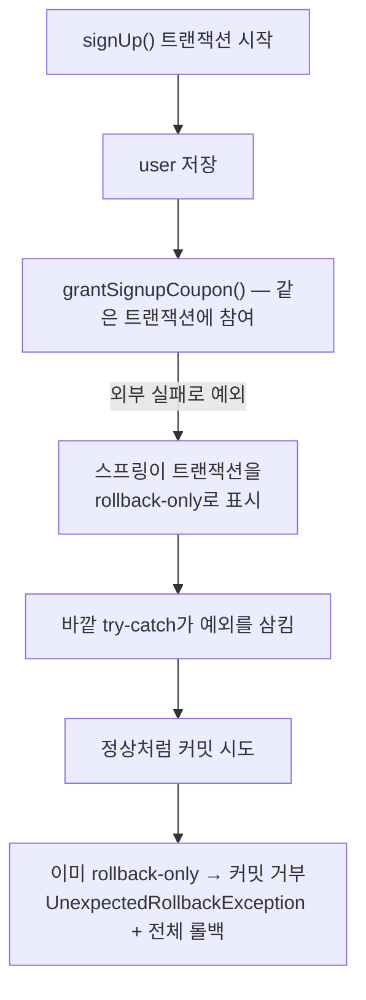

<!-- truncate -->

**상황** — 금요일 오후 피크에 회원가입에서 간헐적으로 500 에러가 났습니다. 최근 배포에서 "외부 API가 실패해도 가입은 진행되게" `try-catch`로 예외를 처리하도록 바꿨는데, <mark>예외를 분명히 잡았는데도 가입 데이터가 DB에 저장되지 않고 트랜잭션이 통째로 롤백됐습니다.</mark> (Spring Boot 3.x · Kotlin · MySQL 8.0)

로그엔 이 예외가 찍혔습니다.

```text
ERROR c.e.SignUpController : Unexpected error during sign-up
org.springframework.transaction.UnexpectedRollbackException:
  Transaction silently rolled back because it has been marked as rollback-only
    at o.s.t.support.AbstractPlatformTransactionManager.processCommit(...:752)
    at o.s.t.support.AbstractPlatformTransactionManager.commit(...:711)
    at o.s.t.interceptor.TransactionAspectSupport.commitTransactionAfterReturning(...)
    at o.s.t.interceptor.TransactionInterceptor.invoke(...)
    at c.e.SignUpController.signUp(SignUpController.java:89)
```

## 무슨 일이 벌어졌나

코드는 대략 이런 모양이었습니다.

```java
@Transactional
public void signUp(SignUpRequest req) {
    userRepository.save(user);
    try {
        couponService.grantSignupCoupon(user); // 내부도 @Transactional
    } catch (Exception e) {
        log.warn("가입 쿠폰 발급 실패, 무시하고 진행", e); // 예외를 삼킴
    }
    // 정상 종료 → 커밋 시도 → 여기서 UnexpectedRollbackException
}
```

핵심은 `grantSignupCoupon`도 `@Transactional`(기본 전파 `REQUIRED`)이라는 점입니다.



<mark>내부 `@Transactional`이 던진 예외는, 바깥에서 잡아 삼켜도 트랜잭션에 남긴 "rollback-only" 표시까지 지우지는 못합니다.</mark> 그래서 커밋 시점에 스프링이 "이 트랜잭션은 롤백만 가능"이라며 거부하고, 저장한 user까지 전부 롤백됩니다.

## 왜 스프링은 이렇게 동작하나

`REQUIRED` 전파에서 내부 메서드는 **새 트랜잭션이 아니라 바깥 트랜잭션에 참여**합니다(물리적으로 하나). 이 참여 구간에서 예외가 터지면, 스프링은 트랜잭션을 **rollback-only**로 표시합니다(`globalRollbackOnParticipationFailure` 기본값).

<mark>즉 "예외를 잡았으니 없던 일"이 아니라, 트랜잭션은 이미 오염돼 커밋할 수 없는 상태가 된 것입니다.</mark> 그래서 잡아도 소용이 없고, 커밋 때 `UnexpectedRollbackException`으로 드러납니다.

## 해결 — 실패해도 되는 작업을 트랜잭션에서 떼어낸다

"가입 쿠폰은 실패해도 가입은 되게" 하려면, 그 작업이 **부모 트랜잭션을 오염시키지 않게** 경계를 나눠야 합니다.

**방법 1 — 외부 호출을 트랜잭션 밖으로.** 가장 깔끔합니다. 핵심 저장과 선택적 외부 작업을 분리합니다.

```java
public void signUp(SignUpRequest req) {
    userService.saveUser(user);      // @Transactional — 이것만 커밋
    tryGrantSignupCoupon(user);      // 트랜잭션 밖, 실패해도 가입엔 영향 없음
}
```

**방법 2 — 선택적 작업을 별도 트랜잭션으로(`REQUIRES_NEW`).** 내부를 독립 트랜잭션으로 떼면, 내부 실패가 바깥을 오염시키지 않습니다.

```java
@Transactional(propagation = Propagation.REQUIRES_NEW)
public void grantSignupCoupon(User user) { ... }
```

<mark>핵심은 "잡느냐"가 아니라 "실패가 같은 트랜잭션을 오염시키지 않게 경계를 긋느냐"입니다.</mark> 외부 호출은 되도록 트랜잭션 밖에서 하는 편이 좋고(커넥션 점유·지연 문제도 함께 피함 — [외부 API 하나가 느려지자 서버 전체가 멈췄다](./external-api-timeout-server-hang)), 트랜잭션 안에 둬야 한다면 전파를 명확히 설계합니다.

## 정리

- `REQUIRED` 전파에서 **내부 `@Transactional`의 예외는 트랜잭션을 rollback-only로 표시**한다.
- 바깥에서 `try-catch`로 삼켜도 표시는 남아, **커밋 때 `UnexpectedRollbackException`** 으로 전체가 롤백된다.
- 해결은 **실패해도 되는 작업(외부 호출 등)을 트랜잭션 밖 또는 `REQUIRES_NEW`로 분리**하는 것.
- <mark>예외를 "잡았다"가 아니라 트랜잭션 "경계"를 나눴는지가 핵심입니다.</mark>

### 용어 한 줄 정리

| 용어 | 쉬운 뜻 |
|---|---|
| rollback-only | 트랜잭션이 "롤백만 가능"으로 표시된 상태 |
| UnexpectedRollbackException | rollback-only인데 커밋을 시도해 나는 예외 |
| REQUIRED | 바깥 트랜잭션이 있으면 거기에 참여(기본 전파) |
| REQUIRES_NEW | 항상 새 트랜잭션을 열어 독립 처리 |
