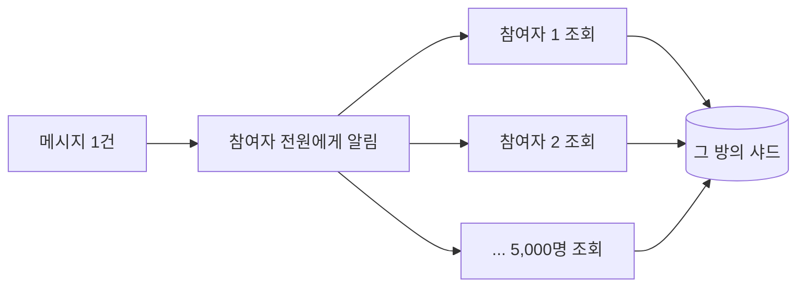
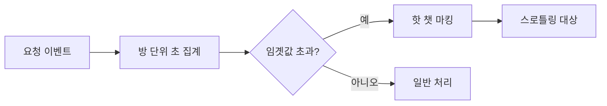

import {AnimatedBars} from '@site/src/components/blog/MonitorCharts';

<!-- truncate -->

전체 채팅방의 0.1%도 안 되는 극소수 방이 어느 순간 평소의 100배 트래픽을 냅니다. 이걸 감당하려고 전체 인프라를 100배로 키우는 것은 낭비입니다. 갑자기 튀는 소수만 감지해서, 그 대상만 완화·격리하면 됩니다. 이 글은 그 방법을 감지 → 스로틀링 → 원본 병목 해소 → 장애 격리 순으로 정리합니다. (LINE 오픈챗의 [100배 트래픽 스파이크 처리 사례](https://engineering.linecorp.com/ko/blog/how-line-openchat-server-handles-extreme-traffic-spikes)를 보고 개념을 제 언어로 다시 정리한 글입니다.)

<mark>전체를 키우는 대신, 갑자기 튀는 극소수(핫스팟)만 감지해 따로 다루는 것이 핵심입니다.</mark>

## 문제 — 어디서 트래픽이 100배로 튀나

부하가 전체적으로 고르게 오르는 게 아니라, **특정 방 하나에 집중**되는 것이 문제의 본질입니다. 튀는 방을 "핫 챗"이라 부르면, 크게 두 패턴이 있습니다.

- **이벤트 폭증**: 인기 방에서 수천 명이 동시에 메시지를 주고받습니다. 이벤트 하나가 생길 때마다 모든 참여자에게 알림을 보내야 하므로, 참여자가 읽으러 오는 조회(페치) API 요청이 폭증하고 그 방을 담당하는 MySQL·Redis 샤드가 과부하됩니다.
- **참여 폭증**: 인플루언서가 초대 QR을 공유하면 초당 수천 건의 가입 요청이 한 방으로 몰립니다. 대량 INSERT로 MySQL이 응답 타임아웃에 빠집니다.

이벤트 폭증이 왜 그렇게 커지는지 숫자로 보면 분명합니다. 메시지 1건이 오면 그 방의 **모든 참여자**에게 "새 이벤트가 있다"는 알림이 나가고, 알림을 받은 각 참여자는 실제 내용을 가져오려고 조회 API를 호출합니다. 즉 **이벤트 1건이 참여자 수만큼의 조회로 퍼집니다(팬아웃)**. 참여자 5,000명 방에서 초당 50개 이벤트가 생기면, 한 방에서만 `50 × 5,000 = 250,000`건의 조회가 초당 발생하고, 이 요청이 전부 그 방을 담당하는 한 샤드로 향합니다.



두 경우 모두 **특정 방 = 특정 샤드/키에 트래픽이 집중**된다는 공통점이 있습니다. <mark>부하가 고르게 오르는 게 아니라 특정 방(=특정 샤드)에 집중되는 것이 문제의 본질입니다.</mark>

## 1. 튀는 대상을 실시간으로 감지한다 — 핫 챗 탐지

대응의 출발점은 "지금 어느 방이 튀는지"를 초 단위로 아는 것입니다. 요청량을 **방 단위로 집계**하다가 임곗값을 넘으면 그 방을 "핫 챗"으로 표시합니다. 요청 이벤트를 Kafka로 모아 집계하고, 임곗값을 넘긴 방을 Redis에 마킹하는 식입니다.



"방 단위로 센다"는 것을 구현으로 옮기면, 방마다 **"이번 1초 동안 몇 번 요청이 왔는지"** 를 세는 카운터입니다. 초가 바뀌면 카운터도 새로 시작하도록 키에 현재 초(epoch second)를 넣으면, 별도 초기화 없이 초 단위 집계가 됩니다.

```java
// 방마다 "이번 초"의 조회 요청 수를 센다 (초가 바뀌면 키도 바뀜)
String key = "fetch:" + roomId + ":" + epochSecond;
long count = counter.incrementAndGet(key);   // 원자적 증가

// 임곗값 = "초당 조회 요청 수". 예: 한 방이 초당 1,000회를 넘으면 핫 챗
if (count > threshold) {
    hotChat.mark(roomId);   // 이 방을 '핫 챗'으로 표시 (짧은 TTL로 자동 해제)
}
```

여기서 임곗값은 "초당 조회 요청 수" 같은 **구체적인 숫자**입니다(예: 초당 1,000회 초과). 중요한 것은 이 값을 **코드 배포·재시작 없이 바꿀 수 있게** 두는 것입니다(동적 설정). 트래픽 상황은 예측 불가능하므로, 방·국가·앱 종류별로 세분화한 실시간 대시보드로 지켜보다가 기준을 즉시 조정할 수 있어야 합니다. <mark>대응의 출발점은 "지금 어느 방이 튀는지"를 초 단위로 감지하는 것입니다.</mark>

## 2. 감지되면 요청을 줄인다 — 확률적 스로틀링

핵심 아이디어는 **조회 횟수가 "이벤트 수"가 아니라 "알림 수"에 비례한다**는 점입니다. 일반 방은 이벤트마다 알림을 보내지만, 핫 챗은 **일정 시간에 한 번만**(예: 1초에 최대 1번) 알림을 보냅니다. 알림을 받은 사용자는 그동안 쌓인 이벤트를 **한꺼번에 모아** 조회하므로, 화면에 보이는 내용은 그대로이면서 조회 API 호출 수만 급감합니다.

```java
if (hotChat.isMarked(roomId)) {
    // 핫 챗: 이 방에 지금 알림을 보내도 되는지 확인 (예: 1초에 1번만 허용)
    if (pushThrottler.tryAcquire(roomId)) {
        push(roomId);   // 이 알림 한 번으로 사용자는 밀린 이벤트를 모아서 조회
    }
    // 못 얻으면 알림 생략 — 어차피 다음 알림 때 함께 받음
} else {
    push(roomId);       // 일반 방: 이벤트마다 알림
}
```

앞의 예(참여자 5,000명, 초당 50 이벤트)로 계산하면, 스로틀링이 없을 땐 `50 × 5,000 = 250,000`건의 조회가 초당 발생하지만, 알림을 초당 1번으로 제한하면 조회는 `1 × 5,000 = 5,000`건으로 줄어듭니다. 참여 요청도 같은 방식으로 제한합니다.

<AnimatedBars
  title="선택적 스로틀링 적용 전/후 원본으로 가는 요청량 (상대)"
  data={[100, 15]}
  labels={["스로틀링 없음", "선택적 스로틀링"]}
  yMax={110}
  yLabel="요청량(상대)"
  xLabel=""
  tone="good"
/>

<mark>모든 이벤트마다 알림을 보내지 않고, 한 번의 알림으로 밀린 이벤트를 모아 받게 하면 요청량이 급감합니다.</mark>

## 3. 감지가 늦으면 소용없다 — 로컬 캐시로 즉시 카운팅

스로틀링은 즉시 반응해야 의미가 있습니다. 그런데 앞의 감지(Kafka로 이벤트를 모아 집계 → Redis 마킹)에는 구조적인 지연이 있습니다.

한 채팅방에서 오가는 메시지(=이벤트)들은 **보낸 순서대로** 참여자에게 보여야 합니다. 그래서 같은 방의 이벤트는 순서가 섞이지 않도록 모두 **같은 Kafka 파티션**으로 보냅니다(Kafka는 한 파티션 안에서만 순서를 보장하기 때문입니다). 문제는, 그러면 핫 챗에서 한꺼번에 생기는 대량 이벤트가 그 방이 배정된 **파티션 하나에 집중**된다는 점입니다. 그 파티션의 오프셋 랙(offset lag, 아직 처리하지 못하고 밀려 있는 메시지 양)이 순간적으로 커지고, 하필 지금 감지해야 할 그 핫 챗의 집계가 몇 초씩 늦어집니다. 참여가 초당 수천 건인 상황에서 그 몇 초는, 스로틀링이 켜지기도 전에 이미 대량 INSERT가 MySQL로 몰리기에 충분한 시간입니다.

그래서 참여 요청 카운팅은 원격 집계를 기다리지 않고, **요청을 받은 그 서버의 메모리에서 즉시** 셉니다. 요청 처리 경로 안에서 바로 카운트를 올리고 임곗값을 확인해, 넘으면 그 자리에서 막습니다(네트워크 왕복 0회).

```java
// 요청을 받은 그 자리에서 즉시 카운트 (프로세스 내 메모리, 왕복 0)
long local = localCounter.increment(roomId);
if (local > joinThresholdPerSec) {
    return reject();   // 이 방은 지금 폭주 중 — 원격 집계를 기다리지 않고 바로 스로틀링
}
```

서버가 여러 대면 각 서버는 자기가 받은 요청만 보므로 전체 수를 정확히 알지는 못합니다. 하지만 핫 챗은 정의상 한 방에 트래픽이 압도적으로 몰리는 경우라, 한 서버의 로컬 카운트만으로도 임곗값을 금방 넘겨 충분히 감지됩니다. 게다가 99.9%인 일반 방은 원격 저장소에 아무것도 기록하지 않으므로, 평상시 오버헤드도 사라집니다. 로컬 캐시를 앞단에 두는 방식은 [다층 캐싱](./multi-layer-caching)에서 다뤘습니다. <mark>스로틀링은 즉시 반응해야 의미가 있어, 지연이 큰 원격 집계 대신 로컬 메모리 카운팅으로 앞당깁니다.</mark>

## 4. 원본(DB)의 병목 — MySQL 락 풀기

스로틀링으로 요청을 줄여도, 원본 DB 자체에 병목이 있으면 소용없습니다. 참여 폭증 사례에서는 두 가지가 원인이었습니다.

- **AUTO_INCREMENT 테이블 락**: 서브쿼리를 포함한 `INSERT ... SELECT`는 넣을 행 수를 미리 알 수 없어 벌크 INSERT로 취급됩니다. 기본값 `innodb_autoinc_lock_mode=1`은 이때 안전하게 번호를 매기려고 **문장이 끝날 때까지 테이블 수준 AUTO-INC 락**을 잡습니다. 그동안 같은 테이블에 들어오려는 다른 INSERT는 전부 대기합니다. 참여가 초당 수천 건이면 이 대기가 쌓여 CPU가 100%에 도달합니다.

  `innodb_autoinc_lock_mode=2`(interleaved)로 바꾸면 테이블 락을 잡지 않고 필요한 만큼만 번호를 나눠 주므로 동시 INSERT가 서로 기다리지 않습니다. 대가는 **자동 증가 값이 연속하지 않을 수 있다**는 것(중간 번호가 건너뛰거나 순서가 섞일 수 있음)이라, "번호가 반드시 1씩 연속"이라는 가정이 없을 때만 씁니다.
- **집계 쿼리 경합**: 참여할 때마다 "이 방의 멤버가 몇 명인지"를 `COUNT`로 다시 세는 쿼리가 실행됐고, 이 재계산이 락 경합을 키웠습니다. 멤버 수는 **별도 집계 테이블(또는 카운터 컬럼)** 로 분리해, 참여 시 값 하나만 갱신하고 매번 전체를 다시 세지 않게 했습니다.

<AnimatedBars
  title="AUTO_INCREMENT 락 모드 변경 전/후 DB CPU"
  data={[100, 18]}
  labels={["lock_mode=1", "lock_mode=2"]}
  yMax={110}
  yLabel="CPU(%)"
  xLabel=""
  tone="good"
/>

<mark>연속된 AUTO_INCREMENT가 꼭 필요하지 않다면 interleaved 모드로 테이블 락 경합을 없앨 수 있습니다.</mark>

## 5. 한 샤드 문제가 전체로 번지지 않게 — 서킷 브레이커·벌크헤드

트래픽을 여러 샤드로 나눠도, 핫 챗이 걸린 한 샤드가 느려지면 그 샤드를 기다리는 요청이 스레드 풀을 가득 채워 **다른 샤드 요청까지 처리하지 못하는** 상황이 됩니다. 이 전파를 막는 두 장치가 있습니다.

- **벌크헤드(bulkhead)**: 샤드별로 스레드 풀을 격리해, 한 샤드가 느려져도 그 대기가 다른 샤드로 번지지 않게 칸막이를 칩니다.
- **서킷 브레이커(circuit breaker)**: 타임아웃이 잦아지면 해당 대상 호출을 잠시 끊고 빠르게 실패시켜, 느린 호출이 쌓이는 것을 막습니다.

내결함성 장치의 개념은 [내결함성과 고가용성](./fault-tolerance-high-availability)에서 더 다뤘습니다. <mark>한 샤드의 지연이 전체로 번지지 않도록, 샤드별 스레드 풀 격리(벌크헤드)와 빠른 실패(서킷 브레이커)로 차단합니다.</mark>

## 정리 — 핫스팟 대응 체크리스트

1. **감지** — 방 단위 초 집계 + 임곗값 + 동적 설정 + 세분화 대시보드로 "지금 튀는 대상"을 즉시 파악합니다.
2. **완화** — 선택적·확률적 스로틀링으로 요청량 자체를 줄입니다.
3. **즉시성** — 로컬 메모리 카운팅으로 스로틀링 지연을 없앱니다.
4. **원본** — MySQL AUTO_INCREMENT 락 모드·집계 테이블 분리로 DB 병목을 해소합니다.
5. **격리** — 서킷 브레이커 + 벌크헤드로 한 샤드의 문제가 전체로 번지는 것을 막습니다.

한 줄로 요약하면, **전체를 키우지 말고, 튀는 0.1%만 감지·완화·격리한다**입니다.

## 용어 한 줄 정리

| 용어 | 쉬운 뜻 |
|---|---|
| 핫스팟 / 핫 챗 | 트래픽이 유독 몰리는 소수의 대상(여기선 특정 채팅방) |
| Kafka 파티션 순서 보장 | Kafka는 한 파티션 안에서만 메시지 순서를 보장. 그래서 순서가 필요한 이벤트는 같은 파티션으로 보냄 |
| 오프셋 랙(offset lag) | 컨슈머가 아직 처리하지 못하고 밀려 있는 메시지 양. 한 파티션에 몰리면 순간적으로 커짐 |
| 스로틀링 | 요청을 의도적으로 줄이거나 늦춰 원본 부하를 낮추는 것 |
| 동적 설정 | 코드 배포·재시작 없이 임곗값 같은 값을 실시간으로 바꾸는 것 |
| AUTO_INCREMENT 락 모드 | 자동 증가 값을 매길 때 거는 락 방식. `1`은 테이블 락, `2`(interleaved)는 경합이 적음 |
| 벌크헤드 | 자원(스레드 풀)을 칸막이로 격리해 장애 전파를 막는 패턴 |
| 서킷 브레이커 | 실패가 잦으면 호출을 잠시 끊어 빠르게 실패시키는 패턴 |
