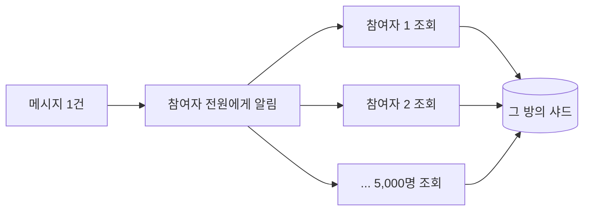
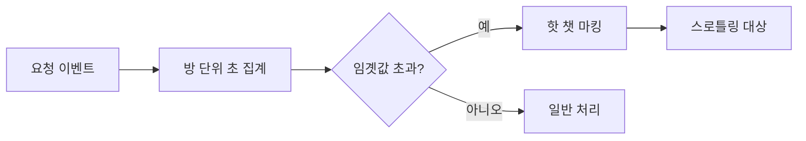
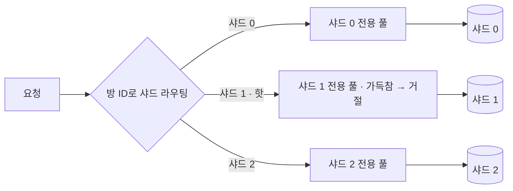

import {AnimatedBars, AnimatedLineChart} from '@site/src/components/blog/MonitorCharts';

<!-- truncate -->

전체 채팅방의 0.1%도 안 되는 극소수 방이 어느 순간 평소의 100배 트래픽을 냅니다. 이걸 감당하려고 전체 인프라를 100배로 키우는 것은 낭비입니다. 갑자기 튀는 소수만 감지해서, 그 대상만 완화·격리하면 됩니다. 이 글은 그 방법을 감지 → 스로틀링 → 원본 병목 해소 → 장애 격리 순으로 정리합니다. (LINE 오픈챗의 [100배 트래픽 스파이크 처리 사례](https://engineering.linecorp.com/ko/blog/how-line-openchat-server-handles-extreme-traffic-spikes)를 보고 개념을 제 언어로 다시 정리한 글입니다.)

<mark>전체를 키우는 대신, 갑자기 튀는 극소수(핫스팟)만 감지해 따로 다루는 것이 핵심입니다.</mark>

## 문제 — 어디서 트래픽이 100배로 튀나

전제를 하나 짚고 시작합니다. 이 서비스의 저장소(**MySQL·Redis**)는 데이터가 한 대에 다 안 들어가고 부하도 못 견디므로, **채팅방 기준으로 여러 샤드에 나뉘어**(샤딩) 있습니다. 그래서 한 방의 데이터와 요청은 특정 샤드 하나가 담당합니다. 이 구조를 기억해 두면 뒤의 문제와 해법이 자연스럽게 이어집니다.

이때 부하가 전체적으로 고르게 오르는 게 아니라, **특정 방 하나에 집중**되는 것이 문제의 본질입니다. 튀는 방을 "핫 챗"이라 부르면, 크게 두 패턴이 있습니다.

- **이벤트 폭증**: 인기 방에서 수천 명이 동시에 메시지를 주고받습니다. 이벤트 하나가 생길 때마다 모든 참여자에게 알림을 보내야 하므로, 참여자가 읽으러 오는 조회(페치) API 요청이 폭증하고 그 방을 담당하는 MySQL·Redis 샤드가 과부하됩니다.
- **참여 폭증**: 인플루언서가 초대 QR을 공유하면 초당 수천 건의 가입 요청이 한 방으로 몰립니다. 대량 INSERT로 MySQL이 응답 타임아웃에 빠집니다.

이벤트 폭증이 왜 그렇게 커지는지 숫자로 보면 분명합니다. 메시지 1건이 오면 그 방의 **모든 참여자**에게 "새 이벤트가 있다"는 알림이 나가고, 알림을 받은 각 참여자는 실제 내용을 가져오려고 조회 API를 호출합니다. 즉 **이벤트 1건이 참여자 수만큼의 조회로 퍼집니다(팬아웃)**. 참여자 5,000명 방에서 초당 50개 이벤트가 생기면, 한 방에서만 `50 × 5,000 = 250,000`건의 조회가 초당 발생하고, 이 요청이 전부 그 방을 담당하는 한 샤드로 향합니다.



두 경우 모두 **특정 방 = 특정 샤드/키에 트래픽이 집중**된다는 공통점이 있습니다. <mark>부하가 고르게 오르는 게 아니라 특정 방(=특정 샤드)에 집중되는 것이 문제의 본질입니다.</mark>

## 1. 튀는 대상을 실시간으로 감지한다 — 핫 챗 탐지

대응의 출발점은 "지금 어느 방이 튀는지"를 초 단위로 아는 것입니다. 요청량을 **방 단위로 집계**하다가 임곗값을 넘으면 그 방을 "핫 챗"으로 표시합니다. 앞서 본 **조회(이벤트) 폭증** 패턴은 조회 요청을 Kafka로 모아 집계하고, 임곗값을 넘긴 방을 Redis에 마킹하는 식으로 감지합니다.



구현을 보면, API가 요청될 때마다 Kafka로 이벤트를 보내고, 퍼블리시 서버가 이를 소비해 **각 방이 최근 몇 초 동안 몇 건을 요청했는지**를 실시간으로 셉니다. 이때 초 단위 버킷을 만들어 두고, 판정할 때 **최근 N초치 버킷을 합산**하는 방식이 단순합니다 — 초 단위 카운트는 구성 요소이고, 실제 기준은 "최근 몇 초 동안의 합"입니다.

```java
// API 요청마다 Kafka로 전송 → 퍼블리시 서버가 소비해, 방+초 버킷에 카운트
counter.incrementAndGet(roomId + ":" + nowSec);

// 판정은 '최근 몇 초'의 합으로 — 예: 최근 5초 동안의 요청 수
long recent = 0;
for (long s = nowSec - 4; s <= nowSec; s++) {          // 최근 5개 초 버킷을 더함
    recent += counter.getOrDefault(roomId + ":" + s, 0);
}
if (recent > threshold) {          // 예: 최근 5초에 5,000건 초과면 핫 챗
    hotChat.mark(roomId);          // 이 방을 '핫 챗'으로 표시 (짧은 TTL로 자동 해제)
}
```

이렇게 창(window)으로 세는 이유는, 판정 기준이 "총 몇 건"이 아니라 **"최근 얼마 동안 몇 건"이라는 속도(rate)** 이기 때문입니다. 계속 더하기만 하는 누적 카운터로는 "시작 이후 총합"만 알 수 있어, 오래된 방일수록 느리게 와도 숫자가 커져 지금 몰리는지를 구분할 수 없습니다. 초 단위 버킷으로 잘게 쌓아 두고 최근 몇 초만 합하면, 지난 시간의 숫자에 오염되지 않고 **"지금의 요청 속도"** 를 봅니다. 딱 1초가 아니라 몇 초를 합치는 건, 한 순간의 출렁임에 과민 반응하지 않으면서도 급증은 몇 초 안에 잡아내기 위한 균형입니다.

여기서 임곗값은 "최근 N초 동안의 요청 수" 같은 **구체적인 숫자**입니다(예: 최근 5초에 5,000건 초과). 중요한 것은 이 값을 **코드 배포·재시작 없이 바꿀 수 있게** 두는 것입니다(동적 설정). 트래픽 상황은 예측 불가능하므로, 방·국가·앱 종류별로 세분화한 실시간 대시보드로 지켜보다가 기준을 즉시 조정할 수 있어야 합니다. <mark>대응의 출발점은 "지금 어느 방이 튀는지"를 초 단위로 감지하는 것입니다.</mark>

## 2. 무엇을 보고 부하를 아는가 — 핵심 지표와 대시보드

핫 챗은 예고 없이 터지므로, "지금 부하가 튀고 있다"를 빨리 알아채는 지표를 평소에 대시보드로 띄워 둡니다. 이때 핵심은 **전체 평균이 아니라 방·국가·앱 종류처럼 잘게 쪼갠 단위로 보는 것**입니다 — 전체 평균은 멀쩡해 보여도 특정 샤드·방 하나만 타고 있을 수 있기 때문입니다.

부하가 한 샤드에 쏠릴 때 함께 움직이는 지표들입니다.

- **샤드별 부하·응답시간**: 한 샤드만 평소의 몇 배로 치솟는지 — 핫 챗의 가장 빠른 1차 신호입니다.
- **샤드 서버의 CPU·GC**: 요청이 몰린 서버 그룹의 CPU가 급등하고 GC가 잦아집니다.
- **Kafka 파티션별 오프셋 랙**: 특정 파티션의 랙이 순간적으로 커지면, 그 방 이벤트 처리가 밀리고 있다는 신호입니다.
- **슬로 쿼리·타임아웃 비율**: DB가 못 버틸 때 느린 쿼리와 타임아웃이 늘어납니다.
- **API 요청량(방·국가·앱별)**: 어느 방·구간에서 요청이 튀는지 짚어 줍니다.

아래처럼 **샤드별로 나눠 보면** 전체 평균에 묻히던 쏠림이 드러납니다. 같은 시각, 한 샤드만 부하가 몇 배로 튀고 나머지는 평탄합니다.

<AnimatedLineChart
  title="샤드별로 나눠 보면 한 샤드만 부하가 튄다"
  data={[10, 12, 11, 34, 33, 30, 14, 11]}
  data2={[10, 11, 10, 12, 11, 10, 11, 10]}
  yMax={40}
  yLabel="샤드 부하(상대)"
  xLabel="시간 →"
  tone="bad"
  tone2="good"
  legend={["핫 샤드", "일반 샤드"]}
/>

이 지표들을 **핫 챗 대시보드** 하나로 모아, 앞서 말한 임곗값을 실시간으로 조정(동적 설정)하며 지켜봅니다. <mark>전체 평균이 아니라 샤드·방·국가처럼 잘게 쪼갠 단위로 봐야 특정 대상에 쏠린 부하가 드러납니다.</mark>

## 3. 감지되면 요청을 줄인다 — 확률적 스로틀링

핵심 아이디어는 **조회 횟수가 "이벤트 수"가 아니라 "알림 수"에 비례한다**는 점입니다. 일반 방은 이벤트마다 알림을 보내지만, 핫 챗은 **모든 이벤트마다 보내지 않고 일부만** 보냅니다(확률적으로 골라 보내거나, 아래 예처럼 일정 간격으로 한 번씩). 알림을 받은 사용자는 그동안 쌓인 이벤트를 **한꺼번에 모아** 조회하므로, 화면에 보이는 내용은 그대로이면서 조회 API 호출 수만 급감합니다.

```java
if (hotChat.isMarked(roomId)) {
    // 핫 챗: 이 방에 지금 알림을 보내도 되는지 확인 (예: 1초에 1번만 허용)
    if (pushThrottler.tryAcquire(roomId)) {
        push(roomId);   // 이 알림 한 번으로 사용자는 밀린 이벤트를 모아서 조회
    }
    // 못 얻으면 알림 생략 — 어차피 다음 알림 때 함께 받음
} else {
    push(roomId);       // 일반 방: 이벤트마다 알림
}
```

앞의 예(참여자 5,000명, 초당 50 이벤트)로 계산하면, 스로틀링이 없을 땐 `50 × 5,000 = 250,000`건의 조회가 초당 발생하지만, 알림을 초당 1번꼴로 줄이면 조회는 `1 × 5,000 = 5,000`건으로 내려갑니다. (참여 폭증도 스로틀링으로 막지만, 그쪽은 즉시성이 관건이라 다음 절에서 따로 다룹니다.)

<AnimatedBars
  title="선택적 스로틀링 적용 전/후 원본으로 가는 요청량 (상대)"
  data={[100, 15]}
  labels={["스로틀링 없음", "선택적 스로틀링"]}
  yMax={110}
  yLabel="요청량(상대)"
  xLabel=""
  tone="good"
/>

<mark>모든 이벤트마다 알림을 보내지 않고, 한 번의 알림으로 밀린 이벤트를 모아 받게 하면 요청량이 급감합니다.</mark>

## 4. 감지가 늦으면 소용없다 — 참여 폭증은 로컬 카운팅으로

앞의 Kafka 집계 + Redis 마킹이 **조회(이벤트) 폭증**에 잘 맞는 이유는 두 가지입니다.

- **정확한 총량을 알려면 한곳에 모아야 한다**: 한 방의 조회 요청은 참여자 수천 명이 **여러 앱 서버에 흩어져** 날립니다. 그래서 서버 한 대만 보면 그 방의 진짜 요청 총량을 알 수 없습니다. 모든 서버의 요청을 Kafka로 한곳에 모아 합산해야 "이 방이 초당 몇 건"인지 정확히 나오고, 그 결과를 Redis에 마킹해 **전 서버가 같은 핫 챗 판정을 공유**합니다.
- **몇 초 지연이 감당된다**: 조회 폭증은 핫 기간 내내 **지속**되고, 대응인 푸시 스로틀링도 그 기간 내내 부하를 낮춥니다. 그래서 감지가 몇 초 늦어도, 곧 스로틀링이 걸려 남은 대부분을 막습니다.

여기서 오해하면 안 되는 점이 있습니다. **스로틀링이 걸리기 전 그 몇 초 동안 조회 폭주는 저장소에 실제로 부담을 줍니다** — 그 방을 담당하는 MySQL·Redis 샤드의 부하가 튀어 응답이 느려지고 타임아웃이 늘어납니다. 공짜가 아닙니다. 다만 조회는 **읽기**라서, 이 부담은 데이터를 깨뜨리지 않는 **일시적 지연**입니다. 대부분 캐시(로컬·Redis)에서 흡수되고, 요청률이 스로틀링으로 떨어지면 저장소가 밀린 것을 따라잡아 회복됩니다. 그 몇 초를 버티게 해 주는 것이 앞 절의 다층 캐시와 뒤에 나올 서킷 브레이커·벌크헤드입니다.

**참여 폭증**은 이 지점이 결정적으로 다릅니다. 가입 요청은 곧장 대량 INSERT로 이어져, 감지가 몇 초만 늦어도 그 사이 쌓인 INSERT와 AUTO_INCREMENT 락 경합으로 DB가 무너집니다. 이미 커밋된 행은 되돌릴 수 없고, 요청률을 늦춘다고 저절로 회복되지도 않습니다 — 읽기의 일시적 지연과 달리 **한 번 무너지면 스스로 돌아오지 않는 장애**입니다. 그래서 참여 폭증은 같은 Kafka 경로를 쓰지 않고, 별도로 **즉시 감지하는 경로**를 둡니다(둘은 갈아타는 게 아니라 패턴별로 공존합니다).

이제 왜 Kafka 경로가 늦는지 보겠습니다. 원문에서 확인되는 사실은 **핫 챗의 대량 이벤트가 Kafka의 한 파티션에 집중되어 그 파티션의 오프셋 랙(offset lag, 아직 처리하지 못하고 밀려 있는 메시지 양)이 순간적으로 커진다**는 것입니다. 왜 한 파티션에 몰리는지는 일반적인 Kafka 사용 방식으로 설명됩니다 — 한 채팅방의 메시지(=이벤트)는 **보낸 순서대로** 보여야 하고, Kafka는 한 파티션 안에서만 순서를 보장하므로, 보통 **같은 방의 이벤트를 같은 파티션**으로 보냅니다. 그래서 핫 챗에서 한꺼번에 생기는 대량 이벤트가 그 방이 배정된 파티션 하나로 쏠리고, 하필 지금 감지해야 할 그 핫 챗의 집계가 몇 초씩 늦어집니다.

그래서 참여 요청 카운팅은 원격 집계를 기다리지 않고, **요청을 받은 그 서버의 메모리에서 즉시** 셉니다. 집계 방식은 1절과 똑같습니다 — **초 단위 버킷에 쌓고 최근 N초치를 합산**해 한도와 비교합니다. 저장 위치만 Redis/Kafka가 아니라 **프로세스 내 메모리**라는 점만 다릅니다("즉시"는 창 크기가 아니라 원격 왕복을 기다리지 않는다는 뜻입니다).

```java
// 버킷: (방 ID, 초) → 카운터. 최근 몇 초치가 살아 있도록 (창보다 조금 긴) 만료로 자동 정리
private final Cache<String, AtomicLong> buckets = Caffeine.newBuilder()
        .expireAfterWrite(Duration.ofSeconds(6))   // 최근 5초를 보려면 그보다 조금 길게
        .build();

boolean allowJoin(long roomId) {
    long nowSec = System.currentTimeMillis() / 1000;
    buckets.get(roomId + ":" + nowSec, k -> new AtomicLong())
           .incrementAndGet();                       // 이번 초 버킷 +1 (프로세스 내, 왕복 0)

    long recent = 0;                                 // 최근 5초 합
    for (long s = nowSec - 4; s <= nowSec; s++) {
        AtomicLong b = buckets.getIfPresent(roomId + ":" + s);
        if (b != null) recent += b.get();
    }
    return recent <= joinThreshold;                  // 최근 5초 한도 이내면 허용
}

// 호출부: 한도를 넘으면 원격 집계를 기다리지 않고 그 자리에서 바로 거절
if (!allowJoin(roomId)) return reject();
```

버킷 맵을 평범한 `Map`이 아니라 **Caffeine 캐시**로 둔 이유가 여기 있습니다. 초가 지날 때마다 새 키가 생기므로 그냥 두면 버킷이 메모리에 무한히 쌓입니다. `expireAfterWrite`를 **보려는 창보다 조금 길게**(최근 5초를 보면 6초) 걸면, 합산에 필요한 최근 몇 초치 버킷만 남고 더 오래된 것은 자동으로 사라져, 직접 청소하는 코드 없이도 메모리가 일정하게 유지됩니다.

서버가 여러 대면 각 서버는 자기가 받은 요청만 보므로 전체 수를 정확히 알지는 못합니다. 하지만 핫 챗은 정의상 한 방에 트래픽이 압도적으로 몰리는 경우라, 한 서버의 로컬 버킷만으로도 임곗값을 금방 넘겨 충분히 감지됩니다. 게다가 99.9%인 일반 방은 원격 저장소에 아무것도 기록하지 않으므로, 평상시 오버헤드도 사라집니다. 로컬 캐시를 앞단에 두는 방식은 [다층 캐싱](./multi-layer-caching)에서 다뤘습니다. <mark>스로틀링은 즉시 반응해야 의미가 있어, 지연이 큰 원격 집계 대신 로컬 메모리 카운팅으로 앞당깁니다.</mark>

## 5. 원본(DB)의 병목 — MySQL 락 풀기

스로틀링으로 요청을 줄여도, 원본 DB 자체에 병목이 있으면 소용없습니다. 참여 폭증 사례에서는 두 가지가 원인이었습니다.

- **AUTO_INCREMENT 테이블 락**: 서브쿼리를 포함한 `INSERT ... SELECT`는 넣을 행 수를 미리 알 수 없어 벌크 INSERT로 취급됩니다. 기본값 `innodb_autoinc_lock_mode=1`은 이때 안전하게 번호를 매기려고 **문장이 끝날 때까지 테이블 수준 AUTO-INC 락**을 잡습니다. 그동안 같은 테이블에 들어오려는 다른 INSERT는 전부 대기합니다. 참여가 초당 수천 건이면 이 대기가 쌓여 CPU가 100%에 도달합니다.

  `innodb_autoinc_lock_mode=2`(interleaved)로 바꾸면 테이블 락을 잡지 않고 필요한 만큼만 번호를 나눠 주므로 동시 INSERT가 서로 기다리지 않습니다. 대가는 **자동 증가 값이 연속하지 않을 수 있다**는 것(중간 번호가 건너뛰거나 순서가 섞일 수 있음)이라, "번호가 반드시 1씩 연속"이라는 가정이 없을 때만 씁니다.
- **멤버 수 조회의 쿼리 캐시 경합**: 참여할 때마다 그 방의 멤버 수를 조회했는데, MySQL **쿼리 캐시**가 이 결과를 캐싱하다가 참여(쓰기)가 생길 때마다 해당 테이블의 캐시를 무효화하며 테이블 락을 잡았습니다. 참여가 초당 수천 건이면 이 무효화가 반복돼 락 경합이 커집니다. 그래서 **쿼리 캐시를 끄고**, 멤버 수는 **별도 집계 테이블(또는 카운터 컬럼)** 로 분리해 참여 시 값 하나만 갱신하도록 했습니다.

<AnimatedBars
  title="AUTO_INCREMENT 락 모드 변경 전/후 DB CPU"
  data={[100, 18]}
  labels={["lock_mode=1", "lock_mode=2"]}
  yMax={110}
  yLabel="CPU(%)"
  xLabel=""
  tone="good"
/>

<mark>연속된 AUTO_INCREMENT가 꼭 필요하지 않다면 interleaved 모드로 테이블 락 경합을 없앨 수 있습니다.</mark>

## 6. 한 샤드 문제가 전체로 번지지 않게 — 서킷 브레이커·벌크헤드

앞서 말한 대로 저장소는 채팅방 기준으로 여러 샤드에 나뉘어 있고(예: 샤드 0~15), 어떤 방이 어느 샤드인지는 `shardId = hash(roomId) % 샤드수` 처럼 방 ID로 정해집니다. 그래서 **한 방에 대한 요청은 항상 같은 샤드 하나로** 향하고, 핫 챗이 생기면 그 방이 배정된 샤드 한 곳에만 부하가 몰립니다. "샤드마다 격리한다"는 것은 이 구조를 그대로 이용하는 것입니다.

문제는 서버가 요청을 처리하는 **스레드가 한정**돼 있다는 점입니다. 핫 샤드의 DB 응답이 느려지면, 그 응답을 기다리는 스레드가 반환되지 못하고 계속 쌓입니다. 모든 샤드가 **하나의 공용 스레드 풀**을 함께 쓰고 있으면, 이 대기 스레드가 풀을 다 차지해 버려 — 멀쩡한 다른 샤드로 갈 요청도 실행할 스레드가 없어 **함께 멈춥니다**(한 줄에 갇힘, head-of-line blocking). 한 샤드의 지연이 서비스 전체 장애로 번지는 것입니다.



핵심 원리는 **샤드마다 자원을 미리 몫으로 나눠 주는 것**입니다. 그러면 핫 샤드가 자기 몫을 다 써도 그 피해가 자기 몫 안에 갇혀, 다른 샤드 몫은 손대지 못합니다. 이 "몫 나누기"를 자원별로 구현한 두 장치가 벌크헤드와 서킷 브레이커입니다.

- **벌크헤드(bulkhead)**: 샤드별로 스레드 풀을 격리해, 한 샤드가 느려져도 그 대기가 다른 샤드로 번지지 않게 칸막이를 칩니다.
- **서킷 브레이커(circuit breaker)**: 샤드별로 실패·지연을 집계하다가 임곗값을 넘으면 그 샤드 호출만 잠시 끊고 빠르게 실패시켜, 느린 호출이 쌓이는 것을 막습니다.

벌크헤드를 세팅하는 가장 단순한 방법은 **샤드마다 크기가 제한된 스레드 풀을 하나씩** 두고, 요청을 자기 샤드의 풀에서만 처리하게 하는 것입니다. 스레드 수와 대기 큐를 모두 유한하게 잡는 것이 핵심입니다 — 핫 샤드의 풀이 가득 차면 그 샤드 요청만 즉시 거절되고, 다른 샤드 풀의 여유는 그대로 남습니다.

```java
// 샤드마다 독립된 스레드 풀 — 한 샤드가 자기 풀을 다 써도 다른 샤드 풀은 멀쩡
Map<Integer, ExecutorService> pools = new ConcurrentHashMap<>();

ExecutorService poolFor(int shardId) {
    return pools.computeIfAbsent(shardId, id ->
        new ThreadPoolExecutor(
            4, 4,                            // 샤드당 스레드 4개로 제한
            0L, TimeUnit.MILLISECONDS,
            new ArrayBlockingQueue<>(50),    // 대기 큐도 유한 — 넘치면 바로 거절
            new ThreadPoolExecutor.AbortPolicy()));
}

// 요청은 자기 샤드의 풀에서만 실행 (핫 샤드가 느려도 다른 샤드는 영향 없음)
poolFor(shardId).submit(() -> handle(request));
```

만약 모든 샤드가 **공용 풀 하나**를 함께 쓰면, 핫 샤드를 기다리는 스레드가 그 풀을 전부 점유해 다른 샤드 요청까지 멈춰 섭니다. 샤드별로 풀을 나누는 것만으로 이 전파가 끊깁니다.

라이브러리를 쓴다면 Resilience4j의 `ThreadPoolBulkhead`를 샤드별 인스턴스로 두어 같은 격리를 선언적으로 얻을 수 있습니다.

```java
ThreadPoolBulkheadConfig config = ThreadPoolBulkheadConfig.custom()
    .maxThreadPoolSize(4)      // 샤드당 스레드 상한
    .queueCapacity(50)         // 대기 큐 상한 — 초과분은 거절
    .build();

// 샤드마다 이름이 다른 독립 벌크헤드를 하나씩 생성
ThreadPoolBulkhead bulkhead = ThreadPoolBulkhead.of("shard-" + shardId, config);
```

서킷 브레이커도 마찬가지로 **샤드별 인스턴스**로 두는 것이 핵심입니다. 핫 샤드 하나가 느려졌다고 전체 서킷이 열리면 멀쩡한 샤드까지 막히기 때문입니다. 실패율이 임곗값을 넘으면 그 샤드 호출만 잠시 끊고(OPEN), 일정 시간 뒤 소량만 시험 삼아 흘려보내(HALF_OPEN) 회복됐는지 확인합니다.

```java
CircuitBreakerConfig config = CircuitBreakerConfig.custom()
    .failureRateThreshold(50)                          // 실패율 50% 넘으면 차단
    .slowCallDurationThreshold(Duration.ofSeconds(1))  // 1초 넘으면 '느린 호출'로 집계
    .slowCallRateThreshold(50)                         // 느린 호출 50% 넘어도 차단
    .waitDurationInOpenState(Duration.ofSeconds(5))    // 5초 뒤 HALF_OPEN으로 회복 시도
    .build();

// 샤드마다 독립된 서킷 브레이커 — 한 샤드가 열려도 다른 샤드는 정상
CircuitBreaker breaker = CircuitBreaker.of("shard-" + shardId, config);

// 샤드 호출을 서킷 브레이커로 감싼다 (열려 있으면 즉시 실패로 빠르게 반환)
Supplier<Result> call = CircuitBreaker.decorateSupplier(breaker, () -> query(shardId));
```

두 장치는 함께 씁니다. **벌크헤드로 샤드별 칸막이를 쳐 자원을 격리하고, 그 안에서 서킷 브레이커로 느린 샤드 호출을 빠르게 끊으면**, 핫 샤드의 지연이 스레드를 점유하지도, 호출로 쌓이지도 못합니다. 내결함성 장치의 개념은 [내결함성과 고가용성](./fault-tolerance-high-availability)에서 더 다뤘습니다. <mark>한 샤드의 지연이 전체로 번지지 않도록, 샤드별 스레드 풀 격리(벌크헤드)와 빠른 실패(서킷 브레이커)로 차단합니다.</mark>

## 정리 — 핫스팟 대응 체크리스트

1. **감지** — 방 단위 초 집계 + 임곗값 + 동적 설정으로 "지금 튀는 대상"을 즉시 파악합니다.
2. **관측** — 샤드·방·국가별로 쪼갠 지표(샤드 부하·CPU·GC·오프셋 랙·슬로 쿼리)와 핫 챗 대시보드로 쏠림을 확인합니다.
3. **완화** — 선택적·확률적 스로틀링으로 요청량 자체를 줄입니다.
4. **즉시성** — 로컬 메모리 버킷 카운팅으로 스로틀링 지연을 없앱니다.
5. **원본** — MySQL AUTO_INCREMENT 락 모드·집계 테이블 분리로 DB 병목을 해소합니다.
6. **격리** — 서킷 브레이커 + 벌크헤드로 한 샤드의 문제가 전체로 번지는 것을 막습니다.

한 줄로 요약하면, **전체를 키우지 말고, 튀는 0.1%만 감지·완화·격리한다**입니다.

## 용어 한 줄 정리

| 용어 | 쉬운 뜻 |
|---|---|
| 핫스팟 / 핫 챗 | 트래픽이 유독 몰리는 소수의 대상(여기선 특정 채팅방) |
| 샤드(shard) | 데이터를 나눠 담은 저장소 조각. 방 ID 등으로 어느 샤드에 담길지 정해짐 |
| Kafka 파티션 순서 보장 | Kafka는 한 파티션 안에서만 메시지 순서를 보장. 그래서 순서가 필요한 이벤트는 같은 파티션으로 보냄 |
| 오프셋 랙(offset lag) | 컨슈머가 아직 처리하지 못하고 밀려 있는 메시지 양. 한 파티션에 몰리면 순간적으로 커짐 |
| 스로틀링 | 요청을 의도적으로 줄이거나 늦춰 원본 부하를 낮추는 것 |
| 동적 설정 | 코드 배포·재시작 없이 임곗값 같은 값을 실시간으로 바꾸는 것 |
| AUTO_INCREMENT 락 모드 | 자동 증가 값을 매길 때 거는 락 방식. `1`은 테이블 락, `2`(interleaved)는 경합이 적음 |
| 벌크헤드 | 자원(스레드 풀)을 칸막이로 격리해 장애 전파를 막는 패턴 |
| 서킷 브레이커 | 실패가 잦으면 호출을 잠시 끊어 빠르게 실패시키는 패턴 |
