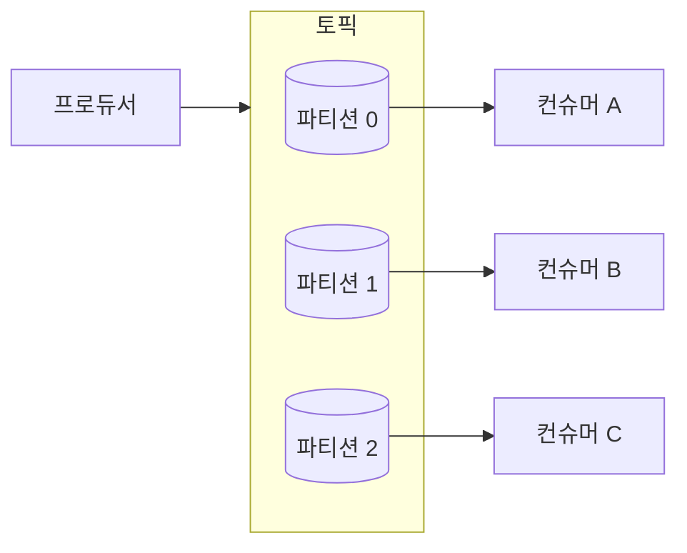
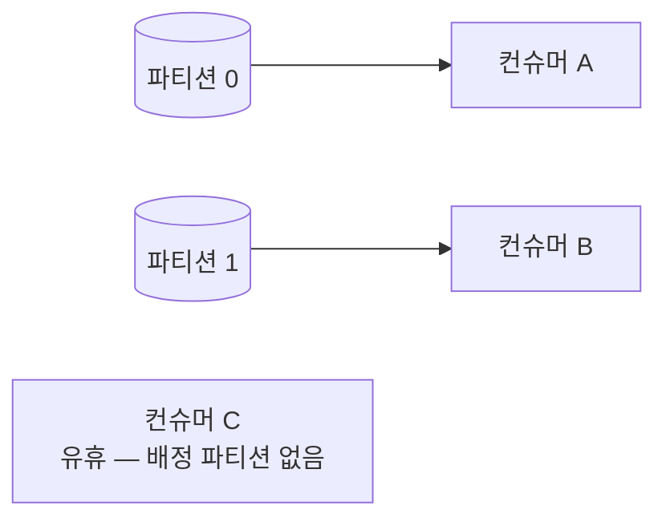

import {AnimatedLineChart, AnimatedBars} from '@site/src/components/blog/MonitorCharts';

<!-- truncate -->

Kafka 토픽을 만들 때 꼭 정해야 하는 값이 **파티션 수**입니다. 그런데 감으로 "일단 10개"처럼 정하면 나중에 처리량이 부족하거나, 반대로 너무 많아 브로커가 무거워집니다. 파티션 수는 **처리량·컨슈머 병렬성·순서 보장**을 한꺼번에 좌우하는 값이라, 근거를 가지고 정해야 합니다. 이 글은 그 근거를 하나씩 정리합니다.

<mark>파티션 수는 성능 튜닝 값이 아니라 "이 토픽이 감당할 병렬성과 순서 단위"를 정하는 설계 결정입니다.</mark>

## 먼저: 파티션이 무엇을 결정하나

파티션은 토픽을 여러 개로 나눈 **로그 조각**입니다. 프로듀서가 보낸 메시지는 특정 파티션에 순서대로 쌓이고, 컨슈머는 파티션 단위로 나눠 읽습니다.



파티션이 결정하는 것은 세 가지입니다.

- **병렬성의 상한**: 한 파티션은 같은 컨슈머 그룹 안에서 **한 컨슈머만** 읽습니다. 그래서 컨슈머를 아무리 늘려도 파티션 수를 넘는 만큼은 놀게 됩니다.
- **순서 보장의 단위**: Kafka는 **파티션 안에서만** 순서를 보장합니다. 토픽 전체의 순서는 보장하지 않습니다.
- **분산의 단위**: 같은 키를 가진 메시지는 같은 파티션으로 갑니다(키 해시 기반). 그래서 "키 단위 순서"를 지키면서 부하를 나눌 수 있습니다.

<mark>같은 컨슈머 그룹의 최대 병렬성은 파티션 수를 넘지 못합니다 — 이것이 파티션 수 산정의 출발점입니다.</mark>

## 왜 처음에 신중히 정해야 하나

파티션 수는 **늘릴 수는 있어도 줄일 수는 없습니다.** 게다가 늘리는 것도 대가가 있습니다. 키 해시로 파티션을 고르기 때문에, 파티션 수가 바뀌면 `키 → 파티션` 매핑이 달라져 **같은 키의 순서가 깨질 수 있습니다.** 예를 들어 주문 ID를 키로 "생성 → 결제 → 취소" 순서를 지키고 있었다면, 파티션 수를 늘린 뒤부터 그 키가 다른 파티션으로 가면서 이전 메시지와 순서가 엉킬 수 있습니다.

<mark>파티션 수는 사실상 한 방향(증가)으로만 바꿀 수 있고, 그마저 키 순서를 흔들기 때문에 처음에 근거 있게 정하는 것이 가장 좋습니다.</mark>

## 기준 1 — 목표 처리량

가장 기본이 되는 기준은 **목표 처리량**입니다. 프로듀서가 밀어 넣는 속도와 컨슈머가 처리하는 속도 중 **더 빠듯한 쪽**을 만족해야 합니다.

```
필요 파티션 수 N = ceil( max( T / P_produce , T / C_consume ) )

  T          목표 처리량 (msg/s 또는 MB/s, 피크 기준)
  P_produce  파티션 1개당 프로듀서 처리량
  C_consume  파티션 1개당(= 컨슈머 1개) 소비 처리량
```

핵심은 **소비 측을 놓치지 않는 것**입니다. 프로듀서는 파티션 1개에도 꽤 높은 처리량을 내지만, 컨슈머는 메시지마다 DB 저장·외부 호출 같은 무거운 로직을 하므로 파티션당 처리량이 훨씬 낮은 경우가 많습니다. 그래서 대개 **소비가 병목**이고, 컨슈머를 늘려 병렬로 처리해야 하는데, 그 병렬성의 상한이 곧 파티션 수입니다.

예를 들어 목표가 초당 60,000건인데 컨슈머 하나가 초당 5,000건을 처리한다면, 최소 `60000 / 5000 = 12`개의 파티션이 필요합니다. 컨슈머를 12개까지 늘려야 목표를 채우고, 그러려면 파티션도 12개 이상이어야 합니다.

<AnimatedLineChart
  title="컨슈머를 늘려도 파티션 수(6개)를 넘으면 처리량은 늘지 않는다"
  data={[10, 20, 30, 40, 50, 60, 60, 60]}
  yMax={70}
  yLabel="처리량(상대)"
  xLabel="컨슈머 수 →"
  tone="accent"
/>

<mark>처리량 기준 파티션 수는 프로듀서·컨슈머 중 더 낮은 처리량 쪽에 맞춰 계산합니다 — 보통은 소비 측입니다.</mark> 파티션 1개당 처리량은 추정하지 말고 실제 워크로드로 측정하는 것이 좋습니다. 파티션이 처리량의 단위인 이유는 [Kafka가 빠른 이유](./kafka-why-fast)에서 다뤘습니다.

## 기준 2 — 컨슈머 병렬성

처리량과 같은 이야기지만, 관점을 "몇 개의 컨슈머 인스턴스를 돌릴 것인가"로 바꿔 봅니다. **파티션 수는 그 컨슈머 그룹이 가질 수 있는 최대 인스턴스 수**입니다. 파티션보다 컨슈머가 많으면, 남는 컨슈머는 배정받을 파티션이 없어 놀게 됩니다.



그래서 "이 서비스는 최대 몇 개의 컨슈머 인스턴스로 확장할 것인가"를 먼저 정하고, 그 이상으로 파티션을 둡니다. <mark>미래에 컨슈머를 늘릴 계획이 있다면, 그 목표 인스턴스 수를 파티션 수에 미리 반영합니다.</mark>

## 기준 3 — 순서와 키 카디널리티

순서가 중요한 데이터라면 파티션 수를 마음대로 키울 수 없습니다. 순서는 **키 단위**로만 지켜지고, 그 키가 어느 파티션으로 갈지는 해시로 정해지기 때문입니다.

여기서 **키 카디널리티**(키 값의 가짓수)를 확인해야 합니다. 키 종류가 파티션 수보다 훨씬 많아야 파티션에 고르게 흩어집니다. 반대로 키가 몇 개뿐이면, 특정 파티션에만 메시지가 몰리는 **핫 파티션**이 생겨 파티션을 늘려도 병렬 처리가 되지 않습니다. 예를 들어 키를 "지역 코드"로 잡았는데 지역이 5개뿐이면, 파티션을 20개 만들어도 실제로는 5개만 일합니다.

<mark>파티션을 고르게 쓰려면 키 카디널리티가 파티션 수보다 충분히 커야 하고, 특정 키에 트래픽이 몰리지 않아야 합니다.</mark> 순서·전달 보장과 파티션의 관계는 [Kafka 전달 보장](./kafka-delivery-semantics)에서 이어집니다.

## 기준 4 — 여유·정렬, 그리고 과다의 비용

앞의 기준으로 최소 개수를 구했다면, 두 가지를 더 봅니다.

- **여유(headroom)**: 나중에 줄이기 어려우니 성장분을 감안해 약간 넉넉히 둡니다. 다만 배수를 과하게 잡지는 않습니다.
- **정렬(배수)**: 파티션 수를 컨슈머 수·브로커 수의 배수로 맞추면 파티션이 균등하게 배분됩니다. 예를 들어 컨슈머 4개에 파티션 12개면 각 컨슈머가 정확히 3개씩 맡습니다.

과다하면 비용이 커집니다. 파티션이 많을수록 브로커의 **파일 핸들·메모리**(각 파티션은 세그먼트 파일을 가짐)와 **복제 부하**가 늘고, **리밸런스**(rebalance, 컨슈머 추가·이탈 시 파티션 재배정)와 **리더 선출** 시간이 길어집니다. 프로듀서는 파티션마다 버퍼를 두므로 배치 효율이 떨어져 **엔드투엔드 지연**이 늘 수도 있습니다.

<AnimatedBars
  title="파티션이 과도하면 리밸런스·지연 비용이 커진다"
  data={[1, 1.3, 2.2, 4.5]}
  labels={["50", "200", "1,000", "4,000"]}
  yMax={5}
  yLabel="리밸런스 시간(상대)"
  xLabel="브로커당 파티션 수"
  tone="bad"
/>

<mark>파티션은 많을수록 좋은 값이 아닙니다 — 병렬성 이득과 브로커 자원·리밸런스·지연 비용 사이의 균형점을 찾습니다.</mark>

## 산정 절차 요약

1. **목표 처리량(T)을 피크 기준으로 정한다** — 평균이 아니라 몰리는 순간 기준.
2. **파티션 1개당 처리량을 실측한다** — 프로듀서(`P_produce`)와 컨슈머(`C_consume`) 각각. 특히 컨슈머는 실제 로직을 포함해 측정.
3. **N = ceil(max(T/P_produce, T/C_consume))** 로 최소 파티션 수를 계산한다(보통 소비 측이 지배).
4. **순서·키 카디널리티를 점검한다** — 키 종류가 파티션 수보다 충분히 많고, 핫 파티션이 없는지.
5. **여유와 배수를 더한다** — 성장분을 감안하되 과다는 피하고, 컨슈머·브로커 수의 배수로 정렬.
6. **과다 비용을 확인한다** — 브로커당 파티션 수가 권장 범위를 넘지 않는지.

## 덧붙임 — 브로커 대수는 어떻게 정하나

파티션 수와 함께 나오는 질문이 브로커 대수입니다. 둘은 맞물려 있습니다 — 파티션과 그 복제본이 브로커에 나뉘어 올라가기 때문입니다. 브로커 대수는 아래를 함께 보고, **가장 큰 값**으로 정합니다.

- **복제 계수(RF)와 내결함성**: 복제본을 RF개 두면 최소 RF대가 필요합니다(보통 RF=3). 브로커 한 대에 장애가 나도 서비스가 유지되려면 브로커 수는 RF보다 커야 하고, 쓰기를 성공으로 인정할 최소 복제본 수(`min.insync.replicas`)도 만족해야 합니다.
- **처리량**: 클러스터 목표 처리량을 브로커 1대가 감당하는 처리량으로 나눕니다. 브로커의 한계는 보통 네트워크·디스크 I/O이고, 복제 때문에 브로커는 자기 몫 외에 복제 트래픽도 처리한다는 점을 감안합니다.
- **저장 용량·보존 기간**: 총 저장량은 대략 "초당 유입 바이트 × 보존 기간 × 복제 계수"입니다. 이를 브로커당 디스크 용량으로 나눠 필요한 대수를 구합니다.
- **파티션 분산**: 총 파티션 수 × RF 만큼의 복제본이 브로커에 고르게 배분돼야 하고, 브로커당 파티션 수가 권장 상한을 넘지 않아야 합니다.

```
필요 브로커 수 ≈ max(
  RF + 여유,                                       # 내결함성 (한 대 장애 허용 = N+1)
  클러스터 목표 처리량 / 브로커당 처리량,             # 처리량
  (유입 바이트/s × 보존 기간 × RF) / 브로커당 디스크,  # 저장 용량
  (총 파티션 수 × RF) / 브로커당 권장 파티션 수         # 파티션 분산
)
```

<mark>브로커 대수는 복제·처리량·용량·파티션 분산 네 가지 중 가장 큰 값으로 잡고, 한 대에 장애가 나도 견디도록 장애 여유(N+1)를 더합니다.</mark>

## 실전 예시 — 신규 주문 이벤트 서비스

기준만 나열하면 감이 잘 안 잡히니, 하나의 상황에 적용해 보겠습니다. **새로 구축하는 커머스의 주문 이벤트 파이프라인**이라고 하겠습니다. 주문이 생기면 `order-events` 토픽에 이벤트를 발행하고, 컨슈머가 이벤트마다 재고 차감·알림·정산 준비를 하며 DB에 씁니다. 상황과 실측값은 이렇게 가정합니다.

- **목표 처리량**: 피크 기준 초당 30,000건(평소 5,000건, 세일 때 급증).
- **파티션당 실측**: 프로듀서는 파티션당 20,000건/s, 컨슈머는 DB 쓰기까지 포함해 파티션당 2,500건/s.
- **순서**: 한 주문의 "생성 → 결제 → 취소"는 순서가 지켜져야 함. 키는 **주문 ID**(가짓수 수백만).
- **운영 계획**: 컨슈머 인스턴스를 최대 16개까지 확장할 계획. `RF=3`, 이벤트 크기 약 1KB, 보존 3일, 브로커당 디스크 4TB 확보.

**① 파티션 수**를 순서대로 계산합니다.

```
처리량:   N = ceil(max(30000/20000, 30000/2500)) = ceil(max(1.5, 12)) = 12  → 소비 측이 지배
병렬성:   컨슈머를 최대 16개로 확장 → 파티션 ≥ 16                            → 12보다 크므로 16 채택
순서·키:  주문 ID라 가짓수가 충분히 크고 편중 없음 → 16개에 고르게 분산       → OK
여유·정렬: 16은 목표 컨슈머 수(16)와 정확히 일치                             → 파티션 16 확정
```

처리량만 보면 12개면 되지만, "앞으로 컨슈머를 16개까지 늘린다"는 계획 때문에 **병렬성 기준이 더 커서 16개**로 정합니다. 주문 ID를 키로 쓰므로 주문 단위 순서는 지켜지고, 가짓수가 많아 핫 파티션도 생기지 않습니다.

**② 브로커 대수**를 네 기준으로 계산합니다.

```
내결함성:   RF 3 → 최소 3, 한 대 장애를 견디게 N+1              → 4
처리량:     30,000건/s는 브로커 1대로도 충분(수십만 건/s 여유)    → 약 1
저장 용량:  5,000건/s × 1KB = 5MB/s, 3일 보존 ≈ 1.3TB, ×RF 3 ≈ 3.9TB / 4TB → 약 1
파티션 분산: 16 × RF 3 = 48 복제본, 브로커당 권장(수천)에 한참 못 미침  → 약 1

필요 브로커 수 = max(4, 1, 1, 1) = 4
```

결론은 **파티션 16개 + 브로커 4대**입니다. 여기서 눈여겨볼 점은, 이 서비스는 처리량·저장 용량이 크지 않아 **브로커 대수를 결정한 것이 내결함성(RF + 장애 여유)** 이라는 것입니다. 신규·중소 규모 서비스에서 흔히 나오는 결론입니다 — 처음부터 처리량으로 브로커를 많이 잡을 필요가 없습니다.

<mark>신규·중소 규모 서비스는 처리량·용량보다 내결함성(RF + 장애 여유)이 브로커 대수를 결정하는 경우가 많습니다.</mark>

나중에 피크가 10배로 커지면 소비 측(2,500건/s)이 다시 병목이 되어 파티션·컨슈머·브로커를 재산정하게 됩니다. 이때 파티션은 늘리기만 할 수 있고 키 순서가 흔들릴 수 있으므로, 처음 16개를 정할 때 이 성장 시나리오를 함께 고려해 둔 것입니다.

## 정리

| 기준 | 무엇을 보나 | 결론 |
|---|---|---|
| 처리량 | 목표 T, 파티션당 생산·소비 처리량 | `N = ceil(max(T/P, T/C))`, 보통 소비 측이 지배 |
| 컨슈머 병렬성 | 목표 컨슈머 인스턴스 수 | 파티션 수 ≥ 최대 컨슈머 수 |
| 순서·키 | 키 카디널리티, 핫 파티션 | 키 종류 ≫ 파티션 수, 편중 없어야 |
| 여유·정렬 | 성장분, 컨슈머·브로커 배수 | 약간 넉넉히 + 배수로 정렬 |
| 과다 비용 | 파일 핸들·리밸런스·지연 | 브로커당 파티션 수 상한 준수 |

한 줄로 요약하면, **소비 측 처리량으로 최소 파티션 수를 잡고, 순서·키 분포로 검증한 뒤, 성장 여유와 배수를 더해 확정**합니다. 그리고 한 번 정하면 줄이기 어렵다는 점을 기억합니다.

## 용어 한 줄 정리

| 용어 | 쉬운 뜻 |
|---|---|
| 파티션 | 토픽을 나눈 로그 조각. 병렬 처리·순서·분산의 단위 |
| 컨슈머 그룹 | 한 토픽을 나눠 읽는 컨슈머들의 묶음. 파티션을 서로 겹치지 않게 나눠 맡음 |
| 병렬성 상한 | 같은 그룹에서 동시에 일하는 컨슈머는 파티션 수를 넘을 수 없음 |
| 키 카디널리티 | 메시지 키 값의 가짓수. 클수록 파티션에 고르게 분산 |
| 핫 파티션 | 특정 키·파티션에 트래픽이 몰리는 현상 |
| 리밸런스 | 컨슈머가 추가·이탈할 때 파티션을 재배정하는 과정 |
| 복제 계수(RF) | 각 파티션을 몇 개의 브로커에 복제해 둘지 정하는 값(보통 3) |
| min.insync.replicas | 쓰기를 성공으로 인정하기 위해 살아 있어야 하는 최소 복제본 수 |
