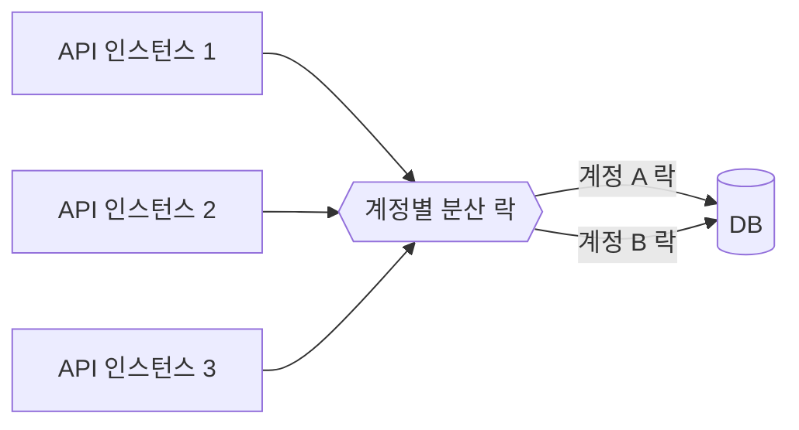

import {AnimatedLineChart, AnimatedBars} from '@site/src/components/blog/MonitorCharts';

<!-- truncate -->

결제는 "같은 계정·같은 주문에 동시에 여러 요청이 들어오는" 동시성 문제가 가장 잘 드러나는 도메인입니다. 사용자의 재시도 한 번, 무상태 인스턴스 여러 대가 겹치면 중복 결제나 잔액 오류로 이어집니다. 이 글은 대규모 결제에서 **분산 락**을 어떻게 절제해서, 그리고 안전하게 쓰는지를 정리합니다. (카카오페이의 [수천만 결제와 분산락 노하우 발표](https://www.youtube.com/watch?v=4wGTavSyLxE)를 보고 개념을 제 언어로 다시 정리한 글입니다.)

<mark>결제 동시성의 핵심은 "같은 자원(계정·주문)에 대한 동시 변경"을 직렬화하는 것입니다.</mark>

## 왜 결제에 동시성 제어가 필요한가

한 사용자가 결제 버튼을 두 번 누르거나, 네트워크 지연으로 클라이언트가 재시도하면 같은 결제 요청이 두 번 들어옵니다. 잔액을 여러 요청이 동시에 차감하면 잔액이 음수가 되고, 포인트가 이중 적립됩니다. API 서버가 여러 대라서 **한 JVM 안의 락(`synchronized`)으로는 막을 수 없습니다** — 서로 다른 서버의 요청은 같은 락 객체를 공유하지 않기 때문입니다. 그래서 여러 노드가 공유하는 **분산 락**이 필요합니다.

분산 락의 기본 개념은 [분산 락과 Redis](./redis-distributed-lock)에서 다뤘습니다. 이 글은 그 위에서 "대규모 결제에서 어떻게 쓰느냐"에 집중합니다.

## 분산 락을 쓰기 전에 — 정말 락이 필요한가

가장 먼저 할 질문은 "락 없이 풀 수 있는가"입니다. 분산 락은 관리 비용과 장애 지점을 늘리므로, 다음으로 해결되면 쓰지 않습니다.

- **멱등성 키**: 같은 결제 요청이 두 번 와도 한 번만 처리되게 합니다. 클라이언트가 요청마다 고유 키를 보내고, 서버는 그 키로 중복을 걸러냅니다.
- **조건부 UPDATE**: 잔액이 충분할 때만 차감하는 식으로, 조건을 SQL에 넣어 원자적으로 처리합니다.
- **DB 유니크 제약**: "주문당 결제 1건" 같은 규칙을 유니크 인덱스로 강제하면, 중복 삽입이 DB 레벨에서 실패합니다.

```sql
-- 잔액이 충분할 때만 차감 — 별도 락 없이도 동시 차감을 안전하게
UPDATE account
   SET balance = balance - :amount
 WHERE id = :id
   AND balance >= :amount;   -- 영향 행이 0이면 잔액 부족 → 실패 처리
```

```java
// 멱등성 키: 같은 결제가 두 번 들어와도 한 번만 처리
if (!paymentRepository.insertIfAbsent(idempotencyKey)) {
    return findResult(idempotencyKey); // 이미 처리된 요청 — 기존 결과 반환
}
```

<mark>락은 마지막 수단입니다 — 멱등성 키·조건부 UPDATE·유니크 제약으로 풀 수 있으면 락을 쓰지 않습니다.</mark>

## 락 범위를 좁힌다 — 키 설계

락이 꼭 필요하다면, 무엇을 잠글지가 처리량을 좌우합니다. 서비스 전체를 하나의 락으로 감싸면(글로벌 락) 모든 결제가 한 줄로 서서 처리량이 무너집니다. 락 키를 **자원 단위**(계정 ID, 주문 ID)로 잘게 나누면, 서로 다른 계정의 결제는 동시에 진행됩니다.



<AnimatedBars
  title="락을 잘게 나눌수록 병렬 처리량이 늘어난다"
  data={[1, 6, 10]}
  labels={["글로벌 락", "샤드 락(16)", "계정별 락"]}
  yMax={11}
  yLabel="처리량(상대)"
  xLabel="락 입도(granularity)"
  tone="good"
/>

다만 특정 계정에 트래픽이 몰리면(대형 가맹점 등) 그 키가 핫스팟이 됩니다. 이런 경우는 계정 하위를 다시 나누거나, 애초에 락이 필요 없는 설계(조건부 연산)로 우회합니다. <mark>락 키를 자원 단위로 잘게 나누는 것이 처리량의 핵심 — 락 하나가 전체를 막지 않게 합니다.</mark>

## 락 구간을 짧게 — 임계 구역 최소화

락을 잡고 있는 동안에는 그 자원을 다른 요청이 건드리지 못합니다. 그래서 락 구간(임계 구역)이 길수록 대기가 쌓이고 처리량이 떨어집니다. 특히 **락을 잡은 채로 외부 결제망·PG 호출 같은 느리고 불확실한 작업을 하면** 최악입니다 — 그 호출이 지연되는 동안 같은 자원의 모든 요청이 묶입니다.

원칙은 "락 안에서는 검증과 상태 변경만 짧게, 외부 호출은 락 밖에서"입니다.

<AnimatedLineChart
  title="락을 오래 잡을수록 처리량은 떨어진다"
  data={[100, 70, 46, 30, 20, 13]}
  yMax={110}
  yLabel="처리량(상대)"
  xLabel="락 보유 시간 →"
  tone="bad"
/>

<mark>락을 잡은 채 외부 호출·긴 작업을 하지 않습니다 — 임계 구역은 짧을수록 좋습니다.</mark>

## Redis 분산 락 — Redisson과 안전장치

Redis로 분산 락을 만들 때, `SETNX`를 반복 호출하는 스핀 방식은 Redis에 부하를 주고 비효율적입니다. Redisson은 **Pub/Sub 기반 대기**(락이 풀리면 알림을 받아 깨어남)로 이 낭비를 없애고, 여러 안전장치를 제공합니다.

```java
RLock lock = redisson.getLock("pay:account:" + accountId); // 계정 단위 락 키
if (lock.tryLock(3, TimeUnit.SECONDS)) {  // 최대 3초 대기(Pub/Sub), 못 얻으면 실패 처리
    try {
        // 임계 구역: 검증 + 상태 변경만 짧게 (외부 결제망 호출은 여기 넣지 않음)
        deductBalance(accountId, amount);
    } finally {
        lock.unlock(); // 자기 락만 해제
    }
}
```

두 가지 안전장치가 핵심입니다.

- **TTL(만료 시간)**: 락을 잡은 노드에 장애가 나도, 시간이 지나면 락이 자동으로 풀립니다. 이게 없으면 장애 난 노드의 락이 영원히 남아 데드락이 됩니다.
- **Watchdog(자동 연장)**: 정상적으로 작업 중인데 TTL이 먼저 끝나 락이 풀리는 사고를 막습니다. Redisson은 작업이 끝날 때까지 락을 주기적으로 연장합니다.

또한 락 해제는 **자기가 건 락만** 풀어야 합니다. TTL로 풀린 뒤 다른 노드가 잡은 락을 실수로 해제하지 않도록, 소유자 토큰을 확인합니다. <mark>TTL로 데드락을 막고 Watchdog으로 정상 작업의 락을 연장하는 것 — 이 둘의 균형이 분산 락 안정성의 핵심입니다.</mark>

Redisson과 저수준 구현의 차이는 [Redisson vs RedisTemplate](./redisson-vs-redistemplate)에서 비교했습니다.

## 락과 트랜잭션의 순서 — 커밋 이후에 풀어야 한다

결제 로직은 보통 DB 트랜잭션 안에서 잔액을 바꿉니다. 이때 **락을 언제 푸느냐**가 정합성을 좌우합니다. 만약 트랜잭션이 커밋되기 **전에** 락을 풀면, 대기하던 다음 스레드가 락을 얻어 들어오는데 그 시점의 DB에는 앞 트랜잭션의 변경이 아직 반영되지 않았습니다 — 즉 **아직 커밋되지 않은 옛 잔액을 읽고** 그 위에서 또 차감합니다. 락을 걸었는데도 동시성 문제가 그대로 남는 것입니다.

그래서 락의 범위가 트랜잭션을 **완전히 감싸야** 합니다. 순서는 "락 획득 → 트랜잭션 시작 → 변경 → 커밋 → 락 해제"입니다.

```java
// 순서가 핵심: 락을 먼저 잡고, 그 안에서 트랜잭션이 시작·커밋되게 한다
lock.acquire(key);
try {
    txTemplate.execute(status -> {   // 트랜잭션 시작 ~ 커밋이 모두 락 안에서 끝남
        deductBalance(accountId, amount);
        return null;
    });                              // 여기서 커밋 완료
} finally {
    lock.release(key);               // 커밋 이후에 해제
}
```

Spring에서 `@Transactional`과 락 애너테이션을 함께 쓴다면, **락 처리가 트랜잭션보다 바깥에서** 실행되도록 순서(AOP 우선순위)를 맞춰야 합니다. 락이 트랜잭션 "안"에 있으면 커밋 전에 unlock이 호출됩니다. <mark>락은 트랜잭션 커밋 이후에 풀어야 합니다 — 커밋 전에 풀면 다음 스레드가 아직 반영되지 않은 데이터를 읽습니다.</mark>

## 반복을 없애는 함수형 락 — "우아하게" 감싸기

지금까지 본 `tryLock → try → finally → unlock`, 그리고 "커밋 이후 해제" 순서를 **호출하는 곳마다 손으로** 쓰면, 어딘가에서 unlock을 빠뜨리거나 순서를 틀리기 쉽습니다. 그래서 이 획득→실행→해제 절차를 **고차 함수 하나로 감싸고, 호출부는 임계 구역 로직만 람다로 넘기는** 방식이 깔끔합니다(카카오페이 발표에서 함수형으로 분산 락을 다룬 핵심이 이것입니다).

```java
// 락 획득 → 실행 → 해제를 한곳에 캡슐화. 호출부는 "무엇을 할지"만 넘긴다
public <T> T withLock(String key, Supplier<T> critical) {
    RLock lock = redisson.getLock(key);
    if (!lock.tryLock(3, TimeUnit.SECONDS)) throw new LockNotAcquired(key);
    try {
        return critical.get();   // 임계 구역
    } finally {
        lock.unlock();           // 어떤 경로로 끝나든 해제 보장
    }
}

// 호출부 — tryLock/finally/unlock이 사라지고 "의도"만 남는다
withLock("pay:account:" + accountId, () -> {
    deductBalance(accountId, amount);
    return null;
});
```

이렇게 두면 (1) unlock 누락·순서 실수를 **구조적으로** 막고, (2) 대기 시간·키 규칙·트랜잭션 경계 같은 락 정책을 **한 곳에서** 바꿀 수 있습니다. <mark>획득→실행→해제를 고차 함수로 감싸면, 호출부에서 unlock 누락·순서 실수를 구조적으로 없앨 수 있습니다.</mark>

## Redis가 장애나면 — 락의 한계와 최종 방어선

분산 락은 Redis에 의존합니다. 그래서 Redis가 느려지거나 멈추면 락 자체가 흔들립니다. 장애 순간에 정합성(락을 못 얻으면 요청 실패)과 가용성(락 없이 진행) 중 무엇을 택할지 미리 정해야 합니다. 복제·failover 중 짧게 락이 두 곳에서 잡히는 상황도 고려해야 합니다.

그래서 **분산 락을 유일한 방어선으로 삼지 않습니다.** 락은 경합을 줄여 처리량을 지키는 1차 방어이고, 정합성의 최종 보장은 **DB의 제약과 조건부 연산**이 맡습니다 — 유니크 인덱스로 중복 결제를 원천 차단하고, 조건부 UPDATE로 잔액이 음수가 되지 않게 합니다. 이렇게 두 겹으로 두면 락이 잠깐 실패해도 데이터가 깨지지 않습니다.

<mark>분산 락은 Redis에 의존하므로, 최종 정합성은 DB의 유니크 제약·조건부 연산으로 한 번 더 보장합니다.</mark>

분산 락과 Redis 장애 시 대응은 [분산 락과 Redis 장애](./distributed-lock-and-redis-failure)에서 더 다뤘습니다.

## 정리 — 결제 분산 락 체크리스트

1. **락이 정말 필요한가** — 멱등성 키·조건부 UPDATE·유니크 제약으로 되면 락을 피합니다.
2. **락 키는 자원 단위로 잘게** — 글로벌 락 금지, 계정·주문 단위로. 핫 키는 다시 나눕니다.
3. **임계 구역은 짧게** — 락 안에서 외부 결제망 호출·긴 작업을 하지 않습니다.
4. **Redisson + TTL + Watchdog** — Pub/Sub 대기로 효율, TTL로 데드락 방지, Watchdog으로 정상 작업 보호, 자기 락만 해제.
5. **락과 트랜잭션 순서** — 락이 트랜잭션을 감싸게 해, 커밋 이후에 락을 풉니다.
6. **함수형으로 캡슐화** — 획득→실행→해제를 고차 함수로 묶어 unlock 누락·순서 실수를 구조적으로 막습니다.
7. **DB를 최종 방어선으로** — 유니크 제약·조건부 UPDATE로 락이 실패해도 정합성을 지킵니다.

한 줄로 요약하면, **락은 최대한 적게·짧게·잘게 쓰고, 마지막 정합성은 DB로 지킨다**입니다.

## 용어 한 줄 정리

| 용어 | 쉬운 뜻 |
|---|---|
| 분산 락 | 여러 서버·노드가 공유하는 락. 한 JVM 락으로 못 막는 동시성을 조율 |
| 멱등성 키 | 같은 요청이 여러 번 와도 한 번만 처리되게 하는 고유 키 |
| 임계 구역 | 한 번에 하나만 들어가야 하는 코드 구간(락으로 보호) |
| 락 입도(granularity) | 무엇을 단위로 잠그는지 — 글로벌 vs 계정별처럼 잘게 나눈 정도 |
| TTL | 락의 만료 시간. 잡은 노드에 장애가 나도 자동으로 풀리게 함 |
| Watchdog | 작업이 끝날 때까지 락 TTL을 주기적으로 연장하는 장치 |
