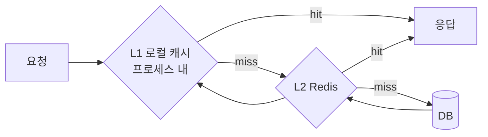

import {AnimatedBars} from '@site/src/components/blog/MonitorCharts';

<!-- truncate -->

선물하기·상품 진열처럼 **읽기가 폭주하는** 서비스에서는, Redis 한 대를 앞에 둬도 어느 순간 그 Redis 자체가 병목이 됩니다. 이 글은 로컬 캐시(L1)를 Redis(L2) 앞에 두는 **다층 캐싱**으로 읽기 폭주를 버티는 방법, 그때 생기는 정합성 문제(인스턴스 간 무효화), 그리고 핫 프로모션 같은 급등을 미리 채워 대비하는 워밍업까지 정리합니다. (카카오 선물하기의 [대용량 트래픽 캐싱 전략 발표](https://www.youtube.com/watch?v=BUV4A2F9i7w)를 보고 개념을 제 언어로 다시 정리한 글입니다.)

<mark>다층 캐싱의 핵심은 "가장 빠르고 가까운 캐시에서 최대한 많이 끝내, 뒤 계층으로 가는 요청 자체를 줄이는 것"입니다.</mark>

## 왜 Redis 하나로는 부족한가

Redis는 충분히 빠르지만, **네트워크 너머의 원격 저장소**입니다. 조회할 때마다 애플리케이션 → Redis 왕복(RTT)이 발생하고, 초당 수십만 건 읽기면 이 왕복 비용과 대역폭이 쌓입니다. 게다가 인기 선물 상품 하나에 트래픽이 몰리면 그 키(핫키)를 담당하는 Redis 노드의 CPU가 포화됩니다 — 아무리 캐시 히트율이 높아도, "네트워크 왕복"과 "한 키 집중"은 남습니다.

Redis의 핫키·왕복 비용 자체는 [대용량 트래픽에서 Redis, 무엇이 문제되나](./redis-large-scale-pitfalls)에서 다뤘습니다. <mark>Redis도 네트워크 너머에 있어, 읽기가 폭주하면 왕복 비용과 핫키가 새로운 병목이 됩니다.</mark>

## 로컬 캐시를 Redis 앞에 둔다 — 2단 캐싱

해법은 애플리케이션 **프로세스 안(메모리)** 에 캐시를 하나 더 두는 것입니다. 조회 순서는 로컬(L1) → Redis(L2) → DB로 내려가고, 위 계층에서 맞으면 아래로 가지 않습니다.



로컬 캐시가 맞으면 네트워크 왕복이 **0회**입니다 — 마이크로초 단위로 끝납니다. 그리고 인기 상품은 각 인스턴스가 자기 메모리에 한 벌씩 들고 있으므로, 핫키 트래픽을 인스턴스별로 나눠 흡수해 Redis로 가는 요청이 급감합니다.

```java
public Product getProduct(Long id) {
    // L1: 로컬(프로세스 내) — 네트워크 0회
    Product local = localCache.getIfPresent(id);
    if (local != null) return local;

    // L2: Redis — 네트워크 1회
    Product cached = redis.get("product:" + id);
    if (cached != null) {
        localCache.put(id, cached); // 로컬에 채워, 다음 요청은 로컬에서 끝나게
        return cached;
    }

    // 원본: DB
    Product fromDb = productRepository.findById(id);
    redis.set("product:" + id, fromDb, Duration.ofMinutes(10));
    localCache.put(id, fromDb);
    return fromDb;
}
```

<AnimatedBars
  title="계층이 가까울수록 응답이 빠르다 (상대 응답시간)"
  data={[1, 20, 200]}
  labels={["L1 로컬", "L2 Redis", "DB"]}
  yMax={210}
  yLabel="응답시간(상대)"
  xLabel="캐시 계층"
  tone="accent"
/>

<mark>자주 읽고 거의 바뀌지 않는 데이터는 로컬 캐시로 흡수해, Redis·DB로 가는 요청 자체를 줄입니다.</mark>

## 무엇을 로컬에 둘까 — 대상 선정

로컬 캐시는 인스턴스마다 메모리를 쓰고, 잠깐 옛 값을 보여줄 수 있습니다. 그래서 아무거나 넣으면 안 됩니다. 넣기 좋은 것과 나쁜 것이 분명합니다.

- **로컬에 둘 것**: 읽기 비율이 높고, 변경이 드물고, 크기가 작고, 잠깐 옛 값이어도 되는 데이터 — 상품 진열 정보, 카테고리, 배너 같은 것.
- **로컬에 두면 안 될 것**: 사용자별 개인화 데이터(종류가 너무 많아 메모리가 터짐), 잔액·재고처럼 강한 일관성이 필요한 데이터(옛 값을 보여주면 안 됨).

<mark>로컬 캐시는 "읽기 많고, 자주 안 바뀌고, 작고, 잠깐 옛 값이어도 되는" 데이터에만 씁니다.</mark>

## 로컬 캐시의 주의할 점 — 인스턴스 간 정합성

로컬 캐시에서 가장 주의할 점은 **인스턴스마다 캐시가 따로**라는 것입니다. 원본이 바뀌어도 각 인스턴스의 로컬 캐시는 옛 값을 그대로 들고 있어, 서버마다 다른 값을 보여줄 수 있습니다(인스턴스 간 불일치). 이걸 통제하는 방법은 세 가지입니다.

- **짧은 TTL**: 로컬 캐시의 만료 시간을 짧게(예: 수 초~수십 초) 둬서, 옛 값을 보여주는 창(staleness window)을 애초에 좁힙니다.
- **메시지 큐 팬아웃 브로드캐스트**: 원본이 바뀌면 "이 키 비워" 메시지를 메시지 큐로 발행하고, 각 인스턴스가 그 메시지를 받아 자기 로컬 캐시를 즉시 지웁니다. 이때 큐를 **팬아웃(fanout)** 으로 두는 것이 핵심입니다 — 팬아웃은 메시지를 소비자 하나에게만 주는 게 아니라 **연결된 모든 인스턴스에** 복제해 전달하므로, 전 서버의 로컬 캐시를 동시에 무효화할 수 있습니다. RabbitMQ의 팬아웃 익스체인지가 이 용도에 잘 맞습니다.
- **버전 키**: 데이터에 버전을 붙여, 버전이 바뀌면 옛 로컬 값을 무시하게 합니다.

```java
// 상품이 바뀌면 팬아웃 익스체인지로 "이 키 비워" 메시지를 발행 (RabbitMQ)
mq.publish("cache-invalidate", "product:" + id);   // 팬아웃 → 모든 인스턴스에 전달

// 각 인스턴스는 자기 큐로 메시지를 받아 로컬 캐시에서 해당 키를 제거
void onInvalidate(String key) {
    localCache.invalidate(key);
}
```

일반적인 작업 큐(work queue)는 메시지를 소비자 **한 명**에게만 전달하므로, 무효화에 그대로 쓰면 인스턴스 한 대만 캐시를 비우고 나머지는 옛 값을 그대로 들고 있게 됩니다. 그래서 "전원에게 전달"되는 팬아웃이어야 합니다. <mark>로컬 캐시의 최대 리스크는 인스턴스 간 불일치이며, 짧은 TTL과 메시지 큐 팬아웃 무효화 브로드캐스트로 옛 값이 보이는 창을 통제합니다.</mark>

## 계층을 늘려도 남는 문제 — 만료 폭주

캐시 계층을 늘려도 "인기 키가 만료되는 순간 요청이 원본으로 몰리는" 캐시 스탬피드는 사라지지 않습니다. 오히려 L1·L2 두 계층 모두에서 생길 수 있습니다. 그래서 각 계층에 같은 방어를 함께 넣습니다.

- **TTL 지터(jitter)**: 만료 시간에 랜덤을 조금 더해, 여러 키가 같은 순간에 한꺼번에 만료되지 않게 흩뜨립니다.
- **재생성 단일화**: 로컬은 인스턴스 안에서 한 요청만 원본을 다시 읽게(single flight), Redis는 분산 락으로 한 노드만 다시 채우게 합니다.

트래픽 상황별 캐시 스탬피드·핫키 대응은 [커머스 캐시·트래픽 전략](./commerce-cache-traffic-strategy)에서 케이스별로 정리했습니다. <mark>계층을 늘려도 만료 폭주는 사라지지 않으니, TTL 지터와 재생성 단일화를 각 계층에 함께 적용합니다.</mark>

## 예고된 급등에 대비 — 캐시 워밍업과 핫 프로모션

선물하기에서 특히 어려운 상황은 **핫 프로모션**입니다. 특정 상품이 갑자기 프로모션 대상이 되면 그 상품 하나에 트래픽이 순식간에 몰립니다. 그런데 그 상품이 아직 캐시에 없으면(콜드), 첫 폭증 요청이 전부 캐시 미스가 되어 원본(DB)으로 한꺼번에 몰립니다 — 앞서 본 콜드 스타트 스탬피드가 가장 나쁜 타이밍에 터지는 것입니다.

해법은 트래픽이 오기 **전에 미리 캐시를 채워 두는 것**(워밍업)입니다. 이걸 사람이 수동으로 하는 대신, **인기·프로모션 예정 상품처럼 곧 트래픽이 몰릴 데이터를 자동으로 감지해 미리 로컬·Redis에 올려 둡니다**(워밍업 자동화). 프로모션이 시작되는 순간엔 이미 캐시에 있으니, 첫 요청부터 캐시 히트로 받아 냅니다.

<mark>핫 프로모션처럼 급등이 예상되는 데이터는 트래픽이 오기 전에 미리 채워(워밍업), 콜드 스타트 스탬피드 자체를 예방합니다.</mark>

여기에 더해, 트래픽이 몰리는 데이터는 만료를 기다렸다 다시 채우는 대신 **초 단위로 백그라운드에서 미리 다시 읽어 갱신**(refresh-ahead)합니다. 그러면 요청이 만료를 만나 원본으로 가는 일 없이도, 항상 최신에 가까운 값을 서빙할 수 있습니다.

## 정리 — 다층 캐싱 체크리스트

1. **Redis 앞에 로컬 캐시(L1)** — 네트워크 왕복과 핫키를 인스턴스별로 흡수합니다.
2. **대상 선정** — 읽기 많고·변경 드물고·작고·옛 값 허용되는 데이터만 로컬에.
3. **정합성** — 짧은 TTL + 메시지 큐 팬아웃 무효화 브로드캐스트로 인스턴스 간 불일치를 통제합니다.
4. **만료 폭주** — TTL 지터 + 재생성 단일화를 L1·L2 양쪽에.
5. **급등 대비** — 핫 프로모션처럼 예상되는 급등은 워밍업(사전 적재)과 초 단위 갱신으로 콜드 스타트를 예방합니다.
6. **금지 대상** — 개인화 데이터, 강한 일관성이 필요한 데이터는 로컬에 두지 않습니다.

한 줄로 요약하면, **가까운 캐시에서 최대한 끝내되, 가까울수록 정합성 관리는 더 신경 쓴다**입니다.

## 용어 한 줄 정리

| 용어 | 쉬운 뜻 |
|---|---|
| L1 / L2 캐시 | L1은 프로세스 안(메모리) 캐시, L2는 Redis 같은 원격 공유 캐시 |
| 근접 캐시(near cache) | 애플리케이션 가까이(프로세스 내)에 둔 캐시 — 여기선 L1 로컬 캐시 |
| RTT | 요청–응답 네트워크 왕복 시간. 원격 캐시는 조회마다 발생 |
| 핫키 | 트래픽이 유독 몰리는 한 개의 키. 단일 노드를 포화시킴 |
| 캐시 스탬피드 | 인기 키가 만료되는 순간 요청이 원본으로 한꺼번에 몰리는 현상 |
| TTL 지터 | 만료 시간에 랜덤을 더해 동시 만료를 흩뜨리는 기법 |
| 팬아웃(fanout) 무효화 | 원본 변경 시 메시지 큐 팬아웃으로 전 인스턴스에 "캐시 비워"를 뿌려 로컬 캐시를 지우는 방식 |
| 캐시 워밍업 | 트래픽이 오기 전에 곧 인기 있을 데이터를 미리 캐시에 채워 두는 것 |
| refresh-ahead(초 단위 갱신) | 만료를 기다리지 않고 백그라운드에서 미리 다시 채워 항상 최신에 가깝게 두는 방식 |
