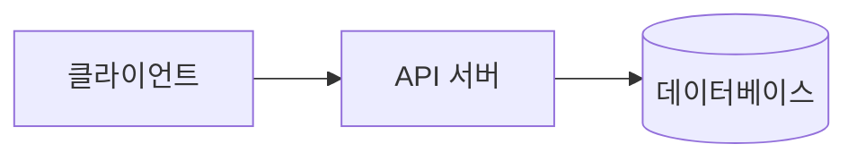
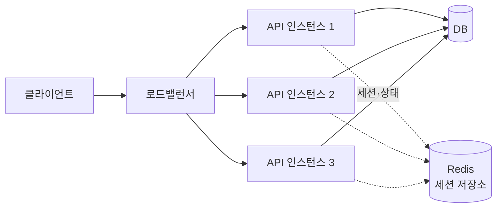
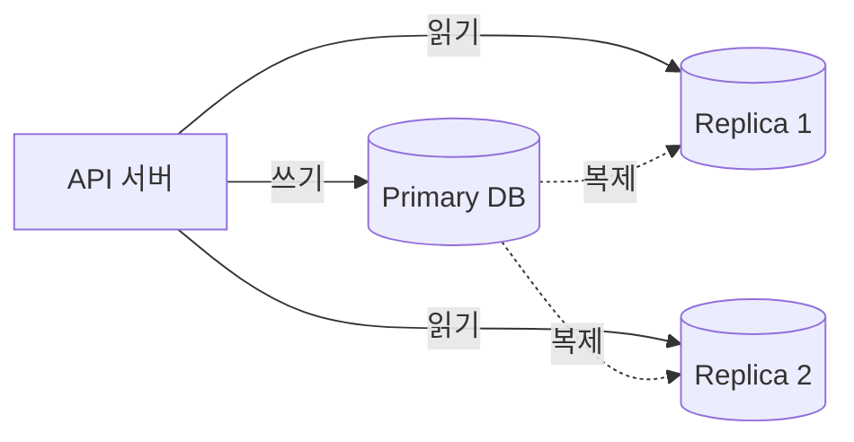
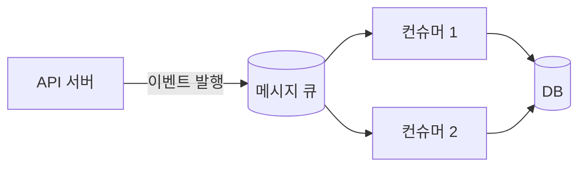
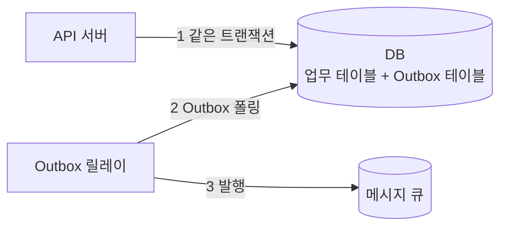
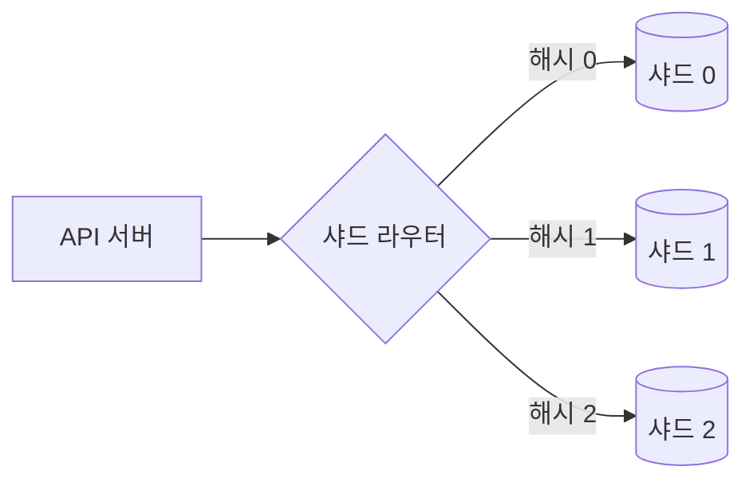

import {AnimatedLineChart, AnimatedBars} from '@site/src/components/blog/MonitorCharts';

<!-- truncate -->

대부분의 서비스는 **클라이언트 → API 서버 → 데이터베이스** 한 줄짜리 구조에서 출발합니다. 사용자가 늘고 데이터가 쌓이면 이 단순한 구조는 순서대로 한계를 드러냅니다. 이 글은 그 구조를 **어떤 순서로, 왜 그렇게** 확장하는지를 단계별로 정리합니다. 각 단계는 앞 단계에서 생긴 병목을 풀고, 동시에 새로운 **데이터 정합성** 과제를 만듭니다. 성능만 좇다 정합성을 놓치지 않도록 확장과 정합성을 함께 봅니다.

<mark>확장은 한 번에 끝내는 작업이 아니라, 병목이 나타나는 지점을 측정해 그 병목만 푸는 반복 과정입니다.</mark> 아직 오지 않은 부하를 미리 가정해 복잡하게 만들면 유지보수 비용만 늘어납니다. 각 단계는 복잡도라는 비용을 더하므로, **지표로 한계를 확인한 뒤** 다음 단계로 넘어갑니다. 트래픽이 커질 때 실제로 나타나는 증상은 [트래픽 증가가 부르는 문제들](./traffic-growth-problems)에서 정리했습니다.

## 출발점 — 단일 구조

한 곳으로 모든 요청이 모이고, 하나의 DB가 모든 읽기·쓰기를 받습니다.



장점은 단순함입니다. 배포·디버깅·트랜잭션이 모두 쉽습니다. 한계는 두 가지입니다. 트래픽이 커지면 한 대의 CPU·메모리·디스크가 곧 상한에 닿고, 그 한 대가 멈추면 서비스 전체가 멈춥니다(단일 장애점, SPOF: Single Point Of Failure). <mark>단순 구조의 진짜 약점은 성능보다 "한 곳이 무너지면 전부 무너진다"는 점입니다.</mark>

## 1단계: 수직 확장(Scale-up)

**언제**: 출시 초기, 사용자가 완만히 늘어 낮 시간대 CPU가 꾸준히 70%를 넘기 시작합니다. 구조를 바꿀 여유는 없고 급한 여유부터 확보해야 하는 상황입니다.

가장 먼저 할 수 있는 건 서버 사양을 키우는 것입니다 — CPU 코어, 메모리, 더 빠른 디스크로 교체합니다. **코드나 구조를 바꾸지 않고 가장 빠르게 여유를 확보**할 수 있는 것이 근거입니다.

다만 사양을 두 배로 올려도 비용은 두 배보다 더 듭니다. 고사양 장비일수록 단가가 비선형으로 오르기 때문입니다. 물리적 상한이 있어 무한히 키울 수 없고, 여전히 한 대라 SPOF가 남습니다.

<AnimatedLineChart
  title="수직 확장: 사양을 올릴수록 비용은 비선형으로 증가"
  data={[1, 2.2, 4, 7, 12, 20]}
  trend={[1, 9]}
  yMax={22}
  yLabel="상대 비용"
  xLabel="서버 사양 →"
  tone="bad"
/>

<mark>수직 확장은 시간을 버는 임시책이지 최종 답이 아닙니다.</mark> (점선은 "비용이 사양에 비례한다면" 그려질 직선이고, 실제 곡선은 그 위로 벌어집니다.)

## 2단계: 계층 분리 — API와 DB를 나눈다

**언제**: 배포 중에 DB 백업 배치가 겹치면 둘 다 느려집니다. API의 순간 CPU 급증이 같은 장비의 DB 쿼리를 방해하는 상황입니다.

API 서버와 DB를 다른 장비로 분리합니다. 이렇게 나누면 **자원 경합이 사라지고**, 각 계층을 **독립적으로 확장**할 수 있습니다. API 계층(CPU·네트워크 중심)과 DB 계층(디스크·메모리 중심)이 서로 방해하지 않고, 각자의 특성에 맞게 따로 확장될 수 있습니다. <mark>이 분리가 다음 단계인 수평 확장의 전제가 됩니다.</mark>

## 3단계: 무상태화 + 로드밸런서 + 수평 확장(Scale-out)

**언제**: 이벤트 오픈으로 동시 접속이 평소의 10배가 됩니다. 한 대로는 요청이 쌓여 응답이 밀립니다. 게다가 로그인 세션을 서버 메모리에 두었더니, 인스턴스를 늘리자 다음 요청이 다른 서버로 가서 "로그인이 자꾸 풀리는" 문제가 생깁니다.

API 서버를 여러 대로 늘리고, 앞에 로드밸런서를 둬서 요청을 분산합니다.



전제가 있습니다. API가 **무상태**(stateless)여야 어느 인스턴스로 요청이 가도 같은 결과를 냅니다. 세션·로그인 상태·임시 데이터를 서버 메모리에 두면, 다음 요청이 다른 인스턴스로 갔을 때 그 상태를 찾지 못합니다. 그래서 상태를 서버 밖으로 뺍니다 — 세션은 Redis 같은 공유 저장소나 토큰(JWT)으로 옮깁니다.

정합성 관점의 과제는 **로컬 상태 불일치**입니다. 인스턴스마다 들고 있는 메모리 캐시·카운터가 다르면, 같은 사용자가 요청할 때마다 다른 값을 볼 수 있습니다. 해결의 방향은 하나입니다 — 여러 인스턴스가 공유해야 하는 상태는 밖으로 뺍니다. <mark>수평 확장의 전제 조건은 무상태입니다. 상태를 서버 밖으로 빼내야 인스턴스를 자유롭게 늘릴 수 있습니다.</mark>

## 4단계: 캐시 도입 — 읽기 부하 완화

**언제**: 상품 상세 페이지가 전체 조회의 대부분을 차지하는데, 같은 상품을 초당 수천 번씩 DB에서 다시 읽고 있습니다. DB CPU는 대부분 동일한 SELECT의 반복으로 채워집니다.

DB 앞에 캐시(Redis)를 둬서 자주 읽는 값을 메모리에서 바로 돌려줍니다. 가장 흔한 방식은 **Cache-Aside**입니다 — 읽을 때 캐시를 먼저 보고, 없으면 DB에서 읽어 캐시에 채웁니다.

```java
// Cache-Aside: 읽을 때 캐시 먼저, 없으면 DB 조회 후 캐시에 채움
public Product getProduct(Long id) {
    String key = "product:" + id;
    Product cached = redis.get(key);
    if (cached != null) return cached;                 // 캐시 히트

    Product product = productRepository.findById(id);  // 캐시 미스 → DB 조회
    redis.set(key, product, Duration.ofMinutes(10));   // TTL과 함께 저장
    return product;
}

// 쓰기: DB 갱신 후 캐시를 지운다(다음 조회에서 다시 채워짐)
public void updateProduct(Product p) {
    productRepository.save(p);
    redis.delete("product:" + p.getId());
}
```

이렇게 하면 **반복 조회를 메모리에서 처리**해 DB 부하와 응답 지연을 줄입니다. 캐시가 채워질수록(warm-up) 히트율이 오르고 DB 조회량은 빠르게 줄어듭니다.

<AnimatedLineChart
  title="캐시 도입 후: DB 조회량↓, 캐시 히트율↑"
  data={[100, 78, 55, 38, 27, 20]}
  data2={[0, 32, 58, 78, 90, 96]}
  yMax={100}
  yLabel="상대값 / %"
  xLabel="캐시 warm-up →"
  legend={["DB 조회량(상대)", "캐시 히트율(%)"]}
  tone="bad"
  tone2="good"
/>

정합성 과제는 **캐시와 DB의 불일치**입니다. DB는 바뀌었는데 캐시에 옛 값이 남으면(stale) 잘못된 데이터를 보여줍니다. 대응은 세 가지 축입니다. TTL로 오래된 값이 자동으로 사라지게 하고, 쓰기 시 관련 캐시를 무효화(삭제)하며, 인기 키가 동시에 만료돼 요청이 한꺼번에 DB로 몰리는 캐시 스탬피드(cache stampede)를 락·조기 갱신으로 막습니다. <mark>캐시에서 어려운 부분은 저장이 아니라 무효화입니다 — 언제 어떤 캐시를 버릴지 정하는 것이 정합성의 핵심입니다.</mark>

캐시·트래픽 전략은 [커머스 캐시·트래픽 전략](./commerce-cache-traffic-strategy)에서 더 다뤘습니다.

## 5단계: DB 읽기 확장 — 읽기 복제본 / CQRS

**언제**: 캐시에 담기 어려운 목록·검색·집계 쿼리가 늘어 primary의 읽기 부하가 한계에 닿습니다. 통계 대시보드 조회가 실서비스 쿼리와 자원을 두고 경쟁합니다.

**읽기 전용 복제본**(read replica)을 두고 쓰기는 primary, 읽기는 replica로 보냅니다. 더 나아가 **CQRS**(Command Query Responsibility Segregation)로 쓰기 모델과 읽기 모델을 분리해, 조회에 최적화된 별도 저장소를 두기도 합니다.



이렇게 하면 **읽기 처리량이 복제본 수만큼 늘어납니다** — 아래 그래프처럼 복제본이 늘수록 감당할 수 있는 읽기량이 커집니다. 특히 읽기가 쓰기보다 훨씬 많은 서비스일수록 효과가 큽니다.

<AnimatedBars
  title="읽기 복제본 수에 따른 읽기 처리량(상대)"
  data={[1, 1.9, 2.8, 3.6]}
  labels={["1대", "2대", "3대", "4대"]}
  yMax={4}
  yLabel="읽기 처리량(상대)"
  xLabel="복제본 수"
  tone="good"
/>

정합성 과제는 **복제 지연**(replication lag)입니다. primary에 쓴 내용이 replica로 복제되기까지 아주 짧은 지연이 있는데, 이 복제가 끝나기 전에 replica를 읽으면 replica에는 아직 새 값이 도착하지 않아 **이전 값이 조회됩니다**(방금 저장한 값이 안 보임). 대응은 쓰기 직후 그 데이터를 읽는 요청은 primary로 보내고(read-your-writes), 지연을 허용해도 되는 화면과 아닌 화면을 구분해 설계하는 것입니다. <mark>읽기 복제본은 읽기 처리량을 늘리는 대신 복제 지연이라는 정합성 비용을 지불합니다.</mark>

## 6단계: 동시성 제어 — 정합성의 핵심

**언제**: 선착순 쿠폰 100장에 5천 명이 동시에 몰립니다. 여러 인스턴스가 같은 재고 행을 동시에 읽고 줄이면서, 재고가 음수가 되거나 한 사람이 두 번 받는 일이 생깁니다.

인스턴스가 여러 대가 되면 서로 다른 요청이 **같은 데이터를 동시에** 수정하는 일이 잦아집니다. 도구는 여러 층입니다.

- **DB 트랜잭션 + 격리 수준**: 한 작업 묶음의 원자성과 격리를 보장합니다.
- **비관적 락 vs 낙관적 락**: 충돌이 잦으면 `SELECT ... FOR UPDATE`로 미리 잠그고, 드물면 버전 컬럼으로 충돌을 감지합니다.
- **조건부 UPDATE**: 기대한 상태일 때만 바꾸고, 영향받은 행 수로 성공 여부를 판단합니다.
- **멱등성 키**: 같은 요청이 두 번 들어와도 한 번만 처리되게 합니다.
- **분산 락**: 여러 노드·자원에 걸친 임계 구역은 Redis(Redisson) 같은 분산 락으로 조율합니다.

```sql
-- 조건부 UPDATE: 기대한 상태일 때만 갱신되고, 영향 행 수(0/1)로 성공 여부 판단
UPDATE coupon_stock
   SET issued = issued + 1
 WHERE coupon_id = :id
   AND issued < total;   -- 남은 수량이 있을 때만 1행 갱신, 없으면 0행 → 발급 실패 처리
```

핵심은 락을 넓게 오래 잡지 않는 것입니다. <mark>동시성 문제는 "동시에 같은 것을 건드릴 때"만 생깁니다 — 경합 범위를 좁히고, 조건부 연산·낙관적 락으로 잠그는 구간을 최소화합니다.</mark>

분산 환경의 락과 장애 대응은 [분산 락과 Redis 장애](./distributed-lock-and-redis-failure)에서 자세히 다뤘습니다.

## 7단계: 비동기화 — 메시지 큐로 완충

**언제**: 결제 완료 시 알림·정산·적립을 요청 안에서 동기로 처리했더니, 외부 알림 API가 느려지면 결제 응답까지 함께 느려집니다. 피크에는 후처리가 밀려 DB가 한꺼번에 몰립니다.

무거운 후처리를 **메시지 큐**로 넘겨 뒤에서 처리합니다.



이렇게 비동기로 분리하는 이유는 세 가지입니다. 큐가 **버퍼** 역할을 해 피크 트래픽을 흡수하고(생산 속도와 소비 속도를 분리), 발신자와 수신자의 **결합도가 낮아**지며, 실패한 작업을 **재시도**하기 쉽습니다.

<AnimatedLineChart
  title="메시지 큐 완충: 유입은 튀어도 처리는 일정하게"
  data={[20, 92, 40, 100, 30, 88, 26]}
  data2={[28, 34, 40, 44, 45, 45, 45]}
  yMax={100}
  yLabel="초당 건수(상대)"
  xLabel="시간 →"
  legend={["요청 유입", "처리 속도(일정)"]}
  tone="bad"
  tone2="accent"
/>

정합성 과제는 **DB 커밋과 메시지 발행의 원자성**입니다. "DB에 주문 저장 + 큐에 이벤트 발행"을 각각 하면, 하나만 성공하고 다른 하나가 실패할 때 유실이나 중복이 생깁니다. 이 둘은 서로 다른 시스템이라 하나의 트랜잭션으로 묶을 수 없습니다. 표준 해법이 **Outbox 패턴**입니다 — 이벤트를 같은 DB 트랜잭션 안에서 Outbox 테이블에 함께 기록하고, 별도 릴레이가 그 테이블을 읽어 큐로 발행합니다.



```java
@Transactional
public void placeOrder(Order order) {
    orderRepository.save(order);                        // 업무 데이터
    outboxRepository.save(OrderCreatedEvent.of(order)); // 같은 트랜잭션에 이벤트 기록
}   // 커밋되면 둘 다 저장, 실패하면 둘 다 롤백 → 원자성 보장
    // 이후 별도 릴레이가 Outbox를 읽어 큐로 발행(실패 시 재시도)
```

메시지는 보통 최소 한 번(at-least-once) 전달되므로 같은 이벤트가 두 번 올 수 있습니다. 그래서 컨슈머는 **멱등**해야 합니다 — 같은 이벤트를 두 번 처리해도 결과가 같도록 처리 기록을 남기거나 조건부 연산을 씁니다. <mark>DB 저장과 메시지 발행을 하나의 트랜잭션으로 묶을 수 없다는 점이 비동기화의 핵심 난제이고, Outbox 패턴이 표준 해법입니다.</mark>

Outbox로 "정확히 한 번" 효과를 내는 방법은 [Kafka Outbox와 정확히 한 번](./kafka-outbox-exactly-once)에서 다뤘습니다.

## 8단계: 데이터 분할 — 파티셔닝 / 샤딩

**언제**: 단일 primary의 쓰기 TPS와 디스크가 한계에 닿습니다. 주문 테이블이 수억 행이 되어 인덱스도 무거워지고, 더 이상 한 대로는 쓰기를 받아내기 어려운 상황입니다.

데이터를 나눕니다. 먼저 한 DB 안에서 테이블을 쪼개는 **파티셔닝**, 그다음 여러 DB로 분산하는 **샤딩**입니다.



이렇게 하면 **쓰기 부하와 저장 용량이 샤드 수만큼 분산**됩니다. 관건은 **샤드 키** 선택입니다 — 특정 샤드에만 트래픽이 몰리면(핫스팟) 나눈 의미가 없습니다.

정합성 과제는 가장 무겁습니다. **여러 샤드에 걸친 트랜잭션**은 하나의 DB 트랜잭션으로 처리할 수 없습니다. 2단계 커밋(2PC)은 느리고 장애에 약해 대개 피합니다. 대신 **Saga 패턴**으로 각 단계를 개별 트랜잭션으로 처리하고, 중간에 실패하면 앞 단계를 되돌리는 **보상 트랜잭션**으로 최종 일관성을 맞춥니다. <mark>샤딩은 최후의 수단입니다 — 나누는 순간 단일 트랜잭션의 강한 일관성을 포기하고 Saga·최종 일관성으로 넘어가야 합니다.</mark>

## 정리 — 단계별 요약

| 단계 | 문제 상황 | 새로 생긴 정합성 과제 | 대응 |
|---|---|---|---|
| 1. 수직 확장 | 한 대의 자원 부족 | – | – |
| 2. 계층 분리 | API·DB 자원 경합 | – | – |
| 3. 무상태 + LB | API 처리량 한계 | 세션·로컬 상태 불일치 | 상태 외부화 |
| 4. 캐시 | 반복 읽기로 DB 부하 | 캐시–DB 불일치 | TTL·무효화·스탬피드 방지 |
| 5. 읽기 복제 | 읽기 처리량 한계 | 복제 지연 | read-your-writes |
| 6. 동시성 제어 | 같은 데이터 동시 수정 | 갱신 충돌 | 락·조건부 UPDATE·멱등성 |
| 7. 비동기화 | 쓰기 피크·무거운 후처리 | 커밋–발행 원자성 | Outbox·멱등 컨슈머 |
| 8. 샤딩 | 쓰기·용량 한계 | 크로스 샤드 트랜잭션 | Saga·최종 일관성 |

관통하는 원칙은 하나입니다. **측정으로 병목을 확인하고, 그 병목만 한 단계 확장합니다.** 단계가 올라갈수록 강한 일관성(단일 트랜잭션)에서 최종 일관성으로, 단순함에서 복잡함으로 이동합니다. 그래서 필요할 때까지는 앞 단계에 머무는 것이 좋은 설계입니다.

## 용어 한 줄 정리

| 용어 | 쉬운 뜻 |
|---|---|
| 무상태(stateless) | 서버가 요청 간 상태를 들고 있지 않아, 어느 인스턴스로 보내도 동일하게 동작 |
| SPOF | 단일 장애점 — 그곳이 멈추면 전체가 멈추는 지점 |
| Cache-Aside | 읽을 때 캐시 먼저, 없으면 DB에서 읽어 캐시에 채우는 방식 |
| 캐시 스탬피드 | 인기 키가 동시에 만료돼 요청이 한꺼번에 DB로 몰리는 현상 |
| 복제 지연 | primary의 변경이 replica에 반영되기까지의 시간차 |
| 낙관적 락 | 충돌이 드물다고 보고, 버전으로 충돌을 감지해 재시도 |
| 비관적 락 | 충돌이 잦다고 보고, 미리 잠그고 작업 |
| 멱등성 | 같은 요청을 여러 번 처리해도 결과가 같은 성질 |
| Outbox 패턴 | 이벤트를 업무 데이터와 같은 트랜잭션에 기록 후 별도로 발행 |
| Saga | 분산 트랜잭션을 개별 단계 + 보상 트랜잭션으로 최종 일관성 달성 |
