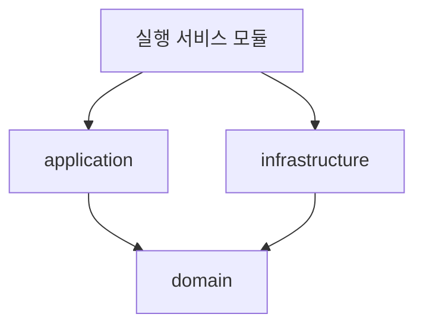

<!-- truncate -->

서비스가 커지면 하나의 거대한 모듈로는 빌드가 느려지고, 계층 간 의존성이 뒤엉키며, 책임 경계가 무너집니다. 여러 실행 서비스(API·배치·스케줄러 등)와 공통 도메인을 **한 저장소의 멀티모듈**로 관리하되, 각 도메인을 **도메인·애플리케이션·인프라 레이어**로 나누는 DDD 기반 레이어드 멀티모듈 구성을 정리합니다. (특정 회사·서비스와 무관하게 일반화한 예시입니다.) DDD는 [에릭 에반스(Eric Evans)](https://www.domainlanguage.com/)가 2003년 저서 『Domain-Driven Design: Tackling Complexity in the Heart of Software』에서 정립한 접근이고, 도메인을 계층으로 나누는 레이어드 구성은 [마틴 파울러의 PoEAA](https://martinfowler.com/eaaCatalog/) 등에서도 정리된 고전적 패턴입니다.

<mark>멀티모듈은 책임·의존성 경계를 물리적으로 강제하고, 레이어드는 그 경계 안에서 의존성이 도메인 쪽으로만 향하게 만듭니다.</mark>

## 왜 멀티모듈 + 레이어드인가

단일 모듈은 처음엔 편하지만 커질수록 문제가 생깁니다. 전체가 한 번에 컴파일돼 빌드가 느리고, 웹 계층이 도메인을 우회해 DB를 직접 부르는 식으로 **계층 경계가 쉽게 무너집니다.** 모듈을 나누면 "이 모듈은 저 모듈을 의존할 수 없다"는 규칙을 **빌드 도구가 강제**하므로, 경계가 코드 리뷰가 아니라 구조로 지켜집니다.

<mark>경계를 사람의 규율이 아니라 모듈 의존성으로 강제하는 것이 멀티모듈의 핵심 가치입니다.</mark>

## 전체 구성 한눈에

모듈을 세 부류로 나눕니다. (1) 실행 가능한 **서비스 모듈**, (2) 비즈니스를 담는 **도메인 모듈**, (3) 여러 서비스가 공유하는 **기술 공통 모듈**입니다.

```
root/
├── service-api/            # [실행] REST API 애플리케이션
├── service-batch/          # [실행] 배치 애플리케이션
├── scheduler-service/      # [실행] 스케줄러
├── websocket-service/      # [실행] 실시간(웹소켓)
├── etl-service/            # [실행] 집계·ETL
│
├── domain-core/            # [도메인] 엔티티·리포지토리 인터페이스·도메인 규칙
├── domain-infra/           # [도메인] 리포지토리 구현(JPA·MyBatis)
├── platform/               # [도메인] 공통 응답·예외·정책
│
├── jdbc-module/            # [기술공통] DB 접근
│   ├── jdbc-core/
│   └── jdbc-jpa/
├── web-module/             # [기술공통] 웹 계층(공통 컨트롤러·필터)
│   ├── web-core/
│   ├── web-front/
│   └── web-back/
├── client-module/          # [기술공통] 외부 연동 클라이언트
│   ├── client-core/
│   └── example-client/
├── message-module/         # [기술공통] 메시징(Kafka 등)
├── metric-module/          # [기술공통] 관측(메트릭·트레이싱)
└── test-module/            # [기술공통] 테스트 지원
```

실행 서비스는 저마다 진입점만 다를 뿐, 필요한 도메인 모듈과 기술 공통 모듈을 **조합**해서 만듭니다. <mark>실행 서비스는 조합의 결과일 뿐, 비즈니스 로직은 도메인 모듈에 모여 있습니다.</mark>

## 도메인 모듈 안의 레이어

도메인 모듈 안은 **바운디드 컨텍스트(주문·회원·결제 등)별로** 나누고, 각 컨텍스트를 다시 `domain / application / infrastructure` 세 레이어로 둡니다.

```
domain-core/src/main/java/com/example/
├── order/                       # 바운디드 컨텍스트: 주문
│   ├── domain/
│   │   ├── entity/              # 엔티티·값 객체(순수 도메인)
│   │   └── repository/          # 리포지토리 "인터페이스"(도메인이 소유)
│   ├── application/             # 유스케이스(서비스)
│   └── infrastructure/          # 리포지토리 "구현"
│       ├── jpa/
│       └── mybatis/
├── member/                      # 바운디드 컨텍스트: 회원
│   └── (동일 구조)
└── payment/
    └── (동일 구조)
```

핵심은 **리포지토리 인터페이스를 `domain`에 두고, 그 구현을 `infrastructure`에 두는 것**입니다. 그러면 도메인은 JPA·MyBatis 같은 기술을 모른 채 인터페이스에만 의존하고, 기술 세부는 바깥에서 갈아 끼울 수 있습니다.

- **domain**: 프레임워크 의존을 최소화한 순수 비즈니스. 규칙·불변식이 여기 있습니다.
- **application**: 유스케이스를 조립(트랜잭션 경계·여러 도메인 오케스트레이션).
- **infrastructure**: 도메인 인터페이스의 구현(영속성·외부 연동).

<mark>리포지토리 인터페이스를 도메인에 두고 구현을 인프라에 두면, 의존성이 도메인 쪽으로 뒤집혀(의존성 역전) 도메인이 기술로부터 독립합니다.</mark>

## 의존성 방향

모든 화살표가 `domain`을 향하고, `domain`은 아무것도 의존하지 않는 것이 목표입니다.



실행 서비스와 인프라는 도메인을 향해 의존하지만, 그 역방향은 없습니다. 이 방향만 지켜지면 도메인 모듈은 어떤 실행 환경(API든 배치든)에도 그대로 재사용됩니다.

## 기술 공통 모듈로 중복 제거

DB 접근·웹 공통 설정·외부 클라이언트·메시징·관측·테스트 지원처럼 **모든 서비스가 똑같이 필요로 하는 것**은 기술 공통 모듈로 뺍니다. 서비스마다 다시 만들지 않고, 버전·정책을 한곳에서 바꿉니다.

<mark>비즈니스는 도메인 모듈에, 반복되는 기술 기반은 공통 모듈에 모아 "서비스 = 도메인 + 공통의 조합"으로 단순해집니다.</mark>

## 정리

- 모듈을 **실행 서비스 / 도메인 / 기술 공통** 세 부류로 나눕니다.
- 도메인 모듈 안은 바운디드 컨텍스트별로, 다시 `domain·application·infrastructure` 레이어로 둡니다.
- 리포지토리 인터페이스를 도메인에 두어 **의존성을 도메인 쪽으로** 통제합니다.

도메인을 인프라로부터 더 강하게 떼어내는 **헥사고날(포트·어댑터)** 구성은 [헥사고날 아키텍처로 멀티모듈 구성하기](./hexagonal-multimodule)에서 이어집니다. 헥사고날의 개념 자체는 [헥사고날 아키텍처](./hexagonal-architecture)를 참고하세요.

## 용어 한 줄 정리

| 용어 | 쉬운 뜻 |
|---|---|
| 멀티모듈 | 한 저장소를 여러 빌드 단위(모듈)로 나눠 의존성 경계를 강제하는 구성 |
| 바운디드 컨텍스트 | 하나의 일관된 도메인 경계(주문·회원·결제 등 단위) |
| 레이어드 아키텍처 | domain·application·infrastructure로 수직 분리한 계층 구조 |
| 의존성 역전(DIP) | 인터페이스를 도메인이 소유하고 구현을 바깥에 둬, 의존 방향을 도메인으로 뒤집는 것 |
