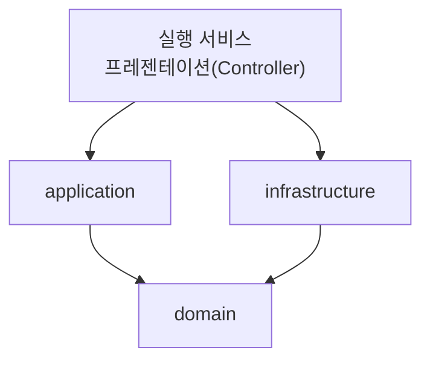
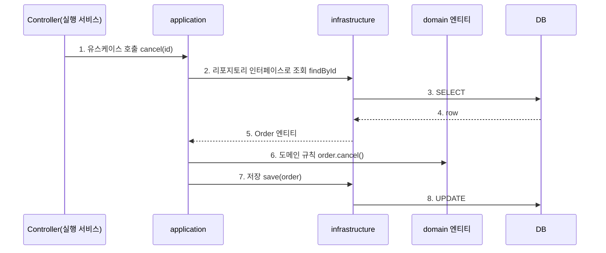

<!-- truncate -->

서비스가 커지면 하나의 거대한 모듈로는 빌드가 느려지고, 계층 간 의존성이 뒤엉키며, 책임 경계가 무너집니다. 여러 실행 서비스(API·배치·스케줄러 등)와 공통 도메인을 **한 저장소의 멀티모듈**로 관리하되, 각 도메인을 **도메인·애플리케이션·인프라 레이어**로 나누는 DDD 기반 레이어드 멀티모듈 구성을 정리합니다. DDD는 [에릭 에반스(Eric Evans)](https://www.domainlanguage.com/)가 2003년 저서 『Domain-Driven Design: Tackling Complexity in the Heart of Software』에서 정립한 접근이고, 도메인을 계층으로 나누는 레이어드 구성은 [마틴 파울러의 PoEAA](https://martinfowler.com/eaaCatalog/) 등에서도 정리된 고전적 패턴입니다.

<mark>멀티모듈은 책임·의존성 경계를 물리적으로 강제하고, 레이어드는 그 경계 안에서 의존성이 도메인 쪽으로만 향하게 만듭니다.</mark>

## 왜 멀티모듈 + 레이어드인가

단일 모듈은 처음엔 편하지만 커질수록 문제가 생깁니다. 전체가 한 번에 컴파일돼 빌드가 느리고, 웹 계층이 도메인을 우회해 DB를 직접 부르는 식으로 **계층 경계가 쉽게 무너집니다.** 모듈을 나누면 "이 모듈은 저 모듈을 의존할 수 없다"는 규칙을 **빌드 도구가 강제**하므로, 경계가 코드 리뷰가 아니라 구조로 지켜집니다.

<mark>경계를 사람의 규율이 아니라 모듈 의존성으로 강제하는 것이 멀티모듈의 핵심 가치입니다.</mark>

## 전체 구성 한눈에

모듈은 크게 세 부류입니다. (1) 실행 가능한 **서비스 모듈** — 각 서비스가 맡은 도메인을 컨텍스트별로 `domain·application·infrastructure·presentation` **4계층으로 직접** 담습니다. (2) 여러 서비스가 함께 쓰는 **공유 도메인·응용 모듈**. (3) **기술 공통 모듈**입니다.

```
root/
├── store-service/          # [실행] 자기 컨텍스트를 domain·application·infra·presentation로 구성
├── admin-service/          # [실행] 어드민
├── promotion-service/      # [실행] 프로모션·컨텐츠
├── websocket-service/      # [실행] 실시간(웹소켓)
├── scheduler-service/      # [실행] 스케줄러
├── etl-service/            # [실행] 집계·ETL API
│
├── shared-domain/          # [공유] 여러 서비스가 쓰는 공용 도메인(엔티티·인터페이스)
├── shared-service-infra/   # [공유] 공용 응용·인프라
├── platform/               # [공유] 공통 도메인·정책
│
├── jdbc-module/            # [기술공통] DB 접근
│   ├── jdbc-core/
│   └── jdbc-jpa/
├── web-module/             # [기술공통] 웹 계층(공통 컨트롤러·필터)
│   ├── web-core/
│   ├── web-front/
│   └── web-back/
├── feign-module/           # [기술공통] 외부 연동 클라이언트
│   ├── feign-core/
│   └── example-client/
├── message-module/         # [기술공통] 메시징(Kafka 등)
├── metric-module/          # [기술공통] 관측(메트릭·트레이싱)
├── test-module/            # [기술공통] 테스트 지원
│
├── etl-common/             # [ETL] 집계 공통 도메인
└── etl-batch-job/          # [ETL] 배치 잡
```

각 실행 서비스는 자기 컨텍스트의 4계층을 직접 담고, 여러 서비스가 겹쳐 쓰는 도메인·응용만 `shared-*` 모듈로 뺍니다. <mark>레이어드는 서비스 모듈 안에서 컨텍스트별 4계층으로 구현되고, 공용 도메인·응용은 별도 공유 모듈로 재사용합니다.</mark>

## 레이어 구성과 계층 배치

DDD의 레이어드 아키텍처는 본래 **표현(Presentation) → 응용(Application) → 도메인(Domain) → 인프라(Infrastructure)** 네 계층입니다. Controller는 이 중 맨 위 **표현 계층**에 속합니다.

한 서비스 모듈은 자기가 맡은 **바운디드 컨텍스트(주문·회원·결제 등)별로 이 4계층을 모두** 담습니다. 컨텍스트 폴더 하나 안에 `domain·application·infrastructure·presentation`가 나란히 들어갑니다.

```
store-service/src/main/java/com/example/
├── order/                       # 바운디드 컨텍스트: 주문
│   ├── domain/
│   │   ├── entity/              # 엔티티
│   │   ├── vo/                  # 값 객체(Value Object)
│   │   ├── repository/          # 리포지토리 "인터페이스"(도메인이 소유)
│   │   └── constant/            # 상수·enum
│   ├── application/             # 유스케이스(서비스)
│   ├── infrastructure/          # 리포지토리 "구현"(JPA·MyBatis)
│   ├── presentation/            # 컨트롤러(표현 계층)
│   └── dto/                     # 요청·응답 DTO(계층 간 전송 객체)
├── member/                      # 회원 컨텍스트 (동일 구조)
├── …/                           # 그 외 컨텍스트 (동일 구조)
└── config/
```

여러 서비스가 겹쳐 쓰는 도메인·응용은 `shared-domain`·`shared-service-infra` 모듈로 빼서 재사용합니다. 핵심은 **리포지토리 인터페이스를 `domain` 패키지에 두고, 그 구현을 `infrastructure` 패키지에 두는 것**입니다. 그러면 `application`·`domain`은 JPA·MyBatis 같은 기술을 모른 채 인터페이스에만 의존하고, 기술 세부는 `infrastructure`에서 갈아 끼울 수 있습니다.

- **presentation**: 컨트롤러(요청·응답 처리).
- **application**: 유스케이스 조립(트랜잭션 경계·여러 도메인 오케스트레이션).
- **domain**: 엔티티·VO·리포지토리 인터페이스(순수 비즈니스, 규칙·불변식).
- **infrastructure**: 도메인 인터페이스의 구현(영속성·외부 연동).
- **dto**: 요청·응답 등 계층 간 전송 객체(엔티티를 그대로 노출하지 않도록 분리).

코드로 보면 세 레이어의 역할과 의존 방향이 분명해집니다.

```java
// [domain] 엔티티: 규칙은 엔티티 안에
public class Order {
    private OrderStatus status;
    public void cancel() {
        if (status == OrderStatus.SHIPPED) throw new IllegalStateException("배송 후 취소 불가");
        this.status = OrderStatus.CANCELED;
    }
}

// [domain] 리포지토리 "인터페이스"를 도메인이 소유
public interface OrderRepository {
    Order findById(Long id);
    void save(Order order);
}

// [application] 유스케이스: 도메인 인터페이스에만 의존 (구현은 모름)
public class OrderService {
    private final OrderRepository orderRepository;
    public void cancel(Long id) {
        Order order = orderRepository.findById(id);
        order.cancel();               // 도메인 규칙 호출
        orderRepository.save(order);
    }
}

// [infrastructure] 도메인 인터페이스를 JPA로 "구현"
public class OrderJpaRepository implements OrderRepository {
    public Order findById(Long id) { /* JPA 조회 */ return null; }
    public void save(Order order)  { /* JPA 저장 */ }
}
```

<mark>리포지토리 인터페이스를 도메인에 두고 구현을 인프라에 두면, 의존성이 도메인 쪽으로 뒤집혀(의존성 역전) 도메인이 기술로부터 독립합니다.</mark>

## 의존성 방향

모든 화살표가 `domain`을 향하고, `domain`은 아무것도 의존하지 않는 것이 목표입니다.



모든 계층이 `domain`을 향해 의존하고, `domain`은 아무것도 의존하지 않습니다. 그래서 도메인 코드는 어떤 실행 환경(API든 배치든)에도 그대로 재사용됩니다.

한 컨텍스트 안에서 `presentation`·`application`은 `domain`의 리포지토리 인터페이스에 의존하고, `infrastructure`가 그 인터페이스를 **구현**합니다. `application`은 구현체(`infrastructure`)를 직접 import하지 않고, 실제 구현은 **Spring이 런타임에 주입**합니다. 그래서 `application`·`domain`은 구현이 JPA인지 MyBatis인지 모릅니다.

## 요청 하나가 계층을 지나는 순서

"주문 취소" 요청이 들어왔을 때 계층을 지나는 큰 흐름입니다.



1. **Controller**(실행 서비스)가 요청을 받아 `application` 유스케이스를 호출합니다.
2. `application`은 `domain`의 **리포지토리 인터페이스**로 조회를 요청합니다(실제 구현은 `infrastructure`가 담당).
3. `infrastructure`가 DB에서 읽은 엔티티를 돌려줍니다.
4. `application`이 그 엔티티에 **도메인 규칙**(`order.cancel()`)을 실행하고, 다시 인터페이스로 저장합니다.

각 단계가 어느 계층·디렉토리에 있는지 대응하면 이렇습니다.

| 단계 | 계층 | 위치(디렉토리) |
|---|---|---|
| ① 요청 수신 | 표현 | store-service/…/order/<mark>presentation</mark>/OrderController |
| ② 유스케이스 호출 | 응용 | store-service/…/order/<mark>application</mark>/OrderService |
| ③ 조회(인터페이스) | 도메인 | store-service/…/order/<mark>domain</mark>/repository/OrderRepository |
| ④ 규칙 실행 | 도메인 | store-service/…/order/<mark>domain</mark>/entity/Order |
| ⑤ 실제 조회·저장 | 인프라 | store-service/…/order/<mark>infrastructure</mark>/OrderJpaRepository |

여기서 헷갈리기 쉬운 것이 **Controller의 계층**입니다. Controller는 **프레젠테이션(표현) 계층**으로, 별도 모듈이 아니라 **같은 컨텍스트 폴더 안**에서 `domain`·`application`·`infrastructure`와 나란히 있습니다(`order/presentation`). 계층 순서는 `presentation → application → domain`이고, `infrastructure`는 `domain`의 인터페이스를 구현하며 뒤에서 붙습니다.

<mark>presentation·application·domain·infrastructure가 한 컨텍스트 폴더에 모여 있고, 의존성은 모두 안쪽 domain을 향합니다. 비즈니스 규칙은 엔티티 안에서 실행됩니다.</mark>

## 기술 공통 모듈로 중복 제거

DB 접근·웹 공통 설정·외부 클라이언트·메시징·관측·테스트 지원처럼 **모든 서비스가 똑같이 필요로 하는 것**은 기술 공통 모듈로 뺍니다. 서비스마다 다시 만들지 않고, 버전·정책을 한곳에서 바꿉니다.

<mark>비즈니스는 도메인 모듈에, 반복되는 기술 기반은 공통 모듈에 모아 "서비스 = 도메인 + 공통의 조합"으로 단순해집니다.</mark>

## 정리

- 모듈을 **실행 서비스 / 공유 도메인·응용 / 기술 공통**으로 나눕니다.
- 각 **서비스 모듈**은 컨텍스트별로 `domain·application·infrastructure·presentation` 4계층을 담고, 공용 도메인·응용만 `shared-*` 모듈로 뺍니다.
- 리포지토리 인터페이스를 `domain` 패키지에 두어 **의존성을 도메인 쪽으로** 통제합니다.

도메인을 인프라로부터 더 강하게 떼어내는 **헥사고날(포트·어댑터)** 구성은 [헥사고날 아키텍처로 멀티모듈 구성하기](./hexagonal-multimodule)에서 이어집니다. 헥사고날의 개념 자체는 [헥사고날 아키텍처](./hexagonal-architecture)를 참고하세요.

## 용어 한 줄 정리

| 용어 | 쉬운 뜻 |
|---|---|
| 멀티모듈 | 한 저장소를 여러 빌드 단위(모듈)로 나눠 의존성 경계를 강제하는 구성 |
| 바운디드 컨텍스트 | 하나의 일관된 도메인 경계(주문·회원·결제 등 단위) |
| 레이어드 아키텍처 | domain·application·infrastructure로 수직 분리한 계층 구조 |
| 의존성 역전(DIP) | 인터페이스를 도메인이 소유하고 구현을 바깥에 둬, 의존 방향을 도메인으로 뒤집는 것 |
