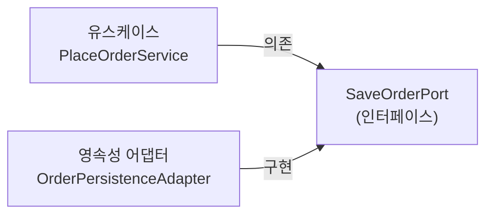
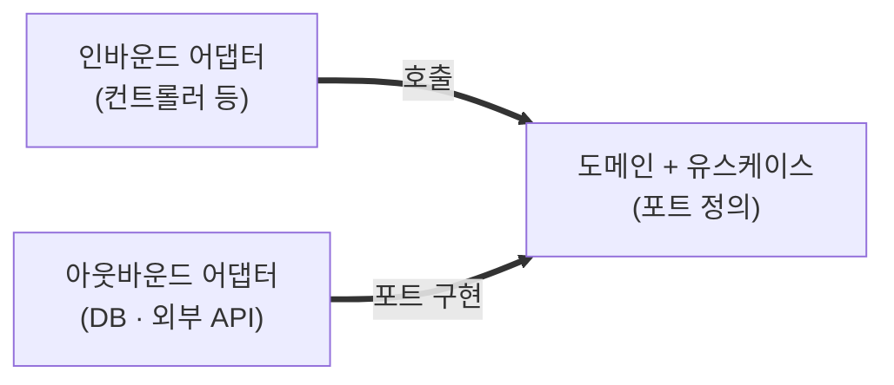
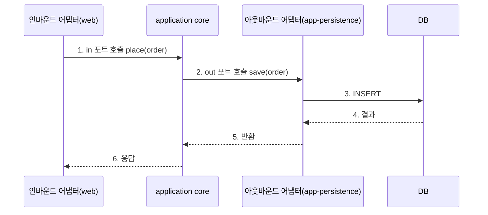

<!-- truncate -->

헥사고날 아키텍처는 **도메인을 가운데 두고, 웹·DB·외부 API 같은 바깥세상을 어댑터로 갈아 끼우는** 구조입니다. 개념을 코드로만 나누면 경계가 흐려지기 쉬워서, 아예 **멀티모듈로 물리적으로 분리**해 도메인이 인프라를 의존하지 못하게 강제한 구성을 정리합니다. 헥사고날 아키텍처는 [앨리스터 코오번(Alistair Cockburn)](https://alistair.cockburn.us/hexagonal-architecture/)이 2005년 제안한 패턴으로, 원래 이름은 **포트와 어댑터(Ports and Adapters)** 입니다.

<mark>헥사고날의 목표는 "도메인은 바깥을 모르고, 바깥이 도메인의 포트(인터페이스)를 구현한다"입니다.</mark>

## 핵심: 도메인은 가운데, 어댑터는 바깥

바깥세상과의 연결을 두 방향으로 나눕니다.

- **인바운드 어댑터(driving)**: 외부가 도메인을 부르는 입구. 웹 컨트롤러·메시지 컨슈머·배치·스케줄러.
- **아웃바운드 어댑터(driven)**: 도메인이 외부를 부르는 출구. DB 영속성·외부 API 클라이언트.
- **포트(port)**: 도메인·코어가 정의한 인터페이스. 어댑터가 이 포트를 구현하거나 호출합니다.

헥사고날의 개념 자체는 [헥사고날 아키텍처](./hexagonal-architecture)에서 다뤘습니다. 이 글은 그것을 **모듈 경계로 어떻게 강제하는지**에 집중합니다.

<mark>포트라는 인터페이스가 도메인과 어댑터 사이의 유일한 접점이라, 어댑터는 언제든 교체·모킹할 수 있습니다.</mark>

## 전체 구성 한눈에

실행 가능한 앱(인바운드 어댑터)들과, 그들이 공유하는 도메인·코어·아웃바운드 어댑터 모듈로 나눕니다.

```
root/
├── app-api/                 # [인바운드] REST API 실행 앱
├── app-consumer/            # [인바운드] 메시지 컨슈머 실행 앱
├── app-batch/               # [인바운드] 배치 실행 앱
├── app-cronjob/             # [인바운드] 크론잡 실행 앱
├── app-exporter/            # [인바운드] 지표 export 실행 앱
│
└── sub-module/              # 공유 도메인·코어·어댑터
    ├── app-domain/          # 도메인 모델 + 애플리케이션(포트 in/out + 유스케이스 service)
    ├── app-core/            # 기술 공통 글루(공통 어댑터·설정·AOP·보안)
    ├── app-persistence/     # [아웃바운드 어댑터] DB (out 포트 구현)
    ├── app-external-api/    # [아웃바운드 어댑터] 외부 API (out 포트 구현)
    └── app-common/          # 공통 유틸
```

여기서 핵심은 **유스케이스와 포트가 `app-domain` 모듈에 있다**는 점입니다. `app-domain` 모듈이 도메인 모델과 애플리케이션(포트·유스케이스)을 함께 담고, `app-core`는 여러 모듈이 함께 쓰는 **기술 글루**(공통 어댑터·설정·보안)입니다. 각 실행 앱은 `app-domain`·`app-core`에 필요한 아웃바운드 어댑터(`app-persistence`, `app-external-api`)를 조합해 만듭니다. **`app-domain`과 `app-core`는 어댑터 모듈을 의존하지 않고**, 반대로 어댑터가 이들을 의존합니다.

말로만 보면 헷갈리니 "주문을 저장한다"는 기능으로 예를 들어 보겠습니다. 저장이 **필요하다**는 사실은 `app-domain`이 인터페이스(포트)로 선언하고, 그 인터페이스를 **어떻게** 저장하는지는 `app-persistence` 어댑터가 구현합니다. 유스케이스(`app-domain`의 `application/service`)는 인터페이스만 알 뿐 구현을 모릅니다.

```java
// [app-domain · application/order/port/in] 인바운드 포트: 컨트롤러가 호출할 유스케이스 "계약"
public interface PlaceOrderUseCase {
    void place(Order order);
}

// [app-domain · application/order/port/out] 아웃바운드 포트: "무엇이 필요한지"만 인터페이스로 선언
public interface SaveOrderPort {
    void save(Order order);
}

// [app-domain · application/order/service] 유스케이스 구현: in 포트를 구현하고 out 포트에만 의존
public class PlaceOrderService implements PlaceOrderUseCase {
    private final SaveOrderPort saveOrderPort;
    public void place(Order order) {
        // ...도메인 규칙 검증...
        saveOrderPort.save(order);   // out 포트(인터페이스) 호출 — 구현이 JPA인지 모름
    }
}

// [app-api · api/order/controller] 인바운드 어댑터: 구현체가 아니라 in 포트(인터페이스)만 호출
public class OrderController {
    private final PlaceOrderUseCase placeOrderUseCase;   // in 포트에 의존
    public void create(OrderRequest req) {
        placeOrderUseCase.place(req.toOrder());          // ② in 포트 호출 → 구현체 PlaceOrderService 실행
    }
}

// [app-persistence · adapter/order] out 포트를 "구현". app-domain을 의존하지만 그 반대는 없음
public class OrderPersistenceAdapter implements SaveOrderPort {
    public void save(Order order) { /* JPA로 저장 */ }
}
```

화살표 방향이 핵심입니다. 유스케이스(`app-domain`의 `application/service`)도 `app-persistence`도 **둘 다 `app-domain`의 포트(인터페이스)를 향합니다.** 그래서 유스케이스가 `app-persistence`를 import하는 일이 없고, 실제 구현체를 꽂아 주는 것은 실행 앱(조립 지점)이 DI로 합니다.



유스케이스와 어댑터가 **둘 다 인터페이스(포트)를 향합니다.** 유스케이스는 `app-persistence`를 import하지 않고, 실제 구현체는 실행 앱이 DI로 꽂아 줍니다. 그래서 저장소를 JPA에서 다른 것으로 바꿔도 유스케이스·도메인 코드는 그대로입니다.

<mark>실행 앱은 "어떤 어댑터를 끼울지"만 조립할 뿐, 비즈니스 규칙은 app-domain 모듈(모델·유스케이스)에 있습니다.</mark>

## 모듈별 책임과 패키지

포트를 `in`(인바운드)과 `out`(아웃바운드)으로 나눠, 각 어댑터가 어떤 포트를 구현/호출하는지 명확히 합니다.

모듈별 역할과 대표 패키지를 앞의 전체 구성과 같은 트리로 펼치면 이렇습니다.

```
root/
├── app-api/                        # [인바운드 어댑터] REST 앱
│   └── api/
│       ├── order/                  #   주문 컨텍스트
│       │   ├── controller/         #     REST 컨트롤러 → in 포트 호출
│       │   └── dto/                #     요청·응답 DTO
│       ├── member/                 #   회원 컨텍스트 (동일 구조)
│       └── …/                      #   그 외 컨텍스트 (동일 구조)
│
└── sub-module/
    ├── app-common/                 # 공통 유틸
    ├── app-core/                   # 기술 공통 글루(adapter·aop·config·security·jpa)
    ├── app-domain/                 # [모듈] 도메인 모델 + 애플리케이션 (헥사고날 코어)
    │   ├── application/            #   [패키지] 애플리케이션 (컨텍스트별)
    │   │   ├── order/              #     주문 컨텍스트
    │   │   │   ├── port/in/        #       인바운드 포트(유스케이스 인터페이스)
    │   │   │   ├── port/out/       #       아웃바운드 포트(persistence·kafka·external)
    │   │   │   └── service/        #       유스케이스 구현
    │   │   ├── member/             #     회원 컨텍스트 (동일 구조)
    │   │   └── …/                  #     그 외 컨텍스트 (동일 구조)
    │   ├── domain/                 #   [패키지] 도메인 모델 (컨텍스트별)
    │   │   ├── order/              #     주문 엔티티·도메인 서비스
    │   │   ├── member/             #     회원 컨텍스트 (동일 구조)
    │   │   └── …/                  #     그 외 컨텍스트 (동일 구조)
    │   ├── builder/                #   [패키지] 도메인 객체 빌더
    │   ├── enums/                  #   [패키지] 공통 열거형
    │   ├── exception/              #   [패키지] 도메인 예외
    │   └── outbox/                 #   [패키지] 트랜잭셔널 아웃박스(이벤트 발행)
    ├── app-persistence/            # [아웃바운드 어댑터] out 포트를 JPA로 구현
    │   ├── adapter/                #   out 포트 구현(어댑터)
    │   │   ├── order/              #     주문 컨텍스트
    │   │   ├── member/             #     회원 컨텍스트 (동일 구조)
    │   │   └── …/                  #     그 외 컨텍스트 (동일 구조)
    │   ├── entity/                 #   JPA 엔티티
    │   └── repository/             #   Spring Data 리포지토리
    │       ├── order/              #     주문 컨텍스트
    │       ├── member/             #     회원 컨텍스트 (동일 구조)
    │       └── …/                  #     그 외 컨텍스트 (동일 구조)
    └── app-external-api/           # [아웃바운드 어댑터] out 포트를 외부 API로 구현
        └── adapter/
            ├── order/              #   주문 컨텍스트
            ├── member/             #   회원 컨텍스트 (동일 구조)
            └── …/                  #   그 외 컨텍스트 (동일 구조)
```

한 가지 짚어둘 점: **모듈 `app-domain`과 그 안의 `domain/` 패키지는 층위가 다릅니다.** 모듈(`app-domain`)은 빌드 단위로 애플리케이션(`application/`)과 도메인 모델(`domain/`)을 함께 담고, 그 아래 `builder`·`enums`·`exception`·`outbox`는 도메인 모델을 뒷받침하는 형제 패키지입니다. 즉 `app-domain`은 **모듈**, 그 안의 `domain/`은 그 모듈의 **도메인 모델 패키지**입니다.

흐름은 단순합니다. 컨트롤러(인바운드 어댑터)가 **in 포트**를 호출하면 `app-domain` 모듈의 유스케이스(`application/…/service`)가 그 포트를 구현하면서 필요할 때 **out 포트**를 호출하고, 그 구현은 `app-persistence`·`app-external-api` 어댑터가 담당합니다.

<mark>유스케이스는 "무엇을 저장한다·부른다"는 out 포트 인터페이스만 알고, 그게 DB인지 외부 API인지는 모릅니다.</mark>

## 의존성 방향

모든 화살표가 안쪽(도메인)을 향합니다. 어댑터는 포트를 구현할 뿐, 도메인이 어댑터를 의존하지 않습니다.



화살표가 **둘 다 안쪽(도메인)을 향한다**는 게 핵심입니다. 인바운드 어댑터는 도메인의 유스케이스를 호출하고, 아웃바운드 어댑터는 도메인의 포트를 구현합니다. 어느 쪽도 도메인이 바깥을 의존하지 않으므로, DB를 바꾸거나 외부 API를 교체해도 도메인·유스케이스 코드는 그대로입니다.

## 요청이 어댑터와 포트를 지나는 순서

"주문 생성" 요청의 큰 흐름입니다.



1. **인바운드 어댑터**(웹 컨트롤러)가 요청을 받아 **in 포트**(유스케이스)를 호출합니다.
2. `app-domain` 모듈의 유스케이스(`application/service`)가 도메인 규칙을 처리하고, 저장이 필요하면 **out 포트**(인터페이스)를 호출합니다.
3. out 포트의 구현인 **아웃바운드 어댑터**(app-persistence)가 실제 DB에 접근합니다.
4. 결과가 반대 순서로 돌아와 응답이 됩니다.

각 단계가 어느 모듈·디렉토리에 있는지 대응하면 이렇습니다.

| 단계 | 역할 | 위치(모듈/디렉토리) |
|---|---|---|
| ① 요청 수신 | 인바운드 어댑터 | <mark>app-api</mark>/…/api/order/<mark>controller</mark>/OrderController |
| ② in 포트 호출 | 인바운드 포트 | <mark>app-domain</mark>/…/application/order/<mark>port/in</mark>/PlaceOrderUseCase |
| ③ 유스케이스 실행 | 애플리케이션(app-domain) | <mark>app-domain</mark>/…/application/order/<mark>service</mark>/PlaceOrderService |
| ④ out 포트 호출 | 아웃바운드 포트 | <mark>app-domain</mark>/…/application/order/<mark>port/out</mark>/SaveOrderPort |
| ⑤ 실제 저장 | 아웃바운드 어댑터 | <mark>app-persistence</mark>/…/<mark>adapter</mark>/order/OrderPersistenceAdapter |

유스케이스는 out 포트라는 인터페이스만 호출할 뿐, 그 구현이 어떤 어댑터인지는 실행 앱이 주입해 줍니다.

<mark>인바운드 어댑터 → in 포트 → 유스케이스 → out 포트 → 아웃바운드 어댑터 → DB 순으로 흐르고, 유스케이스는 포트(인터페이스)만 알고 어댑터 구현은 모릅니다.</mark>

## 레이어드와 무엇이 다른가

[DDD 레이어드 멀티모듈](./ddd-layered-multimodule)이 `domain → application → infrastructure`의 **수직 계층**이라면, 헥사고날은 도메인을 중심에 두고 **모든 어댑터를 포트로 대칭 연결**합니다.

- 레이어드: 위에서 아래로 흐르는 계층. 인프라가 맨 아래.
- 헥사고날: 도메인이 중심. 웹이든 DB든 외부 API든 전부 "바깥의 어댑터"로 동등하게 취급.

<mark>헥사고날은 인프라를 "아래 계층"이 아니라 "교체 가능한 바깥"으로 보기 때문에, 인프라 교체와 도메인 단위 테스트가 더 쉽습니다.</mark>

## 정리

- 실행 앱(**인바운드 어댑터**) + 공유 `app-domain·app-core` + **아웃바운드 어댑터**(`app-persistence`·`app-external-api`)로 모듈을 나눕니다.
- 포트를 `in·out`으로 나눠 도메인과 어댑터의 접점을 인터페이스로만 둡니다.
- 의존성은 항상 **도메인 안쪽**으로 향하게 해, 인프라를 갈아 끼워도 도메인이 흔들리지 않게 합니다.

## 용어 한 줄 정리

| 용어 | 쉬운 뜻 |
|---|---|
| 포트(port) | 도메인·코어가 정의한 인터페이스(접점) |
| 어댑터(adapter) | 포트를 구현/호출하는 바깥 코드(웹·DB·외부 API) |
| 인바운드(driving) | 외부가 도메인을 호출하는 입구(웹·컨슈머·배치) |
| 아웃바운드(driven) | 도메인이 외부를 호출하는 출구(영속성·외부 API) |
| 의존성 역전(DIP) | 어댑터가 도메인 포트를 구현해, 의존이 도메인 안쪽으로 향하게 하는 것 |
