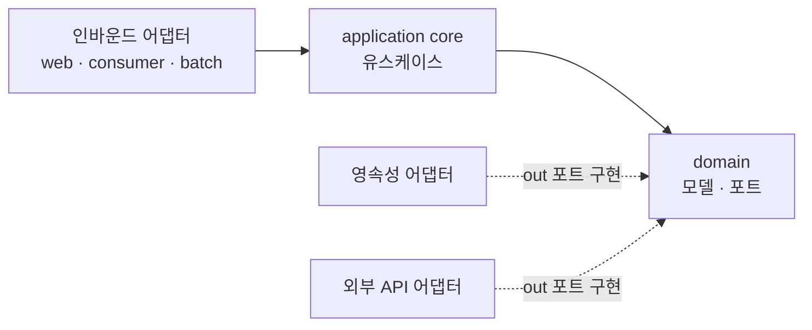

<!-- truncate -->

헥사고날 아키텍처는 **도메인을 가운데 두고, 웹·DB·외부 API 같은 바깥세상을 어댑터로 갈아 끼우는** 구조입니다. 개념을 코드로만 나누면 경계가 흐려지기 쉬워서, 아예 **멀티모듈로 물리적으로 분리**해 도메인이 인프라를 의존하지 못하게 강제한 구성을 정리합니다. (특정 회사·서비스와 무관하게 일반화한 예시입니다.) 헥사고날 아키텍처는 [앨리스터 코오번(Alistair Cockburn)](https://alistair.cockburn.us/hexagonal-architecture/)이 2005년 제안한 패턴으로, 원래 이름은 **포트와 어댑터(Ports and Adapters)** 입니다.

<mark>헥사고날의 목표는 "도메인은 바깥을 모르고, 바깥이 도메인의 포트(인터페이스)를 구현한다"입니다.</mark>

## 핵심: 도메인은 가운데, 어댑터는 바깥

바깥세상과의 연결을 두 방향으로 나눕니다.

- **인바운드 어댑터(driving)**: 외부가 도메인을 부르는 입구. 웹 컨트롤러·메시지 컨슈머·배치·스케줄러.
- **아웃바운드 어댑터(driven)**: 도메인이 외부를 부르는 출구. DB 영속성·외부 API 클라이언트.
- **포트(port)**: 도메인·코어가 정의한 인터페이스. 어댑터가 이 포트를 구현하거나 호출합니다.

헥사고날의 개념 자체는 [헥사고날 아키텍처](./hexagonal-architecture)에서 다뤘습니다. 이 글은 그것을 **모듈 경계로 어떻게 강제하는지**에 집중합니다.

<mark>포트라는 인터페이스가 도메인과 어댑터 사이의 유일한 접점이라, 어댑터는 언제든 교체·모킹할 수 있습니다.</mark>

## 전체 구성 한눈에

실행 가능한 앱(인바운드 어댑터)들과, 그들이 공유하는 도메인·코어·아웃바운드 어댑터 모듈로 나눕니다.

```
root/
├── app-api/                 # [인바운드] REST API 실행 앱
├── app-consumer/            # [인바운드] 메시지 컨슈머 실행 앱
├── app-batch/               # [인바운드] 배치 실행 앱
├── app-scheduler/           # [인바운드] 스케줄러 실행 앱
│
└── sub-module/              # 공유 코어·도메인·어댑터
    ├── domain/              # 도메인: 모델 + 포트(인터페이스)
    ├── core/                # 애플리케이션 코어: 유스케이스(포트 구현)
    ├── persistence/         # [아웃바운드] DB 어댑터
    ├── external-api/        # [아웃바운드] 외부 API 어댑터
    └── common/              # 공통 유틸
```

각 실행 앱은 `domain + core`에 필요한 아웃바운드 어댑터(`persistence`, `external-api`)를 조합해 만듭니다. **`domain`과 `core`는 어댑터 모듈을 의존하지 않습니다.** 반대로 어댑터가 코어를 의존합니다.

<mark>실행 앱은 "어떤 어댑터를 끼울지"만 조립할 뿐, 비즈니스 규칙은 domain·core에 있습니다.</mark>

## 모듈별 책임과 패키지

포트를 `in`(인바운드)과 `out`(아웃바운드)으로 나눠, 각 어댑터가 어떤 포트를 구현/호출하는지 명확히 합니다.

```
sub-module/domain/.../
├── model/                  # 엔티티·값 객체(순수 도메인)
├── port/
│   ├── in/                 # 인바운드 포트: 유스케이스 인터페이스
│   └── out/                # 아웃바운드 포트: 저장·외부 호출 인터페이스
└── exception/

sub-module/core/.../
└── application/service/    # 유스케이스 구현: in 포트를 구현하고 out 포트를 호출

app-api/.../
└── adapter/in/web/         # 인바운드 어댑터: REST 컨트롤러가 in 포트 호출

sub-module/persistence/.../
└── adapter/out/persistence/  # 아웃바운드 어댑터: out 포트를 JPA로 구현

sub-module/external-api/.../
└── adapter/out/client/       # 아웃바운드 어댑터: out 포트를 외부 API로 구현
```

흐름은 단순합니다. 웹 컨트롤러(인바운드 어댑터)가 **in 포트**를 호출하고, `core`의 유스케이스가 그 포트를 구현하면서 필요할 때 **out 포트**를 호출합니다. out 포트의 실제 구현은 `persistence`나 `external-api` 어댑터가 담당합니다.

<mark>유스케이스는 "무엇을 저장한다·부른다"는 out 포트 인터페이스만 알고, 그게 DB인지 외부 API인지는 모릅니다.</mark>

## 의존성 방향

모든 화살표가 안쪽(도메인)을 향합니다. 어댑터는 포트를 구현할 뿐, 도메인이 어댑터를 의존하지 않습니다.



이 방향이 지켜지면, DB를 바꾸거나 외부 API를 교체해도 **도메인·코어 코드는 그대로**입니다. 테스트에서도 out 포트를 가짜 구현으로 바꿔 도메인만 격리해 검증할 수 있습니다.

## 레이어드와 무엇이 다른가

[DDD 레이어드 멀티모듈](./ddd-layered-multimodule)이 `domain → application → infrastructure`의 **수직 계층**이라면, 헥사고날은 도메인을 중심에 두고 **모든 어댑터를 포트로 대칭 연결**합니다.

- 레이어드: 위에서 아래로 흐르는 계층. 인프라가 맨 아래.
- 헥사고날: 도메인이 중심. 웹이든 DB든 외부 API든 전부 "바깥의 어댑터"로 동등하게 취급.

<mark>헥사고날은 인프라를 "아래 계층"이 아니라 "교체 가능한 바깥"으로 보기 때문에, 인프라 교체와 도메인 단위 테스트가 더 쉽습니다.</mark>

## 정리

- 실행 앱(**인바운드 어댑터**) + 공유 `domain·core` + **아웃바운드 어댑터**(`persistence`·`external-api`)로 모듈을 나눕니다.
- 포트를 `in·out`으로 나눠 도메인과 어댑터의 접점을 인터페이스로만 둡니다.
- 의존성은 항상 **도메인 안쪽**으로 향하게 해, 인프라를 갈아 끼워도 도메인이 흔들리지 않게 합니다.

## 용어 한 줄 정리

| 용어 | 쉬운 뜻 |
|---|---|
| 포트(port) | 도메인·코어가 정의한 인터페이스(접점) |
| 어댑터(adapter) | 포트를 구현/호출하는 바깥 코드(웹·DB·외부 API) |
| 인바운드(driving) | 외부가 도메인을 호출하는 입구(웹·컨슈머·배치) |
| 아웃바운드(driven) | 도메인이 외부를 호출하는 출구(영속성·외부 API) |
| 의존성 역전(DIP) | 어댑터가 도메인 포트를 구현해, 의존이 도메인 안쪽으로 향하게 하는 것 |
