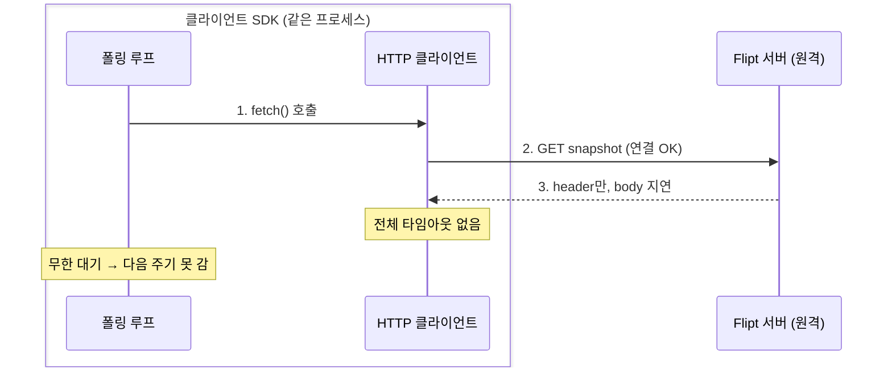

<!-- truncate -->

피처 플래그 도구 [Flipt](https://www.flipt.io/)의 클라이언트 SDK를 쓰다가, 폴링으로 플래그 스냅샷을 갱신하는 백그라운드 작업이 **어느 순간부터 영원히 멈춰** 오래된 스냅샷만 계속 반환하는 버그를 겪었습니다. 원인을 추적해 보니 "에러가 나서 멈춘 것"이 아니라 **요청 타임아웃이 없어 응답을 무한정 기다리다 멈춰 버린** 것이었습니다. 마침 비슷한 시기에 [Flipt 오픈소스 프로젝트](https://github.com/flipt-io/flipt-client-sdks)(upstream)에도 같은 증상의 [이슈](https://github.com/flipt-io/flipt-client-sdks/issues/1926)가 리포팅돼 있어, 원인을 규명하고 수정 [PR](https://github.com/flipt-io/flipt-client-sdks/pull/1928)을 제출하기까지의 과정을 정리합니다.

<mark>`connect_timeout`은 "연결까지"만 제한합니다. 연결된 뒤 응답이 멈추면, 전체 요청 타임아웃이 없는 한 클라이언트는 영원히 기다립니다 — 이게 폴링이 멈춰 버린 원인이었습니다.</mark>

## 증상 — 재기동 전까지 스스로 회복되지 않음

Flipt 클라이언트를 `POLLING` 모드로 쓰면, 엔진이 백그라운드에서 주기적으로 스냅샷을 다시 가져와 최신 플래그를 반영합니다. 그런데 이 갱신 작업이 한 번 멈추면:

- 이후 모든 플래그 평가가 **시작 시점에 가져온 스냅샷**만 반환합니다.
- 엔진 인스턴스는 살아 있고 에러도 없어서, **문제를 인지하기 어렵습니다.**
- 유일한 회복 방법이 **클라이언트 인스턴스를 새로 만드는 것**(보통 앱 재기동)뿐입니다.

피처 플래그는 "지금 이 기능을 켤지 끌지"를 실시간으로 바꾸는 스위치입니다. 그 값이 옛 상태로 멈춰 있으면 다음과 같은 문제가 발생할 수 있습니다.

- 장애가 나서 문제 기능을 **끄려고 플래그를 off로 내려도**, 멈춘 클라이언트는 옛 스냅샷대로 여전히 **on으로 평가**해 문제 기능이 계속 노출됩니다(킬 스위치 무력화).
- 새 기능을 **일부 사용자에게만 켜서 점진 공개**하려고 플래그를 켜도, off로 남아 **그 클라이언트에는 신규 기능이 열리지 않습니다.**

즉, 서버에서 플래그를 아무리 바꿔도 그 클라이언트에는 닿지 않아, 배포·롤백을 위한 스위치가 동작하지 않습니다.

## 원인 추적 — `break`가 아니라 hang

### 폴링 루프가 하는 일

먼저 폴링이 어떻게 도는지부터 봅니다. 엔진은 시작할 때 백그라운드 작업(루프)을 하나 띄우고, 그 안에서 다음을 **무한 반복**합니다.

1. 서버에서 스냅샷을 한 번 가져온다 (`handle_polling`)
2. `update_interval`(예: 30초)만큼 기다린다
3. 다시 1번으로

### 이슈의 진단: "에러가 나면 루프가 끊긴다"

이슈에는 이렇게 적혀 있었습니다.

> `HTTPFetcher::start` breaks out of the loop on error. Nothing restarts the task, and the Engine holding it stays alive and keeps serving evaluations from the last snapshot.

즉 이 루프가 **에러가 나면 `break`로 빠져나가 다시 시작하지 않는다**는 진단입니다. 해당 코드는 이렇습니다.

```rust
FetchMode::Polling => {
    if let Err(e) = fetcher.handle_polling(&tx).await {  // 에러면
        log::warn!("error fetching polling: {e}");
        break;                                           // 루프 종료
    }
    // ... update_interval 만큼 대기 후 반복 ...
}
```

`handle_polling`이 `Err`를 반환하면 `break`로 루프를 끝냅니다. 여기까지만 보면 "에러 → 루프 종료"가 맞아 보입니다. 그런데 진짜 물어야 할 건 **`handle_polling`이 도대체 언제 `Err`를 반환하느냐** 입니다.

### `handle_polling`이 `Err`를 내는 경우는 딱 하나

```rust
async fn handle_polling(&mut self, sender: &mpsc::Sender<...>) -> Result<(), Error> {
    let result = match self.fetch().await {   // ① 서버에서 가져오기
        Ok(Some(resp)) => /* JSON 파싱 */,     //    성공+새 데이터 → 문서를 result에
        Ok(None) => return Ok(()),             //    성공했지만 변경 없음 → 보낼 것 없이 종료
        Err(e) => Err(e),                      // ② 실패해도 "에러를 result에" 담을 뿐
    };
    sender.send(result).await                  // ③ 그 result를 소비자에게 전달
        .map_err(|_| Error::Internal("failed to send result".into()))  // ④ 전달 실패 시에만 Err
}
```

한 줄씩 따라가 봅니다.

- **① `self.fetch().await`** — 서버에서 스냅샷을 가져옵니다. 결과는 세 가지입니다: 새 데이터가 있으면 `Ok(Some(문서))`, 성공했지만 바뀐 게 없으면 `Ok(None)`, 실패하면 `Err(e)`.
  - `Ok(None)`은 요청은 성공했는데 **새 스냅샷이 없을 때**입니다(예: 서버가 "변경 없음 — 304 Not Modified"으로 응답). 보낼 게 없으니 그냥 `return Ok(())`로 끝내고 다음 주기를 기다립니다.
- **② 여기가 포인트** — fetch가 **실패(`Err(e)`)해도** 그 에러는 함수의 반환값이 아니라 `result`라는 **변수에 담길** 뿐입니다. 즉 "에러가 났다"고 해서 함수가 곧바로 `Err`를 내며 끝나지 않습니다.
- **③ `sender.send(result)`** — 성공 문서든 에러든, 그 `result`를 채널로 **소비자(엔진)에게 전달**합니다. 에러도 "정상적으로 전달되는 결과"인 셈입니다.
- **④** — `handle_polling`이 실제로 `Err`를 반환하는 건 **오직 이 `send`가 실패했을 때** 뿐입니다. 그리고 `send`는 **받는 쪽(소비자)이 사라졌을 때만** 실패합니다 = **클라이언트가 종료됐을 때.**

④가 왜 "클라이언트 종료일 때만"인지, 코드 흐름을 따라가 보겠습니다.

- **함수가 `Err`를 반환하는 경로는 `send` 하나뿐입니다.** `handle_polling`은 결과(성공 문서 또는 에러)를 `result`에 담고, 맨 마지막에 `sender.send(result)`로 내보냅니다. 이 `send`의 성공/실패가 그대로 함수의 반환값이 됩니다. fetch·JSON 파싱 에러는 여기서 함수를 끝내지 않고 `result`에 담겨 전송될 뿐이라, 그 자체로는 함수를 `Err`로 만들지 않습니다.
- **`send`는 수신자가 닫혔을 때만 실패합니다.** 이 채널은 용량이 정해진(bounded) 채널이라, 큐가 가득 차면 `send`는 에러를 내지 않고 **자리가 빌 때까지 대기**합니다. `send`가 `Err`를 돌려주는 유일한 조건은 **받는 쪽(수신자)이 닫혔을 때**입니다.
- **그 수신자는 클라이언트가 종료될 때 닫힙니다.** 폴링을 시작할 때 만든 채널의 수신자를 엔진(소비자)이 들고 결과를 소비하는데, 클라이언트를 정리하면 이 수신자도 함께 사라집니다.

세 가지를 이으면 결론은 하나로 모입니다: **`handle_polling`의 `Err` → `send` 실패 → 수신자 닫힘 → 클라이언트 종료.** 따라서 fetch가 에러를 내거나 hang에 빠지더라도, 그것만으로는 `Err`도 `break`도 발생하지 않습니다.

근거가 되는 원문을 직접 인용하면 이렇습니다.

**① `send`의 실패 조건 — tokio 공식 문서** ([`Sender::send`](https://docs.rs/tokio/latest/tokio/sync/mpsc/struct.Sender.html#method.send))

> If the receive half of the channel is closed, either due to `close` being called or the `Receiver` handle dropping, the function returns an error.

즉 `send`가 에러를 내는 건 **수신자가 닫히거나 드롭됐을 때뿐**이고, 큐가 가득 차면 에러 대신 대기합니다.

**② 그 수신자가 만들어져 엔진으로 넘어가는 지점 — 실제 코드** ([`http.rs`의 `start`](https://github.com/flipt-io/flipt-client-sdks/blob/0ebaa5025ab8c208fb15c8da9ca068187215cd6f/flipt-engine-ffi/src/http.rs))

```rust
let (tx, rx) = mpsc::channel(100);
// tx: 폴링 태스크가 결과를 보내는 쪽(sender)
// rx: 엔진(소비자)이 결과를 받는 쪽(receiver) — start()가 이 rx를 호출자에게 반환한다.
//     따라서 rx는 클라이언트(엔진)가 정리될 때 함께 사라진다 → 그때만 send가 실패.
```

정리하면 이렇게 갈립니다.

- **fetch가 에러남** → 에러는 소비자에게 전달되고, `handle_polling`은 `Ok`를 반환 → 루프는 `break` 없이 **계속 돕니다.**
- **클라이언트가 종료됨** → `send` 실패 → `Err` 반환 → `break`. (이땐 끝나는 게 맞습니다.)

즉 **"에러 때문에 루프가 영구 종료된다"는 상황은 실제로는 일어나지 않습니다.** 이슈는 `break` 줄을 원인으로 지목했지만, 그 `break`는 fetch 에러가 아니라 **수신자가 닫혔을 때(=클라이언트 종료)** 에만 실행되기 때문입니다. 정상적으로 돌아가는 클라이언트에서는 아무리 fetch가 실패해도 그 에러가 소비자에게 전달될 뿐, 루프는 다음 주기로 계속 넘어갑니다.

그래서 메인테이너는 "이 `break`는 클라이언트가 닫힐 때만 실행된다"고 답하며 재현에 실패했습니다. `break`만 놓고 보면 그 말이 맞습니다 — 다만 실제 장애의 원인은 `break`가 아니라 **그 위에서 반환조차 되지 않고 멈추는 `fetch().await`** 에 있었고, 그 지점은 이슈에서 지목되지 않았습니다. 재현하려면 "에러를 내는 서버"가 아니라 "연결은 받아 주되 응답을 끝까지 보내지 않는 서버"가 필요했던 것이죠.

### 그럼 진짜로 멈춘 곳은?

바로 위 코드의 **① `self.fetch().await` 한 줄**입니다. 이 호출이 **성공도 실패도 아닌 채, 영원히 반환되지 않으면(hang)** 어떻게 될까요? 그 아래의 ③ `send`도, 이어지는 `update_interval` 대기도, 다음 주기도 **전부 실행되지 못합니다.** 루프는 `break`로 끊긴 게 아니라, `fetch().await` 이 지점에서 **블로킹된 상태로** 다음으로 나아가지 못하는 것입니다.

<mark>루프가 끊긴 게 아니라, 폴링 루프가 `fetch().await`에서 블로킹돼 다음 주기로 넘어가지 못한 것입니다. 끝나지 않는 `await`는 에러도 로그도 없이 백그라운드 작업을 정지시킵니다.</mark>

## 왜 `fetch()`가 멈췄나 — 타임아웃 설정의 사각지대

클라이언트를 만드는 코드를 보면, 폴링 모드의 요청 타임아웃이 **사용자가 명시했을 때만** 설정됩니다.

```rust
let mut client_builder = reqwest::Client::builder()
    .connect_timeout(Duration::from_secs(10));   // 연결까지만 10초 제한

match self.mode {
    FetchMode::Polling => {
        if let Some(request_timeout) = self.request_timeout {   // 기본값(미설정)이면
            if request_timeout.as_secs() > 0 {                  // 이 블록을 건너뜀
                client_builder = client_builder.timeout(request_timeout);
            }
        }
    }
    // ...
}
```

여기서 두 타임아웃의 차이가 핵심입니다.

| 옵션 | 무엇을 제한하나 |
|---|---|
| `connect_timeout` | TCP·TLS **연결 수립**까지의 시간 |
| `timeout`(전체 요청) | 연결 후 **응답을 다 받기까지** 포함한 전체 시간 |

기본 설정에는 `connect_timeout(10s)`만 있고 **전체 요청 타임아웃이 없습니다.** 그래서 연결은 정상적으로 맺어졌는데 서버가 응답을 끝까지 보내지 못하면(과부하로 느려진 서버, 응답을 지연시키는 프록시 등), `fetch().await`가 **완료되지 않고 계속 대기합니다.** 재시도 미들웨어도 도움이 되지 않습니다 — 재시도는 에러가 발생해야 동작하는데, 이 경우는 에러 없이 대기만 이어지기 때문입니다.



메인테이너가 재현하지 못한 이유도 이걸로 설명됩니다 — 재현하려면 "연결은 받아 주되 응답을 멈추는" 서버가 필요했습니다.

## 수정 — 폴링에는 항상 전체 타임아웃을 건다

수정 범위는 작고 간단합니다. 폴링 모드에서 사용자가 값을 주지 않아도 **항상 전체 요청 타임아웃이 걸리도록**, 빌더의 `request_timeout` 기본값을 `None`이 아니라 **30초(`Some(...)`)** 로 바꿨습니다.

```rust
/// 폴링 모드의 기본 전체 요청 타임아웃. 멈춘 응답(연결은 됐지만 body가
/// 끝나지 않는 경우)이 폴링을 영원히 막지 못하게 한다. connect_timeout으론 못 막는다.
const DEFAULT_POLLING_REQUEST_TIMEOUT: Duration = Duration::from_secs(30);

// 빌더를 만들 때 request_timeout 기본값을 None → Some(30초)로
HTTPFetcherBuilder {
    // ...
    request_timeout: Some(DEFAULT_POLLING_REQUEST_TIMEOUT),   // 예전엔 None (그래서 타임아웃이 안 걸렸음)
    // ...
}
```

빌더는 값이 있으면 그대로 클라이언트에 적용합니다. 이제 기본값이 `Some`이라 **폴링에는 언제나 타임아웃이 걸립니다.**

```rust
FetchMode::Polling => {
    if let Some(request_timeout) = self.request_timeout {   // 기본이 Some(30초)라 항상 적용
        client_builder = client_builder.timeout(request_timeout);
    }
}
```

이제 응답이 멈추면 기본 타임아웃에서 **에러로 끊기고**, 그 에러가 소비자에게 전달된 뒤 폴링 루프는 다음 주기로 넘어가 **재시도**합니다. 무한 대기가 사라집니다.

<mark>이 방법의 핵심은 "에러를 잘 처리하자"가 아니라 "끝나지 않을 수 있는 대기에 반드시 상한을 두자"입니다.</mark>

## 테스트 — hang은 어떻게 검증하나

두 가지로 검증했습니다. 먼저 **단위 테스트**로 "빌더 기본값이 실제로 타임아웃을 갖는지"(예전엔 `None`이던 부분)를 확인합니다.

```rust
#[test]
fn test_builder_defaults_request_timeout() {
    let builder = HTTPFetcherBuilder::new("http://localhost:8080");
    assert_eq!(builder.request_timeout, Some(DEFAULT_POLLING_REQUEST_TIMEOUT));
}
```

그리고 **hang 자체**를 재현해 막히는지 봅니다. 이걸 검증하려면 응답을 일부러 붙잡는 서버가 필요합니다. mockito로 header만 보내고 body를 오래 붙잡아 두는 mock 서버를 만든 뒤, 짧은 요청 타임아웃(1초)을 걸어 **정해진 시간 안에 에러로 끝나는지**를 확인합니다(프로덕션 30초를 기다리지 않도록).

```rust
#[tokio::test(flavor = "multi_thread")]
async fn test_polling_request_timeout_unblocks_stalled_response() {
    let mut server = Server::new_async().await;
    let _mock = server.mock("GET", "...snapshot...")
        .with_status(200)
        .with_chunked_body(|_w| {
            std::thread::sleep(Duration::from_secs(30));   // body를 붙잡아 둠
            Ok(())
        })
        .create_async().await;

    let mut fetcher = HTTPFetcherBuilder::new(&server.url())
        .authentication(Authentication::None)
        .request_timeout(Duration::from_secs(1))   // 짧은 타임아웃으로 빠르게 검증
        .build().unwrap();

    let start = Instant::now();
    let result = fetcher.initial_fetch().await;

    assert!(result.is_err(), "멈춘 응답은 타임아웃에서 끊겨야 한다");
    assert!(start.elapsed() < Duration::from_secs(20), "즉시 타임아웃돼야 한다");
}
```

## 기여 과정 — 논의 먼저, 그다음 PR

1. **이슈에 재현 + 원인 댓글**: 메인테이너가 재현을 요청한 상태였으므로, "app 코드 없이" 재현하는 최소 예제(연결은 받되 body를 멈추는 서버)와 함께 "진짜 원인은 `break`가 아니라 기본 타임아웃 누락"이라는 분석을 남겼습니다.
2. **포크 → 브랜치 → 수정 → 테스트**: `cargo fmt`·`cargo clippy`·`cargo test` 통과 확인.
3. **DCO 사인오프 커밋**: 이 저장소는 커밋에 `Signed-off-by`가 필요해 `git commit -s`로 서명.
4. **PR 생성**: 문제·근본 원인·수정·테스트를 정리하고, 머지 시 이슈가 자동으로 닫히도록 `Fixes` 키워드로 이슈를 연결.

<mark>리포트에 이미 있는 진단을 그대로 받지 않고, 코드로 직접 원인을 다시 규명한 것이 기여의 핵심이었습니다 — 원인이 다르면 고칠 곳도 달라집니다.</mark>

## 정리

- **`connect_timeout`과 전체 `timeout`은 다르다:**<br />
  연결만 제한하고 응답 대기에 상한이 없으면, 정체된 서버 하나에 백그라운드 작업이 통째로 멈출 수 있습니다.
- **에러 없이 멈추는 게 더 위험하다:**<br />
  예외·로그가 없으니 모니터링에도 안 걸리고, 재시도 로직도 발동하지 않습니다. 끝나지 않을 수 있는 모든 `await`에는 타임아웃을 설정합니다.
- **오픈소스 기여는 거창하지 않아도 된다:**<br />
  실무에서 겪은 버그를 최소 재현으로 정리하고, 근본 원인을 코드로 규명해 작은 PR로 만드는 것만으로 충분히 가치가 있습니다.
