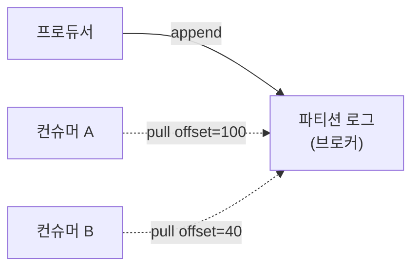

<!-- truncate -->

카프카를 쓰다 보면 "왜 이렇게 만들었지?" 싶은 지점이 있습니다. 브로커가 컨슈머 상태를 안 들고 있고, 메시지를 지우지도 않고, 디스크에 쓰는데도 빠릅니다. 이 선택들은 우연이 아니라 **2011년 원논문**([Kafka: a Distributed Messaging System for Log Processing](https://notes.stephenholiday.com/Kafka.pdf), Jay Kreps 외)에 이미 담긴 설계 원칙에서 나옵니다. 이 논문을 리뷰한 [영상](https://www.youtube.com/watch?v=IF-LA5KBTtc)을 계기로, 카프카를 만든 핵심 원칙을 하나씩 다시 정리합니다.

<mark>카프카의 설계는 "메시지 큐를 잘 만들자"가 아니라 "대량 로그를 높은 처리량으로 흘려보내자"에서 출발합니다. 그 목표가 아래 모든 선택을 설명합니다.</mark>

## 배경 — 왜 또 하나의 메시징 시스템이었나

논문이 나온 2011년, LinkedIn은 사용자 활동 로그·지표 같은 **대량의 로그성 데이터**를 실시간 파이프라인으로 모으고 있었습니다. 기존 메시징 시스템(전통적 MQ)은 메시지당 전달 보장·복잡한 라우팅에 초점이 맞춰져, 초당 수십만 건을 흘려보내는 **로그 처리**에는 무거웠습니다. 로그 데이터는 조금 유실돼도 치명적이지 않은 대신 **처리량과 단순함**이 훨씬 중요합니다. 카프카는 이 지점을 겨냥해, 전통적 MQ와 다른 선택을 합니다.

<mark>"로그 데이터는 대량이지만 유실 허용도가 있다"는 전제가, 강한 보장 대신 처리량·단순함을 택하게 만든 출발점입니다.</mark>

## 1. 메시지를 지우지 않는다 — append-only 커밋 로그

전통적 MQ는 소비된 메시지를 큐에서 지웁니다. 카프카는 다릅니다. 각 파티션을 **파일 끝에만 덧붙이는(append-only) 로그**로 두고, 소비돼도 지우지 않습니다. 대신 **시간·용량 기준으로 보존(retention)** 하다 오래된 것을 통째로 버립니다.

이 단순한 선택이 많은 것을 바꿉니다.

- 쓰기는 항상 **파일 끝에 순차 추가** — 랜덤 접근·삭제가 없습니다.
- 메시지는 파일 내 위치(**오프셋**)로 식별됩니다. 메시지마다 ID·인덱스를 붙이는 오버헤드가 없습니다.
- 소비는 읽기일 뿐이라, 같은 데이터를 **여러 컨슈머가 각자 다시** 읽을 수 있습니다(재처리·리플레이).

<mark>큐가 아니라 "지우지 않는 로그"로 본 것이 카프카의 뿌리입니다 — 소비는 삭제가 아니라 오프셋을 앞으로 옮기는 읽기입니다.</mark>

## 2. "디스크는 느리다"는 착각 — 순차 I/O·페이지 캐시·제로카피

디스크에 쓰는데 어떻게 빠를까요? 세 가지가 맞물립니다(성능의 상세는 [카프카는 왜 빠른가](./kafka-why-fast)에서 더 다룹니다).

- **순차 I/O**: 디스크가 느린 건 **랜덤 접근**일 때입니다. 끝에만 덧붙이는 순차 쓰기·읽기는 디스크에서도 매우 빠릅니다(랜덤 대비 수백 배). append-only 로그라 자연히 순차 접근이 됩니다.
- **OS 페이지 캐시 활용**: 애플리케이션이 자체 메모리 캐시를 두는 대신, **OS 페이지 캐시**에 맡깁니다. JVM 힙에 데이터를 이고 지지 않으니 GC 부담·이중 캐싱이 사라지고, 컨슈머가 최신을 따라잡은 상태면 읽기가 **디스크까지 가지 않고 캐시에서** 나갑니다.
- **제로카피(zero-copy)**: 디스크의 데이터를 소켓으로 보낼 때, user-space로 복사해 다시 커널로 내리는 과정을 생략하고 **커널에서 바로 전송**(`sendfile`)합니다. 불필요한 메모리 복사와 컨텍스트 스위치가 제거됩니다.

<mark>카프카는 데이터를 애플리케이션 메모리에 쌓지 않고 OS(페이지 캐시·sendfile)에 맡겨, 디스크 기반인데도 메모리 시스템에 가까운 처리량을 냅니다.</mark>

## 3. push가 아니라 pull — 소비를 컨슈머가 주도한다

브로커가 컨슈머에게 밀어 넣는(push) 방식이 아니라, **컨슈머가 필요할 때 가져가는(pull)** 방식입니다. 언뜻 사소해 보이지만 효과가 큽니다.

- 컨슈머가 **자기 처리 속도대로** 가져갑니다. 느린 컨슈머에게 브로커가 밀어붙여 과부하시키는 일이 없습니다(자연스러운 백프레셔).
- 한 번에 **여러 메시지를 배치로** 당겨올 수 있어, 네트워크 왕복과 시스템 콜이 줄어 처리량이 오릅니다.
- 브로커는 "누가 얼마나 빨리 받는지" 신경 쓸 필요가 없어 **단순해집니다.**

<mark>pull 모델에서는 컨슈머가 소비 속도의 주인입니다 — 브로커는 "요청받은 만큼만" 내주면 되므로 느린 컨슈머에도 안전하고 구현이 단순합니다.</mark>

## 4. 브로커는 상태를 갖지 않는다 — 오프셋을 컨슈머가 관리

전통적 MQ는 브로커가 "이 소비자가 어디까지 받았나"를 추적하고, 소비 확인(ack)을 받아 메시지를 지웁니다. 카프카는 이 상태를 **컨슈머 쪽으로 넘깁니다.** 각 컨슈머(그룹)가 **자신의 오프셋**을 들고 있고, 브로커는 그 위치의 데이터를 돌려줄 뿐입니다(원논문 시점엔 오프셋을 ZooKeeper에 저장·조정).

이 **무상태 브로커(stateless broker)** 덕분에:

- 브로커가 컨슈머 수·상태에 따라 무거워지지 않아 **수평 확장이 단순**합니다.
- 오프셋을 되감으면 **과거 데이터를 다시 소비**할 수 있습니다(버그 수정 후 재처리 등).
- 같은 로그를 **여러 소비 그룹**이 서로 독립적으로 읽습니다(실시간 서비스와 배치가 같은 토픽을 각자 소비).

<mark>"소비 위치는 컨슈머의 것"이라는 결정이 브로커를 가볍게 만들고, 재처리·다중 소비를 공짜로 얻게 합니다.</mark>

## 5. 파티션과 컨슈머 그룹 — 병렬성과 순서

한 토픽을 여러 **파티션**으로 나눕니다. 파티션은 **병렬 처리의 단위**입니다.

- 프로듀서는 키·라운드로빈으로 메시지를 파티션에 분배하고, 파티션들은 여러 브로커에 흩어져 **쓰기·저장 부하가 분산**됩니다.
- 컨슈머 그룹 안에서 **파티션 하나는 컨슈머 하나**가 맡아, 파티션 수만큼 병렬 소비가 됩니다(그래서 파티션 수가 병렬성의 상한 — [파티션 개수 정하기](./kafka-partition-count) 참고).
- **순서는 파티션 안에서만** 보장됩니다. 전체 순서가 아니라 "같은 키는 같은 파티션"으로 필요한 범위의 순서만 지킵니다.

<mark>파티션은 확장과 순서를 동시에 푸는 장치입니다 — 나눠서 병렬로 처리하되, 순서가 필요한 것만 같은 파티션에 모읍니다.</mark>

## 6. 배치와 단순함 — 처리량을 위해 나머지를 버린다

카프카의 여러 선택은 결국 **배치**로 수렴합니다. 프로듀서는 메시지를 모아 한 번에 보내고, 브로커는 순차로 덧붙이고, 컨슈머는 한 번에 당겨 갑니다. 그리고 저장 포맷을 단순하게(메시지당 메타데이터 최소화) 두어, 한 번의 I/O로 **많은 메시지를 함께** 처리합니다.

여기엔 명확한 트레이드오프가 있습니다.

- 원논문 기준 전달 보장은 **at-least-once**(중복은 가능, 유실 최소화)이며, 정확히 한 번(exactly-once)이나 복잡한 트랜잭션은 나중 버전의 몫이었습니다. (현재의 정확히-한-번 이야기는 [Kafka 트랜잭션과 EOS](./kafka-transactions-exactly-once) 참고.)
- 브로커가 메시지별 라우팅·우선순위 같은 기능을 갖지 않는 대신, **로그를 빠르게 흘려보내는 한 가지**를 잘합니다.

<mark>카프카는 "무엇을 안 할지"를 정한 시스템입니다 — 메시지별 보장·라우팅을 덜어내고 처리량과 단순함을 택한 것이 성능의 근원입니다.</mark>

## 정리

- **append-only 로그**: 소비는 삭제가 아니라 오프셋 이동. 재처리·다중 소비가 자연스럽다.
- **디스크가 빠른 이유**: 순차 I/O + OS 페이지 캐시 + 제로카피(`sendfile`).
- **pull 모델**: 컨슈머가 소비 속도의 주인 → 백프레셔·배치·단순한 브로커.
- **무상태 브로커**: 오프셋을 컨슈머가 관리 → 수평 확장·재처리·다중 소비 그룹.
- **파티션**: 병렬성의 단위이자 순서 보장의 단위(파티션 내 순서).
- **트레이드오프**: 메시지별 보장·기능을 덜고 처리량·단순함을 택함(원논문은 at-least-once).

카프카를 "빠른 메시지 큐"로만 보면 이 선택들이 이상해 보입니다. 하지만 **"대량 로그를 높은 처리량으로 흘려보낸다"** 는 목표에서 보면, 지우지 않는 로그도, pull도, 무상태 브로커도 전부 같은 방향을 가리킵니다. 지금의 카프카가 하는 일 대부분은 이 2011년 원칙 위에 얹혀 있습니다.
