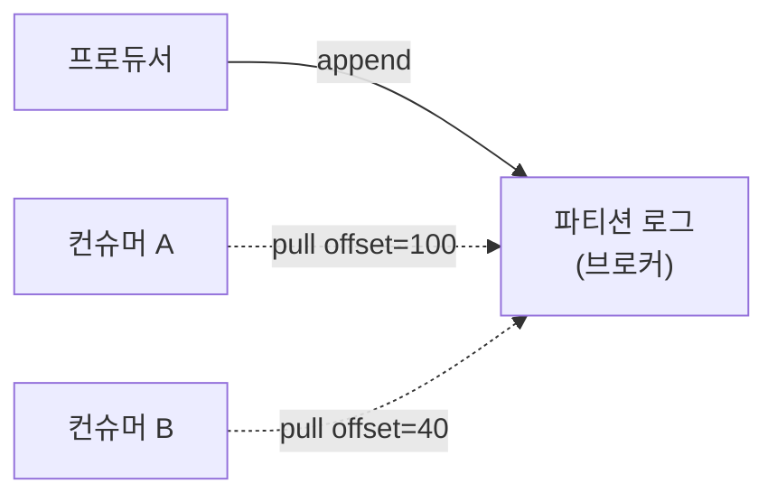

<!-- truncate -->

카프카를 쓰다 보면 "왜 이렇게 만들었지?" 싶은 지점이 있습니다. 브로커가 컨슈머 상태를 안 들고 있고, 메시지를 지우지도 않고, 디스크에 쓰는데도 빠릅니다. 이 선택들은 우연이 아니라 **2011년 원논문**([Kafka: a Distributed Messaging System for Log Processing](https://notes.stephenholiday.com/Kafka.pdf), Jay Kreps 외)에 이미 제시된 설계 원칙에서 나옵니다. 논문의 흐름(배경 → 설계 원칙 → 분산 조율 → 성능 비교 → 트레이드오프)을 따라 카프카를 만든 핵심 원칙을 하나씩 다시 정리합니다.

<mark>카프카의 설계는 "메시지 큐를 잘 만들자"가 아니라 "대량 로그를 높은 처리량으로 처리하자"에서 출발합니다. 그 목표가 아래 모든 선택을 설명합니다.</mark>

## 배경 — 왜 또 하나의 메시징 시스템이었나

논문이 나온 2011년, LinkedIn은 두 종류의 로그가 폭발적으로 늘고 있었습니다.

- **사용자 활동 로그**: 클릭·페이지뷰·검색·좋아요·댓글 같은 행동 이벤트.
- **운영 지표**: CPU·메모리·네트워크·레이턴시·에러 같은 시스템 지표.

규모도 컸습니다. 논문은 당시 Facebook이 하루 약 6TB의 활동 이벤트를, 중국의 한 통신사가 하루 5~8TB의 통화 기록을 수집했다고 인용합니다. 또한 **더 중요한 변화**가 있었습니다. 이 로그가 나중에 모아 분석하는 데이터가 아니라 **실시간 프로덕션 기능**(추천·광고 타깃팅·스팸/보안 탐지·뉴스)에 직접 쓰이기 시작한 것입니다. 즉 "몇 초 안에" 처리해야 했습니다.

기존 메시징 시스템(전통적 MQ)은 메시지당 전달 보장·복잡한 라우팅에 초점이 맞춰져, 초당 수십만 건을 처리하는 **로그 처리**에는 무거웠습니다. 로그 데이터는 조금 유실돼도 치명적이지 않은 대신 **처리량과 단순함**이 훨씬 중요합니다. 카프카는 이 지점을 겨냥해, 전통적 MQ와 다른 선택을 합니다.

<mark>"로그 데이터는 대량이지만 유실 허용도가 있다"는 전제가, 강한 보장 대신 처리량·단순함을 택하게 만든 출발점입니다.</mark>

## 1. 메시지를 지우지 않는다 — append-only 커밋 로그

전통적 MQ는 소비된 메시지를 큐에서 지웁니다. 카프카는 다릅니다. 각 파티션을 **파일 끝에만 덧붙이는(append-only) 로그**로 두고, 소비돼도 지우지 않습니다. 대신 **시간·용량 기준으로 보존(retention)** 하다 오래된 것을 통째로 버립니다(기본 보존 기간은 시간 기반).

- 쓰기는 항상 **파일 끝에 순차 추가** — 복잡한 자료구조를 갱신할 필요도, 랜덤 접근·삭제도 없습니다.
- 소비는 읽기일 뿐이라, 같은 데이터를 **여러 컨슈머가 각자 다시** 읽을 수 있습니다(재처리·리플레이).

<mark>큐가 아니라 "지우지 않는 로그"로 본 것이 카프카의 뿌리입니다 — 소비는 삭제가 아니라 오프셋을 앞으로 옮기는 읽기입니다.</mark>

## 2. 메시지 ID를 버리고 오프셋으로 — 인덱스를 없애다

일반적인 메시징 시스템은 메시지마다 **고유 ID**를 부여합니다. 그러면 ID와 실제 저장 위치를 잇는 **인덱스 구조**가 필요하고, 이 인덱스는 조회 때마다 디스크 여기저기로 이동하는 **랜덤 접근**을 유발해 오버헤드가 큽니다.

카프카는 메시지 ID를 아예 없앴습니다. 대신 파일 안의 위치인 **오프셋으로만 식별**합니다.

- 메모리에는 **각 세그먼트 파일의 시작 오프셋만** 리스트로 유지합니다.
- 컨슈머가 특정 오프셋을 요청하면, 이 리스트에서 **이진 탐색**으로 해당 세그먼트를 찾고 그 지점부터 **순차적으로** 읽어 줍니다.
- 컨슈머가 순차로만 읽으니, **OS의 read-ahead 캐싱**이 자동으로 들어맞습니다(OS가 "이 컨슈머는 계속 앞으로 읽겠구나" 하고 미리 캐시에 올려 둡니다).

메시지마다 ID·인덱스를 붙이는 오버헤드가 사라지고, 저장·조회가 전부 순차 접근이 됩니다(원논문 시점엔 컨슈머 오프셋을 ZooKeeper에 저장했고, 현대 카프카는 내부 토픽 `__consumer_offsets`에 저장합니다).

<mark>"메시지 ID + 인덱스" 대신 "오프셋 + 순차 읽기"를 택한 것이 랜덤 접근을 없애고 순차 I/O를 살린 핵심입니다.</mark>

## 3. "디스크는 느리다"는 착각 — 순차 I/O·페이지 캐시·제로카피

디스크에 쓰는데 어떻게 빠를까요? 세 가지가 맞물립니다(성능의 상세는 [카프카는 왜 빠른가](./kafka-why-fast)에서 더 다룹니다).

- **순차 I/O**: 디스크가 느린 건 **랜덤 접근**일 때입니다. 끝에만 덧붙이는 순차 쓰기·읽기는 디스크에서도 매우 빠릅니다(랜덤 대비 수백 배). append-only 로그라 자연히 순차 접근이 됩니다.
- **제로카피(zero-copy)**: 보통 파일을 네트워크로 보낼 때 **네 번의 복사**(스토리지→페이지 캐시→앱 버퍼→커널 버퍼→소켓)와 **두 번의 시스템 콜**이 일어납니다. 카프카는 리눅스 `sendfile`로 앱 버퍼를 거치는 두 번의 복사를 없애, **복사 2회·시스템 콜 1회**로 줄입니다. CPU 사용량이 크게 낮아지고, 같은 메시지를 여러 컨슈머 그룹이 소비하는 **멀티 구독** 환경에서 효과가 극대화됩니다.
- **OS 페이지 캐시에 위임**: 카프카는 메시지를 자체 프로세스 메모리에 캐싱하지 않고 **OS 페이지 캐시**에 맡깁니다. 그래서 ⑴ 이중 캐싱(더블 버퍼링)이 없고, ⑵ **브로커 프로세스가 종료돼도 OS 캐시는 남아** 재시작 후에도 캐시가 유지되며, ⑶ JVM 힙에 데이터를 이고 지지 않으니 **GC 부담이 거의 없습니다**(JVM 언어인 스칼라로 구현하고도 높은 성능을 낸 이유).

한 가지 현재 관점의 주의: **SSL/TLS**를 활성화하면 데이터를 어플리케이션 레벨에서 암호화해야 하므로 반드시 앱 버퍼를 거쳐야 하고, 그러면 `sendfile`을 쓸 수 없어 **제로카피가 제한**됩니다. 암호화 구간에서는 이 최적화를 포기하는 셈입니다.

<mark>카프카는 데이터를 어플리케이션 메모리에 쌓지 않고 OS(페이지 캐시·`sendfile`)에 맡겨, 디스크 기반인데도 메모리 시스템에 가까운 처리량을 냅니다.</mark>

## 4. push가 아니라 pull — 소비를 컨슈머가 주도한다

브로커가 컨슈머에게 밀어 넣는(push) 방식이 아니라, **컨슈머가 필요할 때 가져가는(pull)** 방식입니다. 언뜻 사소해 보이지만 효과가 큽니다.

- 컨슈머가 **자기 처리 속도대로** 가져갑니다. 느린 컨슈머에게 브로커가 밀어붙여 과부하시키는 일이 없습니다(자연스러운 백프레셔).
- 한 번에 **여러 메시지를 배치로** 당겨올 수 있어, 네트워크 왕복과 시스템 콜이 줄어 처리량이 오릅니다.
- 브로커는 "누가 얼마나 빨리 받는지" 신경 쓸 필요가 없어 **단순해집니다.**

<mark>pull 모델에서는 컨슈머가 소비 속도의 주인입니다 — 브로커는 "요청받은 만큼만" 내주면 되므로 느린 컨슈머에도 안전하고 구현이 단순합니다.</mark>

## 5. 브로커는 상태를 갖지 않는다 — 오프셋을 컨슈머가 관리

전통적 MQ는 브로커가 "이 소비자가 어디까지 받았나"를 추적하고, 소비 확인(ack)을 받아 메시지를 지웁니다. 이 방식은 복잡한 상태 관리를 요구하고 디스크 쓰기를 유발합니다. 카프카는 이 책임을 **컨슈머 쪽으로 넘깁니다.** 각 컨슈머(그룹)가 **자신의 오프셋**을 들고 있고, 브로커는 그 위치의 데이터를 돌려줄 뿐입니다(원논문 시점엔 ZooKeeper에 저장·조정).

그럼 삭제는 어떻게 할까요? "누가 다 읽었는지"를 브로커가 모르니, **시간 기반 보존 정책**(원논문 기본 7일)으로 일정 시간이 지난 메시지를 자동으로 버립니다. 컨슈머 상태를 추적할 필요가 없습니다.

이 **무상태 브로커(stateless broker)** 는 부수 효과로 **리와인드(되감기)** 를 공짜로 줍니다. 브로커가 소비 상태를 안 들고 있으니, 컨슈머는 언제든 원하는 오프셋으로 돌아가 다시 읽을 수 있습니다. 논문이 든 사례는 세 가지입니다.

1. 컨슈머 코드에 버그가 있어 **수정 후 재처리**할 때.
2. **ETL 작업이 실패**해 특정 시점부터 다시 처리할 때.
3. 컨슈머가 **크래시 후 재시작**해 마지막으로 커밋한 오프셋부터 다시 읽을 때.

논문은 이를 "일반적인 큐의 계약을 위반하지만 많은 컨슈머에겐 필수적인 기능"이라 표현합니다(읽은 걸 또 읽는 것은 전통적 큐 관점에선 계약 위반입니다). 그리고 이 되감기는 **pull 모델이라 가능**합니다 — push였다면 브로커가 이미 밀어내 버렸을 테니까요.

<mark>"소비 위치는 컨슈머의 것"이라는 결정이 브로커를 가볍게 만들고, 재처리·다중 소비를 공짜로 얻게 합니다.</mark>

## 6. 분산 조율 — 컨슈머 그룹·파티션·ZooKeeper

한 토픽을 여러 **파티션**으로 나눕니다. 파티션은 **병렬 처리의 최소 단위**입니다.

- **컨슈머 그룹**: 같은 그룹 안에서 하나의 메시지는 딱 한 컨슈머에게만 전달됩니다. 반면 **서로 다른 그룹**은 같은 파티션을 **독립적으로** 소비합니다(예: 그룹 A는 실시간 서비스, 그룹 B는 하둡 오프라인 처리가 같은 토픽을 각자 읽음).
- **파티션 하나는 컨슈머 하나**가 맡습니다. 여러 컨슈머가 한 파티션을 동시에 소비하면 "누가 뭘 읽었나"를 조율할 락·상태 관리가 필요한데, 하나만 담당하게 하면 **락이 없습니다.** 그래서 **최대 병렬도 = 파티션 수**이고, 병렬성을 늘리려면 파티션을 늘립니다(논문은 컨슈머 수보다 파티션을 넉넉히 두는 **오버 파티셔닝**을 권장 — [파티션 개수 정하기](./kafka-partition-count) 참고).
- **순서는 파티션 안에서만** 보장됩니다. 파티션 간 순서는 보장되지 않으니, "같은 키는 같은 파티션"으로 필요한 범위의 순서만 지킵니다.

그룹·파티션 배분은 **ZooKeeper**가 조율합니다(중앙 마스터 노드 없이). ZooKeeper에는 네 종류의 레지스트리(브로커·컨슈머·오너십·오프셋)가 저장되는데, 여기 잘 설계된 장치가 있습니다. 앞의 셋은 **일시적 노드(ephemeral)** 라 **연결이 끊기면 자동 삭제**됩니다. 덕분에 브로커에 장애가 나면 별도의 장애 감지 로직 없이 ZooKeeper가 노드를 지우고, 이를 지켜보던 컨슈머들이 즉시 **리밸런싱**을 시작합니다. 반면 **오프셋 레지스트리만 영속(persistent)** 노드입니다 — 브로커·컨슈머가 종료돼도 오프셋은 보존돼야 하니까요.

> 현재 관점: 카프카 4.0부터는 ZooKeeper 대신 **KRaft**(카프카가 Raft 합의를 직접 구현)로 메타데이터를 자체 관리합니다. 논문의 ZooKeeper 설계는 당시 최선이었지만, 운영 복잡성·확장성 한계로 결국 제거되었습니다.

<mark>파티션 하나로 병렬 확장과 순서 보장을 함께 얻고, ephemeral 노드 덕분에 브로커 장애 감지와 리밸런싱이 별도 로직 없이 자동으로 이뤄집니다.</mark>

## 7. 전달 보장과 순서 — 왜 at-least-once인가

메시징의 전달 보장은 셋으로 나뉩니다.

- **at-most-once(최대 한 번)**: 빠르지만 유실 가능.
- **at-least-once(최소 한 번)**: 유실은 없지만 중복 가능 — **카프카의 기본값**.
- **exactly-once(정확히 한 번)**: 유실도 중복도 없지만, 프로듀서·브로커·컨슈머가 "보냈다/받았다/처리했다"를 함께 확정하는 **합의(2단계 커밋, 2PC)** 가 필요해 비용이 큽니다.

카프카는 왜 at-least-once를 택했을까요? 논문의 표현을 빌리면 **"로그 데이터라면 가끔 빠져도 세상이 끝나지 않는다"** 입니다. 페이지뷰 이벤트 몇 개가 누락되는 것보다 처리량을 극대화하는 편이 낫다는 것이죠. 중복이 문제라면 **오프셋으로 직접 중복 제거**하거나 메시지에 **고유 키**를 넣어 걸러 내면 되고, 이는 2PC보다 훨씬 저렴합니다.

원논문 시점엔 exactly-once가 **향후 과제(future work)** 였고, 이후 **멱등 프로듀서(idempotent producer)** 와 트랜잭션 API로 구현됐습니다(상세는 [Kafka 트랜잭션과 EOS](./kafka-transactions-exactly-once) 참고).

<mark>전달 보장조차 "무엇을 포기할지"의 문제입니다 — 카프카는 exactly-once의 비용을 버리고 at-least-once + (필요시) 중복 제거를 택해 처리량을 얻었습니다.</mark>

## 8. 얼마나 빨랐나 — 논문의 성능 비교

논문은 카프카를 당시 대표 MQ인 **ActiveMQ 5.4·RabbitMQ 2.4**와 직접 비교합니다(장비 2대, 8코어·16GB·1Gbit 네트워크, 한 대는 브로커·한 대는 프로듀서/컨슈머, 메시지 200바이트).

| 지표 | Kafka | RabbitMQ | ActiveMQ |
|---|---|---|---|
| 프로듀서(배치 1) | 초당 5만 | — | — |
| 프로듀서(배치 50) | **초당 40만** | 약 3.7만 | 약 3만 |
| 컨슈머 | **초당 2.2만** | 약 5천 | 약 5천 |

배치 50 기준 프로듀서는 **ActiveMQ의 13배**가 넘고, 컨슈머는 **4배 이상**입니다(RabbitMQ·ActiveMQ는 배치 전송 API가 없어 배치 1로 가정).

**프로듀서가 빠른 이유** 세 가지:

- **비동기 전송**: 프로듀서가 브로커의 ack를 기다리지 않고 보냅니다(배치 50에서 1Gbit 링크가 거의 포화).
- **작은 메시지 오버헤드**: 카프카는 메시지당 오버헤드가 9바이트인데, ActiveMQ는 JMS 규격의 무거운 헤더 + B-트리 인덱스 유지 비용으로 144바이트를 씁니다.
- **배치로 RPC 오버헤드 분산**: 요청 한 번에는 내용과 무관한 고정 비용(연결·헤더·왕복·시스템 콜)이 붙습니다. 메시지 50개를 한 요청에 묶으면 이 고정 비용을 50개가 나눠 지므로, 메시지 하나가 부담하는 오버헤드가 1/50로 줄어듭니다.

**컨슈머**에서 흥미로운 관찰은, 테스트 동안 **카프카 브로커에는 디스크 쓰기가 전혀 없었다**는 점입니다(무상태 브로커라 소비 상태를 기록할 게 없음). 반면 ActiveMQ는 소비 상태 저장을 위해 디스크에 계속 기록했습니다.

논문은 이 실험의 목적이 "다른 시스템이 열등함을 보이려는 게 아니라, **목적에 특화된 시스템이 얼마나 성능 차이를 낼 수 있는지**를 보이는 것"이라고 분명히 합니다.

<mark>13배·4배라는 숫자는 우연이 아니라 앞의 설계(비동기·작은 오버헤드·배치·무상태 브로커)가 합쳐진 결과입니다.</mark>

## 9. 실제 배포 — 이원화와 부하 격리

논문은 LinkedIn의 실제 배포도 보여 줍니다. **메인 데이터센터**에서는 프론트 서비스가 만든 로그를 카프카에 발행하고, 같은 센터의 실시간 서비스(추천·광고·뉴스)가 이를 pull로 소비합니다. **분석 데이터센터**는 메인 센터의 카프카에서 데이터를 당겨와 MapReduce로 하둡·데이터웨어하우스에 적재합니다.

이 이원화의 핵심은 **운영 부하 격리**입니다 — 무거운 오프라인 배치가 실시간 서비스에 영향을 주지 않게 분리한 것이죠. 별도 튜닝 없이 end-to-end 지연이 평균 약 10초, 하루 약 10억 건(수백 GB)을 처리했다고 합니다. 이 패턴은 이후 **MirrorMaker**라는 공식 도구로 정착해, 지금의 멀티 데이터센터 복제로 이어집니다.

<mark>같은 로그를 실시간과 배치가 각자 pull하도록 나눈 것이, 다중 소비 그룹 설계가 실제 운영에서 부하 격리로 쓰인 사례입니다.</mark>

## 트레이드오프 — 무엇을 포기하고 무엇을 얻었나

논문 전체는 결국 **의도적 트레이드오프**의 기록입니다. 포기한 것과 그 대가로 얻은 것을 정리하면:

| 선택 | 포기한 것 | 얻은 것 |
|---|---|---|
| append-only 스토리지 | 메시지 수정·삭제 | 순차 I/O 극대화 (로그는 불변이라 문제 없음) |
| 오프셋 기반 주소 | 메시지 ID 관리 | B-트리 같은 랜덤 인덱스 제거 |
| 무상태 브로커 | 즉시 삭제 (시간 기반만) | 브로커 복잡도↓ + 리와인드 |
| at-least-once | 중복 없음 보장 (2PC) | 처리량↑ (필요시 중복 제거) |
| pull 모델 | 컨슈머의 주기적 폴링 | 컨슈머가 소비 속도 자율 제어 |
| OS 페이지 캐시 위임 | 앱 레벨 캐시 제어 | 더블 버퍼링·GC 부담 제거 |

<mark>카프카는 "무엇을 안 할지"를 정한 시스템입니다 — 메시지별 보장·라우팅을 덜어내고 처리량과 단순함을 택한 것이 성능의 근원입니다.</mark>

## 아키텍트가 배울 것

영상은 이 논문에서 아키텍트가 얻을 교훈 넷으로 마무리합니다.

1. **문제를 명확히 정의하라** — 카프카의 모든 설계는 "대량 로그를 높은 처리량으로 처리한다"는 한 목적에서 나왔습니다. 목적이 흐리면 트레이드오프를 고를 수 없습니다.
2. **트레이드오프를 투명하게 드러내라** — 논문은 무엇을 포기했는지(예: exactly-once)를 명시합니다. 트레이드오프를 숨기는 시스템이 더 위험합니다.
3. **OS를 믿어라** — 페이지 캐시·`sendfile`처럼 수십 년간 검증된 기능에 맡기는 편이 직접 구현보다 빠르고 안정적입니다.
4. **단순함이 확장성을 만든다** — append-only·오프셋·무상태처럼 상태 관리를 없앨수록 수평 확장이 쉬워집니다(브로커가 아무것도 기억하지 않으니 얼마든지 추가할 수 있음).

2011년 이후 카프카는 논문이 남긴 과제들(멀티 리더 복제, Kafka Connect, exactly-once, Kafka Streams, ZooKeeper 제거, Tiered Storage)을 대부분 구현했고, 지금은 Fortune 100의 80% 이상이 사용합니다.

## 정리

- **append-only 로그 + 오프셋 주소**: 소비는 삭제가 아니라 오프셋 이동. 랜덤 인덱스를 없애 순차 I/O를 살린다.
- **디스크가 빠른 이유**: 순차 I/O + OS 페이지 캐시 + 제로카피(`sendfile`, 복사 4→2·시스템 콜 2→1).
- **pull 모델**: 컨슈머가 소비 속도의 주인 → 백프레셔·배치·단순한 브로커.
- **무상태 브로커**: 오프셋을 컨슈머가 관리 → 수평 확장·리와인드·다중 소비 그룹. 조율은 ZooKeeper(→ 현재 KRaft).
- **트레이드오프**: at-least-once·메시지별 기능을 덜고 처리량·단순함을 택함. 성능 비교에서 ActiveMQ 대비 13배(프로듀서)·4배(컨슈머).

카프카를 "빠른 메시지 큐"로만 보면 이 선택들이 이상해 보입니다. 하지만 **"대량 로그를 높은 처리량으로 처리한다"** 는 목표에서 보면, 지우지 않는 로그도, 오프셋도, pull도, 무상태 브로커도 전부 같은 방향을 가리킵니다. 좋은 아키텍처는 트레이드오프를 투명하게 드러내고 의도적으로 선택한 결과라는 것 — 이 2011년 논문이 지금도 읽히는 이유입니다.
