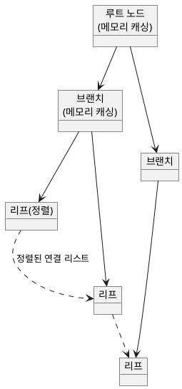

<!-- truncate -->

SQL이 느릴 때 가장 먼저 보는 건 인덱스입니다. 그런데 인덱스를 만들었는데도 쿼리가 여전히 느리거나, 아예 인덱스를 안 타는 경험을 누구나 해 봤을 겁니다. InnoDB 기준 **B+트리 동작 원리 → 인덱스를 못 타는 이유 → 실행계획(EXPLAIN) 진단 → 커버링 인덱스 최적화**까지 실무에서 바로 쓰는 순서로 정리합니다.

<mark>인덱스는 만들기만 하면 무조건 빨라지는 장치가 아니라, 옵티마이저가 비용을 계산해 **사용할지 결정하는** 정렬된 자료구조입니다. 구조를 알아야 왜 안 타는지가 보입니다.</mark>

먼저 흔한 상황. `orders(user_id)`에 인덱스를 걸고 조회했는데 `EXPLAIN` 결과가 `type=ALL`, `key=NULL` — 인덱스를 안 타고 풀스캔입니다. "분명 인덱스를 걸었는데 왜?" 이 질문의 답은 인덱스가 내부에서 어떻게 정렬되고 탐색되는지에 있습니다. 흔한 오해 셋 — **인덱스는 걸면 무조건 빨라진다 / 많을수록 좋다 / 있으면 항상 쓰인다** — 부터 풀어 봅니다.

## 1. 인덱스란 — 책 뒤의 색인

인덱스는 조회를 빠르게 하려고 **원본 테이블과 별개로 유지되는 정렬된 자료구조**입니다. 책에 비유하면, 1페이지부터 끝까지 넘기며 단어를 찾는 게 **풀스캔**이고, 책 뒤 색인에서 단어의 페이지를 찾아 바로 펼치는 게 **인덱스 탐색**입니다.

수백만 건 테이블에서 `id = 980`을 찾을 때, 인덱스가 없으면 처음부터 순차로 다 훑어야 하지만(풀스캔), 인덱스가 있으면 루트 → 브랜치 → 리프로 **서너 단계**만에 도달합니다.

## 2. 왜 B+트리인가 — 트리 높이를 낮춰 디스크 I/O를 줄인다

탐색 자료구조의 후보를 비교하면 B+트리를 택한 이유가 드러납니다.

- **풀스캔** — 처음부터 끝까지. 시간 복잡도 **O(N)**.
- **이진 탐색 트리** — 절반씩 줄여 **O(log N)**. 하지만 자식이 둘뿐이라 데이터가 많아지면 **트리가 높아지고**, 높이만큼 디스크 I/O가 늘어납니다.
- **B+트리** — 노드 하나에 키를 여러 개 넣어 **팬아웃(fan-out)** 이 큽니다. 그래서 수천만 건이어도 보통 **3~5단계**에 끝납니다. 시간 복잡도는 `O(log_m N)`(m = 팬아웃)이라, m이 클수록 트리가 낮아집니다.

<details>
<summary>PlantUML 코드</summary>



</details>


루트·브랜치 노드는 대개 메모리에 캐싱돼 있어, 실제 **디스크 I/O는 마지막 리프 단계에 집중**됩니다. 디스크 기반으로 대량 데이터를 다루는 RDB에서 B+트리가 가장 효과적인 이유입니다.

<mark>B+트리의 핵심은 "낮은 트리 높이" — 몇 단계 안에 끝나 디스크 접근 횟수를 크게 줄입니다.</mark>

## 3. 프라이머리 vs 세컨더리 인덱스 — 더블 룩업

InnoDB에서 인덱스는 두 종류입니다.

- **프라이머리 인덱스(클러스터 인덱스)** — PK로 만든 인덱스. **리프 노드에 실제 행 데이터가 통째로** 들어 있습니다. 리프까지 가면 바로 데이터를 얻습니다.
- **세컨더리 인덱스** — PK가 아닌 일반 컬럼에 건 인덱스. 리프 노드에는 실제 데이터가 아니라 **그 행의 PK 값**이 들어 있습니다.

그래서 세컨더리 인덱스로 조회하면 탐색이 **두 번** 일어납니다. 예를 들어 `users(email)` 인덱스로 이메일을 찾으면 → 리프에서 **PK를 얻고** → 그 PK로 **프라이머리 인덱스를 다시 탐색**해 전체 행을 가져옵니다. 이 이중 탐색을 **더블 룩업(double lookup)** 이라 합니다.

<mark>세컨더리 인덱스는 "인덱스 → PK → 다시 프라이머리 인덱스"의 이중 탐색이라 비용이 더 듭니다 — 뒤에 나올 커버링 인덱스가 이걸 없애는 기법입니다.</mark>

## 4. 인덱스가 있어도 안 타는 이유 ① 옵티마이저의 판단

인덱스가 있는데도 풀스캔이 나오는 근본 이유는 DB의 두뇌인 **옵티마이저**가 **비용 기반(cost-based)** 으로 판단하기 때문입니다. 인덱스를 타는 비용보다 풀스캔이 더 싸다고 계산되면, 옵티마이저는 풀스캔을 고릅니다(전체 행 수·예상 디스크 I/O·값 분포 같은 통계 기반).

가장 흔한 경우가 **카디널리티(cardinality)가 낮은 컬럼**입니다. 카디널리티는 컬럼 값의 다양성인데, 성별처럼 값이 몇 종류뿐이면 카디널리티가 낮습니다. `gender = 'M'`으로 인덱스를 타 봐야 전체의 절반이 걸리고, 그 절반마다 더블 룩업이 발생하니, 옵티마이저는 **"차라리 풀스캔이 낫다"** 고 판단합니다. 반대로 이메일·유저ID처럼 값이 거의 유일한(카디널리티 높은) 컬럼은 탐색 범위를 크게 줄여 인덱스 효율이 좋습니다.

이 밖에도 옵티마이저는 여러 상황에서 인덱스를 건너뜁니다.

- **OR로 서로 다른 인덱스 조건** — 두 인덱스를 합치는(인덱스 머지) 비용과 풀스캔 비용을 견줘 더 싼 쪽을 고릅니다.
- **NULL 조건** — 오라클과 달리 **MySQL InnoDB는 NULL도 인덱스에 저장**해 `IS NULL`/`IS NOT NULL`도 범위 탐색이 됩니다. 다만 해당 값이 너무 많으면 역시 풀스캔이 선택될 수 있습니다.

<mark>인덱스를 탈지는 옵티마이저의 비용 계산 결과입니다 — 그래서 추측하지 말고 반드시 `EXPLAIN`으로 실제 실행계획을 눈으로 확인해야 합니다.</mark>

## 5. 인덱스가 있어도 안 타는 이유 ② 쿼리 작성 실수

옵티마이저 판단과 별개로, **쿼리를 잘못 써서** 인덱스를 못 타게 만드는 세 가지 패턴이 있습니다. 셋 다 "B+트리에 정렬된 **원본 값 자체**를 비교할 수 없게 만든다"는 공통점이 있습니다.

**① 인덱스 컬럼 가공** — 인덱스 컬럼을 함수로 감싸면 정렬된 원본과 비교할 수 없습니다.

```sql
-- ✗ created_at을 함수로 감쌈 → 인덱스 미사용
WHERE DATE(created_at) = '2026-01-01'
-- ✓ 컬럼은 그대로 두고 조건을 범위로
WHERE created_at >= '2026-01-01' AND created_at < '2026-01-02'
```

**② 암묵적 형변환** — `VARCHAR` 컬럼을 숫자로 비교하면 내부에서 문자를 숫자로 바꾸는 변환이 일어나 인덱스 정렬 순서와 맞지 않게 됩니다.

```sql
-- ✗ user_id가 문자열인데 숫자로 비교 → 암묵적 형변환 → 인덱스 미사용
WHERE user_id = 12345
-- ✓ 문자열로 비교
WHERE user_id = '12345'
```

**③ LIKE 앞 와일드카드** — B+트리는 **앞글자 기준으로 정렬**돼 있어, 앞이 고정돼야 탐색할 수 있습니다.

```sql
-- ✗ 앞 와일드카드 → 인덱스 미사용
WHERE name LIKE '%김%'
-- ✓ 앞글자 고정 → 인덱스 범위 탐색
WHERE name LIKE '김%'
```

> 형변환 등은 MySQL 버전·콜레이션·옵티마이저에 따라 결과가 다를 수 있으니, 확실한 건 역시 `EXPLAIN` 확인입니다.

## 6. 인덱스 효율 높이기 — 복합 인덱스·정렬 생략

**복합 인덱스와 최좌측 접두사 규칙(leftmost prefix rule)** — 여러 컬럼을 묶은 복합 인덱스는 **가장 왼쪽 컬럼부터 순서대로만** 탐색할 수 있습니다.

```sql
-- INDEX (a, b, c) 로 생성했다면
WHERE a = ? AND b = ?    -- ✓ 선행 컬럼부터 → 인덱스 사용
WHERE b = ? AND c = ?    -- ✗ a를 건너뜀 → 인덱스 활용 불가
```

DB는 먼저 `a`로 정렬하고, `a`가 같을 때만 그 안에서 `b`로 2차 정렬하기 때문입니다(MySQL 8.0의 인덱스 스킵 스캔이라는 예외는 있음). 그래서 **조건절에 자주 쓰는 선행 컬럼을 앞에** 둬야 합니다. 컬럼 순서는 두 기준으로 정합니다.

1. **카디널리티가 높은 컬럼을 앞에** — 한 번에 탐색 범위를 크게 줄입니다.
2. **등치(=) 조건을 범위(&gt;, &lt;, BETWEEN) 조건보다 앞에** — 등치가 범위보다 범위를 더 많이 줄입니다.

```sql
-- WHERE user_id = ? AND created_at >= ?  (user_id 등치, created_at 범위)
INDEX (user_id, created_at)   -- 등치 먼저로 범위를 줄이고, 그 안에서 범위 탐색
```

**정렬 연산 생략** — 인덱스 리프는 이미 키 순서로 정렬된 연결 리스트입니다. `ORDER BY` 컬럼이 인덱스와 일치하면 DB는 **별도 정렬 없이** 리프 순서를 그대로 읽습니다. 일치하지 않으면 **filesort**(별도 정렬)가 발생해 정렬할 행이 많을수록 메모리·CPU 비용이 커집니다.

<mark>복합 인덱스의 원리는 하나입니다 — 앞 단계에서 탐색 범위를 최대한 줄여, 뒤에서 읽어야 할 양을 줄이는 것.</mark>

## 7. 커버링 인덱스 — 더블 룩업을 없앤다

세컨더리 인덱스의 더블 룩업을 없애는 최적화가 **커버링 인덱스**입니다. 개념은 단순합니다 — 쿼리가 요구하는 **모든 컬럼**(`SELECT`·`WHERE`·`ORDER BY`·`GROUP BY`에 나오는 컬럼)이 인덱스 안에 다 있으면, 인덱스만 한 번 탐색해 값을 바로 얻습니다. PK로 프라이머리 인덱스를 재탐색할 필요가 없습니다.

```sql
SELECT email FROM users WHERE user_id = ?;
-- INDEX (user_id)      → email을 얻으려 더블 룩업 발생
-- INDEX (user_id, email) → 두 컬럼이 인덱스에 다 있음 → 인덱스만으로 해결(커버링)
```

`EXPLAIN`의 `Extra`에 **`Using index`** 가 보이면 커버링 인덱스가 적용된 것입니다. 다만 트레이드오프가 있습니다 — 컬럼을 인덱스에 다 넣으면 **인덱스가 커지고 쓰기 부하가 늘어**납니다. 그래서 **자주 조회되고 SELECT 컬럼이 적을 때** 선택적으로 씁니다.

## 8. EXPLAIN 실행계획 읽기

작성한 쿼리가 의도대로 도는지는 `EXPLAIN`의 핵심 컬럼 셋으로 진단합니다.

**`type`** — 접근 방식. 좋은 쪽부터 나열하면:

| type | 의미 | 평가 |
|---|---|---|
| `const` / `ref` | PK·유니크·인덱스로 소수 행만 조회 | 가장 좋음 |
| `range` | 인덱스로 특정 범위 조회 | 실무 허용 마지노선 |
| `index` | 인덱스 전체를 훑음(풀 인덱스 스캔) | 튜닝 검토 |
| `ALL` | 테이블 풀스캔 | 튜닝 대상 |

**`key`** — 실제 사용된 인덱스. **`NULL`이면 인덱스 미사용**이라 검토 대상입니다.

**`Extra`** — 추가 실행 정보.

- `Using index` — 커버링 인덱스 적용(좋은 신호).
- `Using where` — 인덱스 후 추가 필터링.
- `Using filesort` — 별도 정렬 발생(튜닝 대상).
- `Using temporary` — 임시 테이블 생성. 중간 결과를 어딘가 저장했다 다시 쓰는 것이라 비용이 큼(튜닝 대상).

<mark>진단 순서: `type`에서 `ALL`(풀스캔)을 먼저 없애고, `key=NULL`의 원인을 찾고, `Extra`의 `filesort`·`temporary`를 제거할 수 있는지 본다.</mark>

## 9. 인덱스는 트레이드오프 — 읽기↑ 쓰기↓

인덱스는 조회를 빠르게 하지만 **쓰기를 느리게** 합니다. 정렬된 자료구조를 유지해야 하므로, 데이터가 바뀔 때마다 **페이지 분할·재정렬 비용**이 쌓입니다. 그래서 인덱스를 남발하면 안 되는 경우가 있습니다.

- 조회보다 **쓰기가 훨씬 잦은** 로그·이벤트 테이블에는 인덱스를 최소화합니다.
- 인덱스가 너무 많으면 옵티마이저의 실행계획 수립 시간이 길어지고, 통계 오류 시 엉뚱한 인덱스를 고르기도 합니다.
- 대략 **테이블당 5~6개 이하**를 기준으로, 쓰기가 많으면 더 줄이고 읽기 중심이면 쿼리 패턴에 맞춰 조정합니다.
- **중복 인덱스** — `INDEX(a, b)`가 있는데 `INDEX(a)`를 또 두는 건 대개 불필요(포함 관계)합니다. 단, 유니크 제약·커버링 목적으로 남기는 경우가 있으니 용도를 확인하고 지웁니다.

이 트레이드오프는 인덱스가 잠금·데드락에 관여하는 방식과도 이어집니다 — [인덱스와 데드락](./index-deadlock) 글도 함께 보세요.

## 운영 체크리스트

- **느린 쿼리에 `EXPLAIN`** 을 돌려 `type=ALL`(풀스캔)·`key=NULL`·`Using filesort`/`temporary`가 없는지 확인.
- **인덱스 컬럼을 가공하지 말고**, 암묵적 형변환·`LIKE '%…'`를 피한다.
- 복합 인덱스는 **등치 조건을 앞, 범위 조건을 뒤**, 카디널리티 높은 컬럼을 앞에.
- 빈번한 조회는 **커버링 인덱스**로 PK 재탐색 제거를 검토.
- 카디널리티 낮은 컬럼(성별 등)에 **단독 인덱스는 지양**.
- **슬로우 쿼리 로그**를 켜 두고, `sys.schema_unused_indexes`로 미사용 인덱스를 주기적으로 점검(서버 재시작 후 충분히 운영된 뒤 확인).
- 대량 변경 후 쿼리가 갑자기 느려지면 **통계 갱신**(`ANALYZE TABLE`)으로 옵티마이저가 최신 분포로 다시 계획하도록 한다.

## 정리 — 핵심 다섯

- **인덱스는 B+트리** — 트리 높이가 낮아 수천만 건도 몇 단계로 탐색, 디스크 I/O를 크게 줄인다.
- **옵티마이저는 비용 기반** — 인덱스가 있어도 풀스캔이 싸다고 판단하면 안 탄다(카디널리티가 특히 중요).
- **복합 인덱스는 순서가 전부** — 인덱스 순서와 조건 순서를 맞추고, 등치를 범위보다 앞에.
- **커버링 인덱스** — 필요한 컬럼이 인덱스에 다 있으면 더블 룩업이 사라진다(`Extra: Using index`).
- **인덱스는 읽기↑·쓰기↓ 트레이드오프** — 필요한 만큼만, `EXPLAIN`으로 검증하며 쓴다.

<mark>인덱스는 많이 건다고 빨라지지 않습니다 — 구조(B+트리)를 이해하고, 옵티마이저가 실제로 타는지 `EXPLAIN`으로 확인하며 설계하는 것이 핵심입니다.</mark>

### 용어 한 줄 정리

| 용어 | 쉬운 뜻 |
|---|---|
| B+트리 | 팬아웃이 커 트리 높이가 낮은 정렬 자료구조 |
| 클러스터 인덱스 | 리프에 실제 행이 든 PK 인덱스 |
| 더블 룩업 | 세컨더리 인덱스 → PK → 프라이머리 재탐색 |
| 카디널리티 | 컬럼 값의 다양성(높을수록 인덱스 효율↑) |
| 최좌측 접두사 규칙 | 복합 인덱스는 왼쪽 컬럼부터만 탐색 |
| 커버링 인덱스 | 쿼리 컬럼이 인덱스에 다 있어 재탐색이 없음 |
| filesort | 인덱스 순서를 못 써 별도 정렬하는 것 |
