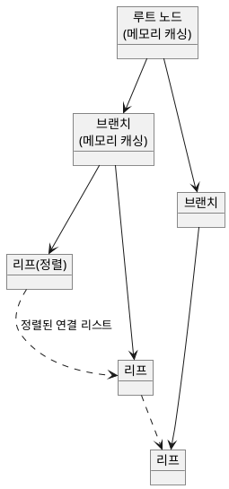

<!-- truncate -->

SQL이 느릴 때 가장 먼저 보는 건 인덱스입니다. 그런데 인덱스를 만들었는데도 쿼리가 여전히 느리거나, 아예 인덱스를 사용하지 않는 경험을 누구나 해 봤을 겁니다. InnoDB 기준 **B+트리 동작 원리 → 인덱스를 사용하지 못하는 이유 → 실행계획(EXPLAIN) 점검 → 커버링 인덱스 최적화**까지 실무에서 바로 사용하는 순서로 정리합니다.

<mark>인덱스는 만들기만 하면 무조건 빨라지는 장치가 아니라, 옵티마이저가 비용을 계산해 **사용할지 결정하는** 정렬된 자료구조입니다. 구조를 알아야 왜 사용하지 않는지가 보입니다.</mark>

먼저 흔한 상황. `orders(user_id)`에 인덱스를 걸고 조회했는데 `EXPLAIN` 결과가 `type=ALL`, `key=NULL` — 인덱스를 사용하지 않고 풀스캔입니다. "분명 인덱스를 걸었는데 왜?" 이 질문의 답은 인덱스가 내부에서 어떻게 정렬되고 탐색되는지에 있습니다. 흔한 오해 셋 — **인덱스는 걸면 무조건 빨라진다 / 많을수록 좋다 / 있으면 항상 사용된다** — 부터 풀어 봅니다.

## 1. 인덱스란 — 책 뒤의 색인

인덱스는 조회를 빠르게 하려고 **원본 테이블과 별개로 유지되는 정렬된 자료구조**입니다. 책에 비유하면, 1페이지부터 끝까지 넘기며 단어를 찾는 게 **풀스캔**이고, 책 뒤 색인에서 단어의 페이지를 찾아 바로 펼치는 게 **인덱스 탐색**입니다.

수백만 건 테이블에서 `id = 980`을 찾을 때, 인덱스가 없으면 처음부터 순차로 다 읽어야 하지만(풀스캔), 인덱스가 있으면 루트 → 브랜치 → 리프로 **서너 단계**만에 도달합니다.

## 2. 왜 B+트리인가 — 트리 높이를 낮춰 디스크 I/O를 줄인다

탐색 자료구조의 후보를 비교하면 B+트리를 택한 이유가 드러납니다.

- **풀스캔** — 처음부터 끝까지. 시간 복잡도 **O(N)**.
- **이진 탐색 트리** — 절반씩 줄여 **O(log N)**. 하지만 자식이 둘뿐이라 데이터가 많아지면 **트리가 높아지고**, 높이만큼 디스크 I/O가 늘어납니다.
- **B+트리** — 노드 하나에 키를 여러 개 넣어 **팬아웃(fan-out)** 이 큽니다. 그래서 수천만 건이어도 보통 **3~5단계**에 끝납니다. 시간 복잡도는 `O(log_m N)`(m = 팬아웃)이라, m이 클수록 트리가 낮아집니다.

<details>
<summary>PlantUML 코드</summary>


```plantuml
@startuml
object "루트 노드\n(메모리 캐싱)" as R
object "브랜치\n(메모리 캐싱)" as B1
object "브랜치" as B2
object "리프(정렬)" as L1
object "리프" as L2
object "리프" as L3

R --> B1
R --> B2
B1 --> L1
B1 --> L2
B2 --> L3

L1 ..> L2 : 정렬된 연결 리스트
L2 ..> L3
@enduml
```

</details>


루트·브랜치 노드는 대개 메모리에 캐싱돼 있어, 실제 **디스크 I/O는 마지막 리프 단계에 집중**됩니다. 디스크 기반으로 대량 데이터를 다루는 RDB에서 B+트리가 가장 효과적인 이유입니다.

<mark>B+트리의 핵심은 "낮은 트리 높이" — 몇 단계 안에 끝나 디스크 접근 횟수를 크게 줄입니다.</mark>

## 3. 프라이머리 vs 세컨더리 인덱스 — 더블 룩업

InnoDB에서 인덱스는 두 종류입니다.

- **프라이머리 인덱스(클러스터 인덱스)** — PK로 만든 인덱스. **리프 노드에 실제 행 데이터가 전부** 들어 있습니다. 리프까지 가면 바로 데이터를 얻습니다.
- **세컨더리 인덱스** — PK가 아닌 일반 컬럼에 건 인덱스. 리프 노드에는 실제 데이터가 아니라 **그 행의 PK 값**이 들어 있습니다.

그래서 세컨더리 인덱스로 조회하면 탐색이 **두 번** 발생합니다. 예를 들어 `users(email)` 인덱스로 이메일을 찾으면 → 리프에서 **PK를 얻고** → 그 PK로 **프라이머리 인덱스를 다시 탐색**해 전체 행을 가져옵니다. 이 이중 탐색을 **더블 룩업(double lookup)** 이라 합니다.

<mark>세컨더리 인덱스는 "인덱스 → PK → 다시 프라이머리 인덱스"의 이중 탐색이라 비용이 더 듭니다 — 뒤에 나올 커버링 인덱스가 이걸 없애는 기법입니다.</mark>

## 4. 인덱스가 있어도 사용하지 않는 이유 ① 옵티마이저의 판단

인덱스가 있는데도 풀스캔이 나오는 근본 이유는 DB의 두뇌인 **옵티마이저**가 **비용 기반(cost-based)** 으로 판단하기 때문입니다. 인덱스를 사용하는 비용보다 풀스캔이 더 낮다고 계산되면, 옵티마이저는 풀스캔을 고릅니다(전체 행 수·예상 디스크 I/O·값 분포 같은 통계 기반).

가장 흔한 경우가 **카디널리티(cardinality)가 낮은 컬럼**입니다. 카디널리티는 컬럼 값의 다양성인데, 성별처럼 값이 몇 종류뿐이면 카디널리티가 낮습니다. `gender = 'M'`으로 인덱스를 사용해 봐야 전체의 절반이 해당되고, 그 절반마다 더블 룩업이 발생하니, 옵티마이저는 **"차라리 풀스캔이 낫다"** 고 판단합니다. 반대로 이메일·유저ID처럼 값이 거의 유일한(카디널리티 높은) 컬럼은 탐색 범위를 크게 줄여 인덱스 효율이 좋습니다.

이 밖에도 옵티마이저는 여러 상황에서 인덱스를 건너뜁니다.

- **OR로 서로 다른 인덱스 조건** — 두 인덱스를 합치는(인덱스 머지) 비용과 풀스캔 비용을 견줘 비용이 더 낮은 쪽을 고릅니다.
- **NULL 조건** — 오라클과 달리 **MySQL InnoDB는 NULL도 인덱스에 저장**해 `IS NULL`/`IS NOT NULL`도 범위 탐색이 됩니다. 다만 해당 값이 너무 많으면 역시 풀스캔이 선택될 수 있습니다.

<mark>인덱스를 사용할지는 옵티마이저의 비용 계산 결과입니다 — 그래서 추측하지 말고 반드시 `EXPLAIN`으로 실제 실행계획을 눈으로 확인해야 합니다.</mark>

## 5. 인덱스가 있어도 사용하지 않는 이유 ② 쿼리 작성 실수

옵티마이저 판단과 별개로, **쿼리를 잘못 작성해서** 인덱스를 사용하지 못하게 만드는 세 가지 패턴이 있습니다. 셋 다 "B+트리에 정렬된 **원본 값 자체**를 비교할 수 없게 만든다"는 공통점이 있습니다.

**① 인덱스 컬럼 가공** — 인덱스 컬럼을 함수로 감싸면 정렬된 원본과 비교할 수 없습니다.

```sql
-- ✗ created_at을 함수로 감쌈 → 인덱스 미사용
WHERE DATE(created_at) = '2026-01-01'
-- ✓ 컬럼은 그대로 두고 조건을 범위로
WHERE created_at >= '2026-01-01' AND created_at < '2026-01-02'
```

**② 암묵적 형변환** — `VARCHAR` 컬럼을 숫자로 비교하면 내부에서 문자를 숫자로 변환하면서 인덱스 정렬 순서와 맞지 않게 됩니다.

```sql
-- ✗ user_id가 문자열인데 숫자로 비교 → 암묵적 형변환 → 인덱스 미사용
WHERE user_id = 12345
-- ✓ 문자열로 비교
WHERE user_id = '12345'
```

**③ LIKE 앞 와일드카드** — B+트리는 **앞글자 기준으로 정렬**돼 있어, 앞이 고정돼야 탐색할 수 있습니다.

```sql
-- ✗ 앞 와일드카드 → 인덱스 미사용
WHERE name LIKE '%김%'
-- ✓ 앞글자 고정 → 인덱스 범위 탐색
WHERE name LIKE '김%'
```

> 형변환 등은 MySQL 버전·콜레이션·옵티마이저에 따라 결과가 다를 수 있으니, 확실한 건 역시 `EXPLAIN` 확인입니다.

## 6. 인덱스 효율 높이기 — 복합 인덱스·정렬 생략

**복합 인덱스와 최좌측 접두사 규칙(leftmost prefix rule)** — 여러 컬럼을 묶은 복합 인덱스는 **가장 왼쪽 컬럼부터 순서대로만** 탐색할 수 있습니다.

```sql
-- INDEX (a, b, c) 로 생성했다면
WHERE a = ? AND b = ?    -- ✓ 선행 컬럼부터 → 인덱스 사용
WHERE b = ? AND c = ?    -- ✗ a를 건너뜀 → 인덱스 활용 불가
```

DB는 먼저 `a`로 정렬하고, `a`가 같을 때만 그 안에서 `b`로 2차 정렬하기 때문입니다(MySQL 8.0의 인덱스 스킵 스캔이라는 예외는 있음). 그래서 **WHERE 조건에 자주 사용하는 선행 컬럼을 앞에** 배치해야 합니다. 컬럼 순서는 두 기준으로 정합니다.

1. **카디널리티가 높은 컬럼을 앞에** — 한 번에 탐색 범위를 크게 줄입니다.
2. **등호(`=`) 조건을 범위(&gt;, &lt;, BETWEEN) 조건보다 앞에** — 등호 조건이 범위 조건보다 범위를 더 많이 줄입니다.

```sql
-- WHERE user_id = ? AND created_at >= ?  (user_id 등치, created_at 범위)
INDEX (user_id, created_at)   -- 등치 먼저로 범위를 줄이고, 그 안에서 범위 탐색
```

**정렬 연산 생략** — 인덱스 리프는 이미 키 순서로 정렬된 연결 리스트입니다. `ORDER BY` 컬럼이 인덱스와 일치하면 DB는 **별도 정렬 없이** 리프 순서를 그대로 읽습니다. 일치하지 않으면 **filesort**(별도 정렬)가 발생해 정렬할 행이 많을수록 메모리·CPU 비용이 커집니다.

<mark>복합 인덱스의 원리는 하나입니다 — 앞 단계에서 탐색 범위를 최대한 줄여, 뒤에서 읽어야 할 양을 줄이는 것.</mark>

## 7. 커버링 인덱스 — 더블 룩업을 없앤다

세컨더리 인덱스의 더블 룩업을 없애는 최적화가 **커버링 인덱스**입니다. 개념은 단순합니다 — 쿼리가 요구하는 **모든 컬럼**(`SELECT`·`WHERE`·`ORDER BY`·`GROUP BY`에 나오는 컬럼)이 인덱스 안에 다 있으면, 인덱스만 한 번 탐색해 값을 바로 얻습니다. PK로 프라이머리 인덱스를 재탐색할 필요가 없습니다.

```sql
SELECT email FROM users WHERE user_id = ?;
-- INDEX (user_id)      → email을 얻으려 더블 룩업 발생
-- INDEX (user_id, email) → 두 컬럼이 인덱스에 다 있음 → 인덱스만으로 해결(커버링)
```

`EXPLAIN`의 `Extra`에 **`Using index`** 가 보이면 커버링 인덱스가 적용된 것입니다. 다만 트레이드오프가 있습니다 — 컬럼을 인덱스에 다 넣으면 **인덱스가 커지고 쓰기 부하가 늘어**납니다. 그래서 **자주 조회되고 SELECT 컬럼이 적을 때** 선택적으로 사용합니다.

## 8. EXPLAIN 실행계획 읽기

작성한 쿼리가 의도대로 도는지는 `EXPLAIN`의 핵심 컬럼 셋으로 점검합니다.

**`type`** — 접근 방식. 좋은 쪽부터 나열하면:

| type | 의미 | 평가 |
|---|---|---|
| `const` / `ref` | PK·유니크·인덱스로 소수 행만 조회 | 가장 좋음 |
| `range` | 인덱스로 특정 범위 조회 | 실무 허용 마지노선 |
| `index` | 인덱스 전체를 읽음(풀 인덱스 스캔) | 튜닝 검토 |
| `ALL` | 테이블 풀스캔 | 튜닝 대상 |

**`key`** — 실제 사용된 인덱스. **`NULL`이면 인덱스 미사용**이라 검토 대상입니다.

**`Extra`** — 추가 실행 정보.

- `Using index` — 커버링 인덱스 적용(좋은 신호).
- `Using where` — 인덱스 후 추가 필터링.
- `Using filesort` — 별도 정렬 발생(튜닝 대상).
- `Using temporary` — 임시 테이블 생성. 중간 결과를 어딘가 저장했다 다시 사용하는 것이라 비용이 큼(튜닝 대상).

<mark>점검 순서: `type`에서 `ALL`(풀스캔)을 먼저 없애고, `key=NULL`의 원인을 찾고, `Extra`의 `filesort`·`temporary`를 제거할 수 있는지 봅니다.</mark>

## 9. 실전 사례 — EXPLAIN 로그로 문제 쿼리 점검·대응

앞의 점검 컬럼(§8)을 실제 `EXPLAIN` 출력에 대입해 봅니다. 아래는 MySQL 8.0 기준이고 핵심 컬럼만 추렸습니다(`id`·`partitions`·`key_len` 등 생략). 각 사례는 **문제 쿼리 → EXPLAIN 분석 → 대응 → 개선 후 EXPLAIN** 순서입니다.

### 사례 1 — 인덱스 컬럼을 함수로 감싸 풀스캔

`orders(created_at)`에 인덱스가 있는데 특정 날짜 주문을 세는 쿼리가 느립니다.

```sql
SELECT COUNT(*) FROM orders WHERE DATE(created_at) = '2026-01-01';
```

```text
+----+--------+------+---------------+------+---------+----------+-------------+
| id | table  | type | possible_keys | key  | rows    | filtered | Extra       |
+----+--------+------+---------------+------+---------+----------+-------------+
|  1 | orders | ALL  | NULL          | NULL | 4831200 |   100.00 | Using where |
+----+--------+------+---------------+------+---------+----------+-------------+
```

**분석** — `type=ALL`(풀스캔) · `key=NULL`(인덱스 미사용) · `rows≈480만`(전체를 다 읽음). `possible_keys`조차 `NULL`이라 옵티마이저가 후보로도 못 올렸습니다. 원인은 `DATE(created_at)` — 인덱스에 정렬된 건 **가공 전 원본 값**이라, 함수로 감싼 결과로는 탐색할 수 없습니다(§5①).

**대응** — 컬럼은 그대로 유지하고 조건을 범위로 변경합니다.

```sql
SELECT COUNT(*) FROM orders
WHERE created_at >= '2026-01-01' AND created_at < '2026-01-02';
```

```text
+----+--------+-------+----------------+----------------+-------+----------+--------------------------+
| id | table  | type  | possible_keys  | key            | rows  | filtered | Extra                    |
+----+--------+-------+----------------+----------------+-------+----------+--------------------------+
|  1 | orders | range | idx_created_at | idx_created_at | 21044 |   100.00 | Using where; Using index |
+----+--------+-------+----------------+----------------+-------+----------+--------------------------+
```

`type=range` · `key=idx_created_at`로 바뀌고 `rows`가 480만 → 2만으로 줄었습니다. `Using index`까지 붙어 리프만 읽고 끝나는 커버링입니다.

### 사례 2 — 암묵적 형변환으로 인덱스 미사용

`users(login_id)`가 `VARCHAR`인데 숫자 리터럴로 비교합니다.

```sql
SELECT * FROM users WHERE login_id = 10023456;
```

```text
+----+-------+------+---------------+------+---------+----------+-------------+
| id | table | type | possible_keys | key  | rows    | filtered | Extra       |
+----+-------+------+---------------+------+---------+----------+-------------+
|  1 | users | ALL  | idx_login_id  | NULL | 2011488 |    10.00 | Using where |
+----+-------+------+---------------+------+---------+----------+-------------+
```

**분석** — 이번엔 `possible_keys=idx_login_id`로 후보엔 올랐지만 `key=NULL`이라 **끝내 안 썼습니다**. `login_id`가 문자열인데 숫자와 비교하니 MySQL이 컬럼 쪽을 숫자로 변환(`CAST`)해 비교합니다 — 인덱스 정렬 순서와 맞지 않아 탐색 불가(§5②). `possible_keys`는 있는데 `key=NULL`이면 형변환·함수 가공을 먼저 의심합니다.

**대응** — 타입을 통일해 문자열로 비교합니다(어플리케이션의 파라미터 바인딩 타입도 함께 점검).

```sql
SELECT * FROM users WHERE login_id = '10023456';
```

```text
+----+-------+------+---------------+--------------+------+----------+-------+
| id | table | type | possible_keys | key          | rows | filtered | Extra |
+----+-------+------+---------------+--------------+------+----------+-------+
|  1 | users | ref  | idx_login_id  | idx_login_id |    1 |   100.00 | NULL  |
+----+-------+------+---------------+--------------+------+----------+-------+
```

`type=ref` · `rows=1` · `filtered=100`. 필요한 한 행만 정확히 찾습니다.

### 사례 3 — ORDER BY가 인덱스와 안 맞아 filesort

`type`은 나쁘지 않은데 정렬이 병목인 경우입니다. `INDEX(user_id)`만 있는 상태에서:

```sql
SELECT * FROM orders WHERE user_id = 42 ORDER BY created_at DESC LIMIT 20;
```

```text
+----+--------+------+---------------+-------------+------+----------+----------------+
| id | table  | type | possible_keys | key         | rows | filtered | Extra          |
+----+--------+------+---------------+-------------+------+----------+----------------+
|  1 | orders | ref  | idx_user_id   | idx_user_id | 8123 |   100.00 | Using filesort |
+----+--------+------+---------------+-------------+------+----------+----------------+
```

**분석** — 인덱스는 사용했지만 `Extra=Using filesort`. `user_id=42`에 해당하는 8천여 행을 **메모리에서 다시 정렬**한 뒤 20건을 잘라냅니다. 조건에 맞는 행이 많을수록 정렬 비용이 커지고, `LIMIT 20`도 정렬을 끝낸 뒤에야 적용됩니다(§6 정렬 생략).

**대응** — 조건 컬럼과 정렬 컬럼을 묶은 복합 인덱스로 정렬을 없앱니다.

```sql
CREATE INDEX idx_user_created ON orders (user_id, created_at);
```

```text
+----+--------+------+------------------+------------------+------+----------+-------+
| id | table  | type | possible_keys    | key              | rows | filtered | Extra |
+----+--------+------+------------------+------------------+------+----------+-------+
|  1 | orders | ref  | idx_user_created | idx_user_created |   20 |   100.00 | NULL  |
+----+--------+------+------------------+------------------+------+----------+-------+
```

`Extra`에서 `filesort`가 사라졌습니다. 인덱스 리프가 이미 `user_id`별 `created_at` 순서라, DB는 정렬 없이 리프를 역순으로 20건만 읽습니다(`rows=20`).

### 사례 4 — 조인 컬럼 타입이 달라 조인 대상 테이블 풀스캔

두 테이블을 조인하는데 **조인 키의 타입(또는 문자셋·콜레이션)이 서로 다르면**, 조인 대상(안쪽) 테이블에서 인덱스를 사용하지 못하고 행마다 풀스캔이 발생할 수 있습니다. 단건 형변환(§5②)과 원리는 같지만, 조인은 **구동 테이블 행마다 안쪽을 반복 탐색**하므로 영향이 훨씬 큽니다.

`users.id`는 `BIGINT`인데 `orders.user_id`가 `VARCHAR`인 상황입니다.

```sql
SELECT u.name, o.id
FROM users u
JOIN orders o ON o.user_id = u.id      -- BIGINT = VARCHAR (타입 불일치)
WHERE u.status = 'ACTIVE';
```

```text
+----+-------+------+---------------+------------+---------+----------+--------------------------------------------+
| id | table | type | possible_keys | key        | rows    | filtered | Extra                                      |
+----+-------+------+---------------+------------+---------+----------+--------------------------------------------+
|  1 | u     | ref  | idx_status    | idx_status |    5120 |   100.00 | Using where                                |
|  1 | o     | ALL  | idx_user_id   | NULL       | 3982104 |    10.00 | Using where; Using join buffer (hash join) |
+----+-------+------+---------------+------------+---------+----------+--------------------------------------------+
```

**분석** — 구동 테이블 `u`는 `idx_status`를 잘 썼지만, 조인 대상 `o`가 `type=ALL`·`key=NULL`입니다. `possible_keys=idx_user_id`가 있는데도 사용하지 못합니다 — `o.user_id`(VARCHAR)와 `u.id`(BIGINT)를 비교하며 **인덱스가 있는 `o.user_id` 쪽을 숫자로 변환**하기 때문입니다(§5②와 같은 원리). MySQL 8은 해시 조인(`Using join buffer (hash join)`)으로 다소 완화하지만, 안쪽을 전부 읽는 비용은 그대로라 구동 테이블 행 수만큼 곱해져 느립니다.

**대응** — 조인 컬럼의 타입과 문자셋·콜레이션을 **양쪽 동일하게** 통일합니다. 근본 대응은 스키마 정정입니다.

```sql
ALTER TABLE orders MODIFY user_id BIGINT;   -- 조인 키 타입을 u.id와 일치
```

```text
+----+-------+------+---------------+-------------+------+----------+-------------+
| id | table | type | possible_keys | key         | rows | filtered | Extra       |
+----+-------+------+---------------+-------------+------+----------+-------------+
|  1 | u     | ref  | idx_status    | idx_status  | 5120 |   100.00 | Using where |
|  1 | o     | ref  | idx_user_id   | idx_user_id |    3 |   100.00 | NULL        |
+----+-------+------+---------------+-------------+------+----------+-------------+
```

조인 대상 `o`가 `type=ref`·`key=idx_user_id`로 바뀌고, 구동 테이블 행마다 안쪽을 **3건 안팎**만 탐색합니다. 문자열 컬럼끼리라도 `utf8mb4` vs `latin1`처럼 **문자셋·콜레이션이 다르면 같은 증상**이 나니, 조인 키는 타입·문자셋·콜레이션을 통일하는 게 원칙입니다.

### 사례 5 — 조인 키가 INT vs BIGINT라 조인 대상이 풀스캔

정수 타입끼리면 괜찮을 것 같지만, **부호가 같아도 `INT`와 `BIGINT`처럼 타입이 다르면 조인 대상이 풀스캔될 수 있습니다.** 부모 PK는 `INT`인데 이를 참조하는 자식 FK를 `BIGINT`로 선언한 스키마를 예로 봅니다.

```sql
CREATE TABLE article (
    id INT AUTO_INCREMENT PRIMARY KEY   -- 부모 PK: INT
    -- ...
);

CREATE TABLE article_comment (
    id         BIGINT UNSIGNED AUTO_INCREMENT PRIMARY KEY,
    article_id BIGINT NOT NULL,                 -- FK인데 BIGINT (부모는 INT)
    KEY idx_article (article_id)                -- 조인 키에 인덱스는 있음
);
```

두 테이블을 조인하면:

```sql
SELECT a.id, c.id
FROM article a
JOIN article_comment c ON c.article_id = a.id;
```

```text
+----+-------+-------+---------------+---------+---------+----------+--------------------------------------------+
| id | table | type  | possible_keys | key     | rows    | filtered | Extra                                      |
+----+-------+-------+---------------+---------+---------+----------+--------------------------------------------+
|  1 | a     | index | PRIMARY       | PRIMARY |   48200 |   100.00 | Using index                                |
|  1 | c     | ALL   | idx_article   | NULL    | 6120400 |    10.00 | Using where; Using join buffer (hash join) |
+----+-------+-------+---------------+---------+---------+----------+--------------------------------------------+
```

**분석** — 조인 대상 `c`가 `type=ALL`·`key=NULL`입니다. `idx_article`(FK 인덱스)이 있는데도 사용하지 못합니다. 원인은 부모 `a.id`(`INT`)와 자식 `c.article_id`(`BIGINT`)의 **타입이 다르다**(저장 크기도 4바이트 vs 8바이트)는 점입니다. 조인 비교 과정에서 타입이 서로 변환되며 인덱스의 정렬 순서를 그대로 활용하지 못해, 부모 행마다 자식 610만 건을 전부 읽습니다. 조인 키에 인덱스가 있어도 소용이 없습니다.

이 규칙은 MySQL 호스팅 회사 PlanetScale의 기술 블로그([*Why isn't MySQL using my index?*](https://planetscale.com/blog/why-isnt-mysql-using-my-index))에도 나옵니다. 그 글의 **"Joining on mismatched columns"** 섹션은 이렇게 설명합니다.

> 조인하는 두 컬럼은 타입과 크기가 같아야 인덱스가 적용된다. `VARCHAR(10)`과 `CHAR(10)`은 호환되지만, `VARCHAR(10)`과 `CHAR(15)`는 크기가 달라 그렇지 않다.

정수의 `INT`와 `BIGINT`도 서로 다른 타입이라(저장 크기도 4바이트 vs 8바이트) 같은 이유로 인덱스가 적용되지 않습니다.

**대응** — FK를 **부모 PK와 완전히 동일한 타입**으로 통일합니다. 여기선 부모가 `INT`이므로 자식 FK도 `INT`로 변경합니다.

```sql
ALTER TABLE article_comment MODIFY article_id INT NOT NULL;  -- 부모 PK(INT)와 일치
```

```text
+----+-------+-------+---------------+-------------+-------+----------+-------------+
| id | table | type  | possible_keys | key         | rows  | filtered | Extra       |
+----+-------+-------+---------------+-------------+-------+----------+-------------+
|  1 | a     | index | PRIMARY       | PRIMARY     | 48200 |   100.00 | Using index |
|  1 | c     | ref   | idx_article   | idx_article |     6 |   100.00 | NULL        |
+----+-------+-------+---------------+-------------+-------+----------+-------------+
```

타입을 통일하면 `c`가 `type=ref`·`key=idx_article`가 되어 인덱스를 다시 사용합니다. 반대로 ID 오버플로(INT는 약 21억에서 한계) 여유가 필요하면 **부모 PK를 `BIGINT`로 올리고 자식과 통일**하는 방향도 있습니다 — 핵심은 방향이 아니라 **양쪽을 같은 타입으로** 통일하는 것입니다.

단, 이 `MODIFY`는 컬럼 타입 변경이라 `ALGORITHM=COPY`(테이블 재작성)로 실행돼 **크기에 비례한 시간**이 들고 `LOCK=SHARED` 동안 **쓰기가 막힙니다**. 운영에선 실행 전 `SELECT MAX(article_id)`로 `INT` 범위(약 21억)를 넘지 않는지 확인하고(축소 변환), 트래픽 낮은 시간대에 적용하거나 무중단이 필요하면 `pt-online-schema-change`·`gh-ost`를 사용합니다.

> **크기뿐 아니라 부호(signed/unsigned)도 맞춘다**
>
> 같은 문제가 부호에서도 납니다. auto_increment PK를 `BIGINT UNSIGNED`로 선언하는 게 정석인데, 이를 참조하는 FK를 그냥 `BIGINT`(signed)로 선언하면 크기가 같아도 **부호가 엇갈려** 같은 증상이 납니다. 이 signed/unsigned 조인 문제는 MySQL 공식 버그 트래커에도 올라 있습니다 — [Bug #8562 *Join using bigint unsigned columns fails*](https://bugs.mysql.com/bug.php?id=8562)는 unsigned bigint 조인이 실패한 사례이고, [Bug #105285](https://bugs.mysql.com/bug.php?id=105285)는 같은 값인데도 `bigint`와 `bigint unsigned` 비교 결과가 맞지 않는 사례입니다. 그래서 **FK는 부모 PK와 타입·크기·부호를 완전히 동일하게** 선언하는 게 원칙입니다([형변환 규칙](https://dev.mysql.com/doc/refman/8.0/en/type-conversion.html) 참고).

### 사례 6 — 인덱스 범위 스캔인데도 범위가 넓어 느린 경우

`type=range`가 나와도 무조건 빠른 건 아닙니다. 인덱스로 범위를 줄이긴 했지만 **그 범위에 해당하는 행이 여전히 많으면** 느립니다.

```sql
-- 최근 6개월 주문 (테이블의 약 40%가 해당)
SELECT * FROM orders WHERE created_at >= '2026-04-01' ORDER BY created_at DESC;
```

```text
+----+--------+-------+----------------+----------------+---------+----------+-------------+
| id | table  | type  | possible_keys  | key            | rows    | filtered | Extra       |
+----+--------+-------+----------------+----------------+---------+----------+-------------+
|  1 | orders | range | idx_created_at | idx_created_at | 1932040 |   100.00 | Using where |
+----+--------+-------+----------------+----------------+---------+----------+-------------+
```

**분석** — `type=range`·`key=idx_created_at`로 인덱스는 사용했지만 `rows≈193만`입니다. 범위에 든 행이 테이블의 40%라, 그 190만 건마다 `SELECT *`로 **더블 룩업**(§3)까지 발생합니다. 매칭 행이 조금만 더 많아지면 옵티마이저는 아예 풀스캔을 선택합니다 — **range라고 다 빠른 게 아니라, `rows`(실제 읽는 양)를 함께 봐야** 합니다.

대응은 "읽어야 할 범위 자체를 줄이는" 방향입니다.

- **범위를 줄인다** — 화면에 20건만 필요하면 6개월 전체 대신 `LIMIT` + **키셋 페이지네이션**(마지막 값 기준 `created_at < ?`)으로 매번 소량만 읽습니다.
- **값이 하나로 정해지는 조건(`=`)을 인덱스 앞에** — 범위 조건은 대개 `=` 조건과 함께 옵니다. `user_id = ? AND created_at >= ?`라면 `INDEX(user_id, created_at)`로 **먼저 한 유저의 행만 남긴 뒤** 그 안에서 범위를 읽어, 190만 → 수백 건으로 줄입니다(§6).
- **커버링으로 더블 룩업 제거** — 넓은 범위가 불가피하면 필요한 컬럼만 뽑아 `INDEX(created_at, 필요컬럼)`로 리프만 읽습니다(`SELECT *`를 피함).
- **넓은 범위 자체가 목적(집계)이면** 실시간 인덱스 조회 대신 **사전 집계·요약 테이블**을 만들어 사용합니다.

예로 `user_id =` 조건을 앞세운 복합 인덱스로 변경하면(`WHERE user_id = 42 AND created_at >= '2026-04-01'`):

```sql
CREATE INDEX idx_user_created ON orders (user_id, created_at);
```

```text
+----+--------+-------+------------------+------------------+------+----------+-------+
| id | table  | type  | possible_keys    | key              | rows | filtered | Extra |
+----+--------+-------+------------------+------------------+------+----------+-------+
|  1 | orders | range | idx_user_created | idx_user_created |  312 |   100.00 | NULL  |
+----+--------+-------+------------------+------------------+------+----------+-------+
```

같은 `range`지만 `rows`가 193만 → 312로 줄었습니다. `type`이 같아도 읽는 양은 이렇게 달라집니다.

<mark>점검은 늘 같은 순서입니다 — `type`으로 풀스캔부터 없애고, `key=NULL`이면 함수 가공·형변환(조인이면 조인 키 타입·부호 불일치)을 의심하고, `range`라도 `rows`가 크면 범위를 더 줄이고, 남은 `filesort`·`temporary`를 복합·커버링 인덱스로 지웁니다.</mark>

## 10. 인덱스는 트레이드오프 — 읽기↑ 쓰기↓

인덱스는 조회를 빠르게 하지만 **쓰기를 느리게** 합니다. 정렬된 자료구조를 유지해야 하므로, 데이터가 바뀔 때마다 **페이지 분할·재정렬 비용**이 쌓입니다. 그래서 인덱스를 남발하면 안 되는 경우가 있습니다.

- 조회보다 **쓰기가 훨씬 잦은** 로그·이벤트 테이블에는 인덱스를 최소화합니다.
- 인덱스가 너무 많으면 옵티마이저의 실행계획 수립 시간이 길어지고, 통계 오류 시 엉뚱한 인덱스를 고르기도 합니다.
- 대략 **테이블당 5~6개 이하**를 기준으로, 쓰기가 많으면 더 줄이고 읽기 중심이면 쿼리 패턴에 맞춰 조정합니다.
- **중복 인덱스** — `INDEX(a, b)`가 있는데 `INDEX(a)`를 또 만드는 건 대개 불필요(포함 관계)합니다. 단, 유니크 제약·커버링 목적으로 남기는 경우가 있으니 용도를 확인하고 지웁니다.

이 트레이드오프는 인덱스가 잠금·데드락에 관여하는 방식과도 이어집니다 — [인덱스와 데드락](./index-deadlock) 글도 함께 보세요.

## 운영 체크리스트

- **느린 쿼리에 `EXPLAIN`** 을 돌려 `type=ALL`(풀스캔)·`key=NULL`·`Using filesort`/`temporary`가 없는지 확인.
- **인덱스 컬럼을 가공하지 말고**, 암묵적 형변환·`LIKE '%…'`를 피한다.
- 복합 인덱스는 **등호 조건을 앞, 범위 조건을 뒤**, 카디널리티 높은 컬럼을 앞에.
- 빈번한 조회는 **커버링 인덱스**로 PK 재탐색 제거를 검토.
- 카디널리티 낮은 컬럼(성별 등)에 **단독 인덱스는 지양**.
- **조인 키는 양쪽 컬럼의 타입·문자셋·콜레이션을 통일** — 다르면 조인 대상 테이블이 풀스캔되고 구동 테이블 행 수만큼 곱해져 느려진다.
- **슬로우 쿼리 로그**를 켜고, `sys.schema_unused_indexes`로 미사용 인덱스를 주기적으로 점검(서버 재시작 후 충분히 운영된 뒤 확인).
- 대량 변경 후 쿼리가 갑자기 느려지면 **통계 갱신**(`ANALYZE TABLE`)으로 옵티마이저가 최신 분포로 다시 계획하도록 한다.

## 정리 — 핵심 다섯

- **인덱스는 B+트리** — 트리 높이가 낮아 수천만 건도 몇 단계로 탐색, 디스크 I/O를 크게 줄인다.
- **옵티마이저는 비용 기반** — 인덱스가 있어도 풀스캔 비용이 낮다고 판단하면 사용하지 않는다(카디널리티가 특히 중요).
- **복합 인덱스는 순서가 전부** — 인덱스 순서와 조건 순서를 맞추고, 등호 조건을 범위보다 앞에.
- **커버링 인덱스** — 필요한 컬럼이 인덱스에 다 있으면 더블 룩업이 사라진다(`Extra: Using index`).
- **인덱스는 읽기↑·쓰기↓ 트레이드오프** — 필요한 만큼만, `EXPLAIN`으로 검증하며 사용한다.

<mark>인덱스는 많이 건다고 빨라지지 않습니다 — 구조(B+트리)를 이해하고, 옵티마이저가 실제로 사용하는지 `EXPLAIN`으로 확인하며 설계하는 것이 핵심입니다.</mark>

### 용어 한 줄 정리

| 용어 | 쉬운 뜻 |
|---|---|
| B+트리 | 팬아웃이 커 트리 높이가 낮은 정렬 자료구조 |
| 클러스터 인덱스 | 리프에 실제 행이 든 PK 인덱스 |
| 더블 룩업 | 세컨더리 인덱스 → PK → 프라이머리 재탐색 |
| 카디널리티 | 컬럼 값의 다양성(높을수록 인덱스 효율↑) |
| 최좌측 접두사 규칙 | 복합 인덱스는 왼쪽 컬럼부터만 탐색 |
| 커버링 인덱스 | 쿼리 컬럼이 인덱스에 다 있어 재탐색이 없음 |
| filesort | 인덱스 순서를 사용하지 못해 별도 정렬하는 것 |
