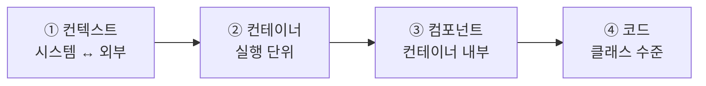
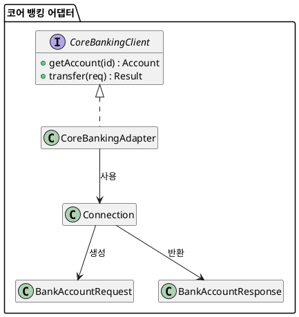

<!-- truncate -->

머릿속엔 설계가 다 있는데, 막상 그림으로 옮기려 하면 "어디까지 그려야 하지? 이 정도면 되나?" 싶어 선뜻 손이 안 나갑니다. 개발은 곧잘 하는데 그걸 그림으로 표현하는 걸 어려워하는 경우가 많습니다. 업계에서 검증된 **C4 모델**로 설계를 시각화하는 방법을 정리합니다.

<mark>C4의 핵심은 하나입니다 — 구글 지도를 확대하듯, 아키텍처를 **네 단계의 추상화 수준**으로 나눠 그린다. 큰 그림에서 시작해 점점 세부로 내려간다.</mark>

## 왜 C4인가 — 탄생 배경

C4 모델은 영국의 아키텍처 컨설턴트 **사이먼 브라운(Simon Brown)** 이 2000년대 중반 아키텍처 워크숍을 진행하며 만들었습니다. 그는 참가자들에게 **같은 요구사항**을 주고 설계시킨 뒤, 결과를 다이어그램으로 그려 보라고 했습니다. 그런데 나온 그림들을 **아무도 이해하지 못했습니다.** 표기법이 제각각이고, 박스 하나하나의 의미가 애매하고, 화살표에 설명이 없고, **한 그림에 서로 다른 추상화 레벨이 뒤섞여** 있었습니다.

여기서 깨달음이 나옵니다. **"설계를 못하는 게 아니라, 설계한 것을 시각화하지 못하는 게 문제였다."** 마침 시대적 배경도 있었습니다. UML(클래스·유스케이스·시퀀스 다이어그램 등 표준 표기법)은 표현력은 강하지만 규칙이 무거웠고, **애자일** 확산과 함께 팀들이 UML을 버리고 박스와 선으로 단순하게 그리기 시작했습니다. 그 과정에서 개발자들이 "설계를 시각적으로 소통하는 능력"을 잃어버린 것이죠.

C4는 완전히 새로운 게 아니라, **UML과 4+1 뷰**에서 필요한 것만 뽑아 가볍게 만든 시각화 방법입니다. 아키텍처 문서화 프레임워크 **arc42**에도 인용되고 기술 레이더 보고서에도 소개될 만큼 검증됐습니다(공식 자료는 [c4model.com](https://c4model.com)).

<mark>C4는 "표기법"이 아닙니다 — 색·도형에 정해진 규칙이 없어, Visio·draw.io 등 어떤 툴로 그려도 개념만 따르면 C4입니다.</mark>

## 4가지 구성 요소 — 포함 관계

C4는 시스템의 **정적 구조**를 네 요소로 봅니다. 상위가 하위를 포함합니다.

- **소프트웨어 시스템(Software System)** — 가장 높은 추상화. 사용자에게 가치를 주는 무언가(제품·서비스). 우리가 만드는 시스템 + **의존하는 외부 시스템**까지.
- **컨테이너(Container)** — 시스템이 동작하려면 **실행되거나 저장돼야 하는 단위**(웹 앱·API 서버·DB 등). 독립적으로 실행·배포되는 런타임 경계. **주의: 도커와 무관** — C4는 도커 이전부터 이 용어를 썼습니다.
- **컴포넌트(Component)** — 잘 정의된 인터페이스 뒤에 캡슐화된 관련 기능의 묶음. **개별 배포 단위가 아니라**, 컨테이너 안에서 다른 컴포넌트들과 **하나의 프로세스**로 동작합니다.
- **코드(Code)** — 클래스·인터페이스·함수 등 언어의 기본 구성 요소로 실제 구현된 것.

## 지도 확대 — 4개의 다이어그램

이 네 요소로 **레벨을 확대해 가며** 네 종류의 다이어그램을 그립니다. 구글 지도가 전체 → 도시 → 동네 → 건물로 확대되듯이.



| 레벨 | 다이어그램 | 무엇을 보여주나 | 대상 독자 |
|---|---|---|---|
| 1 | 시스템 컨텍스트 | 우리 시스템 ↔ 외부 사용자·시스템의 관계 | 개발자 + 비개발자·경영진 모두 |
| 2 | 컨테이너 | 시스템 내부의 큰 실행 단위와 기술·통신 | 개발팀 + 운영팀 |
| 3 | 컴포넌트 | 컨테이너 하나를 열었을 때의 내부 구조 | 해당 컨테이너 담당 개발자 |
| 4 | 코드 | 클래스 다이어그램 수준 | 개발자(자동 생성 권장) |

<mark>"어떤 레벨로 그릴까"는 곧 "누구에게 보여줄까"의 문제입니다 — 경영진에겐 컨텍스트면 충분하고, 코드를 짜는 개발자는 컴포넌트까지 내려가야 쓸모가 있습니다.</mark>

아래는 가상의 **인터넷 뱅킹 시스템** 예시로 각 레벨을 봅니다.

### 레벨 1 — 시스템 컨텍스트

가장 추상화된 그림. 우리 시스템을 가운데 두고, 상호작용하는 **사용자·외부 시스템**만 그립니다. 기술 세부는 모두 생략해 비개발자도 이해할 수 있습니다. **시스템을 그리는 가장 좋은 출발점**입니다.

<details>
<summary>C4-PlantUML 코드</summary>

```plantuml
@startuml
!include https://raw.githubusercontent.com/plantuml-stdlib/C4-PlantUML/master/C4_Context.puml
LAYOUT_LEFT_RIGHT()

Person(customer, "고객", "은행 계좌를 가진 고객")
System(ib, "인터넷 뱅킹 시스템", "계좌 조회·결제를 제공")
System_Ext(core, "코어 뱅킹 시스템", "계좌·거래 처리")
System_Ext(email, "이메일 서비스", "알림 발송")

Rel(customer, ib, "계좌 조회·결제")
Rel(ib, core, "계좌 정보 조회·결제")
Rel(ib, email, "메일 발송")
@enduml
```

</details>


박스마다 **제목 + 설명**을, 화살표마다 **관계를 설명하는 라벨**을 붙이는 게 핵심입니다. **모든 개발팀에 권장**됩니다.

### 레벨 2 — 컨테이너

시스템 경계 안으로 한 겹 들어가, 어떤 **실행 단위**가 있고 책임이 어떻게 나뉘는지, 그리고 **기술 선택과 통신 프로토콜**을 표현합니다.

<details>
<summary>C4-PlantUML 코드</summary>

```plantuml
@startuml
!include https://raw.githubusercontent.com/plantuml-stdlib/C4-PlantUML/master/C4_Container.puml
LAYOUT_LEFT_RIGHT()

Person(customer, "고객")
System_Boundary(ib, "인터넷 뱅킹 시스템") {
  Container(spa, "UI 앱", "JavaScript·Angular", "SPA")
  Container(api, "백엔드 앱", "Java·Spring Boot", "REST API")
  ContainerDb(db, "데이터베이스", "MySQL", "사용자·로그")
}
Rel(customer, spa, "사용", "HTTPS")
Rel(spa, api, "호출", "JSON/HTTPS")
Rel(api, db, "읽기·쓰기", "MySQL")
@enduml
```

</details>


컨텍스트와 달리 **API·HTTPS·MySQL 프로토콜** 같은 기술 통신이 드러납니다. 다만 **클러스터링·로드밸런싱·장애조치 같은 배포 관점은 여기 넣지 않습니다**(환경마다 다르므로 뒤의 디플로이먼트 다이어그램으로). 역시 **모든 개발팀에 권장**됩니다.

### 레벨 3 — 컴포넌트

컨테이너 하나(여기선 **백엔드 앱**)를 열어 내부 컴포넌트를 봅니다.

<details>
<summary>C4-PlantUML 코드</summary>

```plantuml
@startuml
!include https://raw.githubusercontent.com/plantuml-stdlib/C4-PlantUML/master/C4_Component.puml
LAYOUT_LEFT_RIGHT()

Person(customer, "고객")
Container_Boundary(be, "백엔드 앱") {
  Component(login, "로그인 API")
  Component(summary, "계좌요약 API")
  Component(stmt, "명세서 API")
  Component(sec, "시큐리티 컴포넌트", "", "로그인·토큰 검증")
  Component(stmtc, "명세서 컴포넌트", "", "명세서 생성")
}
ContainerDb(db, "데이터베이스", "MySQL")
System_Ext(s3, "명세서 저장소", "AWS S3")

Rel(customer, login, "요청")
Rel(login, sec, "검증 위임")
Rel(summary, sec, "검증 위임")
Rel(stmt, stmtc, "위임")
Rel(sec, db, "읽기·쓰기")
Rel(stmtc, s3, "파일 읽기·쓰기")
@enduml
```

</details>


핵심은 이 컴포넌트들이 **독립 배포 단위가 아니라** 백엔드라는 **한 컨테이너·한 프로세스** 안의 논리적 역할이라는 점입니다. 컴포넌트 레벨은 **필수는 아니며**, 가치가 있을 때만 그립니다. 자주 바뀌므로 **장기 문서화는 자동화 도구**로 생성하는 편이 낫습니다.

### 레벨 4 — 코드

컴포넌트를 코드로 어떻게 구현했는지 — 과거 UML의 **클래스/ER 다이어그램** 수준입니다(그래서 C4-PlantUML이 아니라 일반 PlantUML 클래스 다이어그램으로 그립니다). 예로 앞의 **코어 뱅킹 어댑터** 컴포넌트를 열어 보면:

<details>
<summary>PlantUML 클래스 다이어그램 코드</summary>



</details>


인터페이스·클래스·꼭 필요한 메서드·호출 관계 **정도까지만** 표현하고, 너무 세밀한 건 생략합니다. 변경이 잦으니 **IDE 등으로 자동 생성**하길 권합니다(필수 아님).

## 보완 다이어그램 셋

기본 4개 외에 상황에 따라 쓰는 보조 다이어그램이 있습니다.

- **시스템 랜드스케이프** — 앞 4개는 단일 시스템 표현입니다. 랜드스케이프는 **여러 시스템을 한꺼번에** 그려(ATM·인터넷 뱅킹·코어 뱅킹 등) 조직 전체를 조망합니다. 경계가 회사·조직 단위입니다.
- **다이나믹 다이어그램** — 정적 구조가 아니라 **런타임 상호작용의 흐름**을 표현합니다(UML 시퀀스와 유사). 예: 로그인 요청이 UI → 로그인 API → 시큐리티 → DB로 흐르는 순서. 원칙적으로 금지인 **레벨 혼재를 유일하게 허용**하는 예외입니다(흐름을 보여주는 목적이라 컨테이너·컴포넌트가 함께 등장).
- **디플로이먼트 다이어그램** — **배포 환경**(데이터센터·로드밸런서·DNS·JVM·브라우저 등)을 표현합니다. **환경마다 하나씩**(개발·프로덕션…) 그립니다. 앞서 컨테이너 다이어그램에서 뺐던 클러스터링·장애조치가 여기로 옵니다. **권장**됩니다.

## 어디까지 그릴까

- **컨텍스트 + 컨테이너**: 손으로 그려 유지할 가치가 큼 → **권장**.
- **컴포넌트 + 코드**: 자주 바뀌니 **자동화 도구**로(장기 문서화 시) → 필요할 때만.
- **디플로이먼트**: 환경별 1개씩 → **권장**.

절대적 공식은 아니고, **"누구와 어떤 다이어그램으로 소통할지"** 에 맞춰 고르면 됩니다.

## 다이어그램을 코드로 — C4-PlantUML

앞서 각 레벨 그림 위에 실은 코드가 보여 주듯, C4는 아예 **다이어그램을 코드로 작성**하기 좋은 모델입니다(위 그림들은 모두 그 코드를 렌더한 것). 코드로 두면 **Git으로 버전 관리**하고, PR에서 리뷰하고, 요소가 바뀔 때 손으로 다시 그리지 않아도 됩니다. 위 예시는 **C4-PlantUML**(PlantUML에 C4 매크로를 얹은 것)로, 레벨에 따라 `C4_Context.puml`·`C4_Container.puml`·`C4_Component.puml`을 include하고 `Person`·`System`·`Container`·`Component`·`Rel` 매크로만 바꿔 쓰면 됩니다.

도구는 취향껏 고르면 됩니다.

- **C4-PlantUML** — PlantUML에 C4 매크로를 얹은 것. 배치가 정교하고 IDE·CI 생태계가 넓습니다.
- **Mermaid** — `C4Context` 등 C4 타입을 지원해 코드 블록으로 바로 렌더되지만, C4는 실험적이라 자동 배치가 다소 거칠 수 있습니다.
- **Structurizr** — C4를 만든 사이먼 브라운의 공식 도구. **하나의 DSL 모델**에서 컨텍스트·컨테이너·컴포넌트 뷰를 **자동으로 여러 장** 뽑아 줍니다(모델 한 번, 뷰 여러 개).

<mark>다이어그램을 코드로 두면 설계 그림이 문서가 아니라 **버전 관리되는 산출물**이 됩니다 — 바뀔 때마다 새로 그리는 부담이 사라집니다.</mark>

## 다이어그램 체크리스트 & 자주 하는 실수

공식 사이트가 제안하는 점검 항목 — 점수용이 아니라 빠뜨리기 쉬운 걸 짚는 용도입니다.

- 다이어그램에 **제목**이 있나? 어떤 **유형**인지 명확한가? **범례(legend)** 가 있나?
- **모든 요소에 이름**이 있나? **색·도형·아이콘·선(실선/점선/화살표)에 의미**가 있나?
- **모든 화살표에 관계를 설명하는 라벨**이 붙어 있나?

특히 자주 하는 실수 세 가지:

1. **한 다이어그램에 여러 추상화 레벨을 섞는다.**
2. **화살표에 설명(라벨)이 없다.**
3. **시스템 경계가 불명확하다.**

## 정리

- C4는 아키텍처를 **컨텍스트 → 컨테이너 → 컴포넌트 → 코드**의 4단계로, 지도를 확대하듯 그린다.
- 요소는 **시스템 · 컨테이너(≠도커) · 컴포넌트(≠배포 단위) · 코드**.
- **레벨 선택 = 독자 선택**. 컨텍스트·컨테이너는 권장, 컴포넌트·코드는 자동화, 배포는 디플로이먼트로.
- **한 그림에 레벨을 섞지 말고, 화살표에 라벨을 달고, 경계를 명확히** 한다.

문제는 대개 설계가 아니라 **설계를 그림으로 옮기는 것**이었습니다. <mark>좋은 아키텍트는 설계만 잘하는 사람이 아니라, 그 설계를 상대가 이해할 그림으로 옮길 줄 아는 사람입니다.</mark>
