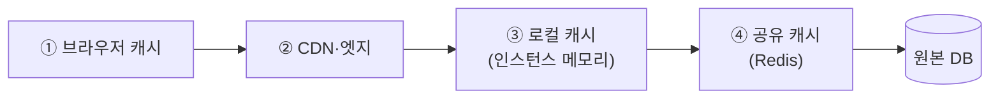

<!-- truncate -->

웹 성능을 높인다고 하면 대부분 **Redis 캐시**를 떠올립니다. 맞는 말이지만 그게 전부는 아닙니다. 사용자의 브라우저에서 어플리케이션 서버까지, 요청이 지나는 경로에는 **여러 캐시 계층**이 있습니다. 각 계층에 어떤 캐시가 있고 언제·어떻게 쓰는지 정리합니다.

<mark>핵심 원칙 하나 — 요청은 **가능한 한 사용자와 가까운 계층에서 끝내라.** 사용자 체감이 빠르고, 뒷단 서버 자원을 안 쓰니 효율적입니다.</mark>

## 계층 한눈에 보기

사용자 → 서버 방향으로, 캐시는 이렇게 쌓여 있습니다.

요청은 왼쪽(사용자 단)에서 miss가 나면 오른쪽으로 한 칸씩 내려가고, 원본(DB)에서 읽은 값은 역순으로 각 계층에 채워집니다. 관례상 프론트엔드는 브라우저·CDN을, 백엔드는 로컬·공유 캐시를 주로 다루지만, **전 계층을 아는 개발자**가 좋은 캐싱 전략을 설계합니다.

## 어느 데이터를 어느 계층에 — 판단 기준 4가지

계층을 고르는 기준은 네 가지입니다.

1. **변경 빈도** — 정적 리소스(거의 안 변함)냐, 장바구니(자주 변함)냐.
2. **공유 범위** — 국가 코드(모든 사용자 공유)냐, 세션(개인 전용)이냐.
3. **용량·네트워크 비용** — 이미지·영상은 크고, 동적 데이터는 작다.
4. **최신성 요구** — 주식 시세(실시간)냐, 공지사항(수 분 지연 허용)이냐.

<mark>같은 웹 서비스 안에서도 데이터마다 적합한 계층이 다릅니다 — "무엇을 어느 계층에 둘지"가 캐싱 설계의 본질입니다.</mark>

## ① 브라우저 캐시 (HTTP 캐시)

정적 리소스(HTML·CSS·JS·이미지·폰트)를 브라우저의 메모리나 디스크에 저장합니다. 한 번 캐시되면 **서버 요청 자체가 안 나가** 네트워크 비용이 0이 됩니다. 저장 위치(메모리/디스크)는 브라우저가 알아서 정합니다.

동작은 **성능**과 **최신성** 두 기준으로 제어됩니다. 서버가 첫 응답에 캐시 제어 헤더를 실어 주면, 브라우저는 유효 기간 동안 로컬 사본을 재사용하고, 만료되면 **재검증(revalidation)** 요청을 보냅니다. 변경이 없으면 서버는 본문 없이 **`304 Not Modified`**(가벼움), 바뀌었으면 **`200 OK`** + 새 리소스를 돌려줍니다.

**유효 기간 헤더**

- **`Cache-Control: max-age=N`** — 받은 시점 기준 상대 시간(초). HTTP/1.1 표준.
- **`Expires`** — 절대 시각. HTTP/1.0 잔재로, 둘 다 있으면 `Cache-Control`이 우선.

**재검증 헤더 (조건부 GET)**

- **`ETag`** ↔ 요청 시 **`If-None-Match`** — 태그가 같으면 304.
- **`Last-Modified`** ↔ 요청 시 **`If-Modified-Since`** — 수정 시각 비교. 둘 다 있으면 `ETag`가 우선.

**`Cache-Control` 지시자 — 헷갈리는 것 정리**

- `public` — 브라우저뿐 아니라 중간 프록시·CDN에도 저장 허용.
- `private` — 프록시엔 저장 금지, **최종 사용자 브라우저에만**(개인화 응답).
- `no-store` — 아예 저장하지 말 것.
- `no-cache` — (이름과 달리) 저장은 하되 **매번 재검증**하라.
- `must-revalidate` — 만료되면 반드시 재검증(오래된 응답을 임의로 주지 못하게).
- `immutable` — 만료 전엔 안 변하니 재검증 자체를 하지 말 것.

**핑거프린팅(파일 지문)** — 실무 표준 갱신 방식입니다. 파일명에 **해시**를 박아(`main.[hash].js`) 리소스가 바뀌면 **파일명 자체가 바뀌게** 합니다. 그러면 URL이 달라져 서버 입장에선 완전히 새 리소스라, 재검증 없이 항상 최신을 받습니다. 그래서 **정적 파일은 `max-age`를 아주 길게** 두고 배포 시 파일명으로 갱신하며, **`index.html`은 파일명이 고정**이라 `no-cache`로 항상 재검증합니다.

> 실제 사례: 어떤 서비스는 JS 파일에 `max-age` 1년, 기타 리소스 30일, `index`엔 `no-cache`+`no-store`+`must-revalidate`를 걸어 둡니다.

## ② CDN·엣지 캐시

전 세계 **엣지 서버**(사용자와 가까운 곳)에 리소스를 캐싱합니다(예: CloudFront). 이미지·대용량 영상·게임 패치 파일 등에 쓰며, **원본(오리진) 서버 부하를 줄이고** 지리적으로 가까운 곳에서 응답해 빠릅니다. 제어는 역시 `Cache-Control`이고, 갱신은 **무효화(invalidation)/퍼지(purge)** 로 합니다 — **퍼지 없이 배포만 하면 갱신되지 않습니다.** 동적 콘텐츠를 캐싱하면 개인정보가 섞일 위험이 있으니 주의합니다.

## ③ 로컬(인프로세스) 캐시

**서버 인스턴스 메모리**에 두는 캐시입니다(Java의 Caffeine·Guava 등). **변경이 드물고 조회가 잦은** 데이터 — 국가 코드·공통 코드·설정값 — 에 적합합니다. 네트워크 통신이 없어 **가장 빠릅니다.** 대신 각 인스턴스에 사본이 따로 생겨, 서버가 여러 대면 **동기화 문제**가 생깁니다.

## ④ 공유(글로벌) 캐시 — Redis

중앙에 하나 두고 **모든 서버가 같은 캐시를 공유**합니다. 세션·장바구니처럼 **여러 서버가 같은 데이터를 봐야 할 때** 씁니다. 로컬 캐시의 동기화 문제가 없는 대신, 각 서버가 Redis와 통신해야 해 **네트워크 왕복이 있어 로컬보다는 느립니다.** **TTL과 eviction 정책**으로 오래된 캐시를 비워야 메모리가 가득 차지 않습니다(Redis가 빠른 이유는 [Redis는 왜 싱글스레드인데 빠른가](./redis-single-thread-fast) 참고).

## 로컬 vs 공유 — 트레이드오프

| 기준 | 로컬(인프로세스) | 공유(Redis) |
|---|---|---|
| 위치 | 인스턴스 메모리 | 중앙 별도 서버 |
| 속도 | 가장 빠름(네트워크 0) | 왕복 있음(상대적으로 느림) |
| 사본 | 인스턴스마다 중복 | 단일 사본 공유 |
| 일관성 | 다중 서버 시 동기화 문제 | 모든 서버 동일 데이터 |
| 적합 데이터 | 공유 불필요·거의 안 변함(공통 코드) | 여러 서버가 공유(세션 등) |

실무에서는 **로컬 캐시를 Redis 앞단에 두어**(near-cache) Redis로 가는 요청 자체를 줄이는 조합도 씁니다.

## 왜 계층으로 나누나 — 물리적 근거

계층화가 이득인 건 저장소마다 **속도·용량·비용의 트레이드오프**가 있기 때문입니다. 랜덤 접근 지연을 보면 RAM ≈ 100ns, NVMe SSD ≈ 20μs(RAM의 약 200배), SATA SSD ≈ 100μs(약 1,000배), HDD ≈ 5ms(수만 배)입니다. **자주 참조되는 데이터일수록 위쪽(빠른) 계층에** 둬야 하고, "최신 SSD를 썼으니 캐시가 필요 없다"는 오해입니다 — NVMe도 RAM보다 수백 배 느립니다.

## 실무 선택 가이드

- **이미지·CSS·JS·폰트**(안 변하고 큼) → 브라우저 캐시. 영상·패치 파일 → CDN.
- **공지사항**(공유·수 분 지연 허용) → 공유 캐시(Redis).
- **권한·메뉴**(잘 안 변함) → 로컬 캐시(또는 로컬+공유 병행).
- **국가 코드·공통 코드**(거의 안 변하고 동기화 이슈 적음) → 로컬 캐시가 효율적.

자주 하는 실수도 있습니다. 정적 리소스를 매번 서버에서 내려받거나, 모든 조회를 공유 캐시로만 처리하거나(변경 없는 공통 코드는 로컬이 낫다), TTL 없이 캐시를 계속 쌓는 경우입니다. 특히 인기 키의 캐시가 동시에 만료돼 원본 DB로 요청이 몰리는 **캐시 스탬피드**와 한 키에 트래픽이 집중되는 **핫키** 대응은 [커머스 캐시 트래픽 대응](./commerce-cache-traffic-strategy)에서 자세히 다뤘습니다.

## 정리

- **캐시는 Redis만이 아니다** — 브라우저 · CDN · 로컬 · Redis로 **계층화**해 쓴다.
- **사용자와 가까운 계층에서 요청을 끝내라** — 빠르고 비용 효율적.
- **데이터 특성(변경 빈도·공유 범위·용량·최신성)에 맞는 계층**을 고른다.
- 브라우저 캐시는 `Cache-Control`·`ETag`·핑거프린팅으로, 공유 캐시는 TTL·eviction으로 관리한다.

<mark>"Redis만 잘 쓰는 개발자"가 아니라, 어떤 데이터를 어느 계층에 둬서 전체 속도를 올릴지 아는 개발자가 되는 것 — 그게 계층 캐싱의 핵심입니다.</mark>

### 용어 한 줄 정리

| 용어 | 쉬운 뜻 |
|---|---|
| 재검증(revalidation) | 캐시가 아직 유효한지 서버에 확인(304/200) |
| ETag | 리소스 버전 태그 — 같으면 304로 본문 생략 |
| 핑거프린팅 | 파일명에 해시를 박아 변경 시 URL이 바뀌게 함 |
| 퍼지/무효화 | CDN 캐시를 강제로 비워 갱신 |
| near-cache | 공유 캐시 앞에 둔 로컬 캐시(왕복 절감) |
