import {AnimatedLineChart} from '@site/src/components/blog/MonitorCharts';

<!-- truncate -->

브로커, 파티션 리더/팔로워, 복제 계수, ISR, `min.insync.replicas`, 오프셋(로그·커밋·현재 위치), rack 배치, 리더 선출, 컨슈머 그룹 리밸런싱, 그룹 코디네이터, 하트비트와 `session.timeout.ms`… 카프카를 오래 써도 이 개념들이 따로 놀아서 장애 대응이나 설정을 만질 때마다 다시 헷갈리곤 합니다. 이 글은 따로 알던 개념들을 **쓰기가 성공하기까지 → 브로커가 죽으면 → 컨슈머가 나눠 읽기까지** 하나의 흐름으로 이어서 정리합니다.

<mark>카프카의 운영 개념은 "쓰기 내구성(복제·ISR·acks) → 장애 극복(리더 선출·rack) → 소비 분배(컨슈머 그룹·리밸런싱)"라는 세 가지 기준으로 나눠 보면 서로 어떻게 맞물리는지가 보입니다.</mark>

파티션 자체의 역할(병렬성·순서·분산의 단위)과 개수 산정은 [파티션 수·브로커 대수 정하기](./kafka-partition-count)에서 다뤘으니, 이 글은 **그 파티션들이 클러스터 위에서 복제되고 소비되는 동작**에 집중합니다.

## 먼저: 컨슈머 그룹이란?

**컨슈머 그룹(consumer group)** 은 하나의 토픽을 여러 컨슈머 인스턴스가 **나눠서** 병렬로 소비하려고 같은 `group.id`로 묶은 묶음입니다. 카프카는 그룹 안 컨슈머들에게 파티션을 겹치지 않게 배분해 **한 파티션은 그룹 안에서 한 컨슈머만** 읽게 합니다. <mark>그래서 컨슈머를 늘리면 처리량이 오르고(확장), 컨슈머 하나가 죽으면 그 파티션이 다른 컨슈머에게 넘어갑니다(장애 대응).</mark> 어디까지 읽었는지(오프셋)도 **그룹 단위**로 기록됩니다. 반대로 `group.id`가 다르면 같은 토픽을 각 그룹이 독립적으로 전부 받아 갑니다. 이 "나눠 읽기"를 **누가 어떻게 조율하고, 멤버가 바뀔 때 어떻게 다시 나누는지**가 이 글 후반의 [그룹 코디네이터](#coordinator)·[리밸런싱](#rebalancing)입니다.

## 클러스터의 뼈대 — 브로커와 컨트롤러

**브로커(broker)** 는 카프카 서버 한 대입니다. 여러 브로커가 모여 **클러스터**를 이루고, 토픽의 파티션과 그 복제본이 브로커들에 나뉘어 올라갑니다. 클라이언트(프로듀서·컨슈머)는 어느 브로커에 붙어도 되고, 브로커가 "어느 파티션의 리더가 어디 있는지"를 알려 줍니다.

이 "누가 무엇의 리더인가, 어느 브로커가 살아 있나" 같은 **메타데이터를 관리하고 파티션 리더를 선출하는 역할**이 **컨트롤러(controller)** 입니다.

<mark>예전에는 이 메타데이터를 별도 ZooKeeper 앙상블(Ensemble)이 맡았지만, Kafka 4.0(2025-03)부터는 ZooKeeper가 제거되고 **KRaft**(카프카 자체 합의 프로토콜)만 남았습니다.</mark> 컨트롤러 역할을 하는 브로커들이 Raft 기반 쿼럼으로 메타데이터를 직접 복제·관리합니다. 운영 관점에서 달라지는 건 "관리할 클러스터가 하나로 줄었다"는 점 — 별도 ZooKeeper를 띄우고 튜닝할 필요가 없어졌습니다.

<details>
<summary>PlantUML 코드</summary>

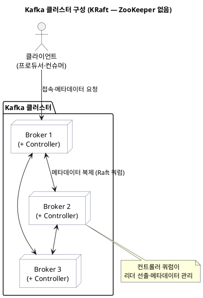

</details>


## 복제 — 리더와 팔로워, 그리고 복제 계수

한 파티션은 **리더(leader) 1개 + 팔로워(follower) 여러 개**로 복제됩니다. 이 복제본의 총 개수가 **복제 계수(replication factor, RF)** 입니다. RF=3이면 같은 파티션이 서로 다른 브로커 3대에 사본으로 존재합니다.

동작의 핵심은 **읽기·쓰기가 모두 리더로만 간다**는 것입니다.

- **프로듀서**는 리더에게만 씁니다.
- **컨슈머**도 기본적으로 리더에서만 읽습니다.
- **팔로워**는 리더의 로그를 **직접 fetch 해서 따라 씁니다** — 마치 팔로워가 리더를 구독하는 컨슈머처럼 동작합니다.

<details>
<summary>PlantUML 코드</summary>

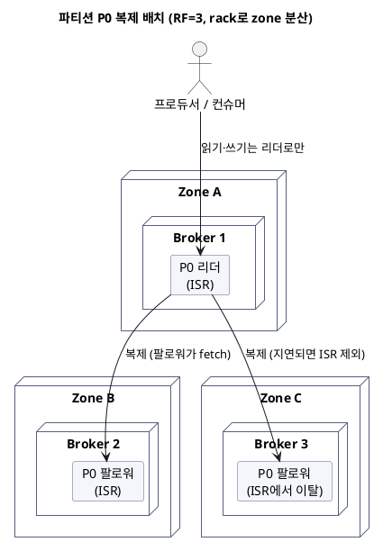

</details>


<mark>모든 읽기·쓰기는 리더가 처리하고, 팔로워는 리더를 따라 복제만 합니다 — 그래서 리더가 죽으면 팔로워 중 하나가 새 리더가 되어야 서비스가 이어집니다.</mark>

## ISR — 어디까지가 "믿을 수 있는 복제본"인가

복제본이 3개라고 다 최신 상태인 건 아닙니다. 네트워크나 부하로 특정 팔로워가 리더를 못 따라잡을 수 있습니다. 그래서 카프카는 **지금 리더를 충분히 따라잡은 복제본의 집합**을 따로 관리하는데, 이것이 **ISR(In-Sync Replicas)** 입니다.

- 리더는 항상 ISR에 포함됩니다.
- 팔로워는 `replica.lag.time.max.ms`(기본 30초) 안에 리더의 로그 끝까지 fetch 해 오면 ISR에 남고, 그보다 뒤처지면 **ISR에서 빠집니다.** 다시 따라잡으면 복귀합니다.

ISR이 중요한 이유는 **리더가 죽었을 때 ISR 안에서만 새 리더를 뽑기 때문**입니다. ISR 밖의(뒤처진) 복제본을 리더로 세우면 아직 복제 안 된 메시지가 사라지니까요.

아래 그림에서 **P0**는 "파티션 0", **LEO(Log End Offset)** 는 그 복제본이 마지막으로 기록한 위치(숫자가 클수록 최신)입니다. 리더와 같은 `LEO=100`까지 따라온 팔로워 A는 ISR에 남고, `LEO=72`로 뒤처진 팔로워 B는 ISR에서 빠집니다.

<mark>ISR은 "리더를 따라잡은 최신 복제본 집합"이고, 새 리더는 원칙적으로 이 집합 안에서만 선출됩니다.</mark>

<details>
<summary>PlantUML 코드</summary>

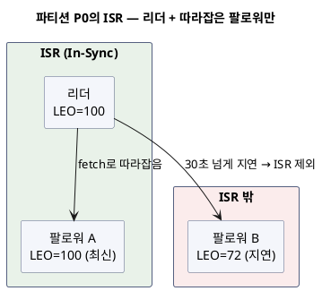

</details>


## acks와 min.insync.replicas — 쓰기를 언제 "성공"으로 볼까

내구성은 **프로듀서의 `acks`** 와 **토픽의 `min.insync.replicas`** 두 설정이 함께 결정합니다.

`acks`는 프로듀서가 "몇 곳에 저장됐을 때 성공으로 칠지" 정합니다.

| acks | 성공 조건 | 특징 |
|---|---|---|
| `0` | 보내고 확인 안 함 | 가장 빠르지만 유실 가능 |
| `1` | **리더**가 기록하면 성공 | 리더가 복제 전에 죽으면 유실 가능 |
| `all`(`-1`) | **ISR 전체**가 기록하면 성공 | 가장 안전, 대신 지연 |

`acks=all`일 때 "ISR 전체"가 몇 개인지가 관건입니다. 여기서 **`min.insync.replicas`** 가 **쓰기를 받아 주기 위한 최소 ISR 크기**를 정합니다. ISR이 이 값보다 작아지면 리더는 쓰기를 거부하고 프로듀서에 `NotEnoughReplicas` 오류를 돌려줍니다 — **유실될 바에는 쓰기를 막는** 쪽을 택하는 것입니다.

가장 널리 쓰는 내구성 조합은 이렇습니다.

```properties
# 토픽/브로커
replication.factor=3
min.insync.replicas=2

# 프로듀서
acks=all
```

<mark>`RF=3`, `min.insync.replicas=2`, `acks=all`이면, 브로커 한 대가 죽어도(ISR 2개 유지) 쓰기가 계속되고 내구성도 지켜지는 균형점이 됩니다.</mark> 만약 두 대가 죽어 ISR이 1개가 되면 쓰기는 막히지만(가용성↓), 유실은 막습니다(내구성↑). 이 트레이드오프의 방향을 정하는 게 다음 절의 리더 선출입니다. 메시지가 실제로 몇 번 전달되는지(at-least-once/exactly-once)는 [전달 보장](./kafka-delivery-semantics)과 [트랜잭션·멱등 프로듀서](./kafka-transactions-exactly-once)에서 이어집니다.

<details>
<summary>PlantUML 코드</summary>

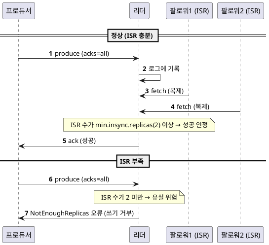

</details>


## 오프셋 3종 — 로그 오프셋·커밋 오프셋·현재 위치

"오프셋"이 헷갈리는 건 사실 **성격이 다른 세 가지**를 같은 이름으로 부르기 때문입니다.

- **로그 오프셋 (브로커가 관리)** — 파티션 로그에서 각 메시지의 일련번호. 여기에 두 지표가 붙습니다.
  - **LEO(Log End Offset)**: 다음에 쓸 위치. 복제본마다 따로 있습니다.
  - **HW(High Watermark, 하이워터마크)**: **ISR 전체가 복제를 마친 지점.** 컨슈머는 HW까지만 읽을 수 있습니다. HW 아래는 "커밋된(committed) 메시지" — 리더가 죽어도 살아남는 지점입니다.
- **컨슈머 커밋 오프셋 (컨슈머 그룹이 관리)** — 이 그룹이 "여기까지 처리 끝냈다"고 기록한 위치. 내부 토픽 **`__consumer_offsets`** 에 저장돼, 컨슈머가 재시작해도 이어서 읽습니다.
- **현재 위치(position)** — 컨슈머가 다음에 fetch 할 위치(메모리상). 처리는 했지만 아직 커밋 안 한 구간이 커밋 오프셋과 현재 위치 사이입니다.

<details>
<summary>PlantUML 코드</summary>

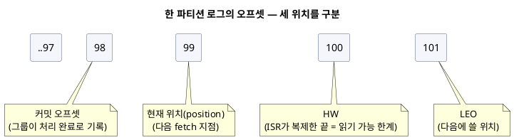

</details>


이 셋을 구분하면 흔한 사고가 설명됩니다. **처리와 커밋의 순서가 맞지 않으면**, 처리 전에 커밋해 버리면(현재 위치만 앞서고 커밋이 먼저) 장애 시 **유실**, 처리 후 커밋인데 그 사이 재시작하면 **중복** 재처리가 됩니다.

<mark>HW는 "브로커가 안전하다고 보는 지점", 커밋 오프셋은 "컨슈머가 처리 끝냈다고 기록한 지점" — 층이 다른 두 오프셋을 섞으면 유실·중복의 원인을 못 찾습니다.</mark>

## 리더 선출 — clean vs unclean

리더 브로커가 죽으면 컨트롤러가 **ISR 안의 팔로워 중 하나를 새 리더로 선출**합니다(clean election). ISR 안에서 뽑으니 커밋된(HW 이하) 메시지는 보존됩니다.

문제는 **ISR이 텅 비었을 때**입니다. 리더도 죽고 따라잡은 팔로워도 없다면 두 선택지뿐입니다.

- **`unclean.leader.election.enable=false`(기본)** — ISR이 빌 때까지 기다립니다. 해당 파티션은 **읽기·쓰기 불가(offline)** 가 되지만, 유실은 없습니다. → **내구성 우선.**
- **`unclean.leader.election.enable=true`** — 뒤처진(ISR 밖) 복제본이라도 리더로 세웁니다. 서비스는 이어지지만, 그 복제본에 없던 메시지는 **유실**됩니다. → **가용성 우선.**

<mark>unclean 리더 선출은 "잠깐 멈추고 유실 없음" vs "계속 돌지만 일부 유실" 사이의 스위치입니다 — 대부분은 기본값(false, 내구성 우선)이 맞습니다.</mark>

<details>
<summary>PlantUML 코드</summary>

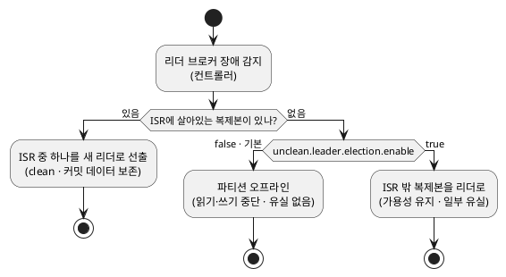

</details>


## rack 배치 — region/zone 장애를 견디기

복제본을 3개 둬도 **셋 다 같은 가용영역(AZ)에 있으면** 그 영역이 통째로 내려갈 때 파티션 전체를 잃습니다. 그래서 브로커마다 **`broker.rack`** 에 자신의 zone/region을 지정하면, 카프카가 **복제본을 서로 다른 rack에 나눠 배치**합니다(아래 그림처럼 Zone A/B/C로 분산). 한 zone이 죽어도 다른 zone에 복제본이 남아 리더 선출이 가능합니다.

<details>
<summary>PlantUML 코드</summary>

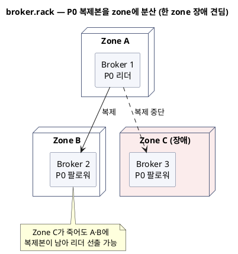

</details>


한 가지 더, 멀티 AZ에서는 **크로스 AZ 트래픽 비용**이 문제입니다. 컨슈머가 항상 리더(다른 zone일 수 있음)에서 읽으면 비용이 커집니다. 이때 **`client.rack`** 을 지정하고 브로커에 rack-aware replica selector를 켜면, 컨슈머가 **같은 zone의 팔로워에서 읽어**(follower fetching) 크로스 AZ 트래픽을 줄일 수 있습니다.

<mark>`broker.rack`은 복제본을 zone에 분산해 영역 장애를 견디게 하고, `client.rack`(팔로워 읽기)은 크로스 AZ 트래픽 비용을 줄입니다.</mark>

<details>
<summary>PlantUML 코드</summary>

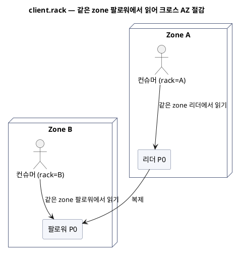

</details>


## 컨슈머 그룹과 그룹 코디네이터 {#coordinator}

이제 소비 쪽입니다. **컨슈머 그룹**은 한 토픽을 나눠 읽는 컨슈머들의 묶음이고, **한 파티션은 그룹 안에서 한 컨슈머만** 맡습니다(그래서 병렬성 상한이 파티션 수).

이 "누가 어느 파티션을 맡을지"를 조율하는 브로커가 **그룹 코디네이터(group coordinator)** 입니다. 그룹마다 코디네이터가 한 명 정해지고(`group.id`를 해시해 `__consumer_offsets`의 특정 파티션 → 그 리더 브로커), 멤버들의 조인·이탈·오프셋 커밋을 관리합니다.

주의할 점은 **"그룹 리더"와 "그룹 코디네이터"가 다르다**는 것입니다. 코디네이터는 브로커이고, **그룹 리더는 멤버(컨슈머) 중 하나** — 코디네이터가 지정한 이 컨슈머가 실제 파티션 할당을 계산합니다.

<mark>그룹 코디네이터(브로커)는 조율만 하고, 파티션 할당 계산은 코디네이터가 지정한 그룹 리더(컨슈머)가 합니다 — 둘은 다른 주체입니다.</mark>

<details>
<summary>PlantUML 코드</summary>

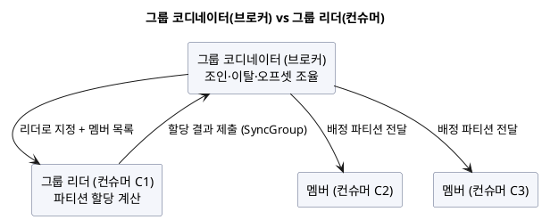

</details>


## 멤버십 유지 — 하트비트, `session.timeout`, `max.poll.interval`

코디네이터가 "이 멤버가 살아 있나"를 판단하는 신호는 **두 가지**이고, 이 둘이 헷갈림의 단골입니다.

- **하트비트 — 별도 스레드가 보냄.** `heartbeat.interval.ms`(기본 3초)마다 보내고, `session.timeout.ms`(기본 45초, Kafka 3.0에서 10초→45초로 상향) 안에 하트비트가 없으면 코디네이터가 그 멤버를 **죽은 것으로 보고 리밸런스**를 일으킵니다. → **연결·프로세스 생존** 신호.
- **poll 주기 — 처리 스레드가 보냄.** `max.poll.interval.ms`(기본 5분) 안에 `poll()`을 다시 호출하지 않으면, 하트비트가 살아 있어도 **처리가 멈춘 것으로 보고** 그 멤버를 그룹에서 빼냅니다. → **실제 처리 진행** 신호.

<details>
<summary>PlantUML 코드</summary>

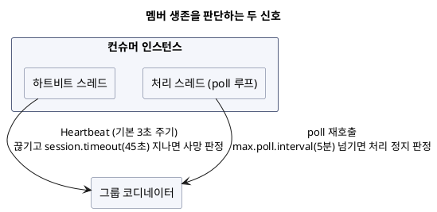

</details>


둘을 나눈 이유가 있습니다. 하트비트만 있으면, 메시지 하나 처리가 오래 걸려(`poll` 사이가 길어져) 실제로는 일을 못 하는데도 "살아 있다"고 오인할 수 있습니다. 그래서 **생존(하트비트)** 과 **진행(poll)** 을 분리해 각각 감시합니다.

실무에서 자주 만나는 사고가 **"처리 로직이 무거워 `max.poll.interval.ms`를 넘겨 리밸런스가 반복되는"** 경우입니다. 한 번에 가져오는 레코드 수(`max.poll.records`)를 줄이거나, 무거운 작업을 별도 스레드로 빼서 poll 주기를 지켜야 합니다.

## 리밸런싱 — eager vs cooperative-sticky {#rebalancing}

멤버가 추가·이탈하거나 파티션이 늘면, 파티션을 다시 나눠 맡는 **리밸런싱(rebalancing)** 이 일어납니다. 아래는 조인·하트비트·이탈의 전체 흐름입니다.

<details>
<summary>PlantUML 코드</summary>

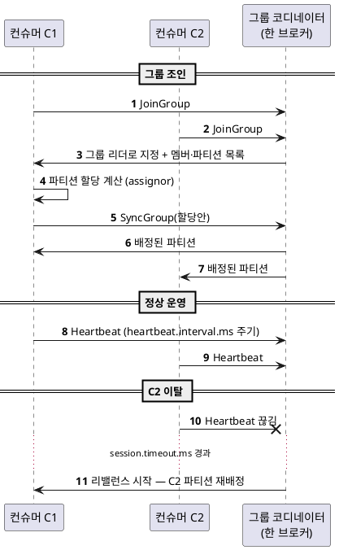

</details>


리밸런싱을 **어떻게** 하느냐가 안정성을 크게 좌우합니다.

- **eager(기본, RangeAssignor 등)** — 리밸런스가 시작되면 **모든 컨슈머가 자기 파티션을 전부 반납**하고, 다시 배정받을 때까지 **전원이 멈춥니다(stop-the-world).** 멤버 하나가 잠깐 재시작해도 그룹 전체가 처리를 멈추는 게 문제입니다.
- **cooperative-sticky(CooperativeStickyAssignor)** — **옮겨야 할 파티션만** 반납하고, 나머지는 계속 처리합니다(incremental). 리밸런스를 두 번에 나눠 하지만 전체 정지가 없어 훨씬 부드럽습니다. 협력적 리밸런싱을 쓰려면 `partition.assignment.strategy`를 이 assignor로 바꿉니다.

<AnimatedLineChart
  title="리밸런스 중 그룹 처리량 — eager(전체 정지) vs cooperative(부분만 정지)"
  data={[80, 80, 5, 5, 80, 80, 80, 80]}
  data2={[80, 80, 62, 60, 78, 80, 80, 80]}
  yMax={90}
  tone="bad"
  tone2="good"
  xLabel="리밸런스 진행 →"
  unit="상대 처리량"
  legend={["eager(stop-the-world)", "cooperative-sticky"]}
/>

<mark>eager는 리밸런스마다 그룹 전체가 멈추고, cooperative-sticky는 이동하는 파티션만 잠깐 멈춰 나머지는 계속 처리합니다.</mark>

## 잦은 리밸런스 줄이기 — 정적 멤버십

롤링 배포나 파드 재시작처럼 **잠깐 나갔다 돌아오는** 경우에도 기본 동작은 매번 리밸런스를 유발합니다. **정적 멤버십(static membership)** 은 컨슈머에 **`group.instance.id`** 로 고정 신원을 부여해, 같은 ID의 멤버가 `session.timeout.ms` 안에 돌아오면 **리밸런스 없이** 이전 파티션을 그대로 이어받게 합니다.

```properties
group.instance.id=consumer-order-1   # 인스턴스마다 고정·고유
session.timeout.ms=45000
```

<mark>정적 멤버십은 "잠깐 재시작"을 그룹 변경으로 보지 않게 해, 배포·재기동 때 불필요한 리밸런스를 없앱니다.</mark>

한 걸음 더 나아가, Kafka 4.0에서 GA된 **새 컨슈머 그룹 프로토콜(KIP-848)** 은 파티션 할당 계산을 **클라이언트가 아니라 브로커(코디네이터)로 옮겨** stop-the-world 리밸런스 자체를 없앱니다. 서버에는 기본 활성화돼 있고, 컨슈머가 `group.protocol=consumer`로 opt-in 하면 큰 그룹에서 리밸런스가 훨씬 안정적입니다. 큰 컨슈머 그룹을 운영한다면 눈여겨볼 방향입니다.

## 정리 — 기준별로 다시 보기

| 기준 | 핵심 개념 | 무엇을 정하나 |
|---|---|---|
| 쓰기 내구성 | 리더/팔로워, RF, **ISR**, `acks`, `min.insync.replicas` | 쓰기를 언제 성공으로 볼지, 몇 곳에 남길지 |
| 위치 관리 | **HW/LEO**(로그) · 커밋 오프셋(`__consumer_offsets`) · 현재 위치 | 어디까지 안전하고, 어디까지 처리했는지 |
| 장애 극복 | 컨트롤러 **리더 선출**(clean/unclean) · **rack** 배치 | 리더가 죽거나 zone이 내려갈 때 어떻게 이어갈지 |
| 소비 분배 | 컨슈머 그룹, **그룹 코디네이터**, 하트비트/`session.timeout`/`max.poll.interval`, **리밸런싱**(eager/cooperative), 정적 멤버십 | 파티션을 누가 맡고, 멤버 변화에 어떻게 대응할지 |

한 줄로 요약하면, **리더가 ISR로 내구성을 지키고(`acks`, `min.insync.replicas`), 컨트롤러가 rack에 분산된 복제본으로 장애를 넘기며(리더 선출), 컨슈머 그룹이 코디네이터의 조율로 파티션을 나눠 읽는다(리밸런싱)** — 이 세 문장이 카프카 클러스터 동작의 뼈대입니다.

## 용어 한 줄 정리

| 용어 | 쉬운 뜻 |
|---|---|
| 브로커 | 카프카 서버 한 대. 여러 대가 클러스터를 이룸 |
| 컨트롤러 | 메타데이터 관리·리더 선출 담당. 4.0부터 KRaft(ZooKeeper 제거) |
| 리더/팔로워 | 파티션 복제본 중 읽기·쓰기를 받는 하나(리더)와 따라 복제하는 나머지(팔로워) |
| 복제 계수(RF) | 파티션 사본 총 개수(보통 3) |
| ISR | 리더를 충분히 따라잡은 복제본 집합. 새 리더는 여기서 선출 |
| min.insync.replicas | `acks=all` 쓰기를 받기 위한 최소 ISR 크기 |
| HW(하이워터마크) | ISR 전체가 복제한 지점. 컨슈머는 여기까지만 읽음 |
| 커밋 오프셋 | 컨슈머 그룹이 "처리 끝"이라 기록한 위치(`__consumer_offsets`) |
| unclean 리더 선출 | ISR이 빌 때 뒤처진 복제본을 리더로 쓸지(가용성↑·유실 위험) |
| broker.rack / client.rack | 복제본을 zone에 분산 / 같은 zone 팔로워에서 읽어 크로스 AZ 비용 절감 |
| 그룹 코디네이터 | 컨슈머 그룹의 조인·이탈·오프셋을 조율하는 브로커 |
| session.timeout.ms | 하트비트가 이 시간 없으면 멤버 사망 판정(기본 45초) |
| max.poll.interval.ms | poll 간격이 이 값을 넘으면 처리 정지로 보고 그룹에서 제외(기본 5분) |
| 리밸런싱 | 멤버·파티션 변화 시 파티션을 재배정. eager(전체 정지) vs cooperative-sticky(부분) |
| 정적 멤버십 | `group.instance.id`로 고정 신원을 줘, 잠깐 재시작엔 리밸런스 생략 |
