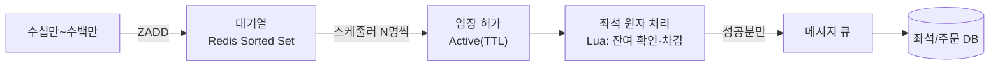

<!-- truncate -->

명절 KTX 예매, 인기 공연 티켓 오픈. 오전 7시 정각에 눌렀는데 **대기 순번이 50만 번대, 뒤에는 200만 명**. 이런 서비스는 평소엔 한산하다가 오픈 순간에만 수백만 명이 동시에 몰립니다. 이 트래픽을 그대로 DB로 흘리면 오픈과 동시에 장애가 납니다. 이런 폭발적 동시접속을 견디는 예매 시스템의 뼈대를 정리합니다.

<mark>핵심은 "모두를 동시에 처리하려 하지 않는 것"입니다. 앞단(대기열)에서 순서를 매겨 흘려보내고, 실제 좌석 경쟁만 원자적으로 처리하고, DB 쓰기는 메시지 큐로 완충합니다.</mark>

이 시스템이 지켜야 할 요구사항은 세 가지입니다.

- **선착순 순서 보장** — 먼저 온 사람이 먼저 예매한다.
- **초과 예매 방지** — 실제 좌석 수를 넘겨 팔지 않는다.
- **중복 예매 방지** — 같은 좌석·같은 시간을 두 사람이 사지 못한다.

## 왜 그냥 받으면 안 되나 — RDB의 한계

가장 단순한 구조는 "요청 → API → DB"입니다. API를 스케일아웃하고 앞에 로드밸런서를 둬도, 결국 **예매를 확정하는 DB가 병목**입니다. 좌석·주문은 정합성·무결성이 생명이라 보통 **RDB**를 쓰는데, RDB는 스케일아웃이 어렵고 스케일업은 비용이 급격히 오릅니다. 수백만 동시 요청이 좌석 테이블 한 곳으로 몰리면 **락 경합과 커넥션 고갈**로 DB가 먼저 한계에 닿습니다.

그래서 문제를 **세 단계로 분리**합니다.

1. **대기열** — 모든 요청이 DB로 직행하지 못하도록, 앞단(인메모리)에 줄을 세운다.
2. **원자적 좌석 처리** — 입장한 사용자들의 좌석 경쟁만 정확히 처리한다.
3. **메시지 큐** — 확정된 것만 큐에 넣어, DB에는 감당 가능한 속도로만 쓴다.

<mark>수백만 요청을 좌석 DB로 직접 보내지 말고, 대기열로 "입장 가능한 만큼만" 통과시켜 DB가 감당할 속도로 유입을 고릅니다.</mark>



## 1. 대기열 — 왜 MQ가 아니라 Redis Sorted Set인가

대기열은 "먼저 온 순서대로, 서버가 감당할 만큼만 입장"을 담당합니다. Redis의 **Sorted Set(정렬 집합)** 에 점수(score)를 **도착 순번**으로 넣으면, 자동으로 순서대로 정렬됩니다.

```text
ZADD  queue:{eventId} {arrivalSeq} {userId}   # 대기열 진입 (score = 도착 순번)
ZRANK queue:{eventId} {userId}                # 내 순위(앞에 몇 명) 즉시 조회
```

여기서 자연스러운 의문이 있습니다. **"선입선출이면 카프카 같은 MQ로 줄 세우면 되는데 왜 Sorted Set인가?"** 기능만 보면 MQ도 됩니다. 갈림길은 **"사용자에게 내 대기 순번을 보여줘야 한다"** 는 UX 요구에서 생깁니다.

- **MQ는 파이프(터널)** 입니다. 앞에서부터 꺼내 소비하는 구조라, 큐 내부에서 **특정 사용자가 몇 번째인지 즉시 조회하기 어렵습니다.** 카프카가 남기는 offset도 "내가 어디까지 읽었나"이지 "이 사용자의 현재 위치"가 아닙니다(카프카의 설계 철학은 [카프카를 탄생시킨 설계 원칙](./kafka-original-design-principles) 참고).
- **Sorted Set은 랭킹 명단**에 가깝습니다. `ZRANK`로 특정 사용자의 순위를 바로 얻고, **새로고침해도 줄이 서버에 남아** 있어 뒤로 밀리지 않습니다. 대기열의 상태(누가 몇 번째)를 그대로 들고 있는 자료구조라 이 요구에 맞습니다.

MQ와 Redis 선택의 일반 기준은 [메시지 큐 비교](./message-queue-comparison)에서 다뤘습니다.

<mark>"선입선출"만 보면 MQ지만, "내 순번을 보여줘야 한다"는 조회 요구가 붙으면 상태를 들고 순위를 즉시 답하는 Sorted Set이 맞습니다.</mark>

## 2. 입장 허가 — 스케줄러가 정해진 속도로 통과시킨다

백그라운드 **스케줄러**가 대기열 앞에서 **N명씩 꺼내** "입장 허가(Active)" 상태로 옮깁니다. 이 N이 곧 예매 단계로 흘려보내는 속도이고, 뒤 단계가 감당할 처리량에 맞춰 정합니다.

```text
members = ZPOPMIN queue:{eventId} N               # 가장 앞 N명 원자적으로 꺼냄
for uid in members:
    SET active:{eventId}:{uid} 1 EX {activeTtl}   # 입장 허가 + 유효시간(TTL)
```

- **Active에 있는 사용자만** 예매 페이지로 진입할 수 있습니다. 예매 API는 매 요청에서 `active:*` 키를 확인해, 없는 요청은 대기 화면으로 되돌립니다.
- Active의 **TTL**은 입장만 하고 예매를 안 하는 사용자를 자동으로 비워, 자리를 다음 대기자에게 돌립니다.

<mark>대기열이 "줄"이라면 스케줄러는 "문지기"입니다 — 뒤 단계가 감당할 속도로만 문을 열어, 폭주가 앞으로 전달되지 않게 합니다.</mark>

## 3. 대기 순번은 어떻게 보여주나 — 폴링(가변 주기 + 지터)

"앞에 N명 남았습니다"를 실시간처럼 보여줘야 하는데, 여기서 **WebSocket·SSE는 피합니다.** 이유는 규모입니다.

- 소켓·SSE는 **연결을 계속 유지**해야 해서, 수십만 대기자면 수십만 개의 연결을 서버가 들고 있어야 합니다 — 자원 낭비가 큽니다.
- 요구는 단순합니다. "지금 내가 몇 번째인지 주기적으로 확인"만 하면 됩니다. 완전한 실시간이 필요 없습니다.

그래서 **폴링(polling)** 을 씁니다. 클라이언트가 `userId`로 **대기 순번 + 입장 가능 여부**를 돌려주는 API를 주기적으로 호출합니다. 여기에 두 가지 기법을 더합니다.

- **가변 주기**: 순번이 많이 남았을 땐 5~10초에 한 번, 입장이 가까워질수록 주기를 줄여 자주 확인합니다.
- **지터(jitter)**: 모든 사용자가 같은 간격으로 요청하면 폴링이 한꺼번에 몰립니다. 사용자마다 **주기를 조금씩 랜덤**하게 두어 폴링 부하를 분산합니다(지터로 부하를 분산하는 아이디어는 [핫스팟 트래픽 격리](./hotspot-traffic-isolation)에서도 씁니다).

<mark>대기 순번은 완전한 실시간이 필요 없는 정보라, 연결을 유지하는 소켓·SSE 대신 가변 주기 폴링 + 지터로 가볍고 고르게 처리합니다.</mark>

## 4. 좌석 선점 — Lua로 원자적으로 확인·차감

입장한 사용자들 사이에서도 **좌석 경쟁**은 남습니다. 핵심은 두 가지입니다. **잔여 좌석 수를 넘기지 않기**(초과 예매 방지)와 **같은 자리를 둘이 잡지 못하게 하기**(중복 예매 방지).

문제는 "잔여 좌석이 있는지 **확인**하고, 있으면 **차감**한다"는 두 동작 사이의 미세한 틈입니다. 그 틈에 다른 스레드가 끼어들면 초과 예매가 납니다. 그래서 **확인+차감을 한 번의 원자적 연산으로** 묶습니다. Redis에서는 **Lua 스크립트**가 이 역할을 합니다.

```lua
-- 잔여 좌석이 있으면 1 차감하고 성공, 없으면 실패 — 확인+차감이 원자적으로 실행
local left = tonumber(redis.call('GET', KEYS[1]))   -- 남은 좌석 수
if left and left > 0 then
    redis.call('DECR', KEYS[1])
    return 1        -- 좌석 확보
else
    return 0        -- 매진
end
```

Redis는 **단일 스레드로 명령을 하나씩** 처리하고, Lua 스크립트도 그 안에서 통째로 원자 실행됩니다. 그래서 수많은 요청이 동시에 와도 **정확히 잔여 좌석 수만큼만 성공**합니다. 스케일아웃(서버 여러 대)이어도 Redis가 직렬화해 주니 정합성이 지켜집니다(Redis가 단일 스레드인데 빠른 이유는 [Redis는 왜 싱글 스레드인데 빠른가](./redis-single-thread-fast) 참고).

- 단순히 `DECR` 하나면 "한 장만" 상황엔 충분하지만, **"AVAILABLE일 때만"·"여러 좌석"** 같은 조건이 붙으면 조회+판단+차감을 한 번에 묶어야 하므로 Lua가 필요합니다.
- 특정 **좌석 하나**의 중복 선점은 `SET seat:{showId}:{seatId} {userId} NX EX {holdTtl}` 로 "키가 없을 때만 성공"시켜 막습니다. **hold TTL**이 지나면 미결제 좌석이 자동으로 풀려, 따로 회수하는 처리를 두지 않아도 됩니다.
- 더 복잡한 상호배제가 필요하면 **분산 락**을 씁니다([Redis 분산 락](./redis-distributed-lock)). 앞단에서 부하를 줄이고 최종 정합성은 DB로 지키는 큰 구조는 [대규모 결제 분산 락](./large-scale-payment-distributed-lock)과 같습니다.

<mark>초과 예매를 막는 핵심은 "확인+차감"을 원자적으로 묶는 것입니다 — Redis 단일 스레드 + Lua가 잔여 좌석 수만큼만 통과시킵니다.</mark>

## 5. 메시지 큐 — DB를 완전히 완충한다

좌석 게이트를 통과했다고 곧장 DB에 쓰지 않습니다. 통과분을 **메시지 큐(MQ)** 에 넣고, 컨슈머가 **DB가 감당할 속도로** 꺼내 순차 기록합니다. 이렇게 하면 오픈 순간의 스파이크가 DB에 그대로 전달되지 않아, DB 부하를 거의 완전히 예방합니다.

즉 유입 완충은 두 겹입니다. **대기열**이 예매 단계 진입 속도를 고르고, **MQ**가 DB 쓰기 속도를 고릅니다. 그 사이의 Redis 원자 처리가 "좌석 수만큼만" 걸러 주므로, MQ에는 이미 확정 가능한 요청만 흐릅니다.

<mark>대기열이 "입장 속도"를 고른다면, 메시지 큐는 "DB 쓰기 속도"를 고릅니다 — 두 겹의 완충으로 스파이크가 DB에 직접 닿지 않습니다.</mark>

## 6. 최종 정합성과 장애 대비

돈이 오가는 좌석은 **최종적으로 DB에서** 확정합니다. Redis가 장애를 겪는 순간에도 "한 좌석 두 번 판매"는 없어야 하기 때문입니다. 컨슈머가 DB에 쓸 때 **조건부 UPDATE**로 확정합니다.

```sql
-- 좌석이 아직 판매 전일 때만 성공 (영향 행 0이면 이미 팔림)
UPDATE seat
   SET status = 'SOLD', order_id = :orderId
 WHERE show_id = :showId AND seat_id = :seatId
   AND status = 'AVAILABLE';
```

- **Redis HA**: 복제·failover(Sentinel/Cluster)로 단일 장애점을 줄입니다.
- **안전한 실패**: 대기열·선점을 확인할 수 없으면 무작정 통과시키기보다 **입장을 잠깐 막고 재시도 안내**를 하는 편이 중복 판매보다 낫습니다.
- **최종 방어선은 DB**: 위 조건부 UPDATE가 있으니, 설령 앞단이 일시적으로 틀어져도 중복 판매는 DB에서 막힙니다.

<mark>Redis·MQ는 "빠르게 걸러 주는 앞단"이고, "한 좌석은 한 번만"이라는 최종 책임은 DB의 조건부 UPDATE에 둡니다.</mark>

## 7. (심화) 대기열 Redis의 고가용성과 클러스터 샤딩

여기까지는 대기열의 "기능"이었습니다. 그런데 **대기열을 담당하는 Redis가 한 대뿐이면 그 한 대가 단일 장애점(SPOF)** 입니다. 수백만이 몰리는 명절 예매에서 그 한 대에 장애가 나면 시스템 전체가 마비됩니다. 그래서 대기열 Redis의 **고가용성(HA)** 설계가 필요합니다.

### 복제 → Sentinel → 클러스터

- **복제(replication)** — 리플리카를 둬 **읽기(순위 조회)를 분산**합니다. 예매는 쓰기보다 "내 순번" 조회가 훨씬 많기 때문입니다. 마스터에 쓰고 리플리카에서 읽되, 복제는 **비동기**라 수백 ms~수 초 **지연**이 생길 수 있습니다. 그래서 **정확성이 필요한 등록·정확 순번은 마스터**에서, **지연을 감수해도 되는 통계성 조회는 리플리카**로 나눕니다.
- **Sentinel** — 복제 위에 얹어 마스터 장애를 **자동 감지·자동 승격**합니다(수동 개입 불필요). 다만 복제 지연은 그대로라, 리플리카마다 반영 속도가 달라 **순번이 들쭉날쭉**해 보일 수 있습니다. 완화책은 같은 사용자를 같은 리플리카로 보내는 **스티키 세션**, 그리고 **순위는 마스터에서 조회**하기입니다.
- **클러스터(샤딩)** — 동접이 전 국민 규모면 대기열 자체를 **여러 키로 쪼개 여러 마스터에 분산**합니다. 진입 시 발급한 사용자 UUID를 해싱해 샤드를 정하면 **읽기뿐 아니라 쓰기도 분산**됩니다.

### 클러스터의 모순 — 전역 순서

여기서 핵심 문제가 생깁니다. **Sorted Set 하나는 한 샤드에만 존재**하므로, 단일 전역 큐 키는 자동으로 분산되지 않습니다. 샤드별로 쪼개면 **전역 순서와 순위를 어떻게 계산하나?** 세 가지 전략이 있습니다.

| 전략 | 순서 기준 | 내 순위 계산 | 입장 처리 | 특징 |
|---|---|---|---|---|
| **A. 글로벌 카운터** | `INCR` 발급 번호 | 내 번호 − 처리 번호 | K-way merge | 정확하지만 **카운터가 새 병목/SPOF** |
| **B. 분산 타임스탬프** | 도착 시각(ms) | 전 샤드 `ZCOUNT` 합산 | K-way merge | 정확하지만 **조회 시 전 샤드 질의**(시간 동기화 필요) |
| **C. 통계적 추정** | 샤드 내 순위 | 내 샤드 순위 × 샤드 수 | 라운드 로빈 | **근사치(오차)**, 대신 성능·단순함·가용성 최고 |

- **입장 처리의 K-way merge** — 각 샤드는 이미 정렬돼 있으니, **맨 앞 값만 비교해 가장 작은 것부터** 하나씩 꺼내면 전역 순서로 병합됩니다. C의 **라운드 로빈**은 비교 없이 각 샤드에서 동일 비율로 꺼내는 방식이라 빠르지만, 샤드 간 인원 편차만큼 순서가 틀어집니다.
- **C의 근거와 한계** — UUID가 균등 난수에 가까워 샤드에 고르게 분포한다는 가정입니다. 표본이 작은 **초반**과 잔여가 적은 **후반**엔 편향이 커집니다. 그래서 **초반엔 B(전 샤드 집계), 안정되면 C**로 바꾸는 **하이브리드**가 현실적입니다.

예매처럼 **순위가 몇 등 틀어져도 무방한** 도메인이라면, 오차를 감수하고 성능·단순함을 얻는 **C**가 합리적일 때가 많습니다. 자체 구현 대신 검증된 대기열 솔루션(예: NetFUNNEL)을 쓰는 것도 선택지입니다.

<mark>클러스터는 부하를 분산하지만 "전역 순서"와 충돌합니다 — 정확한 순위(A·B)냐, 성능·가용성을 위한 근사(C)냐를 도메인의 오차 허용도로 정합니다.</mark>

## 정리

- **대기열(Sorted Set)**: 수백만 요청을 DB로 바로 보내지 말고 순번을 매겨 대기시킨다. MQ가 아니라 ZSET인 건 "내 순번 조회·새로고침 유지"라는 UX 때문.
- **입장 허가(Active + TTL)**: 스케줄러가 감당할 속도로 N명씩만 통과.
- **대기 순번 표시**: 소켓·SSE 대신 **가변 주기 폴링 + 지터**로 가볍게.
- **좌석 처리(Lua 원자 연산)**: 확인+차감을 원자적으로 묶어 잔여 좌석 수만큼만 성공. 중복 좌석은 `SET NX` + hold TTL.
- **메시지 큐**: 통과분만 큐에 넣어 DB 쓰기 속도를 고른다.
- **최종 정합성**: DB 조건부 UPDATE가 "한 좌석 한 번"을 보장. Redis HA + 안전한 실패로 장애 대비.
- **대기열 HA·샤딩**: 복제 → Sentinel → 클러스터로 확장. 샤딩 시 전역 순위는 글로벌 카운터·분산 타임스탬프·통계적 추정 중 오차 허용도로 선택.

예매 시스템의 어려움은 "빠르게"와 "정확하게"가 충돌하는 데 있습니다. 대기열과 메시지 큐로 **속도를 두 겹으로 고르고**, 원자적 좌석 처리와 DB 조건부 갱신으로 **정확성**을 지키면, 폭발적 동시접속에도 "한 좌석은 한 사람에게"를 지킬 수 있습니다.
