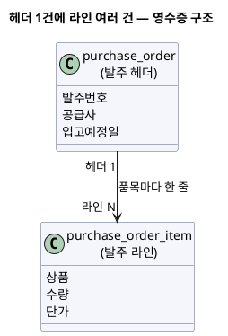
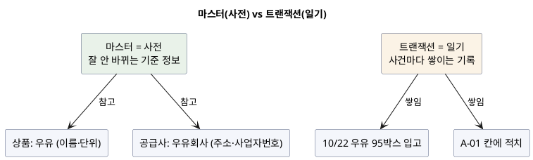
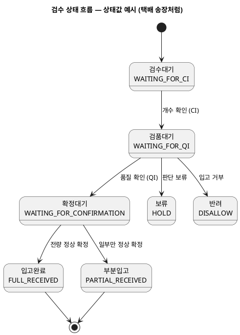
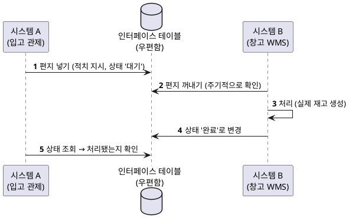
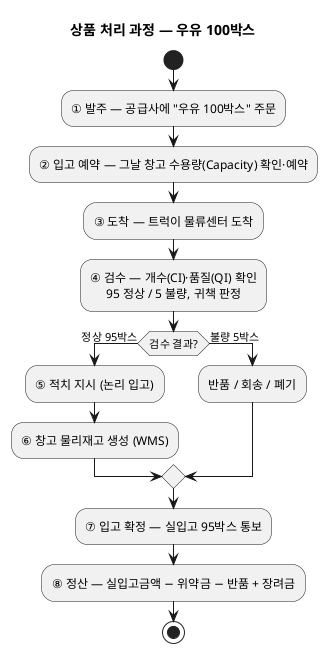
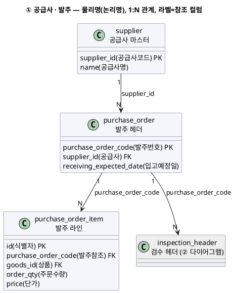
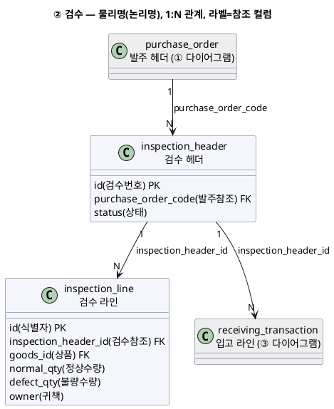
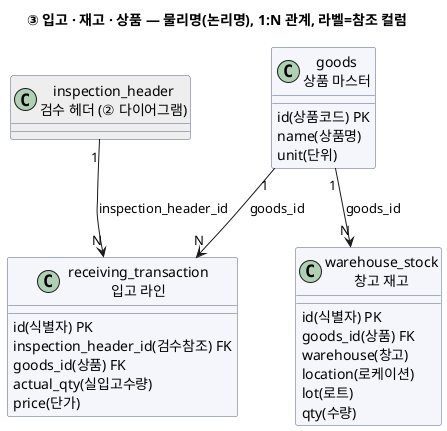
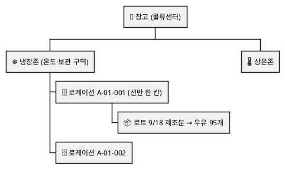

물류·공급망(SCM) 시스템은 겉보기엔 용어가 많아 복잡해 보입니다. 발주·입고·검수·적치·재고·반품·정산에, 시스템이 여러 개로 나뉘어 있고, 데이터 테이블 이름은 암호 같습니다. 하지만 그 안을 들여다보면 하는 일은 단순합니다 — **현실에서 물건이 움직이는 과정을, 데이터로 똑같이 따라 기록하는 것**입니다. 이 글은 물류 SCM을 처음 보는 사람도 이해하도록, **우유 100박스가 창고에 들어와 정산까지 가는 여정**을 따라가며 풀어씁니다.

<!-- truncate -->

<mark>SCM 시스템이 하는 일은 한 문장으로 요약됩니다 — 현실에서 일어나는 물건의 이동(주문·입고·재고·반품)을 데이터로 똑같이 따라 기록하고, 그 결과로 공급사에 정확히 정산하는 것입니다.</mark>

예로 든 테이블 이름·수치는 실제가 아니라 이해를 돕기 위한 것입니다.

## SCM이 뭔가요? — 동네 마트로 비유하면

**SCM(Supply Chain Management, 공급망 관리)** 은 "물건이 공급사에서 창고로 들어와, 보관됐다가, 문제가 있으면 돌려보내거나 버리고, 그 대가로 공급사에 돈을 정산하는 모든 과정"을 관리하는 일입니다. 동네 마트로 비유하면 이렇습니다.

- 마트가 우유 회사에 "우유 100박스 주세요" 주문 → **발주**
- 트럭이 우유를 싣고 도착 → **입고**
- "진짜 100박스 맞나? 상한 건 없나?" 확인 → **검수**
- 멀쩡한 우유를 냉장 창고 정해진 칸에 넣음 → **적치(재고 반영)**
- 상한 우유를 회사로 돌려보내거나 버림 → **반품 / 회송 / 폐기**
- 월말에 "실제로 받은 95박스 값만 지급" → **정산**

이 과정을 사람 손이 아니라 소프트웨어로 처리합니다. 물건은 실제 창고에서 움직이지만, "이 상품이 지금 어느 단계인지, 몇 개인지, 어디 있는지"는 전부 **데이터베이스**에 기록됩니다. 그래서 SCM 개발은 결국 **물건의 이동을 데이터로 정확히 따라 적는 일**입니다.

## 일을 나눠 맡는 4개의 시스템

이 큰 일을 하나의 프로그램으로 하지 않고, **역할별로 나눈 여러 시스템**이 나눠 맡습니다. 회사의 부서라고 생각하면 됩니다.

| 시스템 (역할) | 회사 부서로 치면 | 하는 일 |
|---|---|---|
| **구매·정산 시스템** | 구매·정산팀(공급사 창구) | 공급사와 주고받는 발주, 입고 확정, **돈 계산(정산)** |
| **입고 관제 시스템** | 입고 관제팀 | 입고 전체 진행을 지휘 — 검수·입고 예약·"창고 어디에 넣어라" 지시 |
| **창고 관리 시스템(WMS)** | 창고 현장팀 | 실제 창고 재고를 관리 — 어느 칸에 몇 개 넣었는지 기록 |
| **반품·정리 시스템** | 반품·정리팀 | 반품·회송·폐기·재고 실사 |

<details>
<summary>C4-PlantUML 코드</summary>

```plantuml
@startuml
!include https://raw.githubusercontent.com/plantuml-stdlib/C4-PlantUML/master/C4_Container.puml
LAYOUT_LEFT_RIGHT()
title SCM 시스템 구성 — 역할별로 나뉜 4개 시스템

System_Ext(supplier, "공급사", "상품을 납품하는 협력사")

System_Boundary(scm, "SCM") {
  Container(escm, "구매·정산 시스템", "발주·입고확정·정산", "공급사와 돈·계약 담당")
  Container(inbound, "입고 관제 시스템", "입고 오케스트레이션", "검수·입고예약(Capacity)·적치지시 = 논리 입고")
  Container(wms, "창고 관리 시스템 (WMS)", "물리 재고", "실제 창고 칸·수량·로트 = 물리 입고")
  Container(rms, "반품·정리 시스템", "반품·회송·폐기", "불량품 처리·재고 실사")
}

Rel(supplier, escm, "발주·납품")
Rel(escm, inbound, "발주 확정 이벤트", "Kafka (비동기)")
Rel(inbound, escm, "입고 확정 결과", "Kafka (비동기)")
Rel(inbound, wms, "적치 지시·재고 확인", "REST (동기)")
Rel(inbound, rms, "불량품 반품/회송/폐기")
@enduml
```

</details>


import ArchifyEmbed from '@site/src/components/ArchifyEmbed';

<ArchifyEmbed src="/diagrams/scm-architecture.html" title="SCM 시스템 구성 (인터랙티브)" height="520px" />

**왜 나눴을까요?** 하나의 거대한 프로그램은 한 곳이 고장 나면 전부 멈춥니다. 역할별로 쪼개면 정산이 문제가 생겨도 입고는 계속 실행됩니다. 각 팀이 자기 일에만 집중해 빠르게 고칠 수도 있습니다. 모놀리스와 마이크로서비스의 이런 트레이드오프는 [모놀리스 vs 마이크로서비스](./monolith-vs-microservices)에서 더 다뤘습니다.

<mark>SCM은 하나의 큰 프로그램이 아니라, 발주·입고·창고·반품을 역할별로 나눈 여러 시스템이 협력하는 구조입니다 — 한 시스템이 멈춰도 나머지는 계속 동작하게 하기 위해서입니다.</mark>

이런 구조는 흔히 **하나의 큰 레거시 시스템**에서 출발합니다. 처음엔 입고·반품·재고를 한 시스템이 다 처리하다가, 너무 커지고 얽히면 **입고 같은 일부 도메인을 새 시스템으로 분리**하는 식입니다. 그 과도기에는 같은 이름의 데이터 저장소가 옛 시스템과 새 시스템에 함께 존재하기도 하는데, 잘못이 아니라 분리가 진행 중이라 그렇습니다.

## 데이터를 읽는 기본기 — 5가지만 알면 된다

시스템이 정보를 저장하는 곳이 데이터베이스이고, 그 안은 **테이블(표)** 들로 돼 있습니다. 다음 다섯 가지 개념만 알면 나머지 내용이 쉽게 이해됩니다.

### ① 테이블 = 엑셀 시트

- **테이블** = 엑셀 시트 한 장
- **컬럼** = 열(상품코드·수량·날짜)
- **행(레코드)** = 한 줄 = 실제 한 건의 데이터

예를 들어 발주 테이블(`purchase_order`)은 이렇게 생겼습니다. 한 줄이 발주 한 건입니다.

| 발주번호 | 공급사 | 입고예정일 |
|---|---|---|
| PO-20261020-001 | 우유회사 | 2026-10-22 |

### ② 헤더와 라인 = 영수증 구조

SCM 데이터에서 **가장 자주 나오는 패턴**입니다. 마트 영수증을 떠올리세요.

```
─────── 영수증 ───────      ← 윗부분 = 헤더 (거래 1건의 공통 정보)
 날짜: 2026-10-20
 매장: 강남점
──────────────────────
 우유    2개   3,000원      ← 아래 각 줄 = 라인 (품목별 상세)
 빵      1개   2,000원
──────────────────────
```

- **헤더 테이블**: 거래 전체에 한 번만 있는 정보(날짜·발주번호·공급사)
- **라인 테이블**: 그 안의 품목마다 한 줄씩(상품A 10개, 상품B 5개…)

그래서 `purchase_order`(발주 헤더) ↔ `purchase_order_item`(발주 품목 라인), `inspection_header`(검수 헤더) ↔ `inspection_line`(검수 라인)처럼 **헤더–라인 짝**이 계속 나옵니다. 이름에 `item`·`line`이 붙으면 "그 안의 품목별 상세"라고 보면 됩니다.

<details>
<summary>PlantUML 코드</summary>



</details>


### ③ 마스터와 트랜잭션 = 사전과 일기

- **마스터 데이터**: 잘 안 바뀌는 기준 정보. "사전"에 가깝습니다. 예: 상품 마스터(우유의 이름·단위), 공급사(주소·사업자번호), 창고·로케이션.
- **트랜잭션 데이터**: 사건이 생길 때마다 쌓이는 기록. "일기"에 가깝습니다. 예: 입고 거래(오늘 우유 95박스 입고), 적치 거래(A-01 칸에 넣음).

**마스터는 참고하고, 트랜잭션은 쌓인다**고 기억하면 됩니다.

<details>
<summary>PlantUML 코드</summary>



</details>


### ④ 상태값 = 택배 송장

물건 한 건은 여러 단계를 거칩니다. 그걸 한 컬럼에 "지금 어디쯤"으로 적어 둡니다. 택배 송장의 "배송 준비 중 → 배송 중 → 배송 완료"와 똑같습니다.

<details>
<summary>PlantUML 코드</summary>



</details>


시스템은 이 상태값을 보고 "다음에 뭘 해야 하는지" 판단합니다. 정상 흐름은 `검수대기 → 검품대기 → 확정대기 → 입고완료`이고, 품질검사(QI)에서 문제가 있으면 **보류(HOLD)** 나 **반려(DISALLOW)** 로, 일부만 정상이면 **부분입고(PARTIAL_RECEIVED)** 로 갈립니다. (상태값 이름은 예시입니다.)

### ⑤ 인터페이스 테이블 = 시스템 사이의 우편함

한 시스템이 다른 시스템에 "이거 처리해 줘" 하고 데이터를 넘길 때, 중간에 **우편함 역할을 하는 테이블**을 둡니다. 보내는 쪽이 편지를 넣으면, 받는 쪽이 하나씩 꺼내 처리한 뒤 상태를 "처리 완료"로 바꿉니다.

<details>
<summary>PlantUML 코드</summary>



</details>


<mark>다음과 같은 비유로 생각하면 SCM 데이터 구조가 쉽게 이해됩니다.</mark>

- **테이블** = 엑셀 시트
- **헤더–라인** = 영수증
- **마스터–트랜잭션** = 사전과 일기
- **상태값** = 택배 송장
- **인터페이스 테이블** = 우편함

## 시스템끼리 통신하는 법 — 전화 vs 게시판

시스템 A가 시스템 B에게 일을 시키는 방법은 크게 두 가지입니다. 이 차이가 중요합니다.

- **직접 전화하기 — REST(동기 호출)**: A가 B에게 전화해 "이거 지금 해 줘" 하고 **답을 기다립니다.** 즉시 결과가 필요할 때 씁니다. 예: 입고팀 → 창고팀 "이 상품 적치돼서 재고 생겼어? 성공/실패 알려 줘".
- **게시판에 공지하기 — Kafka(비동기 이벤트)**: A가 "발주가 확정됐다!"라는 **공지(메시지)** 를 게시판에 붙이면, 관심 있는 시스템들이 각자 편한 때에 보고 반응합니다. A는 답을 기다리지 않습니다. 예: 구매팀이 "발주 확정!"을 게시 → 입고팀이 보고 입고예정을 만듦.

<mark>즉시 성공/실패 답이 필요하면 전화(REST), 그냥 알리고 각자 처리하게 하려면 게시판 공지(Kafka)입니다 — 물리 재고 생성처럼 실시간 검증이 필요한 명령은 REST, 발주 확정처럼 느슨히 전파하는 사건은 Kafka.</mark> 메시지 발행·구독의 원리는 [Kafka는 왜 빠른가](./kafka-why-fast)에서, 동기·비동기 선택 기준은 [메시지 큐 선택](./message-queue-comparison)에서 다뤘습니다.

## 상품이 처리되는 과정 — 우유 100박스 따라가기 ★

이제 실제로 상품 하나가 시스템들을 어떻게 통과하는지, **우유 100박스**로 처음부터 끝까지 따라가 봅니다.

<details>
<summary>PlantUML 코드</summary>



</details>


### 1. 주문한다 — 발주 (구매·정산 시스템)

구매 담당자가 공급사에 "우유 100박스, 10월 22일까지 물류센터로 넣어 주세요" 주문합니다.

- **생기는 데이터**: 발주 헤더(공급사·예정일·센터) + 발주 라인(우유 100박스·단가)
- **왜**: 나중에 "얼마 주문했는지"가 정산의 기준이 됩니다. 실제로 몇 개 받았는지와 비교해야 하니까요.
- 발주가 확정되면 **"발주 확정!"을 게시판에 공지합니다(Kafka).**

### 2. 받을 준비를 한다 — 입고 예약·Capacity (입고 관제 시스템)

입고팀 시스템이 그 공지를 보고 "10월 22일에 우유 100박스가 온다"를 자기 장부에 적습니다. 그리고 **Capacity 예약**을 합니다.

- **Capacity란?**: 창고는 하루에 받아 처리할 수 있는 양이 정해져 있습니다(사람·공간·시간 한계). 이 **"하루 입고 처리 능력"** 을 **Capacity(수용량)**, 현업에선 줄여서 **CAPA**라고 합니다.
- 그날 물류센터가 하루 1,000박스까지 받는데 이미 950박스가 예약됐다면, 우유 100박스는 **자리가 없어 거부**될 수 있습니다. 그래서 발주가 오면 먼저 그 날짜의 남은 수용량을 확인하고 자리를 **예약**합니다. 식당 예약과 똑같습니다.
- **왜**: 창고가 감당 못 할 만큼 물건이 몰리는 것을 막기 위해서입니다.

### 3. 트럭이 온다 — 도착 (입고 관제 시스템)

트럭이 물류센터에 도착하면 도착 시각을 기록합니다. "예정보다 늦게 왔나", "언제 검수 시작하나"를 알기 위해서입니다.

### 4. 진짜 100박스 맞나 확인한다 — 검수 (입고 관제 / 반품·정리 시스템)

직원이 박스를 열어 확인합니다. 검수는 두 종류입니다.

- **CI(계수검사)**: 개수가 맞나? (100박스 맞나?)
- **QI(품질검사)**: 상태가 괜찮나? (상한 건 없나, 유통기한 넉넉한가?)

확인 결과 **95박스는 정상, 5박스는 상함**이라고 합시다.

- **생기는 데이터**: 검수 헤더 + 검수 라인(정상 95·불량 5·상태값) + 불량 사유별 상세
- **귀책 판정**: 상한 5박스가 **누구 잘못이냐**를 정합니다. 공급사가 상한 걸 보냈으면 **공급사 귀책**(공급사가 부담), 창고에서 옮기다 떨어뜨렸으면 **자사 귀책**(자사 손실). 이 판정이 나중에 **정산에서 누가 돈을 부담할지**를 가릅니다.
- **왜**: 정확히 몇 개를, 어떤 상태로 받았는지가 재고와 정산의 근거이기 때문입니다.

### 5-A. 정상 95박스 → 논리 입고 vs 물리 입고

정상 95박스는 창고에 넣어야 합니다. 여기서 **가장 중요한 구분**이 나옵니다.

- **논리 입고 (입고 관제 시스템)**: "우유 95박스를 냉장존 A-01 칸에 넣어라"는 **지시·계획**을 만듭니다. 서류상의 입고입니다.
- **물리 입고 (창고 관리 시스템, WMS)**: 그 지시를 받아 **실제 창고 재고**를 만듭니다. "A-01 칸에 우유 95개가 실제로 있다"는 사실입니다.

입고 관제 시스템이 창고 시스템에 **REST로 호출**해 "우유 95박스, A-01 칸에 넣어. 됐어?" 하고 지시하면, 창고 시스템이 실제 재고를 만들고 결과를 답합니다. 이때 **로트(Lot)** 단위로 재고를 관리합니다.

- **로트(Lot)란?**: 같은 제조일·유통기한을 가진 상품 묶음입니다. 10/22 들어온 우유와 10/29 들어온 우유는 유통기한이 다르니 **다른 로트**로 관리합니다. 그래야 오래된 것부터 내보낼 수 있습니다.

이제 **우유 95박스가 재고가 됐습니다.**

### 5-B. 불량 5박스 → 반품 / 회송 / 폐기 (반품·정리 시스템)

상한 5박스는 창고에 두면 안 되니 처리합니다. 세 갈래이고, 헷갈리기 쉬워 표로 정리합니다.

| 구분 | 뜻 | 예 |
|---|---|---|
| **반품(Return)** | 공급사에 "문제 있어요, 돌려줄게요" 접수하는 **절차(서류상 결정)** | 상한 우유 5박스 반품 접수 |
| **회송(RTS)** | 실제로 공급사(또는 다른 센터)로 **물건을 되돌려 보내는 물류 행위** | 반품 접수된 우유를 트럭에 실어 보냄 |
| **폐기(Scrap)** | 돌려보낼 수도 없어 **버리는 것**(재고 제거 + 손실 처리) | 완전히 상해 반품 불가한 우유 폐기 |

"반품은 서류상 결정, 회송은 실제 이동, 폐기는 버림"으로 기억하면 됩니다. 불량품이 재고에 섞이면 안 되고, 그 손실을 **정산에 반영**해야 하기 때문에 따로 처리합니다.

### 6. 결과를 구매팀에 알린다 — 입고 확정 (입고 관제 → 구매·정산 시스템)

"우유는 주문 100박스 중 95박스 입고, 5박스 불량(공급사 귀책)"이라는 결과를 구매팀 시스템에 **게시판 공지(Kafka)** 로 알립니다. 정산은 **실제로 받은 수량** 기준으로 계산하기 때문입니다.

### 7. 돈을 계산한다 — 정산 (구매·정산 시스템)

월말에 공급사에 줄 돈을 계산합니다. 단순히 "95박스 × 단가"가 아니라 여러 가감이 있습니다.

```
공급사에 줄 돈 =
    실입고금액        (95박스 × 단가)
  + 성장장려금        (많이 납품해 성장하면 주는 인센티브)
  − 미입고위약금      (주문 100 − 실입고 95 = 5박스 못 채운 것에 대한 벌점 성격 금액)
  − 반품 금액         (불량으로 돌려보낸 값)
```

이 규칙들(대상 여부·비율)은 공급사마다 미리 설정돼 있어, 정산할 때 불러와 적용합니다. 결과로 거래명세서·세금계산서를 만들고 대금을 지급합니다.

<mark>정산의 핵심은 "주문한 값이 아니라 실제로 받은 값 기준"이라는 점입니다 — 그래서 검수에서 정확히 몇 개를 어떤 귀책으로 받았는지가 곧바로 돈으로 이어집니다.</mark>

## 데이터 구조 한눈에 — 테이블과 컬럼 관계

앞 이야기에 나온 테이블들이 어떤 **컬럼으로 서로를 참조**하는지 봅니다. 각 컬럼은 **물리명(논리명)** 표기이고, **`PK`** 는 그 표를 식별하는 대표 컬럼, **`FK`** 는 다른 표를 가리키는 참조 컬럼입니다. 화살표는 **1:N 관계**(부모 1건 → 자식 여러 건)이고, 라벨이 연결에 쓰이는 컬럼입니다. 한 장에 다 담으면 너무 커서 **공급사·발주 / 검수 / 입고·재고·상품** 세 장으로 나눴고, **회색 상자**는 다른 장에 상세히 있는 연결 테이블입니다. (이름은 예시입니다.)

**① 공급사 · 발주**

<details>
<summary>PlantUML 코드</summary>



</details>


**② 검수**

<details>
<summary>PlantUML 코드</summary>



</details>


**③ 입고 · 재고 · 상품**

<details>
<summary>PlantUML 코드</summary>



</details>


> 세 그림은 **회색 상자**로 이어집니다 — **발주(①)** 가 `purchase_order_code`로 **검수(②)** 와, **검수(②)** 가 `inspection_header_id`로 **입고(③)** 와 연결됩니다. `goods_id`(상품 마스터)는 발주·검수·입고·재고 여러 표가 공통으로 참조하는 컬럼이고, `id`는 각 표 자신의 대표 키(PK)입니다.

- **헤더–라인**: `purchase_order` 1건에 `purchase_order_item` 여러 줄(품목마다 한 줄).
- **연결 고리**: 발주번호·상품(`goods_id`) 같은 값으로 검수·입고·재고가 서로를 참조합니다.
- **정산의 기준 컬럼**: 입고 라인의 `실입고수량`과 단가 — 여기서 최종 금액이 계산됩니다.

## 헷갈리는 개념 두 가지 더

### 창고의 구조 — 창고 > 존 > 로케이션 > 로트

창고 안의 위치는 건물 주소처럼 계층입니다.

<details>
<summary>PlantUML 코드</summary>



</details>


주문이 들어와 우유를 꺼낼 때, 시스템은 이 구조를 보고 "어느 칸에서 어떤 로트를 먼저 꺼낼지"(보통 유통기한이 임박한 것부터)를 정합니다.

### 왜 논리 입고와 물리 입고를 나눴나

입고 과정(검수·귀책 판정)은 복잡하고 자주 바뀌지만, 창고 재고 관리(칸·수량)는 정확하고 단순해야 합니다. 역할을 나누면 각자 잘하는 일에 집중할 수 있습니다. 그래서 입고 관제 시스템이 "지시"하고, 창고 시스템이 "실제 재고"를 만듭니다. 앞서 REST를 쓴 이유도 여기 있습니다 — 물리 재고 생성은 즉시 성공/실패를 확인해야 하니까요.

## 정리 — 전체 그림 다시 보기

- **SCM = 물건의 이동을 데이터로 따라 기록하고 정산하는 것.**
- **시스템은 역할별로 나뉜다**: 구매·정산 / 입고 관제 / 창고(WMS) / 반품·정리.
- **데이터는 다섯 패턴**: 테이블(엑셀), 헤더–라인(영수증), 마스터–트랜잭션(사전·일기), 상태값(택배 송장), 인터페이스 테이블(우편함).
- **통신은 둘**: 즉시 답이 필요하면 REST(전화), 느슨히 알리면 Kafka(게시판 공지).
- **상품 처리 과정**: 발주 → Capacity 예약 → 도착 → 검수(CI·QI·귀책) → 정상은 논리·물리 입고로 재고화, 불량은 반품/회송/폐기 → 입고 확정 → 정산.
- **핵심 구분**: 논리 입고(지시·계획) vs 물리 입고(실제 재고), 반품·회송·폐기, 정산은 실입고 기준.

처음엔 용어가 많아 복잡해 보이지만, **"현실의 물건 이동을 데이터로 따라 적는다"** 는 원리 하나만 이해하면 나머지는 그 안의 세부일 뿐입니다.

## 용어 한 줄 정리

| 용어 | 쉬운 뜻 |
|---|---|
| SCM | 공급망 관리. 발주~입고~재고~반품~정산 전 과정 |
| 발주(PO) | 공급사에 상품을 주문하는 것 |
| 입고 | 주문한 상품이 창고로 들어오는 것 |
| Capacity | 창고의 하루 입고 처리 능력(수용량). 초과 예약 거부 |
| 검수 / CI / QI | 들어온 상품 확인 / 개수 검사 / 품질 검사 |
| 귀책 | 불량의 책임이 공급사인지 자사인지 |
| 적치 | 검수 끝난 상품을 창고 칸에 넣는 것 |
| 논리 입고 / 물리 입고 | 지시·계획(입고 관제) / 실제 창고 재고(WMS) |
| 로트(Lot) | 같은 제조일·유통기한을 가진 상품 묶음 |
| 창고 / 존 / 로케이션 | 상품 위치 계층(건물 → 구역 → 칸) |
| 반품 / 회송 / 폐기 | 문제 상품을: 돌려주기로 접수 / 실제로 되돌려 보냄 / 버림 |
| 정산 | 실제 받은 수량 기준으로 공급사에 대금 계산·지급 |
| 성장장려금 / 미입고위약금 | 정산 가산(많이 납품) / 차감(주문보다 덜 옴) |
| 헤더 / 라인 | 거래 대표 정보 / 그 안 품목별 상세 |
| 마스터 / 트랜잭션 | 잘 안 바뀌는 기준 정보(사전) / 사건마다 쌓이는 기록(일기) |
| REST / Kafka | 전화(즉시 답) / 게시판 공지(붙여놓고 각자 확인) |
